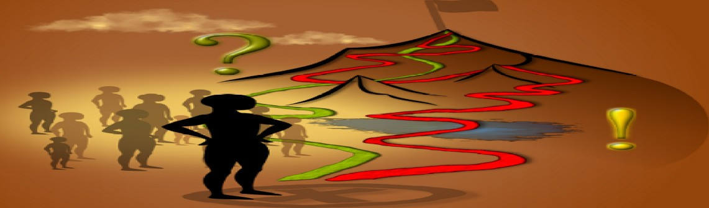

# System thinking in IT and Digital Fabrication

	
## Vision

* We are building Trusted Single source of truth   **3Rs: Right Information - For Right Role - in Right Time**

* "Our Vision is to empower our students with the knowledge and skills necessary to excel in the world of IT and Digital Fabrication by fostering a deep understanding of system thinking. 

* We aspire to create a community where innovative problem-solving thrives, enabling our students to become architects of the  'trusted single source of truth' in the digital age. 

* Furthermore, we aim to bridge the gaps among 'Islands of Knowledge,' promoting a holistic perspective in an interconnected world."

## Mission 
* "Our Mission is to provide a comprehensive educational experience that cultivates the core values of Communication, Understanding, Trust, Cooperation, and Success Solutions.

* Through rigorous curriculum, hands-on learning, and collaborative projects, we aim to equip our students with the ability to analyze complex systems, make informed decisions, and implement sustainable solutions. 

* We are dedicated to nurturing a learning environment that encourages critical thinking, creativity, and ethical responsibility, preparing our students to lead and innovate in the ever-evolving fields of IT and Digital Fabrication.

* In addition, we are committed to building synergies among internal teams and external partners, 

* Fostering collaborations that enrich our students' experiences and broaden their horizons. 

* By actively connecting knowledge and resources, we seek to create a dynamic ecosystem where the power of collective wisdom drives progress and innovation."

## Commitment
* Without COMMUNICATION      There is NO UNDERSTANDING

* Without Understanding there is NO TRUST

* Without Trust there is NO SUCCESSFUL SOLUTION 

**We are committed  to:**

*  **bridging knowledge gaps** and

* **fostering collaborations** among internal and external stakeholders, 

* aligning with the principles of **system thinking and holistic problem-solving**.
## Strategy

Based on 5 principles of Self learning organisation:

(Peter Senge, 5th Principle of self learning organisation)
    1. Personal Mastery.
           It is the process of continuous learning and self-improvement.
    2. Mental Models.
           It is the ability to recognize and challenge the assumptions and beliefs that shape our perceptions of the world.
     3. Shared Vision.
           It is the ability to create a common goal that motivates and aligns the efforts of all members of an organization.
    4. Team Learning.
            It is the ability to learn and work together as a team to achieve a common goal.
    5. Systems Thinking. 
            It is the ability to see the big picture and understand how the different parts of a system interact with each other.

 ## Time Roadmap

  Winter Semester 2023-2024, september 2023 - January 2024

## Technical conditions/requirements

> For team collaboation is used Atlassian Confluence and Bitbuct   
   >> Every student has got own organisation with Confluence and Bitbucket
   >> Coordinations, Templates, communication is performed via Class confluence
   >> Final Students Outputs is via class Bitbucket

## Conditions for completing the course 2023-2024

There are defined 5 maturity levels:
* F - Passive approach

* E - Slide show maker

* D - Activity keep tracker

* C - Conceptual Diagram maker

* B - Feature based knowledge worker

* A - Real World Modeler

*Presentation of final outputs in Confluence.*

Original in own organization, copy in SystemThinking-In-IT, Bitbucket 

Minimum requirements to pass the assessment for Systems Thinking  
Minimum requirements for Digital Fabrication  
CommentsThe final mark will be the average of the marks from both areas.  
The minimum must be met in both sections.

| Grade    | System thinking   | Digital Fabrication  | Comments |
---------:| :----- |:----- |:----- 
***Fx***  |  ignoracy | ignoracy  |  minimum effort and level of cooperation required
***E*** |  Own space for the knowledge system.   Presentation of final outputs in Confluence.   Original in own organization, copy in SystemThinking-In-IT,   GitHub| Creating a 3D object with a SMARTLAB CVTI technology.Documentation on GitHub| Each student must have his or her own space for the knowledge system.   **GitHub Pages.**   Each student must create an GitHub presentation of the output of their work.   This is at the level of previous years' work.
***D*** |Demonstrable record of knowledge during the creation of the resulting deliverables in Confluence following the 7Ds methodology using drawing tools (e.g. EA, Draw.io) | Mastery of the basics of at least two SMARTLAB CVTI technologies.Documentation on GitHub | The student must demonstrate ongoing systematic work throughout the semester by recording the various parts of the 7Ds methodology in their knowledge system. **GitHub, GitHub Pages**
***C*** | Presentable model in some modeler with implemented 7Ds methodology, Enterprise Architect is recommended | Implementation of the "materialization" of an individual idea, project using several SMARTLAB CVTI technologies, including generative and parametric design.Documentation on GitHub |  On this level are diagrams **Enterprise Architect, GitHub, GitHub Sites**
***B*** | Demonstration of ability to work with the model and git workflow. | Implementation of the "materialization" of the idea, project using several FABLAB CVTI technologies, including generative and parametric design. In a team of min. 2 members and Documentation on GitHub in the form of detailed step-by-step instructions. | Decentralized versioning system enables PARALLEL Modeling, workflows that significantly accelerate the delivery of sw solutions, support the quality of delivered solutions, protect the work of all involved from stasis and damage. Recommended technologies- **GitHub, GITbash,  SmartGIT** *The only technology for parallel modeling with GIT workflow support is Enterprise Architect and Lemontree*
***A*** | Presentable custom model with implemented AUV methodology.Demonstration of understanding of the concepts of Taxonomy, Ontology, Visual Management through concrete diagrams and demonstration of the model. **Recommended modeler Enterprise Architect** | Implementation of the "materialization" of the idea, the project using several SMARTLAB CVTI technologies, including generative and parametric design and also the use of machine learning (AI) in a team of at least 2 members.Documentation on GitHub in the form of detailed step-by-step instructions, understandable for some age groups.   | Work at the level of models. The student must demonstrate the ability to distinguish what an image is, what a model is, what a taxonomy is, what an ontology is. How he/she has used this in his/her work. Just within the scope of the solution provided. This to create a digital twin of the student's solution. Visual Management is also part of it. **Enterprise Architect, Draw.io**

## Meet the team

| Person                    | Role                                | Responsibility | Contact |
| :------------------------ | :---------------------------------- | :------------- | :------ |
| Ing. Roman Kazička, PhD  | Course supervisor                   |                |         |
| Ing. Roman Kazička, PhD  | Knowledge Management Enterprise Architect | Teacher        |   [roman.kazicka@systemthinking.sk](mailto:roman.kazicka@systemthinking.sk) |

---

## 🔭 Navigácia – kam ďalej?

### 🎓 Triedny dashboard (STHDF 2025–2026)
- 🧭 [Prehľad kurzu](./content/docs/index.md)
- 📘 [O predmete / About the Course](./content/docs/sk/class_sthdf_dashboard/01-class_sthdf_dashboard_2025-2026/class-sthdf/about/index.md)
- 📌 [Podmienky a pravidlá](#conditions-for-completing-the-course-2023-2024)
- 🎞️ [Showcase – príklady](./content/docs/sk/class_sthdf_dashboard/01-class_sthdf_dashboard_2025-2026/class-sthdf/showcase/index.md)
- ## Class 2025-2026 - Navigation

- ### [Students](./content/docs/sk/class_sthdf_dashboard/01-class_sthdf_dashboard_2025-2026/students/ST_INDEX.md)
- ### [Projects](./content/docs/sk/class_sthdf_dashboard/01-class_sthdf_dashboard_2025-2026/projects/PRJ_INDEX.md)
- ### [Best students Project in the year 2025-2026](./content/docs/sk/class_sthdf_dashboard/01-class_sthdf_dashboard_2025-2026/class-sthdf/showcase/index.md)

### 🔪 KNIFE Framework
- 🗺️ [KNIFE hub](./content/docs/sk/knifes/)
- 📰 [Blogový prehľad KNIFE](./content/docs/sk/knifes/knifes_overview/KNIFE_Overview_Blog.md)
- 🗂️ [Zoznam KNIFE](./content/docs/sk/knifes/knifes_overview/KNIFE_Overview_List.md)
- 📈 [Detailný prehľad KNIFE](./content/docs/sk/knifes/knifes_overview/KNIFE_Overview_Details.md)

### ⚙️ 7Ds – rámec
- ⚙️ [7Ds – hlavná stránka](./content/docs/sk/7Ds/)

### 🧱 SDLC / integračné modely
- 🧱 [SDLC – integračný hub](./content/docs/sk/sdlc/)

### 🧭 Ďalšie sekcie
- 🧭 [Q12 – Twelve Quadrants](./content/docs/sk/q12/)
- ℹ️ [About (SK)](./content/docs/sk/about.md)
