---
# 🧩 Versioning – systém dopĺňa automaticky
fm_version: "1.0.1"

# Dátum buildu – generuje skript
fm_build: "2025-11-28T15:54:47.994817+00:00"

# Poznámka k verzii – voliteľné
fm_version_comment: ""

# 🆔 IDENTITY --------------------------------------------------------

# ID generuje CLI / skript

# Unikátne UUID – generuje skript
guid: "18286aed-e3cf-4e1b-89b9-589bb4692714"

# 🧭 CONTEXT ---------------------------------------------------------

# DAO / doména (knife, sdlc, q12, 7ds...) dopĺňa skript
dao: "class_sthdf_dashboard"

# Názov zápisu – dopĺňa používateľ
title: "slides"

# Krátky popis – dopĺňa používateľ (voliteľné)
description: "{{DESCRIPTION}}"

# 👥 AUTHORSHIP ------------------------------------------------------

# Hlavný autor – z globálneho configu
author: "Roman Kazicka"

# Zoznam autorov – generuje skript
authors:
  - "Roman Kazicka"

# 🗂 CLASSIFICATION ---------------------------------------------------

# Nadradená kategória – môže doplniť používateľ
category: ""

# Typ dokumentu (guide, case, tutorial...) – používateľ (voliteľné)
type: ""

# Priorita (low/medium/high) – voliteľné
priority: ""

# Tagy – odporúča sa 2–6 tagov.
# Typy tagov:
#   - rámce: knife, 7ds, sdlc, q12
#   - účel: tutorial, guide, pattern, case-study
#   - téma: git, backup, ai, communication
#   - úroveň: beginner, intermediate, advanced
tags: []

# 🌍 LOCALIZATION -----------------------------------------------------

# Jazyk dokumentu – doplní skript podľa štruktúry
locale: "sk"

# 🕒 LIFECYCLE --------------------------------------------------------

# Dátum vytvorenia – generuje skript
created: "2025-11-28 16:54"

# Dátum poslednej úpravy – dopĺňa človek
modified: "2025-11-28 16:54"

# Stav dokumentu – default "backlog"
status: "backlog"

# Viditeľnosť – default "public"
privacy: "public"

# ⚖ INTELLECTUAL PROPERTY -------------------------------------------

# Držiteľ práv k obsahu – dopĺňa skript
rights_holder_content: "Roman Kazicka"

# Systémový vlastník práv
rights_holder_system: "CAA / KNIFE / LetItGrow"

# Licencia
license: "CC-BY-NC-SA-4.0"

# Disclaimer
disclaimer: "Use at your own risk. Methods provided as-is; participation is voluntary and context-aware."

# Copyright
copyright: "© 2025 Roman Kazicka"

# 🔗 ORIGIN / PROVENANCE ---------------------------------------------

# Repozitár pôvodu
origin_repo: ""

# URL pôvodného repozitára
origin_repo_url: ""

# Commit pôvodu
origin_commit: ""

# Branch pôvodu
origin_branch: ""

# Systém pôvodu (CAA/KNIFE/STHDF…)
origin_system: "CAA"

# Pôvodný autor
origin_author: "Roman Kazicka"

# Importovaný zdroj
origin_imported_from: ""

# Dátum importu
origin_import_date: ""

# 🧱 RESERVED ---------------------------------------------------------

fm_reserved1: ""
fm_reserved2: ""
---

<!-- class_sthdf_dashboard_INSTANCE_ID: 01-class_sthdf_dashboard_2025-2026 -->

[🏠 Domov](../../../index.md) · [⬅️ Nahor](../)
# PRJ002 — Presentation

## Headline
**Inteligentné monitorovanie včelích úľov pomocou IoT**

## Včelie úle kedysi
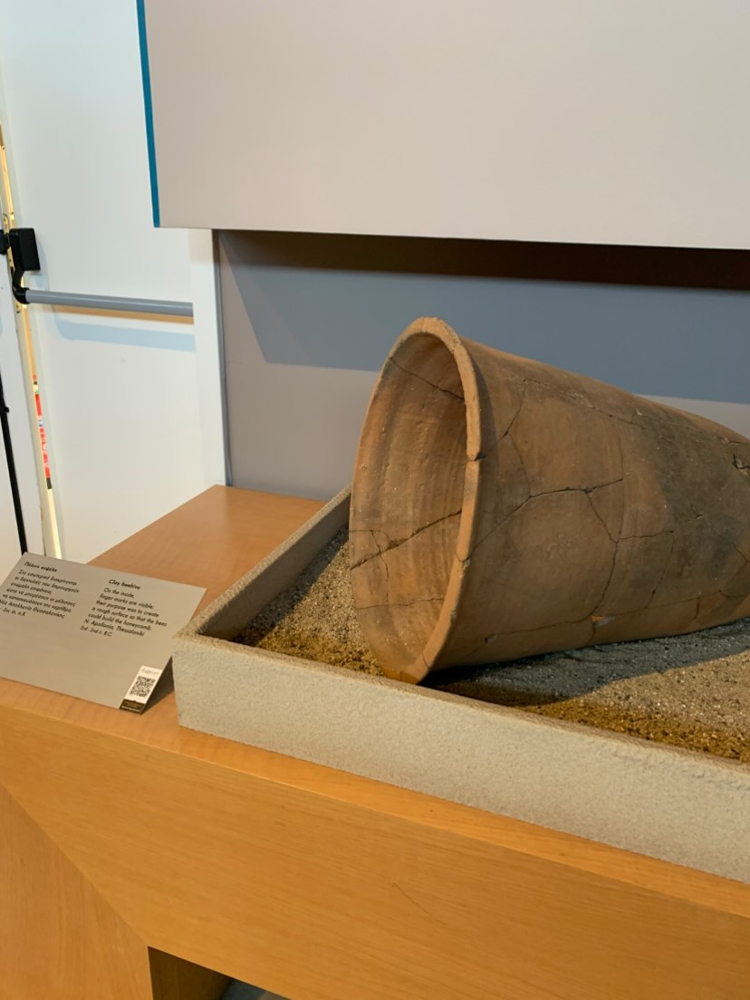

## Včelie úle dnes 
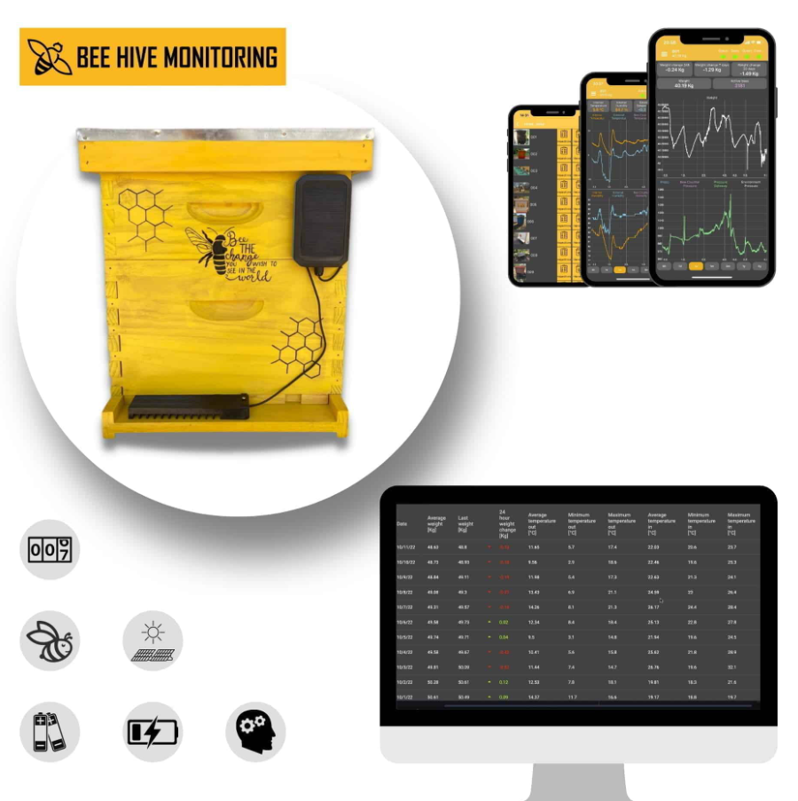

## Introduction
**Inteligentné monitorovanie včelích úľov pomocou IoT**

Navrhovaný systém slúži na inteligentné monitorovanie stavu včelích úľov prostredníctvom siete IoT senzorov, ktoré priebežne zhromažďujú údaje o vnútorných a vonkajších podmienkach úľa, ako sú teplota, vlhkosť, aktivita včelstva a ďalšie relevantné parametre. Získané dáta sú spracovávané v reálnom čase a následne prezentované používateľovi prostredníctvom prehľadného a interaktívneho používateľského rozhrania.

## Obsah
- [01-Business](../sdlc/01-business/index.md)
- [02-Top Level Architecture](../sdlc/02-top-level-architecture/index.md)
- [03-Solution Architecture](../sdlc/03-solution-architecture/index.md)
- [04-Analysis](../sdlc/04-analysis/index.md)
- [05-Design](../sdlc/05-design/index.md)
- [06-Implementation](../sdlc/06-implementation/index.md)
- [07-Testing & Verification](../sdlc/07-testing-verification/index.md)
- [08-Operation](../sdlc/08-operation/index.md)
- [09-Change Management](../sdlc/09-Change-Management/index.md)

## 01-Business

Súčasťou riešenia je inteligentný notifikačný modul, ktorý na základe analyzovaných meraní automaticky identifikuje neštandardné alebo potenciálne rizikové situácie. V prípade detekcie anomálií systém bezodkladne informuje používateľa, čím umožňuje včasnú reakciu a podporuje efektívnejšiu starostlivosť o včelstvá.
## Základný opis fungovania systému
Systém funguje na princípe kontinuálneho zberu dát z fyzických senzorov umiestnených vo včelích úľoch. Tieto senzory monitorujú vybrané environmentálne a behaviorálne parametre včelstva a odosielajú namerané hodnoty do centrálneho softvérového systému.

Centrálna časť systému zabezpečuje spracovanie, ukladanie a vyhodnocovanie prijatých dát. Používateľ má k dispozícii webové rozhranie, prostredníctvom ktorého môže sledovať aktuálny stav jednotlivých úľov, historický vývoj meraných hodnôt a prehľadné vizualizácie trendov. 

### Projektový tím

- **Členovia:**
    - Adam Grík – Vývoj softvéru
    - Maximilián Strečanský – Vývoj hardvéru
  

### Hlavné ciele projektu

- Navrhnúť a implementovať hardvérové zariadenie pre monitorovanie vybraných parametrov včelích úľov, založené na princípoch internetu vecí (IoT).
- Implementovať, alebo prispôsobiť existujúcu IoT platformu zabezpečujúcu zber, prenos, ukladanie a základné spracovanie dát zo senzorov umiestnených vo včelích úľoch.
- Navrhnúť a implementovať prezentačnú webovú aplikáciu, ktorá umožní používateľovi prehľadné zobrazenie aktuálnych aj historických dát, ako aj sledovanie stavu jednotlivých úľov.

## Zámer projektu a pridaná hodnota
Zámerom projektu je poskytnúť včelárom možnosť kontinuálneho a vzdialeného monitorovania stavu včelích úľov prostredníctvom IoT riešenia. Systém má umožniť včasnú identifikáciu výnimočných stavov včelstva na základe analýzy jeho aktivity a automaticky o nich informovať používateľa.

Navrhované riešenie prispieva k efektívnejšej starostlivosti o včelstvá a k zníženiu rizika chorobnosti včiel prostredníctvom včasného upozornenia na neštandardné situácie. Zároveň znižuje potrebu manuálnych kontrol úľov a zvyšuje dostupnosť relevantných informácií pre včelára aj pri vzdialenom prístupe.

### Rozsah projektu

- **V rozsahu projektu:**
  - Implementácia prototypu hardvérového zariadenia určeného na monitorovanie včelieho úľa.
  - Zber a spracovanie základných monitorovaných hodnôt, konkrétne teploty, vlhkosti a detekcie prevrátenia úľa.
  - Základná integrácia hardvérového zariadenia so softvérovou časťou systému a vizualizácia nameraných dát v prezentačnej aplikácii.
  
- **Mimo rozsahu projektu:**
  - Implementácia produkčného alebo certifikovaného hardvérového riešenia.
  - Monitorovanie rozšírených alebo špecializovaných parametrov včelstva.
  - Testovanie systému v reálnych prevádzkových podmienkach.

## 02-Top Level Architecture
## 03-Solution Architecture
## 04-Analysis

### Funkčné požiadavky
- Systém musí umožniť zber telemetrických dát z IoT zariadenia.
- Systém musí ukladať namerané hodnoty do databázy.
- Systém musí zobrazovať aktuálne a historické dáta v prezentačnej aplikácii.
- Systém musí detegovať výnimočné stavy na základe definovaných pravidiel.
- Systém musí informovať používateľa o výnimočných stavoch prostredníctvom notifikácií.

### Nefunkčné požiadavky
- Systém musí umožňovať vzdialený prístup k dátam.
- Systém musí zabezpečiť základnú dostupnosť služby.
- Systém musí byť navrhnutý ako prototypové riešenie.
- Systém musí byť rozšíriteľný o ďalšie monitorované parametre.

### Používateľské roly 
- Včelár 
- Administrátor IoT platformy 

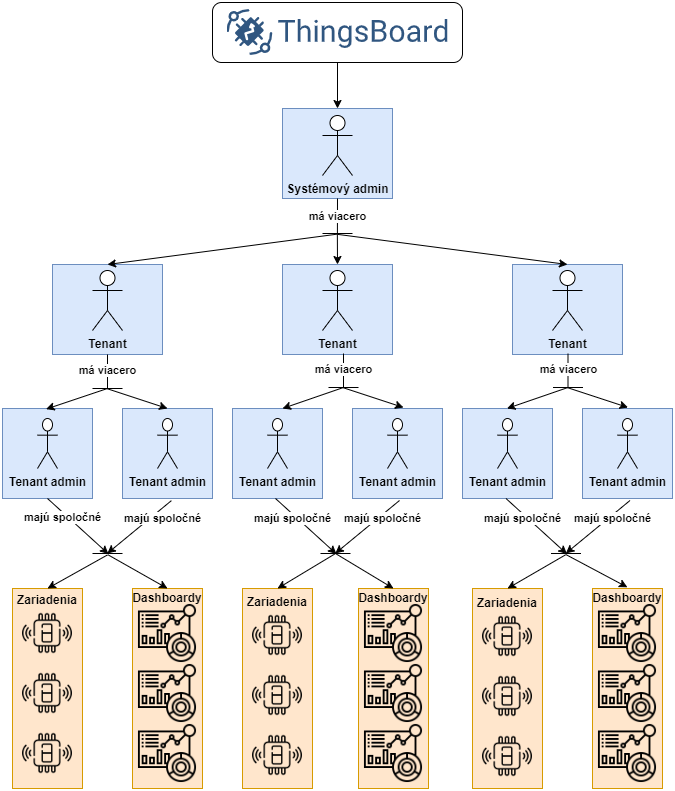

### Analýza stavov včelstva na základe frekvencie 
Na základe analýzy sme zistili, aké výnimočné stavy včelstva, môžeme vyhodnotiť a identifikovať na základe nameranej frekvencie.
Ak namerané hodnoty frekvencie budú v týchto rozsahoch, budeme včelárovi odosielať notifikácie. 

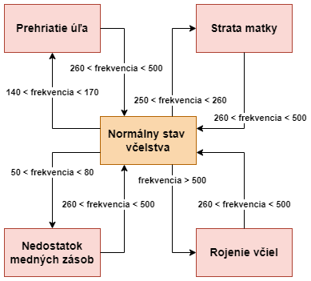

## 05-Design

### Value stream 
Základný value stream nášho systému, zobrazenie dát o včelích úľoch.
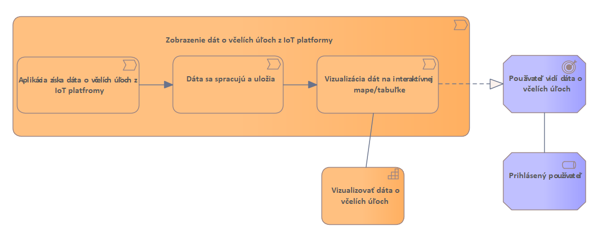

### Zmena stavu včelstva a odoslanie notifikácie na základe frekvencie
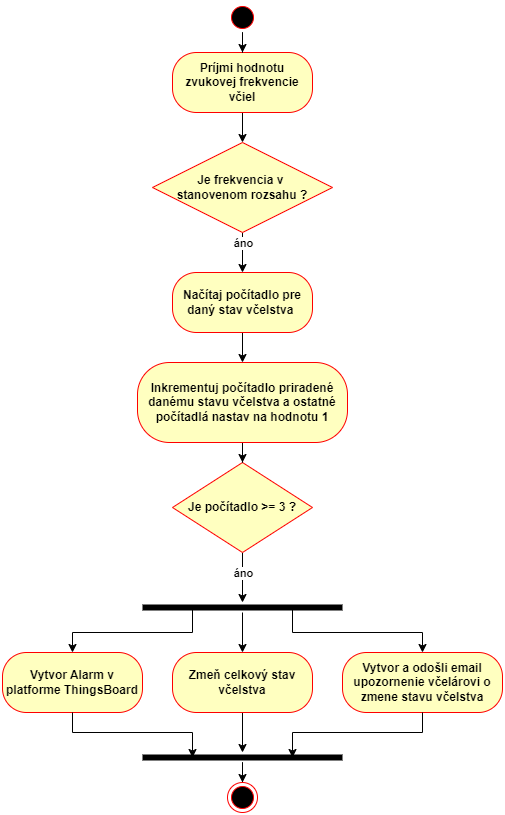

### Odosielanie notifikácií
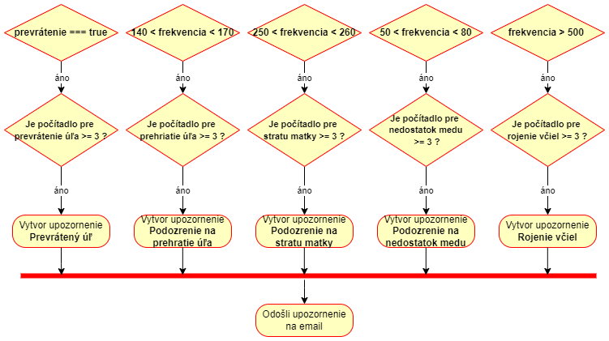

### Štruktúra GEO dát v prezentačnej webovej aplikácií
Vo webovej aplikácií budeme mať mapu, kde si bude môcť verejnosť pozrieť kde sa nachádzajú monitorované včelie úle, preto potrebujeme štruktúru dát ako budeme tieto GEO dáta ukladať.

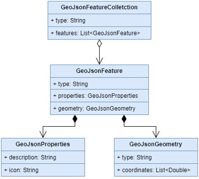

### Device DB - prezentačný web
Štruktúra objektu Device v databáze prezentačného webu, Device predstavuje jeden včelí úľ, ktorý je zobrazený na interaktívnej mape. Nie sú to namerané dáta, tie sú uložené v platforme Thingbsoard, ktorá má vlastnú databázu.
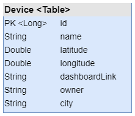

## Wireframes

### Prezentačný web
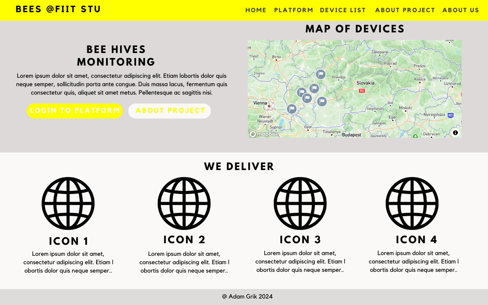
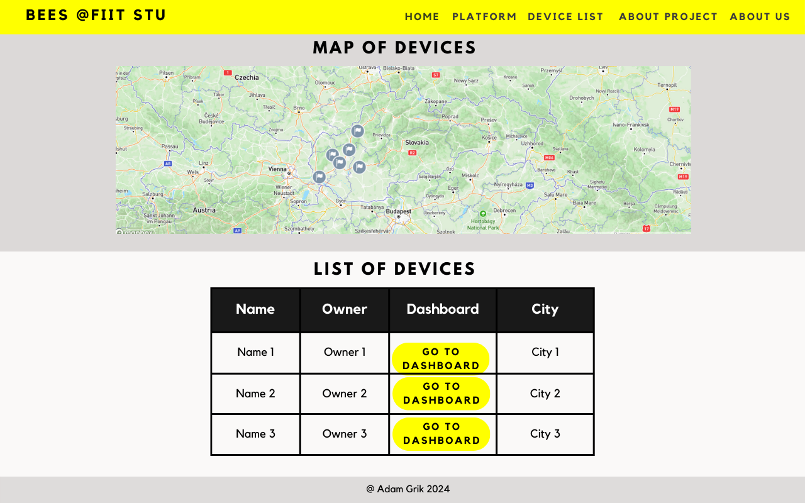
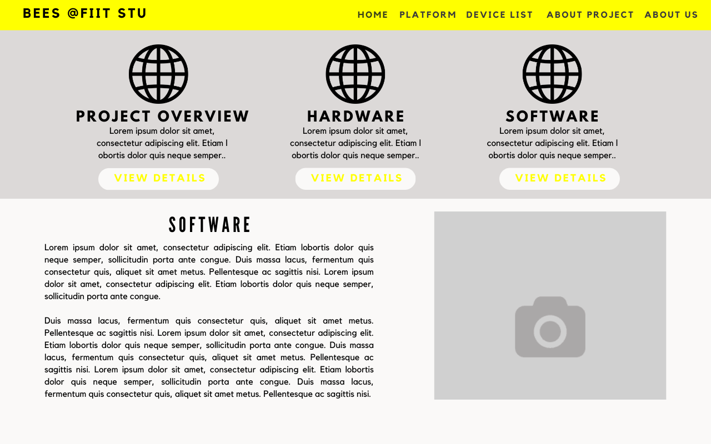
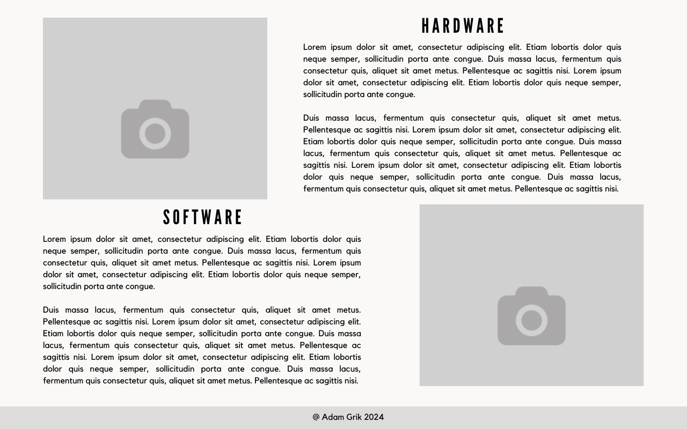
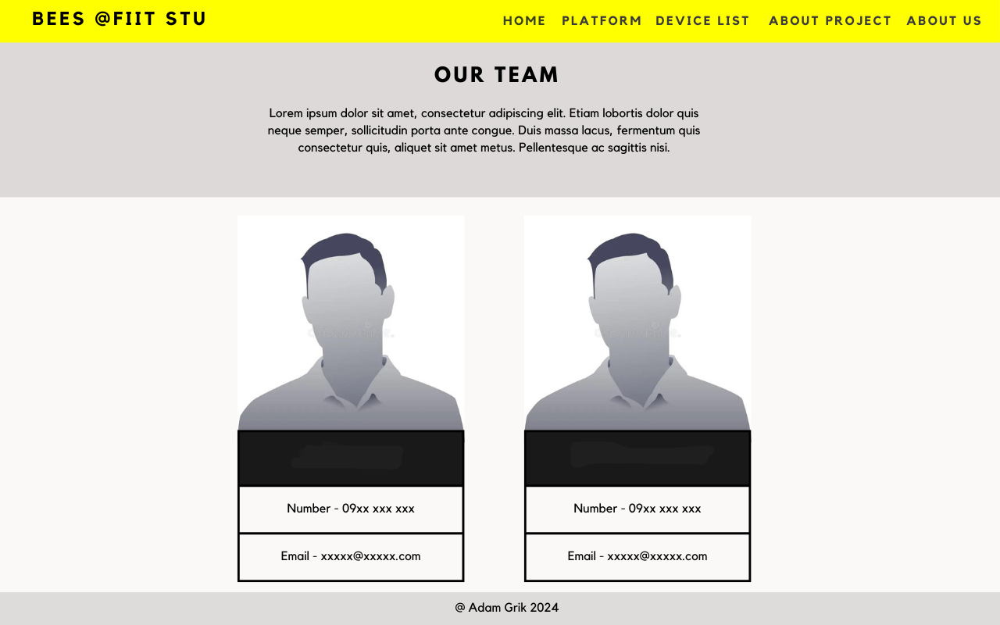

### Návrh dashboardov s dátami
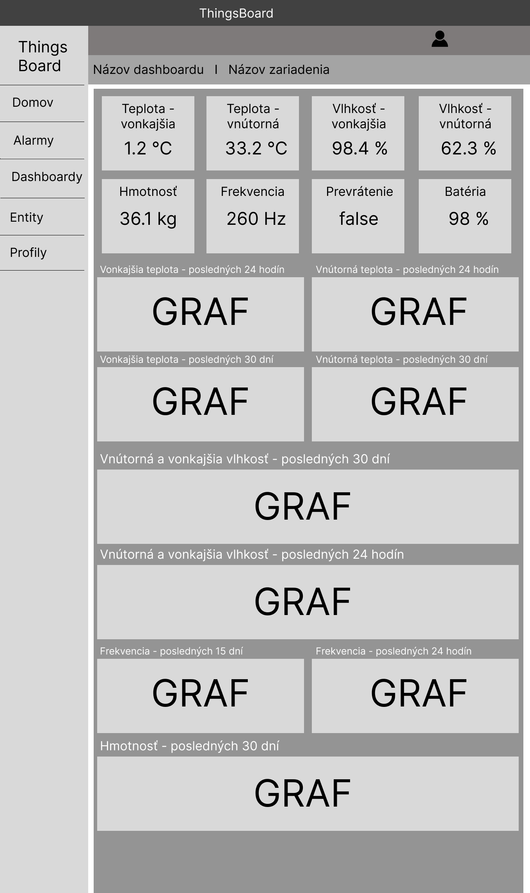

## 06-Implementation

###  Hardvérové zapojenie

- Použitý mikrokontrolér: ESP32-WROOM-32D.
- Senzor teploty a vlhkosti DHT11.
  
#### Základné zapojenie:

- VCC (DHT11) → 3.3V na ESP32
- GND (DHT11) → GND na ESP32
- DATA (DHT11) → GPIO17 na ESP32

#### Konfigurácia projektu v Arduino IDE

- Ďalším krokom bolo nainštalovanie driverov pre ESP32 a zvolenie konkrétneho modulu pre zariadenie
- Tools → Board → ESP32 Dev Module
- Tools → Port → zvoliť port, kde je ESP32 pripojené.

#### Nahratie kódu

- Pre nahratie kódu je potrebné pripojiť ESP32 cez USB k počítaču a následne v Arduino IDE kliknúť na Upload
- Po verifikácii kódu sa na Arduino IDE zobrazí pokus o pripojenie k ESP32, kde je následne potrebné podržať na hardvéri tlačidlo pripojenia a počkať na úspešný upload
- Následne v Serial Monitor nastavíme správny baud rate (115200) a uvidíme, že sa nám pravidelne zobrazujú hodnoty teploty a vlhkosti z DHT11 

### Implementácia softvéru 

#### IoT platforma Thingsboard - 

- IoT platforma ThingsBoard bola nainštalovaná v lokálnom prostredí na operačnom systéme Windows podľa oficiálnej dokumentácie výrobcu.

- Ako databázové úložisko bol použitý databázový systém PostgreSQL (verzia 16), ktorý slúži na perzistenciu telemetrických a konfiguračných dát.

- Po úspešnej inštalácii bola platforma spustená ako systémová služba, čím bola zabezpečená jej automatická dostupnosť po štarte systému.

- V rámci platformy boli vytvorené tenanti a účty tenant administrátorov, ktoré slúžia na logické oddelenie a správu jednotlivých častí systému.

- Pre účely monitorovania včelích úľov boli definované IoT zariadenia (devices) reprezentujúce jednotlivé hardvérové jednotky.

- Pre každé zariadenie boli nakonfigurované atribúty a telemetrické veličiny, ktoré definujú sledované parametre (napr. teplota, vlhkosť, stav prevrátenia).

- Na vizualizáciu dát boli vytvorené dashboardy, ktoré umožňujú prehľadné zobrazenie aktuálnych a historických hodnôt meraní.

- ThingsBoard bol použitý ako centrálny bod pre zber, spracovanie a sprístupnenie dát prezentačnej webovej aplikácii prostredníctvom dostupných rozhraní.

#### Rule engine v IoT platforme Thingsboard
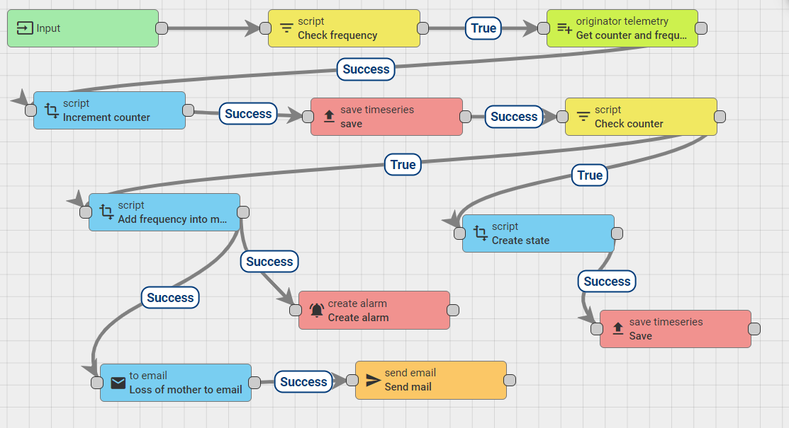

#### Prezentačný web 
- Prezentačná webová aplikácia bola implementovaná pomocou frameworku Spring Boot (Java) a slúži na prezentovanie projektu širokej verejnosti.

- Aplikácia poskytuje centrálne webové rozhranie pre zobrazenie informácií o monitorovaných včelích úľoch a sprístupňuje vybrané funkcionality systému verejným používateľom.

- Na ukladanie aplikačných dát bola použitá SQLite databáza, ktorá zabezpečuje perzistenciu základných informácií potrebných pre chod prezentačnej časti systému.

- Webová aplikácia obsahuje interaktívnu mapu, na ktorej sú zobrazené jednotlivé včelie úle spolu s ich geografickou polohou.

- Na implementáciu mapovej funkcionality bol použitý mapový softvér Mapbox, ktorý umožňuje vizuálne a prehľadné zobrazenie úľov v priestore.

- Používateľ má možnosť prechádzať z mapového rozhrania na verejne prístupné dashboardy, ktoré zobrazujú detailné údaje a vizualizácie nameraných hodnôt.

## 07-Testing & Verification

### Nasadenie zariadenia, testovanie a validácia

Testovanie a validácia systému prebiehali v rámci funkčného prototypu, ktorého cieľom bolo overiť správnu spolupárcu hardvérovej a softvérovej časti. ESP mikrokontroler sa nám podarilo úspešne zapojiť a bolo nakonfigurované tak, aby sa pravidelne zbierali údaje zo senzorov. Prijaté dáta sa v reálnom čase ukladali a spracovali v ThingsBoard.

Validácia používateľského rozhrania nám ukázala správnu funkčnosť webového dashboardu, na ktorom boli namerané hodnoty priebežne aktualizované a vizualizované. Na základe vykonaných testov možno povedať, že základné funkčné požiadavky systému boli splnené a prototyp úspešne ukazuje schopnosť monitorovania včelieho úľa a prenosu dát v rámci navrhovaného IoT riešenia.

## 08-Operation
## 09-Change Management
