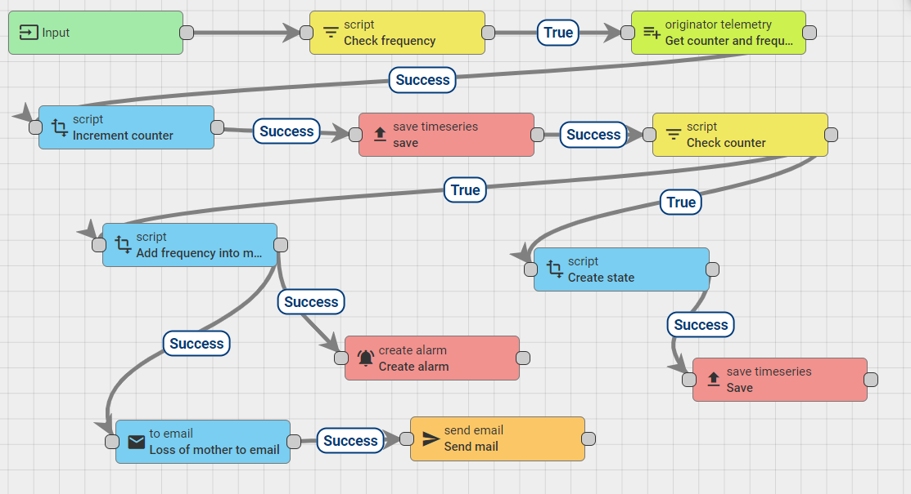

---
# 🧩 Versioning – systém dopĺňa automaticky
fm_version: "1.0.1"

# Dátum buildu – generuje skript
fm_build: "2025-11-28T15:54:47.998633+00:00"

# Poznámka k verzii – voliteľné
fm_version_comment: ""

# 🆔 IDENTITY --------------------------------------------------------

# ID generuje CLI / skript

# Unikátne UUID – generuje skript
guid: "09ab6f4d-2810-4dcf-957f-51eafc5f73a9"

# 🧭 CONTEXT ---------------------------------------------------------

# DAO / doména (knife, sdlc, q12, 7ds...) dopĺňa skript
dao: "class_sthdf_dashboard"

# Názov zápisu – dopĺňa používateľ
title: "06 implementation"

# Krátky popis – dopĺňa používateľ (voliteľné)
description: "{{DESCRIPTION}}"

# 👥 AUTHORSHIP ------------------------------------------------------

# Hlavný autor – z globálneho configu
author: "Roman Kazicka"

# Zoznam autorov – generuje skript
authors:
  - "Roman Kazicka"

# 🗂 CLASSIFICATION ---------------------------------------------------

# Nadradená kategória – môže doplniť používateľ
category: ""

# Typ dokumentu (guide, case, tutorial...) – používateľ (voliteľné)
type: ""

# Priorita (low/medium/high) – voliteľné
priority: ""

# Tagy – odporúča sa 2–6 tagov.
# Typy tagov:
#   - rámce: knife, 7ds, sdlc, q12
#   - účel: tutorial, guide, pattern, case-study
#   - téma: git, backup, ai, communication
#   - úroveň: beginner, intermediate, advanced
tags: []

# 🌍 LOCALIZATION -----------------------------------------------------

# Jazyk dokumentu – doplní skript podľa štruktúry
locale: "sk"

# 🕒 LIFECYCLE --------------------------------------------------------

# Dátum vytvorenia – generuje skript
created: "2025-11-28 16:54"

# Dátum poslednej úpravy – dopĺňa človek
modified: "2025-11-28 16:54"

# Stav dokumentu – default "backlog"
status: "backlog"

# Viditeľnosť – default "public"
privacy: "public"

# ⚖ INTELLECTUAL PROPERTY -------------------------------------------

# Držiteľ práv k obsahu – dopĺňa skript
rights_holder_content: "Roman Kazicka"

# Systémový vlastník práv
rights_holder_system: "CAA / KNIFE / LetItGrow"

# Licencia
license: "CC-BY-NC-SA-4.0"

# Disclaimer
disclaimer: "Use at your own risk. Methods provided as-is; participation is voluntary and context-aware."

# Copyright
copyright: "© 2025 Roman Kazicka"

# 🔗 ORIGIN / PROVENANCE ---------------------------------------------

# Repozitár pôvodu
origin_repo: ""

# URL pôvodného repozitára
origin_repo_url: ""

# Commit pôvodu
origin_commit: ""

# Branch pôvodu
origin_branch: ""

# Systém pôvodu (CAA/KNIFE/STHDF…)
origin_system: "CAA"

# Pôvodný autor
origin_author: "Roman Kazicka"

# Importovaný zdroj
origin_imported_from: ""

# Dátum importu
origin_import_date: ""

# 🧱 RESERVED ---------------------------------------------------------

fm_reserved1: ""
fm_reserved2: ""
---

<!-- class_sthdf_dashboard_INSTANCE_ID: 01-class_sthdf_dashboard_2025-2026 -->

# 06-Implementation

- [Odkazy na kód / repozitáre](./code-links.md)
  
**Navigation:** [⬆️ SDLC](../index.md) · [⬅️ Projekt](../../index.md)

#  Hardvérové zapojenie

- Použitý mikrokontrolér: ESP32-WROOM-32D.
- Senzor teploty a vlhkosti DHT11.
  
## Základné zapojenie:

- VCC (DHT11) → 3.3V na ESP32
- GND (DHT11) → GND na ESP32
- DATA (DHT11) → GPIO17 na ESP32

## Konfigurácia projektu v Arduino IDE

- Ďalším krokom bolo nainštalovanie driverov pre ESP32 a zvolenie konkrétneho modulu pre zariadenie
- Tools → Board → ESP32 Dev Module
- Tools → Port → zvoliť port, kde je ESP32 pripojené.

## Nahratie kódu

- Pre nahratie kódu je potrebné pripojiť ESP32 cez USB k počítaču a následne v Arduino IDE kliknúť na Upload
- Po verifikácii kódu sa na Arduino IDE zobrazí pokus o pripojenie k ESP32, kde je následne potrebné podržať na hardvéri tlačidlo pripojenia a počkať na úspešný upload
- Následne v Serial Monitor nastavíme správny baud rate (115200) a uvidíme, že sa nám pravidelne zobrazujú hodnoty teploty a vlhkosti z DHT11 

# Implementácia softvéru 

## IoT platforma Thingsboard - 

- IoT platforma ThingsBoard bola nainštalovaná v lokálnom prostredí na operačnom systéme Windows podľa oficiálnej dokumentácie výrobcu.

- Ako databázové úložisko bol použitý databázový systém PostgreSQL (verzia 16), ktorý slúži na perzistenciu telemetrických a konfiguračných dát.

- Po úspešnej inštalácii bola platforma spustená ako systémová služba, čím bola zabezpečená jej automatická dostupnosť po štarte systému.

- V rámci platformy boli vytvorené tenanti a účty tenant administrátorov, ktoré slúžia na logické oddelenie a správu jednotlivých častí systému.

- Pre účely monitorovania včelích úľov boli definované IoT zariadenia (devices) reprezentujúce jednotlivé hardvérové jednotky.

- Pre každé zariadenie boli nakonfigurované atribúty a telemetrické veličiny, ktoré definujú sledované parametre (napr. teplota, vlhkosť, stav prevrátenia).

- Na vizualizáciu dát boli vytvorené dashboardy, ktoré umožňujú prehľadné zobrazenie aktuálnych a historických hodnôt meraní.

- ThingsBoard bol použitý ako centrálny bod pre zber, spracovanie a sprístupnenie dát prezentačnej webovej aplikácii prostredníctvom dostupných rozhraní.

### Rule engine v IoT platforme Thingsboard

## Prezentačný web 
- Prezentačná webová aplikácia bola implementovaná pomocou frameworku Spring Boot (Java) a slúži na prezentovanie projektu širokej verejnosti.

- Aplikácia poskytuje centrálne webové rozhranie pre zobrazenie informácií o monitorovaných včelích úľoch a sprístupňuje vybrané funkcionality systému verejným používateľom.

- Na ukladanie aplikačných dát bola použitá SQLite databáza, ktorá zabezpečuje perzistenciu základných informácií potrebných pre chod prezentačnej časti systému.

- Webová aplikácia obsahuje interaktívnu mapu, na ktorej sú zobrazené jednotlivé včelie úle spolu s ich geografickou polohou.

- Na implementáciu mapovej funkcionality bol použitý mapový softvér Mapbox, ktorý umožňuje vizuálne a prehľadné zobrazenie úľov v priestore.

- Používateľ má možnosť prechádzať z mapového rozhrania na verejne prístupné dashboardy, ktoré zobrazujú detailné údaje a vizualizácie nameraných hodnôt.