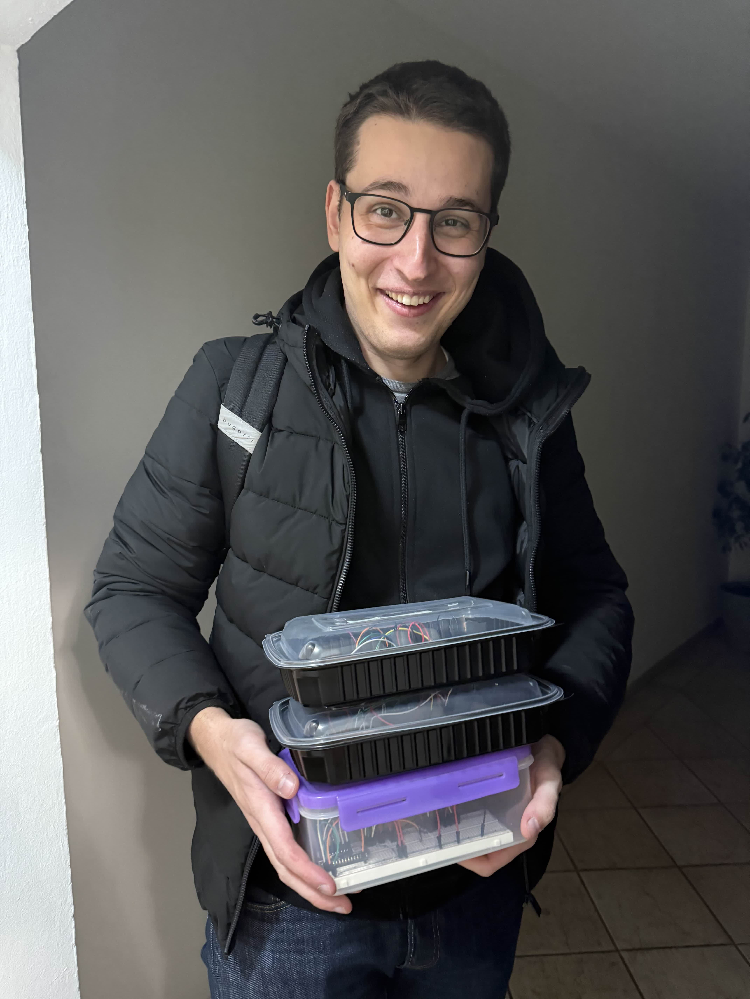
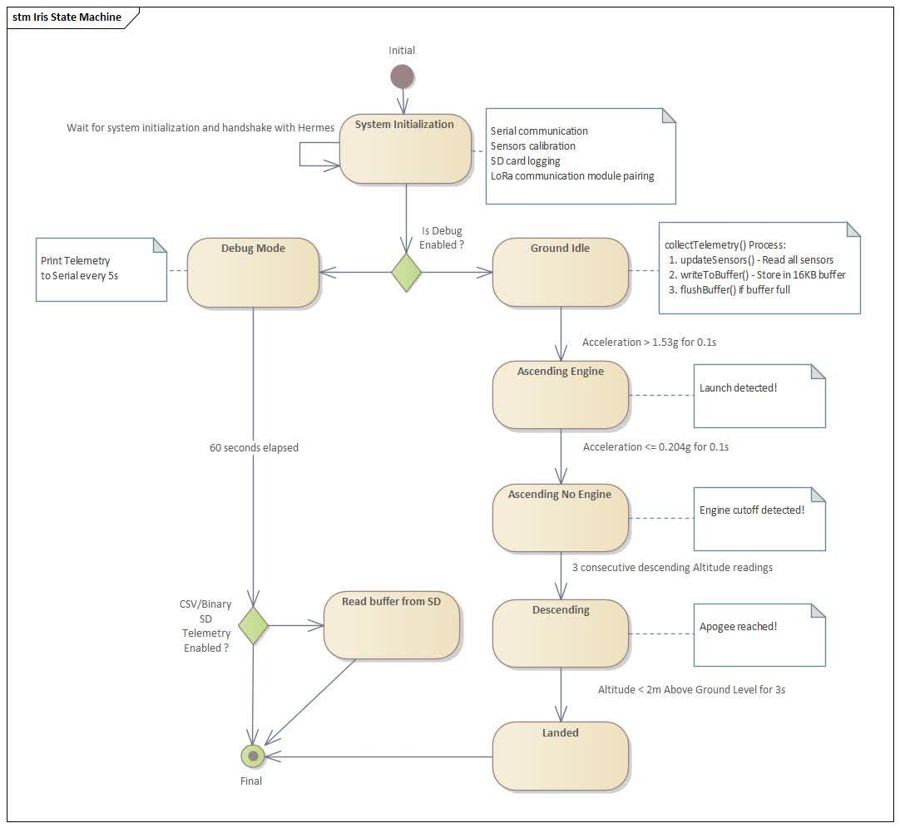
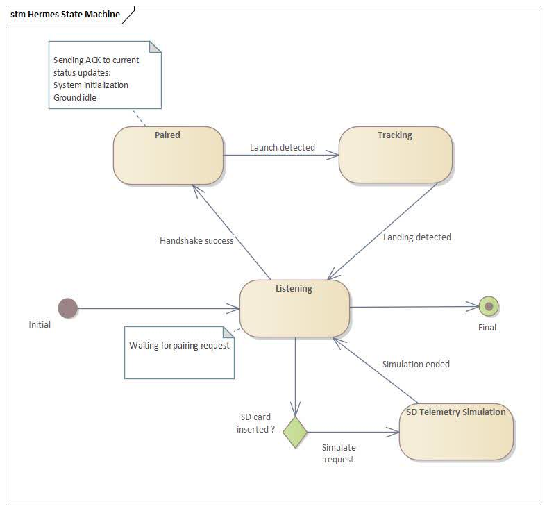
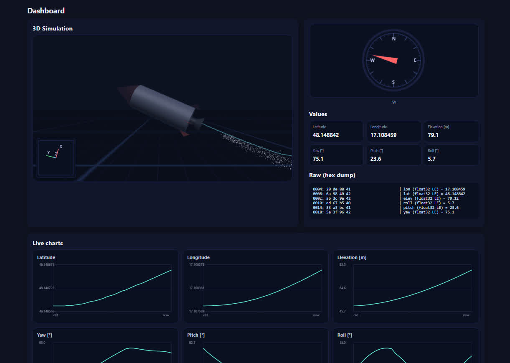
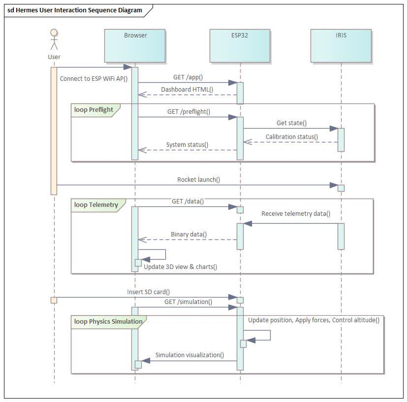
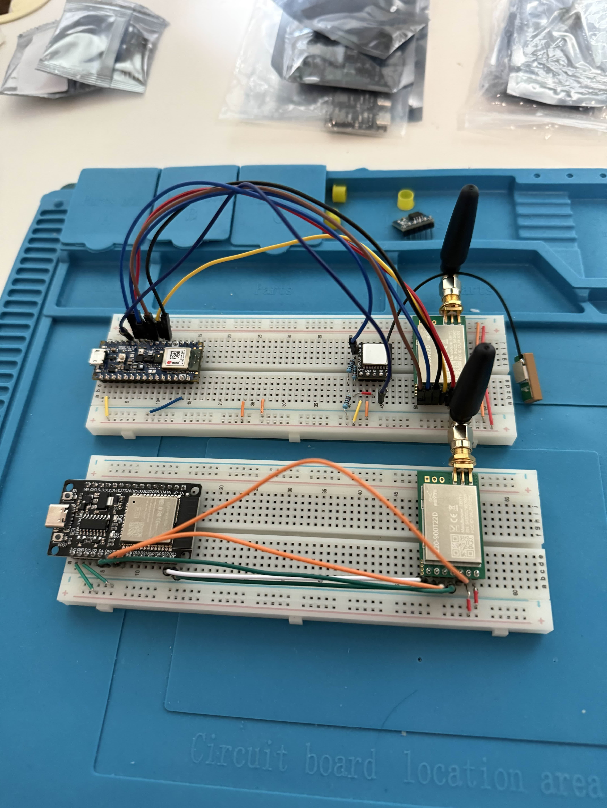
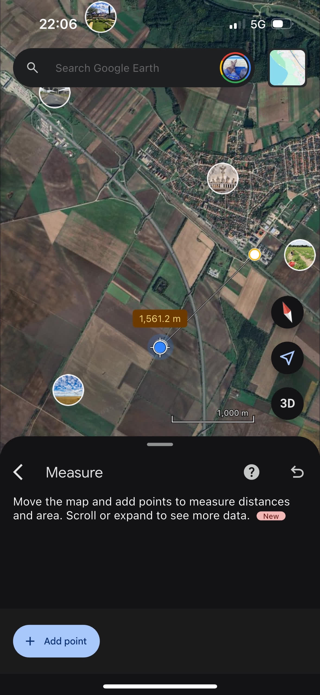
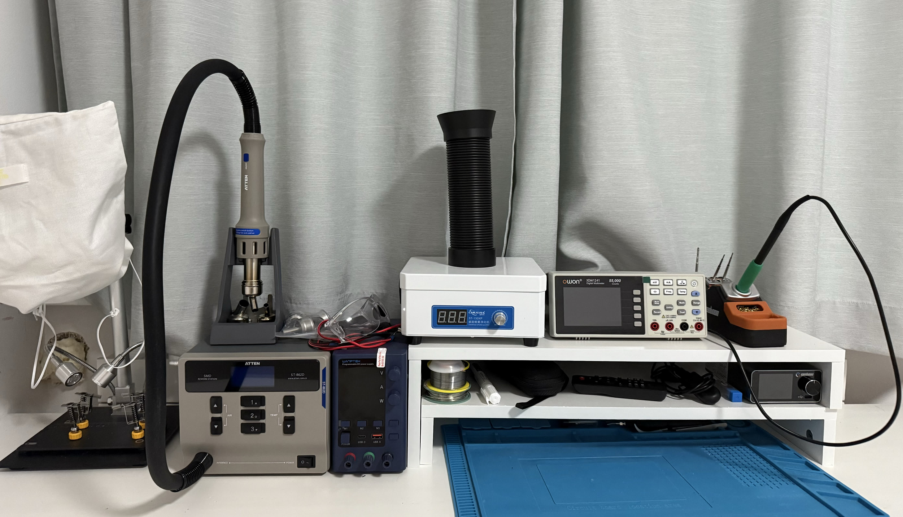
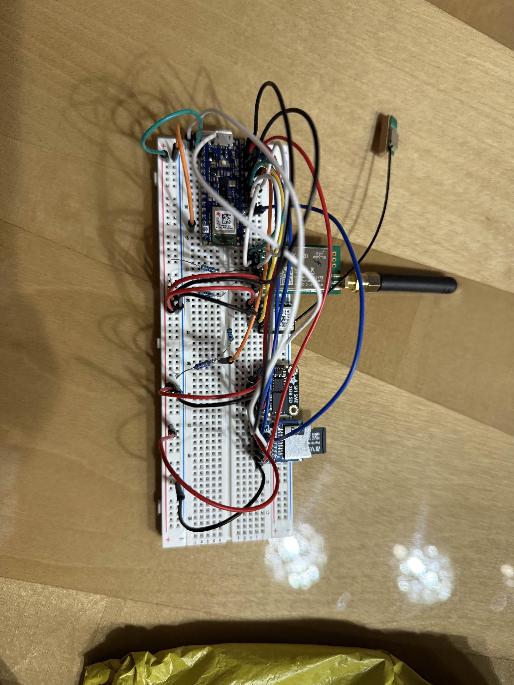
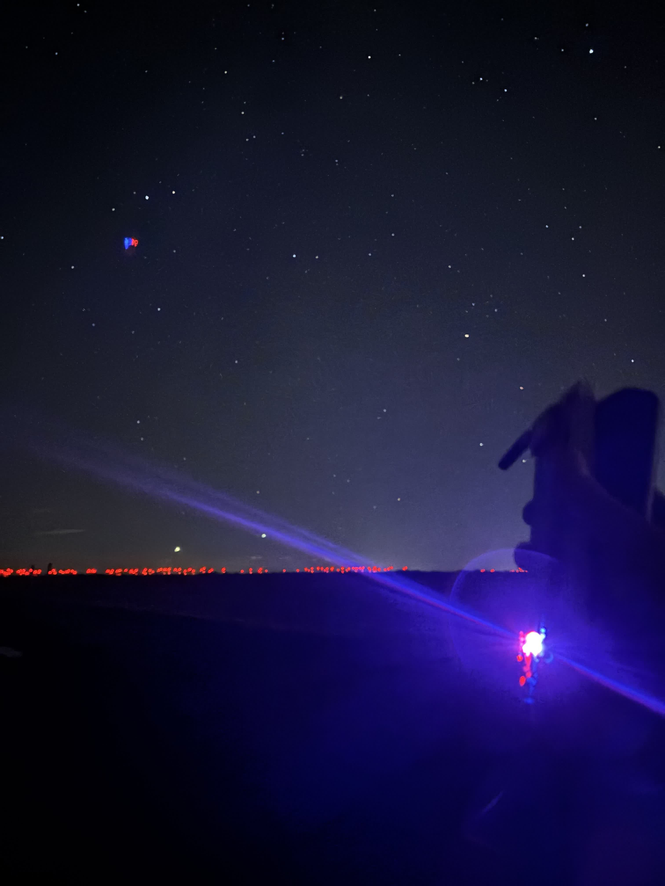

---
# 🧩 Versioning – systém dopĺňa automaticky
fm_version: '1.0.1'

# Dátum buildu – generuje skript
fm_build: '2025-11-28T15:54:47.910025+00:00'

# Poznámka k verzii – voliteľné
fm_version_comment: ''

# 🆔 IDENTITY --------------------------------------------------------

# ID generuje CLI / skript

# Unikátne UUID – generuje skript
guid: 'c0754bee-c03c-4ba2-991d-b845e3172d45'

# 🧭 CONTEXT ---------------------------------------------------------

# DAO / doména (knife, sdlc, q12, 7ds...) dopĺňa skript
dao: 'class_sthdf_dashboard'

# Názov zápisu – dopĺňa používateľ
title: 'slides'

# Krátky popis – dopĺňa používateľ (voliteľné)
description: '{{DESCRIPTION}}'

# 👥 AUTHORSHIP ------------------------------------------------------

# Hlavný autor – z globálneho configu
author: 'Roman Kazicka'

# Zoznam autorov – generuje skript
authors:
  - 'Roman Kazicka'

# 🗂 CLASSIFICATION ---------------------------------------------------

# Nadradená kategória – môže doplniť používateľ
category: ''

# Typ dokumentu (guide, case, tutorial...) – používateľ (voliteľné)
type: ''

# Priorita (low/medium/high) – voliteľné
priority: ''

# Tagy – odporúča sa 2–6 tagov.
# Typy tagov:
#   - rámce: knife, 7ds, sdlc, q12
#   - účel: tutorial, guide, pattern, case-study
#   - téma: git, backup, ai, communication
#   - úroveň: beginner, intermediate, advanced
tags: []

# 🌍 LOCALIZATION -----------------------------------------------------

# Jazyk dokumentu – doplní skript podľa štruktúry
locale: 'sk'

# 🕒 LIFECYCLE --------------------------------------------------------

# Dátum vytvorenia – generuje skript
created: '2025-11-28 16:54'

# Dátum poslednej úpravy – dopĺňa človek
modified: '2025-11-28 16:54'

# Stav dokumentu – default "backlog"
status: 'backlog'

# Viditeľnosť – default "public"
privacy: 'public'

# ⚖ INTELLECTUAL PROPERTY -------------------------------------------

# Držiteľ práv k obsahu – dopĺňa skript
rights_holder_content: 'Roman Kazicka'

# Systémový vlastník práv
rights_holder_system: 'CAA / KNIFE / LetItGrow'

# Licencia
license: 'CC-BY-NC-SA-4.0'

# Disclaimer
disclaimer: 'Use at your own risk. Methods provided as-is; participation is voluntary and context-aware.'

# Copyright
copyright: '© 2025 Roman Kazicka'

# 🔗 ORIGIN / PROVENANCE ---------------------------------------------

# Repozitár pôvodu
origin_repo: ''

# URL pôvodného repozitára
origin_repo_url: ''

# Commit pôvodu
origin_commit: ''

# Branch pôvodu
origin_branch: ''

# Systém pôvodu (CAA/KNIFE/STHDF…)
origin_system: 'CAA'

# Pôvodný autor
origin_author: 'Roman Kazicka'

# Importovaný zdroj
origin_imported_from: ''

# Dátum importu
origin_import_date: ''

# 🧱 RESERVED ---------------------------------------------------------

fm_reserved1: ''
fm_reserved2: ''
---

<!-- class_sthdf_dashboard_INSTANCE_ID: 01-class_sthdf_dashboard_2025-2026 -->

[🏠 Domov](../../../index.md) · [⬅️ Nahor](../)

# PRJ008 — Presentation

--- Headline ---

## Headline

**2025-PRJ-008 — SIGNALIS**

Telemetrický systém pre raketové lety

**ARC Team:** Adam Hladík, Dominik Mifkovič, Ján Sližik, UR
--- Headline ---

--- introduction ---

## Introduction

**SIGNALIS — Dostupný telemetrický systém pre raketové lety**

SIGNALIS je dvojkomponentový systém určený na komunikáciu, zber a vizualizáciu údajov z raketových letov. Pozostáva z palubného datalogera **IRIS** umiestneného v rakete a pozemnej stanice **HERMES**, ktorá prijíma telemetrické dáta cez LoRa (2 km dosah) a poskytuje real-time vizualizáciu prostredníctvom webového dashboardu.

**Pridaná hodnota:**

- Dostupná alternatíva k drahým komerčným riešeniam (500€+)
- Otvorenosť a možnosť rozširovania
- Edukatívny prínos pre začínajúcich raketových modelárov
- Detailné letové dáta bez vysokých vstupných nákladov

**Kľúčové technológie:** Arduino Nano 33 BLE, ESP32, LoRa komunikácia (900 MHz), WebGL 3D vizualizácia, 9DOF IMU, GPS, Barometer
--- introduction ---

--- obsah ---

## Obsah

- [01-Business](../sdlc/01-business/index.md)
- [02-Top Level Architecture](../sdlc/02-top-level-architecture/index.md)
- [03-Solution Architecture](../sdlc/03-solution-architecture/index.md)
- [04-Analysis](../sdlc/04-analysis/index.md)
- [05-Design](../sdlc/05-design/index.md)
- [06-Implementation](../sdlc/06-implementation/index.md)
- [07-Testing & Verification](../sdlc/07-testing-verification/index.md)
- [08-Operation](../sdlc/08-operation/index.md)
- [09-Change Management](../sdlc/09-Change-Management/index.md)
  --- obsah ---

## 01-Business

**Projekt:** SIGNALIS (2025_PRJ_008)

**Popis:**
SIGNALIS je systém určený na komunikáciu, zber a vizualizáciu údajov z raketových letov. Skladá sa z dvoch hlavných komponentov - **IRIS** (palubný datalogger) a **HERMES** (pozemná stanica).

**Motivácia:**
Začínajúci raketoví modelári potrebujú dostupné riešenie na overenie letových výpočtov. Komerčné systémy stoja okolo 500€, čo predstavuje značné finančné riziko pri strate zariadenia. SIGNALIS ponúka rádovo lacnejšiu alternatívu.

**Cieľová skupina:**

- Raketoví modelári
- Študenti technických odborov
- Technologickí nadšenci

**Tím:** ARC Team (4 členovia)

- Adam Hladík - LoRa, rádio, vedúci developer
- Dominik Mifkovič - PCB dizajnér, dátový analytik
- Ján Sližik - Softvérový inžinier, EA expert
- UR - Tímový vedúci, projektový manažér, CAD modelár

**Míľniky:** M01-M04 ✅ Dokončené, Finálna prezentácia ✅ Január 2026

## 02-Top Level Architecture

**Systémový prehľad:**

Dvojkomponentová architektúra komunikujúca cez LoRa rádio (až 2 km dosah).

**IRIS - Palubný datalogger:**

- Arduino Nano 33 BLE Sense Rev2
- 9DOF IMU (akcelerometer, gyroskop, magnetometer)
- Barometer (tlak, teplota)
- GPS modul (pozícia, elevácia)
- LoRa rádio E220-900T22D (900 MHz)
- SD karta (CSV záznam)
- 3.7V LiPo batéria (30+ min)
- Hmotnosť: max. 200g
- Kompatibilné s BT-80 raketovými nosičmi

**HERMES - Pozemná stanica:**

- ESP32 mikrokontrolér
- LoRa prijímač E220-900T22D
- WiFi Access Point (arct-signalis.local)
- Webový dashboard (HTML/CSS/JS)
- Batéria (45+ min výdrž)
- Rozmery: 91×84×35 mm

**Komunikácia:**

- LoRa 900 MHz, half-duplex
- Dosah: 2 km (overené)
- Telemetrický rámec: 28 bajtov (binárny)
- Priorita: Vzdialenosť pred šírkou pásma

## 03-Solution Architecture

**Komunikačný protokol:**

- **Poloduplexná LoRa komunikácia**
- Polling-based prístup s retry mechanizmom (3 pokusy)
- CRC validácia a RSSI reporting
- Stavové automaty pre IRIS aj HERMES

**IRIS stavy:**
UNPAIRED → PAIRING → PRE_LAUNCH → IN_FLIGHT → APOGEE → LANDED

**HERMES stavy:**
LISTENING → PAIRED → TRACKING → IDLE

**Webový Dashboard:**

- ESP32 WiFi AP (192.168.4.1)
- HTTP endpointy: `/` (landing), `/app` (dashboard), `/data` (telemetria)
- **Čisté HTML/CSS/JavaScript** (žiadne externé knižnice)
- 3D WebGL vizualizácia s interaktívnou kamerou
- Live grafy a hex dump pre debug
- 28-bajtový telemetrický rámec (float32 LE)

**Sekvenčný diagram:**

## 04-Analysis

**Prvotný prototyp:**

- Vytvorenie funkčných prototypov HERMES a IRIS na breadboardoch
- Overenie funkcionality senzorov
- Detekcia LoRa správ pomocou SDR prijímača

**LoRa testy:**

- Testovanie komunikačného dosahu v reálnych podmienkach
- **Dosiahnutý dosah: až 2 km ✅**
- Stabilita spojenia overená
- RSSI reporting funkčný

**Dizajnové výzvy - IRIS:**

- **Problém:** Priestorové obmedzenia (BT-80 trubica, ~65mm priemer)
- **Prvotný návrh:** Stacked layout (2 horizontálne dosky)
- **Identifikovaný problém:** SMA konektor pre anténu → zostava sa **nezmestila**
- **Riešenie:** Redesign na **vertikálny layout** ✅

**Záver:**
Úspešné overenie konceptu a riešenie priestorových obmedzení pripravilo cestu pre finálny dizajn.

## 05-Design

**HERMES PCB - 4 iterácie:**

**Iterácia 1:** CNC prototyp (jednovrstvová doska)

- Základný dizajn, lokálna výroba
- Problémy: nedostatočná šírka spojov, chyby v rozmeroch dier

**Iterácia 2:** Vylepšená CNC doska

- Rozšírené spoje, solder maska (UV živica), silkscreen (laser)
- Funkčná doska s drobnými nedostatkami

**Iterácia 3-4:** Profesionálna výroba

- Oddelenie analógových/digitálnych signálov
- Obvod merania a regulácie napätia
- Finálna kvalita ✅

**HERMES 3D dizajn - 2 iterácie:**

**v1:** 85×100×45 mm - Problémy: veľa supports, veľké rozmery
**v2:** 91×84×35 mm - Optimalizovaný bez supports, reprodukovateľný ✅

**IRIS PCB:**

- Stacked layout zahodnutý (SMA konektor problém)
- **Vertikálny layout** - zmestí sa do BT-80, funkčný ✅

## 06-Implementation

**SMD spájkovanie - Workshop:**

- Tréning pre členov tímu (0603, 0805, 1206 komponenty)
- Klasické SMD spájkovanie + hot air reflow
- Práca s mikroskopom

**HERMES zostavenie:**

- Osadenie profesionálnej PCB (SMD + THT komponenty)
- Hot air reflow spájkovanie
- Inštalácia do 3D tlačeného krytu
- Pripojenie batérie, tlačidla, antény

**IRIS zostavenie:**

- Osadenie PCB vertikálneho layoutu
- Integrácia LoRa rádia, SD karty, GPS, senzorov
- Inštalácia do 3D tlačeného držiaka

**Webový Dashboard:**

- ESP32 WiFi AP (`arct-signalis.local`)
- HTTP server s 3 endpointmi
- **Čisté HTML/CSS/JS** (bez závislostí)
- 3D WebGL vizualizácia, live grafy, hex dump

**Firmware:**

- IRIS: Stavový automat, sensor integration, LoRa, SD logging
- HERMES: WiFi AP, HTTP server, LoRa receiver, real-time distribution

**Repozitáre:** [06-STH-Projects](https://github.com/06-STH-Projects)

## 07-Testing & Verification

**Prvotný prototyp:**

- ✅ Senzory (IMU, barometer, GPS) funkčné
- ✅ LoRa komunikácia overená (SDR detekcia)

**LoRa dosahové testy:**

- ✅ Maximálny dosah: až 2 km (splnené)
- ✅ Stabilita komunikácie
- ✅ RSSI reporting
- ✅ Paketová strata: <3% (cieľ <5%)

**IRIS integračné testovanie:**

- ✅ LoRa rádio: komunikácia s HERMES (2 km)
- ✅ SD karta: offline záznam (CSV formát)
- ✅ IMU (9DOF): akcelerometer, gyroskop, magnetometer
- ✅ Barometer: tlak a teplota
- ✅ GPS: pozícia a elevácia

**HERMES testovanie:**

- ✅ WiFi AP stabilita (arct-signalis.local)
- ✅ HTTP server a endpointy
- ✅ Telemetrický endpoint (`/data` - 28 bajtov)
- ✅ 3D dashboard vizualizácia
- ✅ Live grafy a hex dump

**Technické špecifikácie - overené:**

| Parameter          | Požiadavka  | Dosiahnuté | Stav |
| ------------------ | ----------- | ---------- | ---- |
| IRIS výdrž         | min. 30 min | 30+ min    | ✅   |
| HERMES výdrž       | min. 45 min | 45+ min    | ✅   |
| LoRa dosah         | min. 2 km   | až 2 km    | ✅   |
| Telemetrický rámec | 28 bajtov   | 28 bajtov  | ✅   |

**Záver:** Všetky požiadavky splnené alebo prekročené, systém pripravený na nasadenie.

## 08-Operation

**Aktuálny stav:**

**Dokončené:**

- ✅ HERMES PCB (revízia 4) + 3D kryt (v2)
- ✅ IRIS PCB (vertikálny layout) + držiaky
- ✅ Webový dashboard s 3D vizualizáciou
- ✅ Telemetrický protokol (28-byte frame)
- ✅ LoRa komunikácia (2 km overená)

**Prebieha:**

- 🔄 Integrácia do finálnych zostáv
- 🔄 Testovanie kompletného systému
- 🔄 Optimalizácia softvéru
- 🔄 Kalibrácia senzorov

**Prevádzkové režimy IRIS:**

- UNPAIRED: Pairing request každých 5s
- PRE_LAUNCH: Status update pri zmene
- IN_FLIGHT: Telemetria 1s, GPS 500ms
- LANDED: Pozícia každých 30s

**HERMES Dashboard:**

- 3D WebGL model s interaktívnou kamerou
- Real-time telemetria (GPS, elevácia, orientácia)
- Live grafy s adaptívnym rozsahom
- Hex dump pre debug

**Cieľová skupina:**

- Raketoví modelári
- Študenti technických odborov
- Technologickí nadšenci

**Pridaná hodnota:**

- Dostupná cena (vs. 500€ komerčné)
- Otvorenosť a modularita
- Vzdelávacie využitie

**Budúce kroky:**

- Finálne zostavenie s profesionálnymi PCB
- Testovanie v simulovaných letových podmienkach
- Dlhodobé: injection molding, programovateľné API, mobilná aplikácia

## 09-Change Management

**Evolúcia projektu:**

**HERMES PCB - 4 iterácie:**

1. CNC prototyp → problémy (šírka spojov, rozmery dier)
2. Vylepšená CNC → solder maska, silkscreen
   3-4. Profesionálna výroba → finálne vylepšenia

**HERMES 3D - 2 iterácie:**

1. v1 (85×100×45mm) → problémy (supports, veľkosť)
2. v2 (91×84×35mm) → optimalizovaný, bez supports ✅

**IRIS PCB - redesign:**

1. Stacked layout → SMA konektor problém
2. Vertikálny layout → vyriešené ✅

**Riziká a manažment:**

- **Ambiciózny rozsah** → Iteratívny vývoj, MVP prístup ✅
- **Dlhé dodacie lehoty** → Skoré objednávanie, paralelný vývoj ✅
- **Závislosť na vybavení** → Pravidelné stretnutia, workshop ✅

**Získané poznatky:**

- 3D tlač a CAD modelovanie (Fusion 360)
- CNC frézovanie a programovanie
- SMD spájkovanie (klasické + hot air reflow)
- Práca s mikroskopom
- Implementácia fyzikálnych konceptov
- Enterprise Architect (stavové automaty, diagramy)
- LemonTree pre verzionovanie EA modelov

**Míľniky dosiahnuté:**

- ✅ Príprava (september-október 2025)
- ✅ Implementácia (október-december 2025)
- ✅ Testovanie (december 2025)
- ✅ Prezentácia (január 2026)

**Dodané výstupy:**

- ✅ Prototyp IRIS a HERMES
- ✅ PCB dizajny (KiCad)
- ✅ 3D modely (Fusion 360)
- ✅ Firmware (Arduino, ESP32)
- ✅ Web Dashboard
- ✅ Dokumentácia (KNIFE články, EA diagramy)

**Reflexia:**
Pre každého člena tímu mal projekt výrazný prínos - naučili sme sa množstvo praktických zručností (hardvér, softvér, 3D tlač, CNC, spájkovanie) a získali cenné skúsenosti s iteratívnym vývojom a tímovou prácou.

**Budúci rozvoj:**
Pri sériovej výrobe potrebný redesign pre injection molding, outsourcing 3D tlače, programovateľné rozhranie pre pokročilých používateľov.
