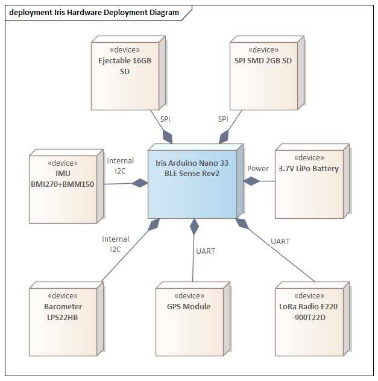
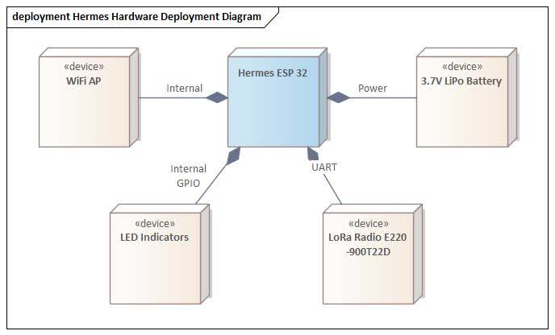

---
# 🧩 Versioning – systém dopĺňa automaticky
fm_version: '1.0.1'

# Dátum buildu – generuje skript
fm_build: '2025-11-28T15:54:47.914597+00:00'

# Poznámka k verzii – voliteľné
fm_version_comment: ''

# 🆔 IDENTITY --------------------------------------------------------

# ID generuje CLI / skript

# Unikátne UUID – generuje skript
guid: 'a83431c4-1f05-4cb0-a41d-67ef24effd77'

# 🧭 CONTEXT ---------------------------------------------------------

# DAO / doména (knife, sdlc, q12, 7ds...) dopĺňa skript
dao: 'class_sthdf_dashboard'

# Názov zápisu – dopĺňa používateľ
title: '02 top level architecture'

# Krátky popis – dopĺňa používateľ (voliteľné)
description: '{{DESCRIPTION}}'

# 👥 AUTHORSHIP ------------------------------------------------------

# Hlavný autor – z globálneho configu
author: 'Roman Kazicka'

# Zoznam autorov – generuje skript
authors:
  - 'Roman Kazicka'

# 🗂 CLASSIFICATION ---------------------------------------------------

# Nadradená kategória – môže doplniť používateľ
category: ''

# Typ dokumentu (guide, case, tutorial...) – používateľ (voliteľné)
type: ''

# Priorita (low/medium/high) – voliteľné
priority: ''

# Tagy – odporúča sa 2–6 tagov.
# Typy tagov:
#   - rámce: knife, 7ds, sdlc, q12
#   - účel: tutorial, guide, pattern, case-study
#   - téma: git, backup, ai, communication
#   - úroveň: beginner, intermediate, advanced
tags: []

# 🌍 LOCALIZATION -----------------------------------------------------

# Jazyk dokumentu – doplní skript podľa štruktúry
locale: 'sk'

# 🕒 LIFECYCLE --------------------------------------------------------

# Dátum vytvorenia – generuje skript
created: '2025-11-28 16:54'

# Dátum poslednej úpravy – dopĺňa človek
modified: '2025-11-28 16:54'

# Stav dokumentu – default "backlog"
status: 'backlog'

# Viditeľnosť – default "public"
privacy: 'public'

# ⚖ INTELLECTUAL PROPERTY -------------------------------------------

# Držiteľ práv k obsahu – dopĺňa skript
rights_holder_content: 'Roman Kazicka'

# Systémový vlastník práv
rights_holder_system: 'CAA / KNIFE / LetItGrow'

# Licencia
license: 'CC-BY-NC-SA-4.0'

# Disclaimer
disclaimer: 'Use at your own risk. Methods provided as-is; participation is voluntary and context-aware.'

# Copyright
copyright: '© 2025 Roman Kazicka'

# 🔗 ORIGIN / PROVENANCE ---------------------------------------------

# Repozitár pôvodu
origin_repo: ''

# URL pôvodného repozitára
origin_repo_url: ''

# Commit pôvodu
origin_commit: ''

# Branch pôvodu
origin_branch: ''

# Systém pôvodu (CAA/KNIFE/STHDF…)
origin_system: 'CAA'

# Pôvodný autor
origin_author: 'Roman Kazicka'

# Importovaný zdroj
origin_imported_from: ''

# Dátum importu
origin_import_date: ''

# 🧱 RESERVED ---------------------------------------------------------

fm_reserved1: ''
fm_reserved2: ''
---

<!-- class_sthdf_dashboard_INSTANCE_ID: 01-class_sthdf_dashboard_2025-2026 -->

# 02-Top Level Architecture

## Systémový prehľad

Projekt SIGNALIS je postavený na dvojkomponentovej architektúre komunikujúcej cez LoRa rádio na vzdialenosť až 2 km. Systém pozostáva z palubného datalogera **IRIS** umiestneného v rakete a pozemnej stanice **HERMES**, ktorá prijíma telemetrické dáta a poskytuje real-time vizualizáciu prostredníctvom webového dashboardu.

### Architektúra systému

```
┌──────────────────────┐          LoRa 900MHz           ┌──────────────────────┐
│                      │◄────────(až 2 km)──────────────►│                      │
│   IRIS               │                                 │   HERMES             │
│   Palubný datalogger │                                 │   Pozemná stanica    │
│                      │                                 │                      │
└──────────────────────┘                                 └──────────────────────┘
         │                                                         │
         │ Lokálny záznam                                          │ WiFi AP
         ▼                                                         ▼
    [SD Karta]                                              [Webový Dashboard]
     (CSV formát)                                            (Real-time vizualizácia)
```

## IRIS - Palubný datalogger

IRIS je kompaktné palubné zariadenie určené na zber telemetrických údajov počas raketového letu a ich prenos na pozemú stanicu.

### Hardvérová špecifikácia

**Hlavný mikrokontrolér:**

- Arduino Nano 33 BLE Sense Rev2

**Senzorové vybavenie:**

- **9DOF IMU (BMI270 + BMM150)**
  - 3-osový akcelerometer
  - 3-osový gyroskop
  - 3-osový magnetometer
- **Barometer (LPS22HB)**
  - Meranie atmosférického tlaku
  - Meranie teploty
- **GPS modul (GPS + BDS BeiDou)**
  - Geografická poloha (longitude, latitude)
  - Elevácia

**Komunikácia:**

- LoRa rádio (E220-900T22D)
- Dosah: až 2 km
- Frekvencia: 900 MHz

**Napájanie:**

- 3.7V LiPo batéria
- Minimálna výdrž: 30 minút
- Hmotnosť celej zostavy: max. 200g (vrátane batérie)

**Záznam dát:**

- **Lokálne ukladanie**: SD karta, CSV formát
- **Real-time telemetria**: LoRa prenos na HERMES
- **Kapacita**: Dáta z posledných 3 letov

**Mechanická konštrukcia:**

- 3D tlačiteľné držiaky (FDM)
- Kompatibilné s BT-80 raketovými nosičmi (priemer ~65mm)
- Dizajn optimalizovaný pre subsonické lety (pod Mach 1)

### Hardvérový deployment diagram - IRIS



Diagram zobrazuje jednotlivé hardvérové komponenty zariadenia IRIS a ich vzájomné prepojenia. Hlavný mikrokontrolér Arduino Nano 33 BLE komunikuje so všetkými periférnymi zariadeniami (IMU, barometer, GPS, LoRa rádio, SD karta) prostredníctvom I2C, SPI a UART komunikačných rozhraní.

## HERMES - Pozemná stanica

HERMES je pozemná prijímacia a vizualizačná stanica, ktorá zabezpečuje príjem telemetrických dát z IRIS modulu a ich prezentáciu používateľovi prostredníctvom webového rozhrania.

### Hardvérová špecifikácia

**Hlavný mikrokontrolér:**

- ESP32
- Programovací USB-C port dostupný aj v zostavenej forme

**Komunikácia:**

- **LoRa prijímač (E220-900T22D)**
  - Príjem telemetrie z IRIS
  - Dosah: až 2 km
- **WiFi Access Point**
  - SSID: `arct-signalis.local`
  - IP adresa: `192.168.4.1`
  - Optimalizované nastavenia (vypnutý power-save, HT20, 19.5dBm výkon)

**Napájanie:**

- Batéria s minimálnou výdržou: 45 minút
- Spínač napájania (power on/off)

**Indikácia stavu:**

- LED indikátory (napr. GPS lock, pripojenie klientov)

**Mechanická konštrukcia:**

- 3D tlačiteľný dizajn (FDM)
- Rozmery: 91×84×35 mm
- Materiál: PETG (BambuLab P1S)
- Ľahko rozobratené pre údržbu a modifikácie

### Webové rozhranie

**HTTP endpointy:**

- `/` – Landing page s tlačidlom na dashboard
- `/app` – Hlavný dashboard (HTML/CSS/JavaScript)
- `/data` – Binárny telemetrický rámec (28 bajtov)

**Dashboard features:**

- **3D WebGL vizualizácia**: Model nosiča, dymová stopa, trajektória, zemská mriežka
- **Interaktívna kamera**: Otáčanie myšou, zoom, dotykové gestá
- **Real-time údaje**: GPS súradnice, elevácia, orientácia (yaw/pitch/roll)
- **Live grafy**: Časové grafy pre všetky parametre
- **Hex dump**: Raw zobrazenie prijatých dát
- **Bez závislostí**: Čisté HTML/CSS/JS bez externých knižníc

### Hardvérový deployment diagram - HERMES



Diagram zobrazuje architektúru HERMES pozemnej stanice. ESP32 mikrokontrolér spravuje LoRa komunikáciu s IRIS, WiFi Access Point pre klientov a LED indikátory. Webový dashboard beží priamo na ESP32 a poskytuje HTTP server pre vizualizáciu telemetrie.

## Komunikačné parametre

**Protokol:** Half-duplex LoRa komunikácia
**Frekvenčné pásmo:** 900 MHz
**Dosah:** 2 km (overené testovaním)
**Telemetrický rámec:** 28 bajtov (binárny formát)
**Priorta:** Vzdialenosť pred šírkou pásma

## Technické špecifikácie

### Záznam dát

| Parameter      | IRIS                     | HERMES                   |
| -------------- | ------------------------ | ------------------------ |
| Formát záznamu | CSV (SD karta)           | 28-bajtové binárne rámce |
| Kapacita       | Dáta z 3 letov           | Real-time bez ukladania  |
| Frekvencia     | Optimalizovaná pre výdrž | Podľa prijatých paketov  |

### Výdrž batérie

| Komponent | Požiadavka    | Stav       |
| --------- | ------------- | ---------- |
| IRIS      | min. 30 minút | ✅ Splnené |
| HERMES    | min. 45 minút | ✅ Splnené |

### Hmotnosť a rozmery

| Parameter | IRIS                                 | HERMES             |
| --------- | ------------------------------------ | ------------------ |
| Hmotnosť  | max. 200g (vrátane batérie)          | ~250g (s batériou) |
| Rozmery   | Kompatibilné s BT-80 (~65mm priemer) | 91×84×35 mm        |
| Mechanika | 3D tlačiteľné držiaky                | 3D tlačený kryt    |

**Navigation:** [⬆️ SDLC](../index.md) · [⬅️ Projekt](../../index.md)
