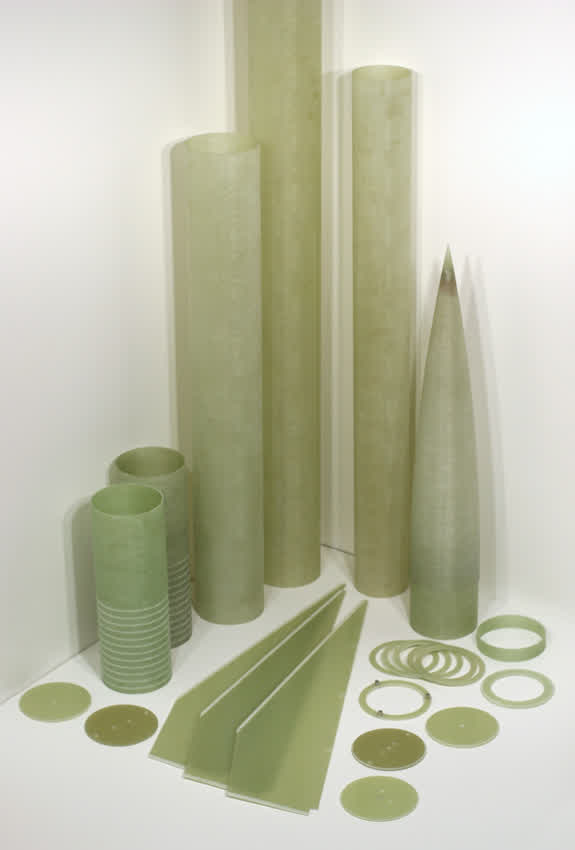

---
# 🧩 Versioning – systém dopĺňa automaticky
fm_version: '1.0.1'

# Dátum buildu – generuje skript
fm_build: '2025-11-28T15:54:47.914037+00:00'

# Poznámka k verzii – voliteľné
fm_version_comment: ''

# 🆔 IDENTITY --------------------------------------------------------

# ID generuje CLI / skript

# Unikátne UUID – generuje skript
guid: '71bb4165-7e63-4c66-b91e-047aadb6c63e'

# 🧭 CONTEXT ---------------------------------------------------------

# DAO / doména (knife, sdlc, q12, 7ds...) dopĺňa skript
dao: 'class_sthdf_dashboard'

# Názov zápisu – dopĺňa používateľ
title: '04 analysis'

# Krátky popis – dopĺňa používateľ (voliteľné)
description: '{{DESCRIPTION}}'

# 👥 AUTHORSHIP ------------------------------------------------------

# Hlavný autor – z globálneho configu
author: 'Roman Kazicka'

# Zoznam autorov – generuje skript
authors:
  - 'Roman Kazicka'

# 🗂 CLASSIFICATION ---------------------------------------------------

# Nadradená kategória – môže doplniť používateľ
category: ''

# Typ dokumentu (guide, case, tutorial...) – používateľ (voliteľné)
type: ''

# Priorita (low/medium/high) – voliteľné
priority: ''

# Tagy – odporúča sa 2–6 tagov.
# Typy tagov:
#   - rámce: knife, 7ds, sdlc, q12
#   - účel: tutorial, guide, pattern, case-study
#   - téma: git, backup, ai, communication
#   - úroveň: beginner, intermediate, advanced
tags: []

# 🌍 LOCALIZATION -----------------------------------------------------

# Jazyk dokumentu – doplní skript podľa štruktúry
locale: 'sk'

# 🕒 LIFECYCLE --------------------------------------------------------

# Dátum vytvorenia – generuje skript
created: '2025-11-28 16:54'

# Dátum poslednej úpravy – dopĺňa človek
modified: '2025-11-28 16:54'

# Stav dokumentu – default "backlog"
status: 'backlog'

# Viditeľnosť – default "public"
privacy: 'public'

# ⚖ INTELLECTUAL PROPERTY -------------------------------------------

# Držiteľ práv k obsahu – dopĺňa skript
rights_holder_content: 'Roman Kazicka'

# Systémový vlastník práv
rights_holder_system: 'CAA / KNIFE / LetItGrow'

# Licencia
license: 'CC-BY-NC-SA-4.0'

# Disclaimer
disclaimer: 'Use at your own risk. Methods provided as-is; participation is voluntary and context-aware.'

# Copyright
copyright: '© 2025 Roman Kazicka'

# 🔗 ORIGIN / PROVENANCE ---------------------------------------------

# Repozitár pôvodu
origin_repo: ''

# URL pôvodného repozitára
origin_repo_url: ''

# Commit pôvodu
origin_commit: ''

# Branch pôvodu
origin_branch: ''

# Systém pôvodu (CAA/KNIFE/STHDF…)
origin_system: 'CAA'

# Pôvodný autor
origin_author: 'Roman Kazicka'

# Importovaný zdroj
origin_imported_from: ''

# Dátum importu
origin_import_date: ''

# 🧱 RESERVED ---------------------------------------------------------

fm_reserved1: ''
fm_reserved2: ''
---

<!-- class_sthdf_dashboard_INSTANCE_ID: 01-class_sthdf_dashboard_2025-2026 -->

# 04-Analysis

## Analýza požiadaviek a prvotné prototypy

Fáza analýzy projektu SIGNALIS zahŕňala vytvorenie prvotných prototypov, testovanie komunikačných technológií a identifikáciu dizajnových výziev, ktoré je potrebné riešiť pred finálnou implementáciou.

### Prvotný prototyp

Podarilo sa nám úspešné vytvorenie prvotných prototypov HERMES a IRIS staníc na breadboardoch, na ktorých bolo možné testovať základnú funkcionalitu.

**Overená funkcionalita:**

- Práca so senzormi (IMU, barometer, GPS)
- Posielanie prvých LoRa správ
- Detekcia LoRa komunikácie pomocou SDR prijímača
- Overenie správnosti výberu komponentov

**Výsledok:**
Posielanie LoRa správ bolo úspešne detekované pomocou SDR (Software Defined Radio), čo potvrdilo funkčnosť zvolenej komunikačnej technológie a správnosť konfigurácie LoRa modulov.

### Testovanie LoRa komunikácie

Po úspešnej validácii prvotných prototypov nasledovalo testovanie komunikačného dosahu a spoľahlivosti LoRa modulov v reálnych podmienkach.

**Testované parametre:**

- Maximálny dosah komunikácie
- Stabilita spojenia pri rôznych vzdialenostiach
- RSSI (Received Signal Strength Indicator) hodnoty
- Vplyv prekážok na kvalitu signálu

**Výsledky testovania:**

- **Dosiahnutý dosah**: až 2 km
- **Stabilita komunikácie**: Spoľahlivý prenos dát na cieľovej vzdialenosti
- **RSSI reporting**: Funkčný reporting sily signálu pre diagnostiku

**Záver:**
LoRa moduly `E220-900T22D` splnili požiadavku minimálneho dosahu 2 km, čo potvrdzuje vhodnosť zvolenej technológie pre raketové telemetrické aplikácie.

## Analýza dizajnových problémov

### IRIS - Priestorové obmedzenia

Kľúčovým problémom pri návrhu IRIS komponentu boli priestorové obmedzenia. Doska sa musí zmestiť do raketovej trubice s priemerom približne 65 mm (veľkosť BT-80 v kontexte modelárskeho raketárstva).

**Priestorové požiadavky:**

- Priemer trubice: ~65 mm (BT-80)
- Potrebné komponenty: Arduino Nano 33 BLE, LoRa rádio, GPS modul, SD karta, batéria
- Problematický komponent: LoRa rádio s SMA konektorom (veľmi dlhé)

### Dizajnový problém: Stacked Layout

**Prvotný návrh** obsahoval horizontálny layout dvoch dosiek umiestnených nad sebou (tzv. **stacked layout**) a prepojených konektormi.

**Testovanie rozmerov:**
Pred odoslaním dosiek do výroby boli najprv vyfrézované ich tvary pre overenie layoutu.

**Identifikovaný problém:**
V princípe tento koncept fungoval výborne, avšak problém nastal pri použití **SMA konektora** pre anténu, kvôli ktorému sa zostava už **nezmestila do definovaných rozmerov**.

Bez samotného SMA konektora sa dosky do tela rakety zmestili perfektne, ale po pridaní kábla to už možné nebolo. Keďže samotné LoRa rádio je veľmi veľké (resp. dlhé), nebolo možné ho efektívne presunúť, čo znamenalo, že tento prístup nefungoval.

### Riešenie: Vertikálny Layout

**Alternatívne riešenie:**
Bol navrhnutý nový návrh PCB dosky s **vertikálnym rozložením**. Po vyfrézovaní tvaru dosky a overení jej rozmerovej správnosti bol návrh odoslaný do výroby.

**Mechanický dizajn:**
Počas čakania na dodanie dosiek (približne 3 týždne) bol navrhnutý 3D tlačiteľný držiak pre dosku, pomocou ktorého bude doska umiestnená v budúcej rakete.

**Overenie finálneho dizajnu:**
Po obdržaní profesionálne vyrobených PCB bol dizajn overený a testovaný.

**Výsledok:**
Na záver sa ukázalo, že tento dizajn **spĺňa všetky požiadavky**. Doska sa zmestí do priestorových obmedzení a zároveň funguje tak, ako má.

### Identifikované nedostatky

Počas testovania boli odhalené aj určité nedostatky v dizajne:

- **Chýbajúci obvod na reguláciu vstupného napätia** (7.4V LiPo → 5V/3.3V)
- Potreba optimalizácie umiestnenia konektorov
- Možnosť zlepšenia celkovej mechanickej stability

Tieto problémy boli zaznamenané pre riešenie v ďalšej iterácii návrhu (viď 09-Change Management).

## Zoznam komponentov IRIS

V porovnaní s pôvodným návrhom bol zoznam súčiastok pre IRIS mierne upravený:

| Komponent                      | Typ                                | Účel                                      |
| ------------------------------ | ---------------------------------- | ----------------------------------------- |
| Arduino Nano 33 BLE Sense Rev2 | Mikrokontrolér                     | Hlavný procesor, senzory (IMU, barometer) |
| LoRa rádio                     | E220-900T22D                       | Bezdrôtová komunikácia s HERMES (2km)     |
| MicroSD modul                  | Generický (AliExpress)             | Prenos letových dát po lete               |
| MicroSD modul                  | Adafruit XTSD 2GB (ID: 6038)       | Záznam dát počas letu                     |
| GPS modul                      | DFRobot GPS+BDS BeiDou Dual Module | Geografická poloha                        |
| Batéria                        | 7.4V 2S LiPo, 900mAh               | Napájanie (30+ min)                       |

## Závery analýzy

**Úspešné overenia:**

- ✅ Funkcionalita všetkých senzorov
- ✅ LoRa komunikácia na požadovaný dosah (2km)
- ✅ SDR detekcia LoRa správ
- ✅ Riešenie priestorových obmedzení (vertikálny layout)

**Identifikované výzvy:**

- ⚠️ Priestorové obmedzenia (BT-80 trubica)
- ⚠️ SMA konektor interferencia so stacked layoutom
- ⚠️ Potreba regulácie napätia
- ⚠️ Iteratívny proces pre optimálny dizajn

**Ďalšie kroky:**
Výsledky analýzy viedli k finálnemu dizajnu PCB s vertikálnym layoutom, ktorý bol následne realizovaný v nasledujúcich fázach projektu (05-Design, 06-Implementation).

## Odkazy

- [Backlog a analýzy](./backlog.md)

**Navigation:** [⬆️ SDLC](../index.md) · [⬅️ Projekt](../../index.md)
