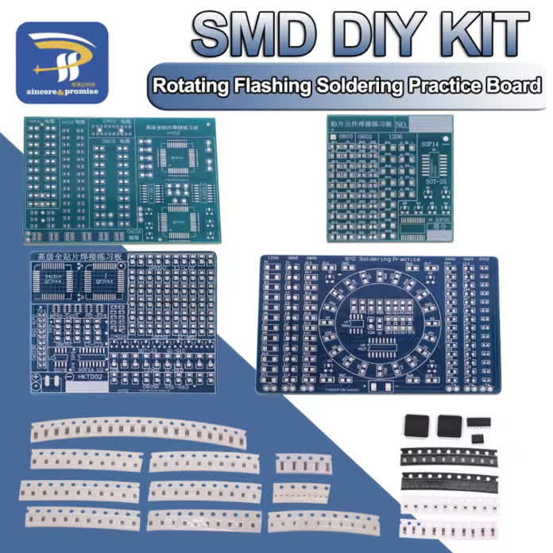
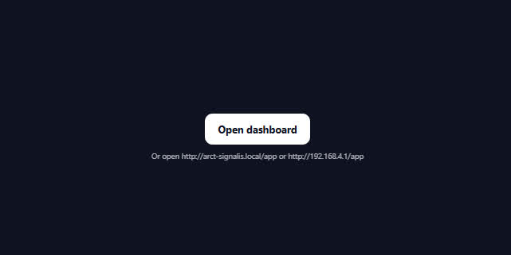

---
# 🧩 Versioning – systém dopĺňa automaticky
fm_version: '1.0.1'

# Dátum buildu – generuje skript
fm_build: '2025-11-28T15:54:47.913741+00:00'

# Poznámka k verzii – voliteľné
fm_version_comment: ''

# 🆔 IDENTITY --------------------------------------------------------

# ID generuje CLI / skript

# Unikátne UUID – generuje skript
guid: '4f3e553f-3fab-49aa-b842-00455b414620'

# 🧭 CONTEXT ---------------------------------------------------------

# DAO / doména (knife, sdlc, q12, 7ds...) dopĺňa skript
dao: 'class_sthdf_dashboard'

# Názov zápisu – dopĺňa používateľ
title: '06 implementation'

# Krátky popis – dopĺňa používateľ (voliteľné)
description: '{{DESCRIPTION}}'

# 👥 AUTHORSHIP ------------------------------------------------------

# Hlavný autor – z globálneho configu
author: 'Roman Kazicka'

# Zoznam autorov – generuje skript
authors:
  - 'Roman Kazicka'

# 🗂 CLASSIFICATION ---------------------------------------------------

# Nadradená kategória – môže doplniť používateľ
category: ''

# Typ dokumentu (guide, case, tutorial...) – používateľ (voliteľné)
type: ''

# Priorita (low/medium/high) – voliteľné
priority: ''

# Tagy – odporúča sa 2–6 tagov.
# Typy tagov:
#   - rámce: knife, 7ds, sdlc, q12
#   - účel: tutorial, guide, pattern, case-study
#   - téma: git, backup, ai, communication
#   - úroveň: beginner, intermediate, advanced
tags: []

# 🌍 LOCALIZATION -----------------------------------------------------

# Jazyk dokumentu – doplní skript podľa štruktúry
locale: 'sk'

# 🕒 LIFECYCLE --------------------------------------------------------

# Dátum vytvorenia – generuje skript
created: '2025-11-28 16:54'

# Dátum poslednej úpravy – dopĺňa človek
modified: '2025-11-28 16:54'

# Stav dokumentu – default "backlog"
status: 'backlog'

# Viditeľnosť – default "public"
privacy: 'public'

# ⚖ INTELLECTUAL PROPERTY -------------------------------------------

# Držiteľ práv k obsahu – dopĺňa skript
rights_holder_content: 'Roman Kazicka'

# Systémový vlastník práv
rights_holder_system: 'CAA / KNIFE / LetItGrow'

# Licencia
license: 'CC-BY-NC-SA-4.0'

# Disclaimer
disclaimer: 'Use at your own risk. Methods provided as-is; participation is voluntary and context-aware.'

# Copyright
copyright: '© 2025 Roman Kazicka'

# 🔗 ORIGIN / PROVENANCE ---------------------------------------------

# Repozitár pôvodu
origin_repo: ''

# URL pôvodného repozitára
origin_repo_url: ''

# Commit pôvodu
origin_commit: ''

# Branch pôvodu
origin_branch: ''

# Systém pôvodu (CAA/KNIFE/STHDF…)
origin_system: 'CAA'

# Pôvodný autor
origin_author: 'Roman Kazicka'

# Importovaný zdroj
origin_imported_from: ''

# Dátum importu
origin_import_date: ''

# 🧱 RESERVED ---------------------------------------------------------

fm_reserved1: ''
fm_reserved2: ''
---

<!-- class_sthdf_dashboard_INSTANCE_ID: 01-class_sthdf_dashboard_2025-2026 -->

# 06-Implementation

## SMD spájkovanie - Workshop

V rámci vývoja komponentov IRIS a HERMES bolo potrebné zvládnuť spájkovanie **SMD (Surface Mount Device)** komponentov. Jedná sa o veľmi malé komponenty, ktoré sú naspájkované priamo na plošnú dosku, nie do vyfrézovaných dier ako pravidelné through-hole (THT) komponenty.

### SMD vs Through-Hole porovnanie


**Diagram prevzatý zo stránky:** [ErsaElectronics](https://www.ersaelectronics.com/blog/smd-components-guide)

### Veľkosti SMD komponentov

Konkrétne sme pracovali s komponentami o veľkosti **0603**, **0805** a **1206**.


**Obrázok prevzatý zo stránky:** [PCBoard.ca](https://www.pcboard.ca/led-0805)

### Workshop pre členov tímu

Skúsenosti so spájkovaním týchto komponentov nemali dvaja naši členovia. Rozhodli sme sa pre nich spraviť malý praktický workshop, kde si mali možnosť vyskúšať spájkovanie na testovacích doskách zakúpených na Aliexpress.



**Prostredie workshopu:**

Workshop prebiehal v pracovni doma u jedného z členov tímu s využitím profesionálneho vybavenia:

- Spájkovacie stanice
- Mikroskop pre prácu s malými komponentami
- Teplovzdušná stanica pre reflow spájkovanie
- Pomocné nástroje (pinzety, flux, pájecí drôt)


### Techniky spájkovania

#### 1. Klasické SMD spájkovanie

Spájkovanie malých SMD komponentov s využitím spájkovacej stanice a mikroskopu.

**Účastníci workshopu si osvojili:**

- Prácu s pinzetami a malými komponentmi
- Nanášanie flux-u pre lepšiu spájkovateľnosť
- Techniku drag soldering
- Kontrolu spojov pod mikroskopom

#### 2. Hot Air Reflow Soldering

Keďže spájkovanie bolo veľmi zaujímavé a mali sme ku koncu dňa viac voľného času, rozhodli sme sa vo workshope zahrnúť aj **spájkovanie pomocou horúceho vzduchu** (reflow soldering).

**Proces:**

1. Nanesenie pájecí pasty na kontaktné plôšky
2. Umiestnenie SMD komponentov na pastu
3. Zahriatie teplovzdušnou stanicou (~350°C)
4. Roztavenie pasty a pripojenie komponentov

**Výsledok:**
Vzhľadom na to, že členovia spájkovali prvýkrát, výsledky boli na dobrej ceste! Workshop splnil svoj účel a pripravil tím na spájkovanie produkčných PCB.

## HERMES - Finálne zostavenie

### Osadenie profesionálnej PCB

Po obdržaní profesionálne vyrobenej plošnej dosky (revízia 4) boli na ňu naspájkované potrebné komponenty vrátane malých SMD súčiastok.

**Osadená doska:**


**Použité techniky:**

- **Klasické spájkovanie** pre väčšie THT komponenty
- **Hot air reflow** pre SMD komponenty (rezistory, kondenzátory, regulátory napätia)
- **Mikroskopová kontrola** kvality spojov

**Komponenty na doske:**

- ESP32 mikrokontrolér
- LoRa rádio modul E220-900T22D
- SMD rezistory a kondenzátory (0603, 0805)
- Obvody regulácie napätia
- Obvod merania napätia batérie
- LED indikátory
- Tlačidlá a konektory

### Inštalácia do 3D tlačeného krytu

Po osadení PCB bola doska nainštalovaná do vytlačeného krytu (v2 dizajn) spolu s ostatnými súčiastkami.

**Kompletné zostavenie:**


**Dodatočné komponenty:**

- 3.7V LiPo batéria s min. 45 minút výdrže
- Power on/off tlačidlo
- LoRa anténa s SMA konektorom
- LED indikátory pripojenia

## IRIS - Zostavenie

V poslednom období sa podarilo vytvoriť plne funkčný IRIS modul s nasledujúcimi komponentmi:

**Integrované komponenty:**

- Arduino Nano 33 BLE Sense Rev2 (mikrokontrolér + senzory)
- LoRa rádio E220-900T22D s anténou
- MicroSD moduly (2x) pre záznam a prenos dát
- GPS modul (DFRobot GPS+BDS BeiDou)
- 7.4V 2S LiPo batéria (900mAh)
- Vertikálne rozložená PCB v 3D tlačenom držiaku

**Plne funkčný IRIS modul:**


**Funkčné komponenty:**

- ✅ LoRa rádio: Bezdrôtová komunikácia s HERMES stanicou
- ✅ SD karta: Offline záznam letových údajov
- ✅ 9-osový IMU: 3-osový akcelerometer, gyroskop, magnetometer
- ✅ Barometer: Tlak a teplota
- ✅ GPS modul: Longitude, latitude, elevácia

## Webový Dashboard - Implementácia

### Softvérový stack

Celý webový systém je postavený na mikrokontroléri **ESP32**, ktorý v tomto riešení preberá úlohu:

- LoRa prijímača (telemetrické rámce doručené cez LoRa)
- WiFi Access Pointu pre pozemnú stanicu
- HTTP servera poskytujúceho webové rozhranie
- Real-time distribútora binárnych dát

### WiFi AP konfigurácia

**Sieťové nastavenia:**

- **SSID:** `arct-signalis.local`
- **IP adresa:** `192.168.4.1`
- **Maska:** `255.255.255.0`
- **mDNS:** Aktívne

**Optimalizácie pre stabilitu:**

```c
esp_wifi_set_ps(WIFI_PS_NONE);  // Vypnutý power-save
// Šírka kanála: HT20
// Vysielací výkon: WIFI_POWER_19_5dBm
// Beacon interval: 100 ms
```

**LED indikácia (GPIO2):**

- Svieti trvalo → Aspoň jeden klient pripojený
- Bliká → Žiadny klient pripojený

### HTTP Server a Routing

**Implementované endpointy:**

| Endpoint | Obsah                    | Účel                                        |
| -------- | ------------------------ | ------------------------------------------- |
| `/`      | Landing page             | Úvodná stránka s tlačidlom "Open dashboard" |
| `/app`   | Dashboard HTML/CSS/JS    | Kompletná webová aplikácia                  |
| `/data`  | 28-bajtový binárny rámec | Real-time telemetrické dáta                 |




### Frontend implementácia

**Technológie:**

- **Čisté HTML/CSS/JavaScript**
- **Žiadne externé knižnice** (žiadny React, Vue, jQuery)
- **WebGL** pre 3D vizualizáciu
- **Canvas API** pre grafy

**Výhody tohto prístupu:**

- Minimálna veľkosť → rýchle načítanie z ESP32
- Žiadne závislosti → jednoduchšia údržba
- Funguje offline na ESP32 bez CDN

### Dashboard komponenty

#### 1. 3D WebGL vizualizácia

**Features:**

- Model raketového nosiča s dynamickou orientáciou
- Dymová stopa pri štarte
- Animovaná trajektória (trail)
- Zemská mriežka pre orientáciu

**Interaktívna kamera:**

- Otáčanie myšou
- Zoom kolieskom
- Dotykové gestá (drag, pinch pre mobile)
- Smoothing pre plynulú animáciu

#### 2. Real-time panel

**Zobrazované údaje:**

- GPS súradnice (latitude, longitude)
- Elevácia v metroch
- Orientácia (yaw, pitch, roll) v stupňoch

**Hex dump:**

- Raw zobrazenie 28-bajtového rámca
- Rozbitý podľa offsetov pre debug

#### 3. Live grafy

**Časové grafy pre každý parameter:**

- Priebežné min/max hodnoty
- Adaptívny rozsah osi Y
- Detekcia anomálií (drift, oscilá

cie)

**Účel:**

- Sledovanie stability senzorov
- Analýza výškového profilu
- Detekcia problémov v reálnom čase

### Telemetrický protokol

**28-bajtový binárny rámec:**

Dáta prichádzajú cez LoRa v identickom formáte, aký UI očakáva. ESP32 ich bez úprav zabalí do HTTP odpovede.

**Dekódovanie v JavaScript:**

```javascript
const view = new DataView(buffer)
const longitude = view.getFloat32(4, true) // Little Endian
const latitude = view.getFloat32(8, true)
const elevation = view.getFloat32(12, true)
const roll = view.getFloat32(16, true)
const pitch = view.getFloat32(20, true)
const yaw = view.getFloat32(24, true)
```

## Firmware implementácia

### IRIS Firmware

**Hlavné komponenty:**

- **Stavový automat:** Riadenie letových fáz (UNPAIRED → PAIRING → PRE_LAUNCH → IN_FLIGHT → APOGEE → LANDED)
- **Sensor integration:** IMU, barometer, GPS čítanie a kalibrácia
- **LoRa communication:** Polling-based protokol s retry mechanizmom
- **SD card logging:** CSV formát pre offline analýzu
- **Timing management:** Adaptívne vzorkovanie podľa stavu

### HERMES Firmware

**Hlavné komponenty:**

- **WiFi AP management:** Konfigurácia, pripojenie klientov, LED indikácia
- **HTTP server:** Routing endpointov, obsluha požiadaviek
- **LoRa receiver:** Dekódovanie binárnych rámcov, RSSI reporting
- **Real-time distribution:** Poskytovanie dát cez `/data` endpoint
- **State machine:** Pairing, tracking, idle režimy

## Repozitáre a zdrojový kód

**GitHub organizácia:** [06-STH-Projects](https://github.com/06-STH-Projects)

**Projekt SIGNALIS:**

- IRIS firmware (Arduino C++)
- HERMES firmware (ESP32 C++)
- Web Dashboard (HTML/CSS/JavaScript)
- PCB dizajny (KiCad projekty)
- 3D modely (Fusion 360 súbory)
- Dokumentácia a EA diagramy

**Tím - kontakty a repozitáre:**

| Člen             | GitHub                                                           | Email                     |
| ---------------- | ---------------------------------------------------------------- | ------------------------- |
| Adam Hladík      | [github.com/Hladikes](https://github.com/Hladikes)               | adi.hladik@gmail.com      |
| Dominik Mifkovič | [github.com/dominikmifkovic](https://github.com/dominikmifkovic) | dominikmifkovic@gmail.com |
| Ján Sližik       | [github.com/Mushishy](https://github.com/Mushishy)               | xslizik@stuba.sk          |
| UR               | [github.com/xurger](https://github.com/xurger)                   | linens-nova.5z@icloud.com |

## Zhrnutie implementácie

**Hardvér:**

- ✅ HERMES PCB osadená a nainštalovaná
- ✅ IRIS PCB osadená a funkčná
- ✅ 3D tlačené kryty a držiaky
- ✅ SMD spájkovanie zvládnuté

**Softvér:**

- ✅ WiFi AP a HTTP server
- ✅ Webový dashboard bez závislostí
- ✅ Telemetrický protokol (28-byte frame)
- ✅ Firmware pre oba komponenty
- ✅ Stavové automaty implementované

**Získané zručnosti:**

- SMD spájkovanie (klasické aj hot air reflow)
- Práca s mikroskopom
- ESP32 programovanie
- WebGL a Canvas API
- Binárne protokoly a sériová komunikácia

## Odkazy

- [Odkazy na kód / repozitáre](./code-links.md)

**Navigation:** [⬆️ SDLC](../index.md) · [⬅️ Projekt](../../index.md)
