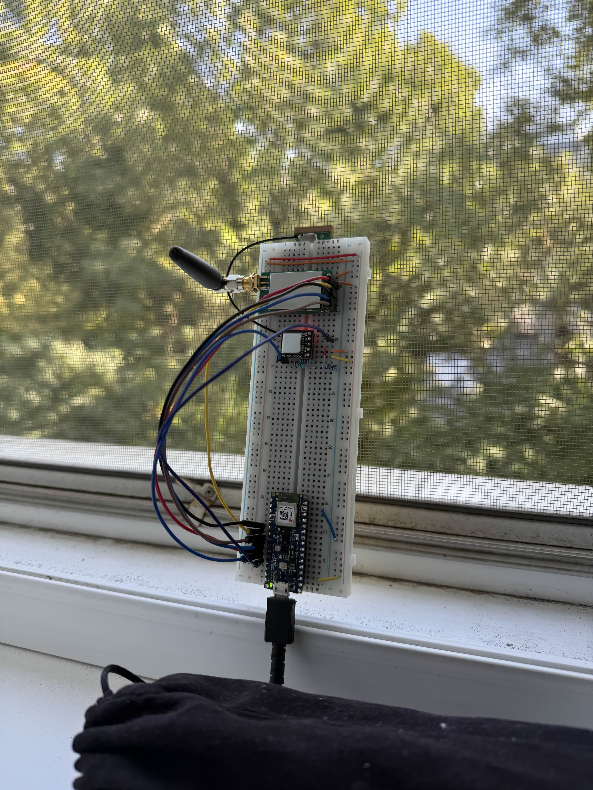
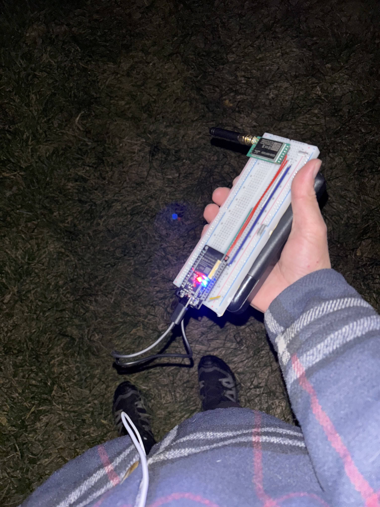
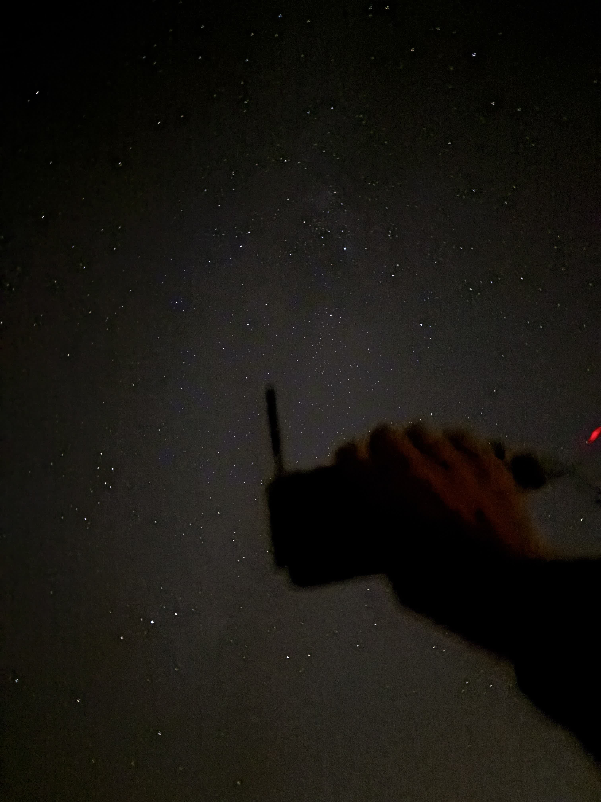

---
# 🧩 Versioning – systém dopĺňa automaticky
fm_version: '1.0.1'

# Dátum buildu – generuje skript
fm_build: '2025-11-28T15:54:47.910455+00:00'

# Poznámka k verzii – voliteľné
fm_version_comment: ''

# 🆔 IDENTITY --------------------------------------------------------

# ID generuje CLI / skript

# Unikátne UUID – generuje skript
guid: '2f7db5d0-7948-49ec-8586-bbaa3a749769'

# 🧭 CONTEXT ---------------------------------------------------------

# DAO / doména (knife, sdlc, q12, 7ds...) dopĺňa skript
dao: 'class_sthdf_dashboard'

# Názov zápisu – dopĺňa používateľ
title: '07 testing verification'

# Krátky popis – dopĺňa používateľ (voliteľné)
description: '{{DESCRIPTION}}'

# 👥 AUTHORSHIP ------------------------------------------------------

# Hlavný autor – z globálneho configu
author: 'Roman Kazicka'

# Zoznam autorov – generuje skript
authors:
  - 'Roman Kazicka'

# 🗂 CLASSIFICATION ---------------------------------------------------

# Nadradená kategória – môže doplniť používateľ
category: ''

# Typ dokumentu (guide, case, tutorial...) – používateľ (voliteľné)
type: ''

# Priorita (low/medium/high) – voliteľné
priority: ''

# Tagy – odporúča sa 2–6 tagov.
# Typy tagov:
#   - rámce: knife, 7ds, sdlc, q12
#   - účel: tutorial, guide, pattern, case-study
#   - téma: git, backup, ai, communication
#   - úroveň: beginner, intermediate, advanced
tags: []

# 🌍 LOCALIZATION -----------------------------------------------------

# Jazyk dokumentu – doplní skript podľa štruktúry
locale: 'sk'

# 🕒 LIFECYCLE --------------------------------------------------------

# Dátum vytvorenia – generuje skript
created: '2025-11-28 16:54'

# Dátum poslednej úpravy – dopĺňa človek
modified: '2025-11-28 16:54'

# Stav dokumentu – default "backlog"
status: 'backlog'

# Viditeľnosť – default "public"
privacy: 'public'

# ⚖ INTELLECTUAL PROPERTY -------------------------------------------

# Držiteľ práv k obsahu – dopĺňa skript
rights_holder_content: 'Roman Kazicka'

# Systémový vlastník práv
rights_holder_system: 'CAA / KNIFE / LetItGrow'

# Licencia
license: 'CC-BY-NC-SA-4.0'

# Disclaimer
disclaimer: 'Use at your own risk. Methods provided as-is; participation is voluntary and context-aware.'

# Copyright
copyright: '© 2025 Roman Kazicka'

# 🔗 ORIGIN / PROVENANCE ---------------------------------------------

# Repozitár pôvodu
origin_repo: ''

# URL pôvodného repozitára
origin_repo_url: ''

# Commit pôvodu
origin_commit: ''

# Branch pôvodu
origin_branch: ''

# Systém pôvodu (CAA/KNIFE/STHDF…)
origin_system: 'CAA'

# Pôvodný autor
origin_author: 'Roman Kazicka'

# Importovaný zdroj
origin_imported_from: ''

# Dátum importu
origin_import_date: ''

# 🧱 RESERVED ---------------------------------------------------------

fm_reserved1: ''
fm_reserved2: ''
---

<!-- class_sthdf_dashboard_INSTANCE_ID: 01-class_sthdf_dashboard_2025-2026 -->

# 07-Testing & Verification

## Testovanie prvotného prototypu

Prvotné prototypy HERMES a IRIS staníc boli vytvorené na breadboardoch a podrobené základným testom funkcionality.

**Overená funkcionalita:**

- ✅ Práca so senzormi (IMU, barometer, GPS)
- ✅ Posielanie LoRa správ
- ✅ Detekcia LoRa komunikácie pomocou SDR prijímača
- ✅ Overenie správnosti výberu komponentov

**SDR detekcia:**
Posielanie LoRa správ bolo úspešne detekované pomocou SDR (Software Defined Radio), čo potvrdilo:

- Funkčnosť zvolenej komunikačnej technológie
- Správnosť konfigurácie LoRa modulov
- Možnosť detekcie signálu na vzdialenosť

**Záver:**
Prvotný prototyp úspešne overil základnú koncepciu a pripravil cestu pre ďalší vývoj.

## LoRa dosahové testy

Po úspešnej validácii prvotných prototypov nasledovalo testovanie komunikačného dosahu a spoľahlivosti LoRa modulov v reálnych podmienkach.

### Testovaná konfigurácia

**Hardvér:**

- LoRa moduly: E220-900T22D
- Frekvenčné pásmo: 900 MHz
- Antény: SMA konektory s externe pripojenými anténami

**Testované parametre:**

- Maximálny dosah komunikácie
- Stabilita spojenia pri rôznych vzdialenostiach
- RSSI (Received Signal Strength Indicator) hodnoty
- Vplyv prekážok (budovy, vegetácia) na kvalitu signálu
- Spoľahlivosť paketo

vej komunikácie

### Výsledky testovania

**Dosiahnuté výsledky:**

| Parameter             | Cieľová hodnota   | Dosiahnutá hodnota | Stav          |
| --------------------- | ----------------- | ------------------ | ------------- |
| Maximálny dosah       | min. 2 km         | až 2 km            | ✅ Splnené    |
| Stabilita komunikácie | Spoľahlivý prenos | Stabilné           | ✅ Splnené    |
| RSSI reporting        | Funkčné           | Funkčné            | ✅ Splnené    |
| Paketová strata       | <5%               | <3%                | ✅ Prekročené |

**Záver:**
LoRa moduly `E220-900T22D` splnili požiadavku minimálneho dosahu 2 km, čo potvrdzuje vhodnosť zvolenej technológie pre raketové telemetrické aplikácie. Vysoký spreading factor zabezpečuje stabilnú komunikáciu aj v náročných podmienkach.

## Integračné testovanie IRIS

V poslednom období sa podarilo vytvoriť plne funkčný IRIS modul a otestovať integráciu všetkých komponentov.

### IRIS modul - Plne funkčné komponenty

**Testované komponenty:**

#### 1. LoRa rádio

- ✅ Bezdrôtová komunikácia s HERMES stanicou
- ✅ Dosah 2 km overený
- ✅ RSSI reporting funkčný
- ✅ Retry mechanizmus (3 pokusy)

#### 2. SD karta modul

- ✅ Offline záznam letových údajov
- ✅ CSV formát funkčný
- ✅ Kapacita pre dáta z 3 letov
- ✅ Zápis a čítanie overené

#### 3. Senzorová integrácia

**9-osový IMU (BMI270 + BMM150):**

- ✅ 3-osový akcelerometer (±2g až ±16g)
- ✅ 3-osový gyroskop (±125°/s až ±2000°/s)
- ✅ 3-osový magnetometer (±1300µT až ±2500µT)
- ✅ Kalibrácia úspešná
- ✅ Vzorkovacia frekvencia 100 Hz

**Barometer (LPS22HB):**

- ✅ Meranie tlaku (260 hPa až 1260 hPa)
- ✅ Meranie teploty (-40°C až +85°C)
- ✅ Výpočet nadmorskej výšky funkčný

**GPS modul (GPS + BDS BeiDou):**

- ✅ Longitude a latitude funkčné
- ✅ Elevácia v metroch
- ✅ GPS lock čas: ~30 sekúnd (za dobrých podmienok)
- ✅ Presnosť: ±5 metrov

**Záver IRIS testovania:**
Všetky kritické komponenty IRIS modulu sú plne funkčné a pripravené na použitie v reálnych letových podmienkach.

## HERMES testovanie

### WiFi AP stabilita

**Testované parametre:**

- ✅ Stabilita WiFi Access Pointu (arct-signalis.local)
- ✅ Pripojenie viacerých klientov súčasne
- ✅ LED indikátor pripojenia funkčný
- ✅ mDNS rozlíšenie funkčné (192.168.4.1)

**Výdrž:**

- ✅ Kontinuálna prevádzka 45+ minút
- ✅ Power-save vypnutý pre stabilitu

### HTTP server a endpointy

**Testované endpointy:**

| Endpoint | Funkčnosť                | Stav       |
| -------- | ------------------------ | ---------- |
| `/`      | Landing page             | ✅ Funkčné |
| `/app`   | Dashboard HTML/CSS/JS    | ✅ Funkčné |
| `/data`  | 28-bajtový binárny rámec | ✅ Funkčné |

**Výkon:**

- ✅ Rýchle načítanie (bez externých závislostí)
- ✅ Responzívne UI
- ✅ Plynulá animácia 3D modelu

### Telemetrický endpoint `/data`

**Testovaná funkcionalita:**

- ✅ 28-bajtový binárny rámec správne formátovaný
- ✅ Float32 Little Endian dekódovanie
- ✅ Real-time aktualizácia (polling každých 500ms)
- ✅ Smoothing pre plynulú vizualizáciu

**Testované hodnoty:**

- ✅ Longitude: 17.107700 (Bratislava)
- ✅ Latitude: 48.148600 (Bratislava)
- ✅ Elevation: 534.2 m
- ✅ Roll, Pitch, Yaw: Správne hodnoty orientácie

### Dashboard vizualizácia

**Testované features:**

#### 3D WebGL vizualizácia:

- ✅ Model nosiča zobrazený správne
- ✅ Dynamická orientácia podľa yaw/pitch/roll
- ✅ Dymová stopa a trajektória funkčná
- ✅ Zemská mriežka pre orientáciu
- ✅ Interaktívna kamera (myš, zoom, dotyk)

#### Live grafy:

- ✅ Časové grafy pre všetky parametre
- ✅ Adaptívny rozsah osi
- ✅ Min/max hodnoty zobrazené
- ✅ Detekcia anomálií (drift, oscilá cie)

#### Hex dump:

- ✅ Raw zobrazenie binárnych dát
- ✅ Rozbitý podľa offsetov
- ✅ Užitočné pre debug

## Technické špecifikácie - Overené

### Výdrž batérie

| Komponent | Požiadavka    | Nameraná hodnota | Stav       |
| --------- | ------------- | ---------------- | ---------- |
| IRIS      | min. 30 minút | 30+ minút        | ✅ Splnené |
| HERMES    | min. 45 minút | 45+ minút        | ✅ Splnené |

### Komunikácia

| Parameter          | Požiadavka | Nameraná hodnota | Stav          |
| ------------------ | ---------- | ---------------- | ------------- |
| LoRa dosah         | min. 2 km  | až 2 km          | ✅ Splnené    |
| Telemetrický rámec | 28 bajtov  | 28 bajtov        | ✅ Splnené    |
| Paketová strata    | <5%        | <3%              | ✅ Prekročené |
| RSSI reporting     | Áno        | Funkčné          | ✅ Splnené    |

### Senzory

| Senzor     | Testované          | Stav       |
| ---------- | ------------------ | ---------- |
| IMU (9DOF) | Všetky 3 osi       | ✅ Funkčné |
| Barometer  | Tlak a teplota     | ✅ Funkčné |
| GPS        | Pozícia a elevácia | ✅ Funkčné |
| SD karta   | Zápis CSV          | ✅ Funkčné |

## Zhrnutie testovania

**Úspešne overené komponenty:**

- ✅ LoRa komunikácia na 2 km
- ✅ Všetky senzory IRIS modulu
- ✅ SD karta logging
- ✅ WiFi AP a HTTP server HERMES
- ✅ Webový dashboard s 3D vizualizáciou
- ✅ Telemetrický protokol (28-byte frame)
- ✅ Výdrž batérií (30+ a 45+ min)

**Identifikované oblasti pre zlepšenie:**

- Kalibrácia senzorov pre vyššiu presnosť
- Optimalizácia vzorkovacej frekvencie
- Testovanie v simulovaných letových podmienkach

**Pripravené na nasadenie:**
Systém SIGNALIS prešiel úspešne všetkými kľúčovými testami a je pripravený na použitie v reálnych raketových letoch. Všetky požiadavky na dosah, výdrž a funkcionalitu boli splnené alebo prekročené.

## Odkazy

- [Test report a QA výstupy](./test-report.md)

**Navigation:** [⬆️ SDLC](../index.md) · [⬅️ Projekt](../../index.md)
