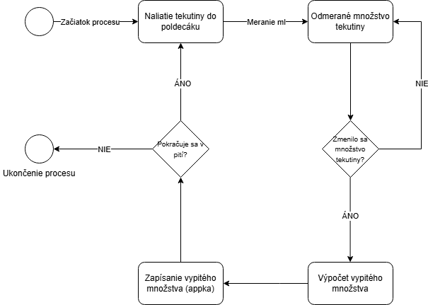
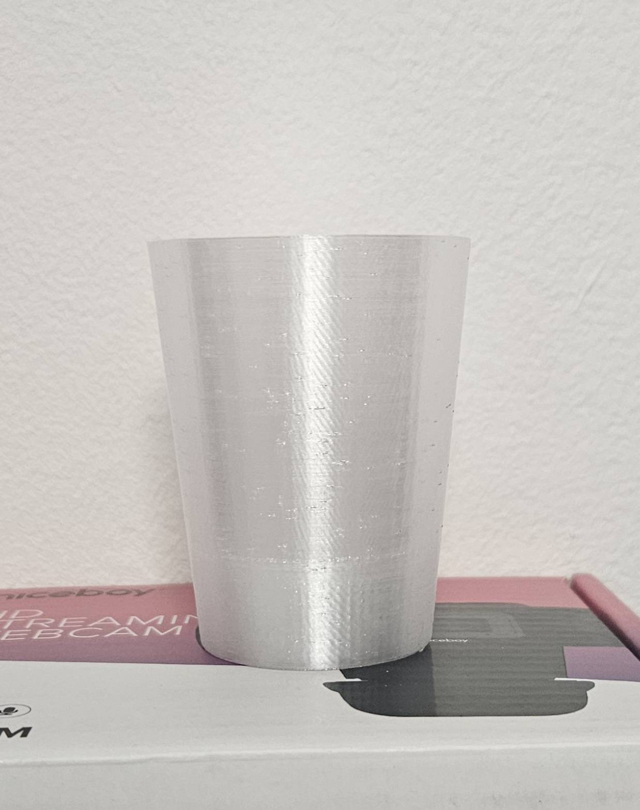
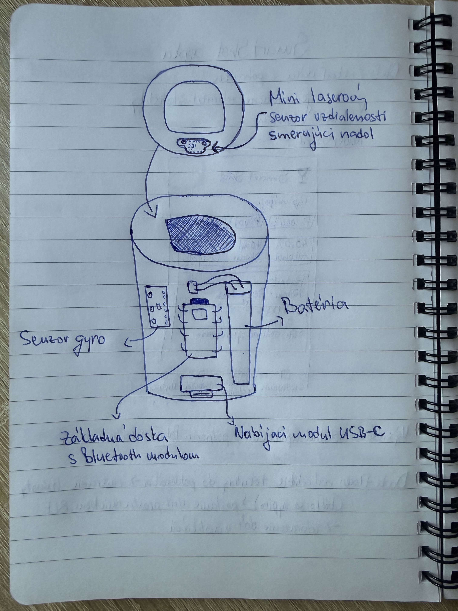
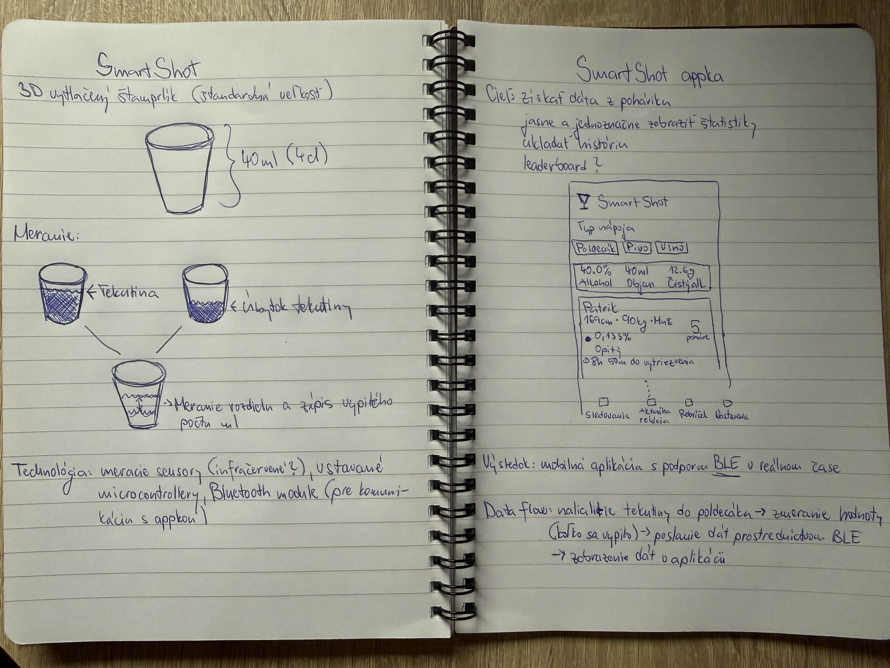
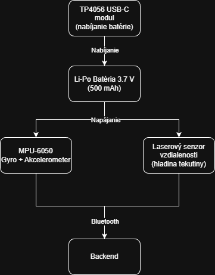
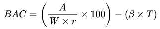
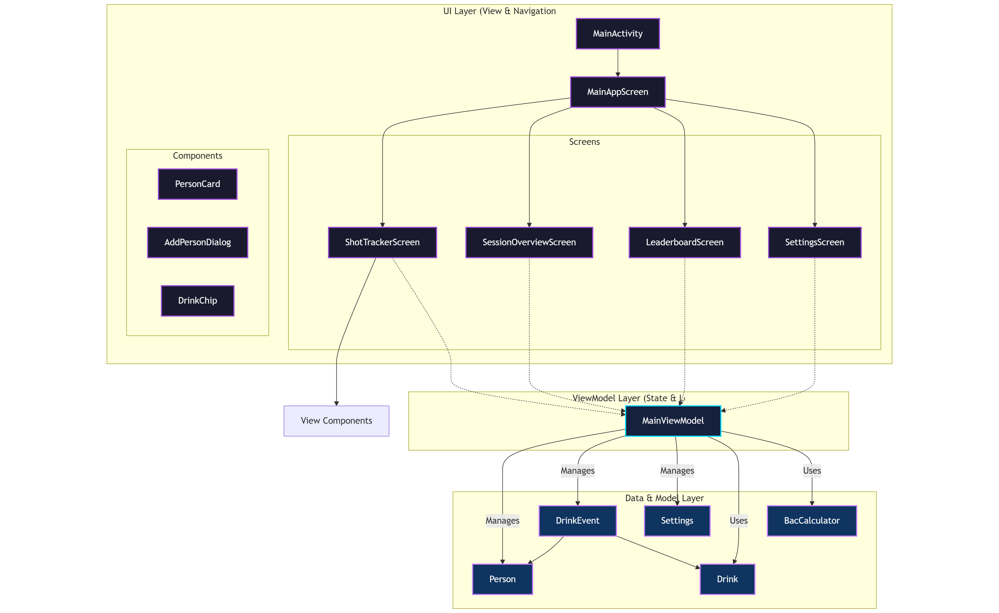

---
# 🧩 Versioning – systém dopĺňa automaticky
fm_version: "1.0.1"

# Dátum buildu – generuje skript
fm_build: "2025-11-28T15:54:47.940571+00:00"

# Poznámka k verzii – voliteľné
fm_version_comment: ""

# 🆔 IDENTITY --------------------------------------------------------

# ID generuje CLI / skript

# Unikátne UUID – generuje skript
guid: "4118e33f-6682-46f8-bee9-31ef89605d44"

# 🧭 CONTEXT ---------------------------------------------------------

# DAO / doména (knife, sdlc, q12, 7ds...) dopĺňa skript
dao: "class_sthdf_dashboard"

# Názov zápisu – dopĺňa používateľ
title: "SmartShot"

# Krátky popis – dopĺňa používateľ (voliteľné)
description: "Intelligent shot cup that tracks alcohol consumption in real time and displays it in a mobile app."

# 👥 AUTHORSHIP ------------------------------------------------------

# Hlavný autor – z globálneho configu
author: "Roman Kazicka"

# Zoznam autorov – generuje skript
authors:
  - "Roman Kazicka"

# 🗂 CLASSIFICATION ---------------------------------------------------

# Nadradená kategória – môže doplniť používateľ
category: ""

# Typ dokumentu (guide, case, tutorial...) – používateľ (voliteľné)
type: ""

# Priorita (low/medium/high) – voliteľné
priority: ""

# Tagy – odporúča sa 2–6 tagov.
# Typy tagov:
#   - rámce: knife, 7ds, sdlc, q12
#   - účel: tutorial, guide, pattern, case-study
#   - téma: git, backup, ai, communication
#   - úroveň: beginner, intermediate, advanced
tags: [iot,hardware,mobile,bluetooth,smart-device]

# 🌍 LOCALIZATION -----------------------------------------------------

# Jazyk dokumentu – doplní skript podľa štruktúry
locale: "sk"

# 🕒 LIFECYCLE --------------------------------------------------------

# Dátum vytvorenia – generuje skript
created: "2025-11-28 16:54"

# Dátum poslednej úpravy – dopĺňa človek
modified: "2025-11-28 16:54"

# Stav dokumentu – default "backlog"
status: "backlog"

# Viditeľnosť – default "public"
privacy: "public"

# ⚖ INTELLECTUAL PROPERTY -------------------------------------------

# Držiteľ práv k obsahu – dopĺňa skript
rights_holder_content: "Roman Kazicka"

# Systémový vlastník práv
rights_holder_system: "CAA / KNIFE / LetItGrow"

# Licencia
license: "CC-BY-NC-SA-4.0"

# Disclaimer
disclaimer: "Use at your own risk. Methods provided as-is; participation is voluntary and context-aware."

# Copyright
copyright: "© 2025 Roman Kazicka"

# 🔗 ORIGIN / PROVENANCE ---------------------------------------------

# Repozitár pôvodu
origin_repo: ""

# URL pôvodného repozitára
origin_repo_url: ""

# Commit pôvodu
origin_commit: ""

# Branch pôvodu
origin_branch: ""

# Systém pôvodu (CAA/KNIFE/STHDF…)
origin_system: "CAA"

# Pôvodný autor
origin_author: "Roman Kazicka"

# Importovaný zdroj
origin_imported_from: ""

# Dátum importu
origin_import_date: ""

# 🧱 RESERVED ---------------------------------------------------------

fm_reserved1: ""
fm_reserved2: ""
---

<!-- class_sthdf_dashboard_INSTANCE_ID: 01-class_sthdf_dashboard_2025-2026 -->

[🏠 Domov](../../../index.md) · [⬅️ Nahor](../)
# PRJ009 — Presentation

## SmartShot

**Intelligent Shot Cup for Real-Time Alcohol Tracking**

SmartShot je inteligentný systém, ktorý sleduje spotrebu alkoholu v reálnom čase pomocou smart pohárika a mobilnej aplikácie.

## Introduction
**SmartShot – Smart drinking assistant**

SmartShot je inovatívny projekt kombinujúci hardvér a mobilnú aplikáciu na meranie množstva vypitého alkoholu počas jednej drinking session.  
Cieľom projektu je podporiť zodpovedné pitie a priniesť používateľom prehľad o ich spotrebe v reálnom čase.

## Obsah
- [01-Business](../sdlc/01-business/index.md)
- [02-Top Level Architecture](../sdlc/02-top-level-architecture/index.md)
- [03-Solution Architecture](../sdlc/03-solution-architecture/index.md)
- [04-Analysis](../sdlc/04-analysis/index.md)
- [05-Design](../sdlc/05-design/index.md)
- [06-Implementation](../sdlc/06-implementation/index.md)
- [07-Testing & Verification](../sdlc/07-testing-verification/index.md)
- [08-Operation](../sdlc/08-operation/index.md)
- [09-Change Management](../sdlc/09-Change-Management/index.md)

## 01-Business

### Motivation & Problem

- **Strata kontroly:** V dynamickom prostredí (kluby, oslavy) je takmer nemožné udržať si presný prehľad o počte a objeme vypitých nápojov.
- **Zdravotné riziká:** Nadmerná konzumácia bez včasnej spätnej väzby vedie k nebezpečným stavom intoxikácie.
- **Subjektívne skreslenie:** Odhad miery opitosti je u väčšiny ľudí vysoko nepresný.
- Chýbajú jednoduché a okamžité nástroje na sledovanie spotreby  

### Goal

- **Automatizácia:** Nahradiť manuálny tracking automatickým senzorickým snímaním.
- **Safety First:** Implementovať vizuálnu signalizáciu a notifikácie pri dosiahnutí kritických limitov.
- **Gamifikácia vs. Zodpovednosť:** Vytvoriť atraktívne prostredie, ktoré však v prvom rade chráni používateľa.
- Prepojiť smart zariadenie s mobilnou aplikáciou  

## 02-Top Level Architecture

### System Overview

SmartShot systém funguje na princípe uzavretej slučky spätnej väzby:
1.  **Sensing Layer:** Senzory tlaku alebo hladiny v poháriku detegujú zmenu objemu.
2.  **Processing Layer:** MCU (Mikrocontroller) spracuje signál a odfiltruje šum (napr. otrasy).
3.  **Communication Layer:** Dáta sú prenášané cez protokol **Bluetooth Low Energy (BLE)** pre minimalizáciu spotreby.
4.  **Application Layer:** Mobilné zariadenie spracuje prijaté dáta, vypočíta odhadovanú hladinu alkoholu v krvi (BAC) a uloží záznam.

**Data flow:**  
Shot → senzor → mikroprocesor → BLE → mobilná aplikácia  

## 03-Solution Architecture

### Main Components

**SmartShot Cup**
- Meracie senzory  
- Mikrocontroller  
- Bluetooth modul  

**Mobile Application**
- Príjem dát v reálnom čase  
- Vizualizácia štatistík  
- História session  

## 04-Analysis

### Requirements

- Presné meranie objemu  
- Stabilná Bluetooth komunikácia  
- Jednoduché ovládanie pre používateľa  
- Prehľadné zobrazenie dát  

### Constraints

- Malé rozmery zariadenia  
- Batériové napájanie  
- Spoľahlivosť v reálnych podmienkach  

## 05-Design

### Hardware Design

- Integrované senzory v poháriku  
- Kompaktné rozloženie komponentov  

### Software Design

- Firmware na spracovanie meraní  
- BLE protokol na prenos dát  
- Mobilná aplikácia s jednoduchým UI  
- Výpočet alkoholu krvu pomocou Widmarkovho vzorca

- A - Množstvo skonzumovaného alkoholu (v gramoch)
- W - Hmotnosť tela (v gramoch)
- r - Widmarkov faktor. Zvyčajne 0,68 pre mužov a 0,55 pre ženy
- B - Rýchlosť, akou sa alkohol vylučuje (zvyčajne 0,015 až 0,020 za hodinu)   nastaviteľné v aplikácií
- T - Čas, ktorý uplynul od konzumácie prvého nápoja

  

  

   

## 06-Implementation

### Implemented Features

- Meranie objemu shotov  
- Odosielanie dát cez Bluetooth  
- Zobrazenie počtu shotov a celkového objemu  
- Záznam session v aplikácii  

## 07-Testing & Verification

### Testing

- Kalibrácia senzorov  
- Testovanie presnosti merania  
- Testovanie stability Bluetooth spojenia  

### Verification

- Porovnanie meraní s reálnym objemom  
- Funkčné testy mobilnej aplikácie  

## 08-Operation

### Usage Scenario

1. Používateľ naleje shot  
2. Pohárik zmeria objem  
3. Dáta sa odošlú do aplikácie  
4. Používateľ vidí štatistiky v reálnom čase  

## 09-Change Management

### Future Improvements

- Vyššia presnosť merania  
- Používateľské profily  
- Push notifikácie (limit shotov)  
- Cloud synchronizácia  
- Rozšírenie na ďalšie smart zariadenia  

## Team

- **Patrik Pišta** – System design, backend integration  
- **Kristián Gerhát** – Hardware & embedded systems
- **Marek Podolský** – Mobile app & UI/UX  
- **Erik Mokrán** – Prototyping & testing  