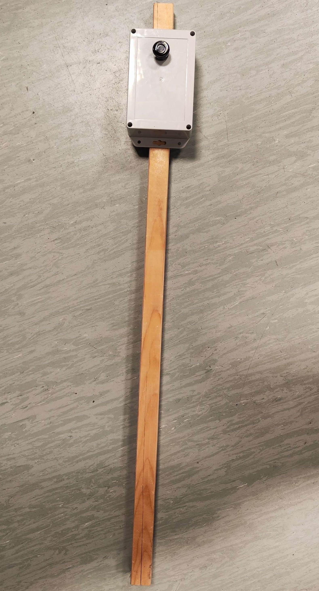
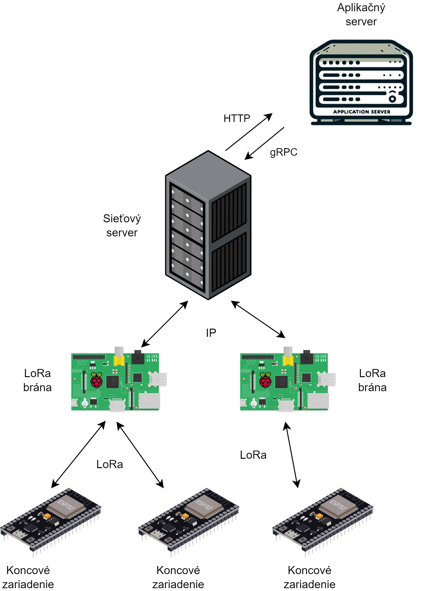
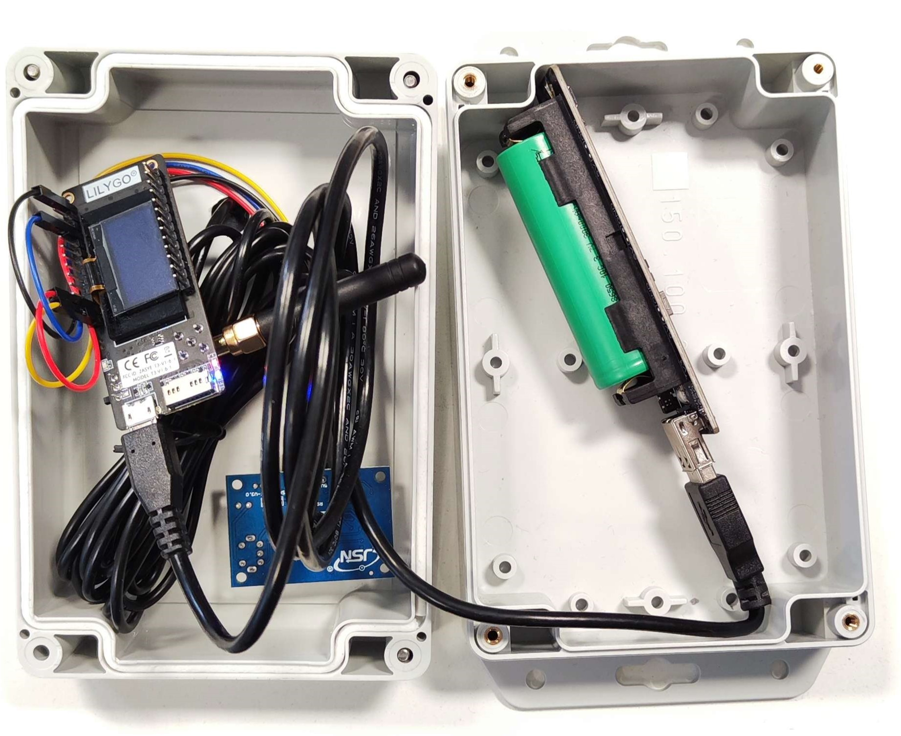
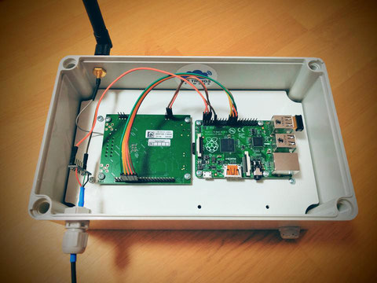
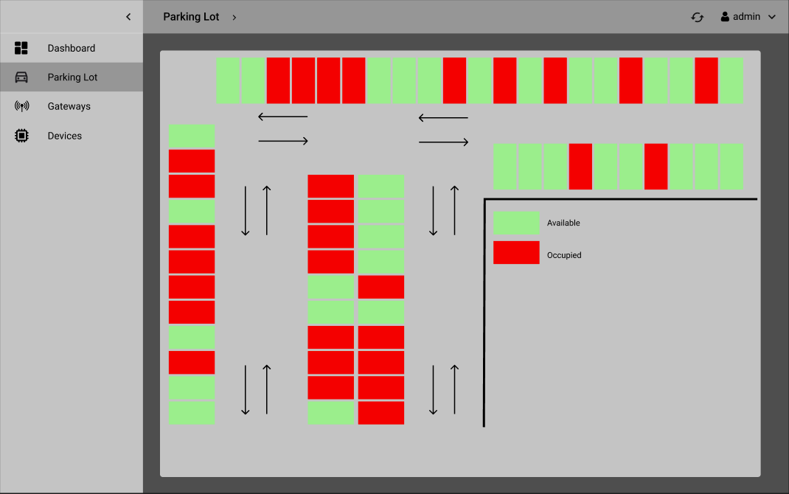
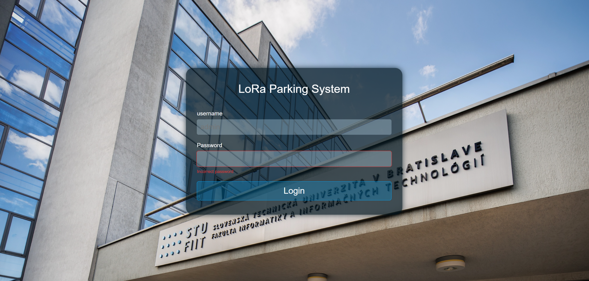
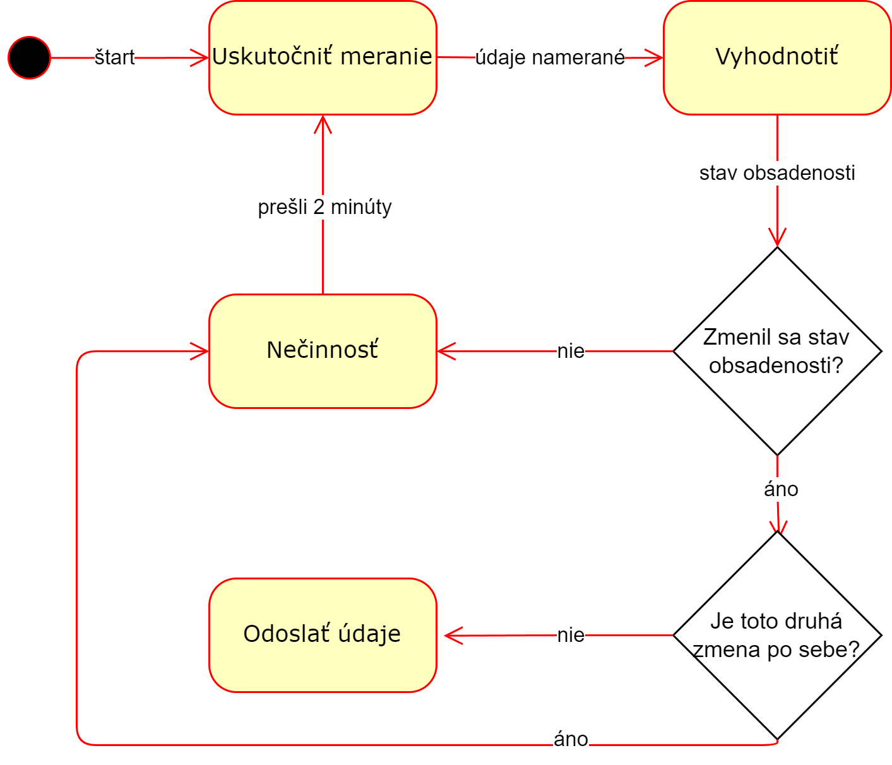
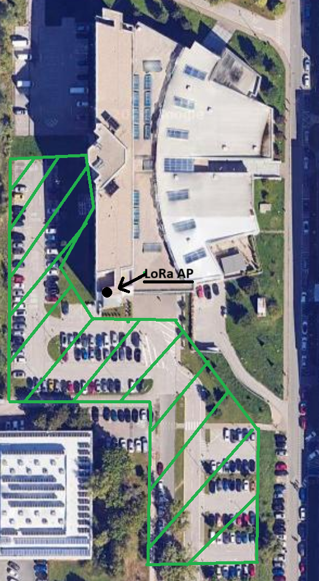
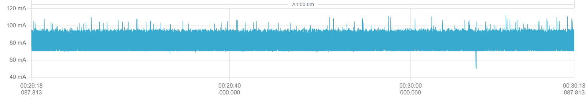

---
# 🧩 Versioning – systém dopĺňa automaticky
fm_version: "1.0.1"

# Dátum buildu – generuje skript
fm_build: "2025-11-28T15:54:48.089477+00:00"

# Poznámka k verzii – voliteľné
fm_version_comment: ""

# 🆔 IDENTITY --------------------------------------------------------

# ID generuje CLI / skript

# Unikátne UUID – generuje skript
guid: "85026093-04f4-4833-921f-447e195c6ea8"

# 🧭 CONTEXT ---------------------------------------------------------

# DAO / doména (knife, sdlc, q12, 7ds...) dopĺňa skript
dao: "class_sthdf_dashboard"

# Názov zápisu – dopĺňa používateľ
title: "slides"

# Krátky popis – dopĺňa používateľ (voliteľné)
description: "{{DESCRIPTION}}"

# 👥 AUTHORSHIP ------------------------------------------------------

# Hlavný autor – z globálneho configu
author: "Roman Kazicka"

# Zoznam autorov – generuje skript
authors:
  - "Roman Kazicka"

# 🗂 CLASSIFICATION ---------------------------------------------------

# Nadradená kategória – môže doplniť používateľ
category: ""

# Typ dokumentu (guide, case, tutorial...) – používateľ (voliteľné)
type: ""

# Priorita (low/medium/high) – voliteľné
priority: ""

# Tagy – odporúča sa 2–6 tagov.
# Typy tagov:
#   - rámce: knife, 7ds, sdlc, q12
#   - účel: tutorial, guide, pattern, case-study
#   - téma: git, backup, ai, communication
#   - úroveň: beginner, intermediate, advanced
tags: []

# 🌍 LOCALIZATION -----------------------------------------------------

# Jazyk dokumentu – doplní skript podľa štruktúry
locale: "sk"

# 🕒 LIFECYCLE --------------------------------------------------------

# Dátum vytvorenia – generuje skript
created: "2025-11-28 16:54"

# Dátum poslednej úpravy – dopĺňa človek
modified: "2025-11-28 16:54"

# Stav dokumentu – default "backlog"
status: "backlog"

# Viditeľnosť – default "public"
privacy: "public"

# ⚖ INTELLECTUAL PROPERTY -------------------------------------------

# Držiteľ práv k obsahu – dopĺňa skript
rights_holder_content: "Roman Kazicka"

# Systémový vlastník práv
rights_holder_system: "CAA / KNIFE / LetItGrow"

# Licencia
license: "CC-BY-NC-SA-4.0"

# Disclaimer
disclaimer: "Use at your own risk. Methods provided as-is; participation is voluntary and context-aware."

# Copyright
copyright: "© 2025 Roman Kazicka"

# 🔗 ORIGIN / PROVENANCE ---------------------------------------------

# Repozitár pôvodu
origin_repo: ""

# URL pôvodného repozitára
origin_repo_url: ""

# Commit pôvodu
origin_commit: ""

# Branch pôvodu
origin_branch: ""

# Systém pôvodu (CAA/KNIFE/STHDF…)
origin_system: "CAA"

# Pôvodný autor
origin_author: "Roman Kazicka"

# Importovaný zdroj
origin_imported_from: ""

# Dátum importu
origin_import_date: ""

# 🧱 RESERVED ---------------------------------------------------------

fm_reserved1: ""
fm_reserved2: ""
---

<!-- class_sthdf_dashboard_INSTANCE_ID: 01-class_sthdf_dashboard_2025-2026 -->

# PRJ011 — Presentation

--- Headline ---
## Headline
**2025-PRJ-011-ST_011-ST_011-ParkSense**

--- Headline ---

--- introduction ---

## Introduction
**2025-PRJ-011-ST_011-ST_011-ParkSense**

V projekte sa zamieravame na zvýšenie efektivity parkovacích priestorov v snahe znížiť emisie spôsobené automobilmi, ktorých vodiči hľadajú vhodné parkovacie miesto. Navrhli a implementovali sme smart parkovací systém, ktorý reflektuje stav parkoviska v reálnom čase pomocou webovej aplikácie a API.  

--- introduction ---

--- obsah ---
## Obsah
- [01-Business](../sdlc/01-business/index.md)
- [02-Top Level Architecture](../sdlc/02-top-level-architecture/index.md)
- [03-Solution Architecture](../sdlc/03-solution-architecture/index.md)
- [04-Analysis](../sdlc/04-analysis/index.md)
- [05-Design](../sdlc/05-design/index.md)
- [06-Implementation](../sdlc/06-implementation/index.md)
- [07-Testing & Verification](../sdlc/07-testing-verification/index.md)
- [08-Operation](../sdlc/08-operation/index.md)
- [09-Change Management](../sdlc/09-Change-Management/index.md)
--- obsah ---

## 01-Business

- vytvoriť cost-effective riešenie pre optimalizáciu parkovacieho procesu,
- sústrediť sa na spoľahlivosť a jednoduchosť prevádzky riešenia,
- priblížiť riešenie bližšie ku koncovým použiívateľom pomocou webového rozhrania,
- využiť bezdrôtové technológie s nízkoou spotrebou energie a ďalekým komunikačným dosahom.

## 02-Top Level Architecture

- koncové zariadenia komunikujú s LoRa bránou, ktorá cez IP sieť preposiela komunikáciu sieťovému serveru,
- sieťový server komunikáciu overuje a zasiela aplikačnému serveru na spracovanie,
- aplikačný server obsluhuje webovú aplikáciu, ktorá je hlavným bodom interakcie s používateľom.

## 03-Solution Architecture

- koncové zariadenie pozostávajúce z:
  - TTGO LoRa T3,
  - vodeodolného ultrazvukového sensora,
  - batérie (nevyžaduje elektrickú sieť),
  - vlastného kódu, ktorý optimalizuje životnosť batérie.

- LoRa brána pozostávajúca z:
  - RaspBerry Pi 4B,
  - IMST iC880A-SPI koncentrátoru,
  - napájaná zo siete.

## 04-Analysis

- porovnanie rôznych bezdôtových technológií ako LoRaWAN, Bluetooth Low Energy, ZigBee a iné,
- zvolenie komponentov a softvérového stacku riešenia.

## 05-Design

- intuitívne prostredie webovej aplikácie,

- login stránka,

## 06-Implementation

- nastavenie sieťového serveru (tenant, registrácia zariadení),
- aplikačný server (implementácia aplikácie),
- spustenie koncového zariadenia (poskladanie komponentov, injekcia kódu).

## 07-Testing & Verification

- overenie pokrytia LoRa bránou,

- spotreba energie koncového zariadenia,

- korektný prenos a spracovanie údajov

## 08-Operation

- riešenie zatiaľ nie je produkčne nasadné, ale len podrobne otestované,

## 09-Change Management

- zmena vadného senzoru,
- zmena LMIC-node knižnice za inú, ktorá korektne implementuje hlboký spánok.