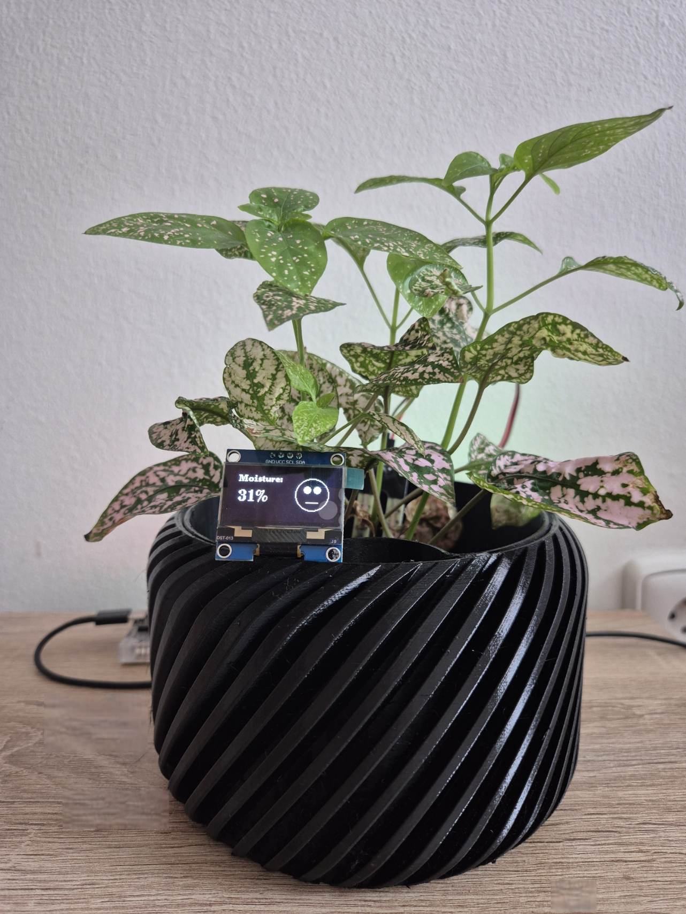
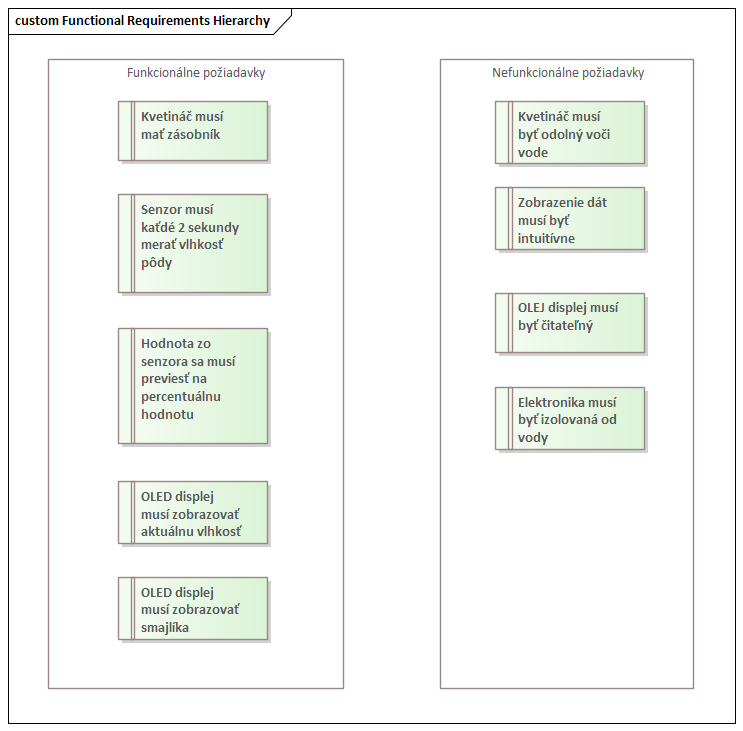
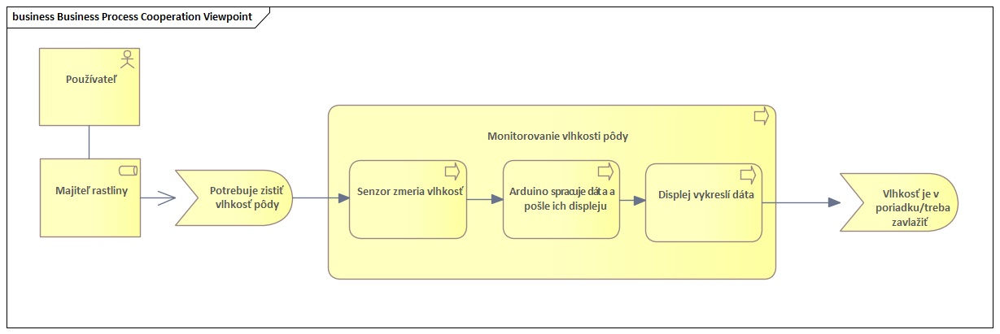
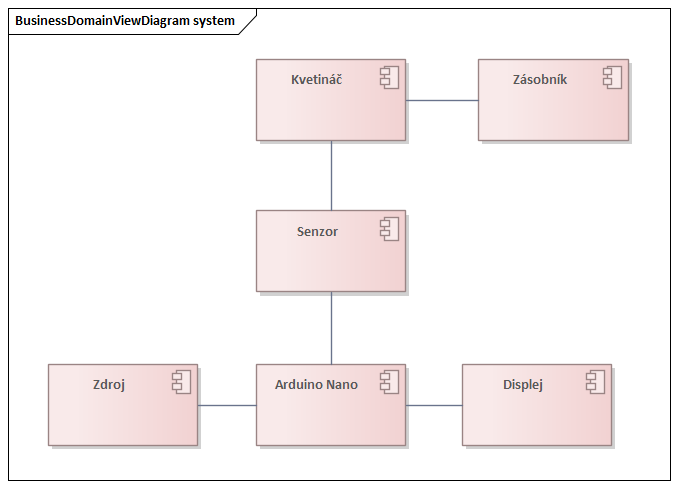

---
# 🧩 Versioning – systém dopĺňa automaticky
fm_version: "1.0.1"

# Dátum buildu – generuje skript
fm_build: "2025-11-28T15:54:47.983300+00:00"

# Poznámka k verzii – voliteľné
fm_version_comment: ""

# 🆔 IDENTITY --------------------------------------------------------

# ID generuje CLI / skript

# Unikátne UUID – generuje skript
guid: "7fdce06f-1d41-4477-9a43-dc01c83240d9"

# 🧭 CONTEXT ---------------------------------------------------------

# DAO / doména (knife, sdlc, q12, 7ds...) dopĺňa skript
dao: "class_sthdf_dashboard"

# Názov zápisu – dopĺňa používateľ
title: "slides"

# Krátky popis – dopĺňa používateľ (voliteľné)
description: "{{DESCRIPTION}}"

slug: /sk/class_sthdf_dashboard/class_sthdf_dashboard_2025-2026/projects/PRJ012/presentation/slides

# 👥 AUTHORSHIP ------------------------------------------------------

# Hlavný autor – z globálneho configu
author: "Roman Kazicka"

# Zoznam autorov – generuje skript
authors:
  - "Roman Kazicka"

# 🗂 CLASSIFICATION ---------------------------------------------------

# Nadradená kategória – môže doplniť používateľ
category: ""

# Typ dokumentu (guide, case, tutorial...) – používateľ (voliteľné)
type: ""

# Priorita (low/medium/high) – voliteľné
priority: ""

# Tagy – odporúča sa 2–6 tagov.
# Typy tagov:
#   - rámce: knife, 7ds, sdlc, q12
#   - účel: tutorial, guide, pattern, case-study
#   - téma: git, backup, ai, communication
#   - úroveň: beginner, intermediate, advanced
tags: []

# 🌍 LOCALIZATION -----------------------------------------------------

# Jazyk dokumentu – doplní skript podľa štruktúry
locale: "sk"

# 🕒 LIFECYCLE --------------------------------------------------------

# Dátum vytvorenia – generuje skript
created: "2025-11-28 16:54"

# Dátum poslednej úpravy – dopĺňa človek
modified: "2025-11-28 16:54"

# Stav dokumentu – default "backlog"
status: "backlog"

# Viditeľnosť – default "public"
privacy: "public"

# ⚖ INTELLECTUAL PROPERTY -------------------------------------------

# Držiteľ práv k obsahu – dopĺňa skript
rights_holder_content: "Roman Kazicka"

# Systémový vlastník práv
rights_holder_system: "CAA / KNIFE / LetItGrow"

# Licencia
license: "CC-BY-NC-SA-4.0"

# Disclaimer
disclaimer: "Use at your own risk. Methods provided as-is; participation is voluntary and context-aware."

# Copyright
copyright: "© 2025 Roman Kazicka"

# 🔗 ORIGIN / PROVENANCE ---------------------------------------------

# Repozitár pôvodu
origin_repo: ""

# URL pôvodného repozitára
origin_repo_url: ""

# Commit pôvodu
origin_commit: ""

# Branch pôvodu
origin_branch: ""

# Systém pôvodu (CAA/KNIFE/STHDF…)
origin_system: "CAA"

# Pôvodný autor
origin_author: "Roman Kazicka"

# Importovaný zdroj
origin_imported_from: ""

# Dátum importu
origin_import_date: ""

# 🧱 RESERVED ---------------------------------------------------------

fm_reserved1: ""
fm_reserved2: ""
---

<!-- class_sthdf_dashboard_INSTANCE_ID: 01-class_sthdf_dashboard_2025-2026 -->

[🏠 Domov](../../../index.md) · [⬅️ Nahor](../)
# PRJ012 — Presentation

--- Headline ---
## Headline
**2025-PRJ-012-ST_012-ST_012-SmartPot**

SmartPot spája 3D tlač a jednoduchú elektroniku, aby uľahčil starostlivosť o rastliny každému používateľovi, od začiatočníkov až po nadšencov. Umožňuje presné meranie vlhkosti a poskytuje jasnú vizuálnu informáciu o tom, či rastlina potrebuje vodu.
--- Headline ---

--- introduction ---
## Introduction
**2025-PRJ-012-ST_012-ST_012-SmartPot**

SmartPot je inteligentný samozavlažovací kvetináč, ktorý kombinuje 3D tlačený kvetináč so vstavaným zásobníkom vody, vlhkostný senzor, Arduino Nano a OLED displej. Senzor meria vlhkosť pôdy v reálnom čase a Arduino spracováva namerané údaje, ktoré sa následne zobrazujú na displeji formou percentuálneho ukazovateľa a smajlíka.  

Tento systém umožňuje používateľovi okamžite vidieť, či rastlina potrebuje zálievku, a tým znižuje riziko prelievania alebo vysychania. SmartPot tak poskytuje praktické, intuitívne a spoľahlivé riešenie pre každodennú starostlivosť o rastliny.

--- introduction ---

--- obsah ---
## Obsah
- [01-Business](../sdlc/01-business/index.md)
- [02-Top Level Architecture](../sdlc/02-top-level-architecture/index.md)
- [03-Solution Architecture](../sdlc/03-solution-architecture/index.md)
- [06-Implementation](../sdlc/06-implementation/index.md)

--- obsah ---

## 01-Business
SmartPot rieši najčastejší problém pri pestovaní rastlín, a tým je nesprávne zalievanie. Či už ide o zabúdanie, prelievanie alebo neodhadnutie množstva vody, rastlina bez správnej vlhkosti trpí.

Správne množstvo vody je pri rastinách zásadné:
- **príliš veľa vody** = hniloba koreňov, plesne, postupné odumieranie rastlín,
- **príliš málo vody** = vädnutie, žltnutie, spomalený rast.

SmartPot umožní používateľovi:
- jednoducho sledovať vlhkosť pôdy v reálnom čase,
- predchádzať prelievaniu či podlievaniu,
- získať jasný vizuálny indikátor (percento + smajlík),
- zjednodušiť a zefektívniť starostlivosť o rastliny.

SmartPot tak znižuje riziko poškodenia rastliny a pomáha udržiavať optimálne podmienky aj tým, ktorí starostlivosť občas zanedbajú.

### Requirements

### Business Process

## 02-Top Level Architecture
SmartPot kombinuje 3D tlač s jednoduchou elektronikou a meraním vlhkosti pôdy.

### Hardvérové prvky:
- 3D tlačený kvetináč so vstavaným zásobníkom vody
- analógový senzor vlhkosti, ktorý meria množstvo vody v pôde
- Arduino Nano pre spracovanie údajov zo senzora
- OLED displey na vizuálnu signalizáciu

### Ako funguje meranie:

1. Senzor vlhkosti pôdy detekuje obsah vody v pôde a odošle analógový signál do Arduino Nano.
2. Arduino prepočíta nameranú hodnotu na zrozumiteľnú škálu 0-100%
3. OLED displej zobrazí úroveň vlhkosti spolu s indikátorom smajlíka:

| Vlhkosť | Emoji | Stav |
|--------|--------|-------|
| > 60 % | 😊 (štasný smajlík)| pôda má dostatok vody |
| 30–60 % | 😐(neutrálny smajlík) | pôda začína vysychať |
| < 30 % | 😟 (smutný smajlík) | pôda je suchá, je čas rastlinu poliať |

SmartPot tak používateľovi poskytuje okamžitú spätnú väzbu bez nutnosti jeho odhadu alebo kontroly vlhkosti pôdy rukou.

Nasledujúci diagram zobrazuje hlavné komponenty systému a ich prepojenie.

## 03-Solution Architecture
SmartPot je kombináciou viacerých komponentov. Vlhkostný senzor meria pôdu v reálnom čase, Arduino spracováva údaje a OLED displej ich zobrazuje percentuálne a pomocou smajlíka.

###  Použité komponenty

| **Komponent** | **Množstvo** |
|---------------|--------------|
| Arduino Nano | 1 ks |
| OLED displej (I2C, 1.3″) | 1 ks |
| Senzor vlhkosti pôdy | 1 ks |
| Jumper káble (M–F, M–M) | cca 30 ks |
| Breadboard | 1 ks |
| USB kábel | 1 ks |
| 3D tlačený kvetináč (PETG) | 1 ks |
| 3D tlačené vnútro do kvetináča (PETG) | 1 ks |

[Arduino Nano](https://techfun.sk/produkt/arduino-nano-klon-s-usb-c/)

[Senzor vlhkosti](https://techfun.sk/produkt/senzor-vlhkosti-pody/)

[Jumper kable](https://techfun.sk/produkt/kabliky-40-kusov-20-cm-m-f/)

[Breadboard](https://techfun.sk/produkt/nepajive-kontaktne-pole-830-bodov-transparentne/)

## 04-Analysis
### Project Roadmap
1. **Úvodný koncept**  
   - Pôvodná myšlienka bola vytvoriť iba samozavlažovací kvetináč pomocou 3D tlače.  
   - Po diskusii s kolegom však vznikla myšlienka projekt rozšíriť o elektronickú časť, ktorá bude vedieť sledovať vlhkosť pôdy.

2. **Papierové návrhy**  
   - Ručný náčrt tvaru kvetináča, zásobníka vody a umiestnenia elektroniky.  
   - Náčrt zapojenia senzora, Arduina a displeja.  
   - Tieto náčrty tvorili prvú verziu architektúry pred spracovaním v EA.

3. **Modelovanie architektúry v Enterprise Architect (EA)**  
   - **Business Layer** – definovanie potrieb používateľa a základného procesu.  
   - **System Layer (Top Level Architecture)** – návrh architektúry: senzor → Arduino → displej → používateľ.  
   - **Technology Layer** – technická schéma zapojenia + komponenty použité pre prototyp.

4. **3D modelovanie kvetináča**  
   - Kompletný návrh vo Fusion 360.  
   - Export modelu a príprava pre 3D tlač.

5. **3D tlač prototypu**  
   - Tlač prebehla vo FabLabe.  
   - Priebežné úpravy a drobné iterácie podľa potreby.

6. **Zostavenie HW a programovania (paralelne s 3D tlačou)**  
   - Provný prototyp predstavoval prepojenie vlhkostného senzora, OLED displeja a Arduina na breadboarde.  
   - Programovanie základnej funkcionality:  
     - čítanie vlhkosti,  
     - prepočet na percentá,  
     - zobrazenie na displeji,  
     - smajlík podľa stavu pôdy.  

7. **Integrácia HW s vytlačeným 3D modelom**  
   - Druhý prototyp predstavoval zapojenie komponentov bez breadboardu do finálneho 3D tela.  
   - Umiestnenie senzora do rastliny a testovanie v reálnych podmienkach.  
   - Finálna úprava kódu.

8. **Testovanie a ladenie**  
   - Test reakcií displeja pri rôznych úrovniach vlhkosti.  
   - Kontrola kompatibility 3D modelu s elektronikou.

9. **Finalizácia projektu**  
   - Dokončenie dokumentácie.  
   - Pridanie fotografií prototypu.  

## 05-Design
### Schéma zapojenia 
Na nasledujúcom obrzáku je náš rukou nakreslený náčrť, ako by sme si zapojenie s Arduinom predstavovali.

### Pôvodný náčrt kvetináču

### Návrh 3D modelov vo Fusion 360

## 06-Implementation
###  Zapojenie elektroniky

#### Zapojenie senzora vlhkosti s Arduino Nano
- **VCC → VIN (Arduino Nano)**  
- **GND → GND (Arduino Nano)**  
- **A0 → A0 (Arduino Nano)**  

#### Zapojenie OLED displeja (I2C) s Arduino Nano
- **VCC → VIN (Arduino Nano)**  
- **GND → GND (Arduino Nano)**  
- **SDA → A4 (Arduino Nano)**  
- **SCL → A5 (Arduino Nano)** 

### Výsledná schéma zapojenia 
Na obrázku nižšie je zobrazená schéma zapojenia Arduina so senzorom a OLED displejom.

Takto vyzeral prvotný prototyp zapojenia v breadboarde:

A takto vyzeralo finálne zapojenie bez breadboardu:

### Vytlačený 3D model
Vytlačený kvetináč pozostával z dvoch častí, samotného kvetináča a vnútra, ktoré oddeľuje kvet od zásobníka vody.

Na nasledujúcich obrázkoch je možné vidieť už spojené časti kvetináču.

### Finálny produkt
Projekt priniesol plne funkčný SmartPot, ktorý obsahuje 3D tlačený kvetináč so vstavaným zásobníkom vody, vlhkostný senzor a displej, ktorý poskytuje okamžitú vizuálnu spätnú väzbu. Meranie vlhkosti je presné a používateľ je notifikovaný o stave pôdy jednoduchým vizuálnym indikátorom na displeji (percento + smajlík). 

### Možné vylepšenia v budúcnsosti
Do budúcnosti vidíme niekoľko možností, ako prototyp vylepšiť. Mohli by sme pridať automatickú pumpu, ktorá by sama dopĺňala vodu zo zásobníka alebo integrovať Bluetooth či Wi-Fi pre odosielanie upozornení priamo do telefónu používateľa. Ďalšou možnosťou je pridať zvukový indikátor, ktorý by upozorňoval, že pôda je suchá, čím by sa zvýšila interaktivita a použiteľnosť zariadenia.