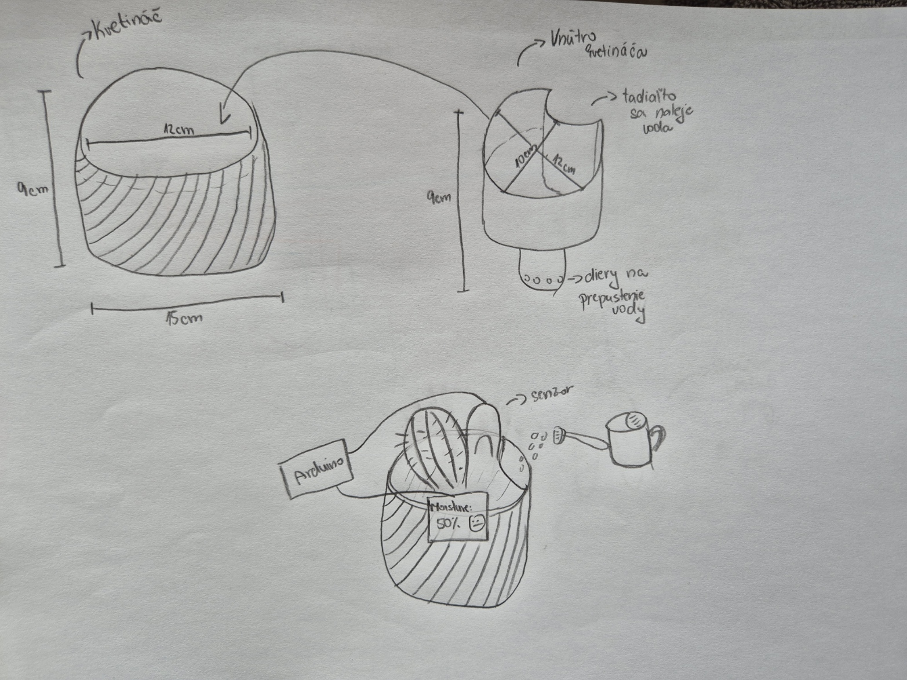
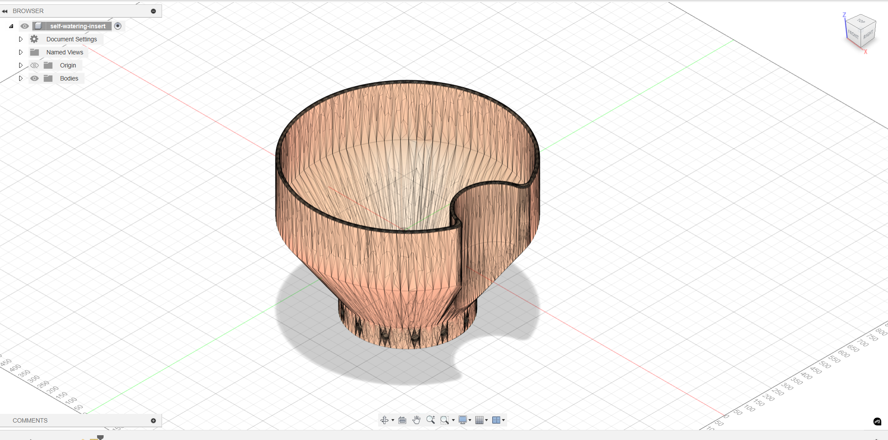
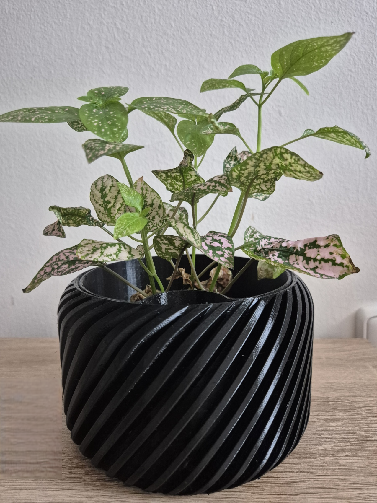
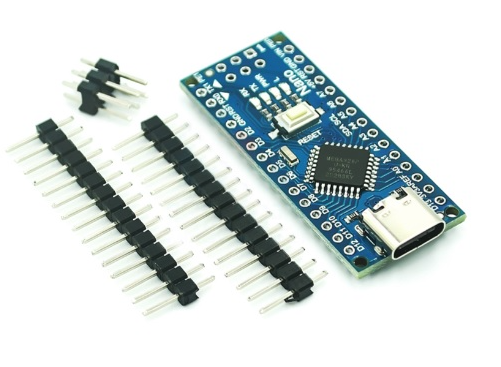
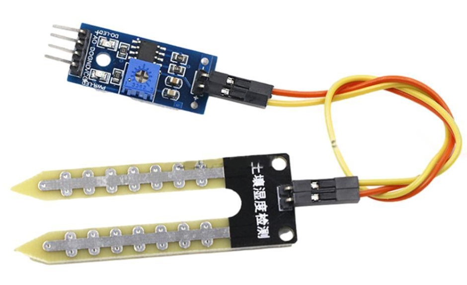
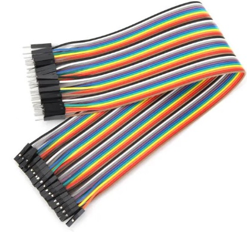
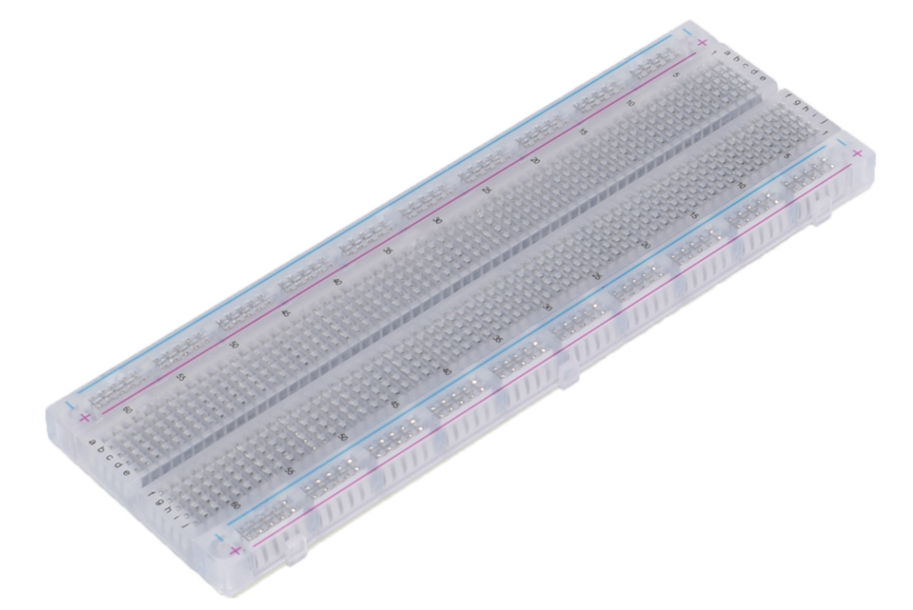
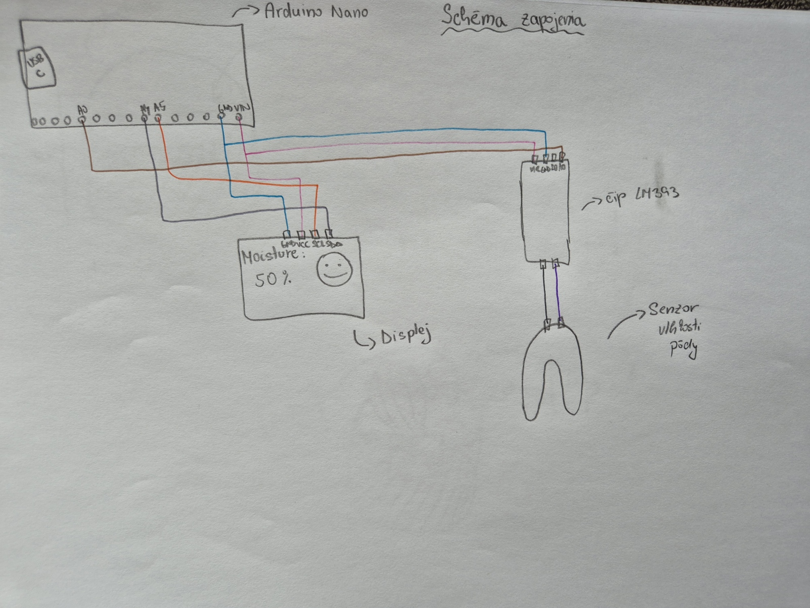
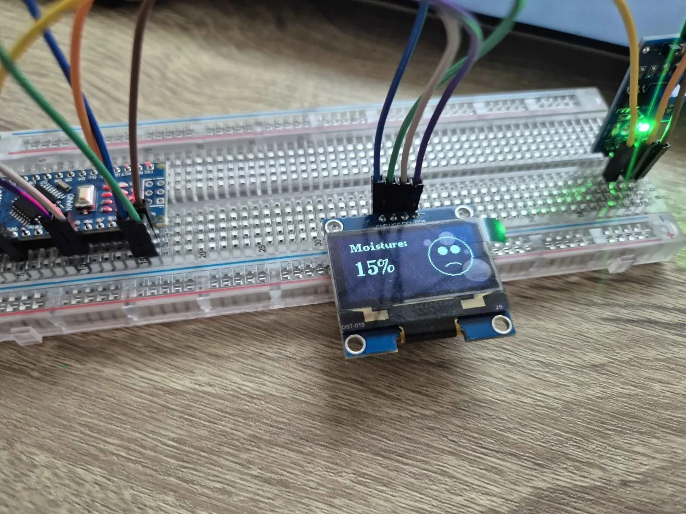

---
# 🧩 Versioning – systém dopĺňa automaticky
fm_version: "1.0.1"

# Dátum buildu – generuje skript
fm_build: "2025-11-28T15:54:47.985656+00:00"

# Poznámka k verzii – voliteľné
fm_version_comment: ""

# 🆔 IDENTITY --------------------------------------------------------

# ID generuje CLI / skript

# Unikátne UUID – generuje skript
guid: "a5903b37-8ce4-4292-8e13-a31f7df5a4fb"

# 🧭 CONTEXT ---------------------------------------------------------

# DAO / doména (knife, sdlc, q12, 7ds...) dopĺňa skript
dao: "class_sthdf_dashboard"

# Názov zápisu – dopĺňa používateľ
title: "03 solution architecture"

# Krátky popis – dopĺňa používateľ (voliteľné)
description: "{{DESCRIPTION}}"

# 👥 AUTHORSHIP ------------------------------------------------------

# Hlavný autor – z globálneho configu
author: "Roman Kazicka"

# Zoznam autorov – generuje skript
authors:
  - "Roman Kazicka"

# 🗂 CLASSIFICATION ---------------------------------------------------

# Nadradená kategória – môže doplniť používateľ
category: ""

# Typ dokumentu (guide, case, tutorial...) – používateľ (voliteľné)
type: ""

# Priorita (low/medium/high) – voliteľné
priority: ""

# Tagy – odporúča sa 2–6 tagov.
# Typy tagov:
#   - rámce: knife, 7ds, sdlc, q12
#   - účel: tutorial, guide, pattern, case-study
#   - téma: git, backup, ai, communication
#   - úroveň: beginner, intermediate, advanced
tags: []

# 🌍 LOCALIZATION -----------------------------------------------------

# Jazyk dokumentu – doplní skript podľa štruktúry
locale: "sk"

# 🕒 LIFECYCLE --------------------------------------------------------

# Dátum vytvorenia – generuje skript
created: "2025-11-28 16:54"

# Dátum poslednej úpravy – dopĺňa človek
modified: "2025-11-28 16:54"

# Stav dokumentu – default "backlog"
status: "backlog"

# Viditeľnosť – default "public"
privacy: "public"

# ⚖ INTELLECTUAL PROPERTY -------------------------------------------

# Držiteľ práv k obsahu – dopĺňa skript
rights_holder_content: "Roman Kazicka"

# Systémový vlastník práv
rights_holder_system: "CAA / KNIFE / LetItGrow"

# Licencia
license: "CC-BY-NC-SA-4.0"

# Disclaimer
disclaimer: "Use at your own risk. Methods provided as-is; participation is voluntary and context-aware."

# Copyright
copyright: "© 2025 Roman Kazicka"

# 🔗 ORIGIN / PROVENANCE ---------------------------------------------

# Repozitár pôvodu
origin_repo: ""

# URL pôvodného repozitára
origin_repo_url: ""

# Commit pôvodu
origin_commit: ""

# Branch pôvodu
origin_branch: ""

# Systém pôvodu (CAA/KNIFE/STHDF…)
origin_system: "CAA"

# Pôvodný autor
origin_author: "Roman Kazicka"

# Importovaný zdroj
origin_imported_from: ""

# Dátum importu
origin_import_date: ""

# 🧱 RESERVED ---------------------------------------------------------

fm_reserved1: ""
fm_reserved2: ""
---

<!-- class_sthdf_dashboard_INSTANCE_ID: 01-class_sthdf_dashboard_2025-2026 -->

# 03-Solution Architecture
### Pôvodný náčrt kvetináču

### Návrh 3D modelov vo Fusion 360

### Vytlačený 3D model

###  Zoznam komponentov

| **Komponent** | **Množstvo** |
|---------------|--------------|
| Arduino Nano | 1 ks |
| OLED displej (I2C, 1.3″) | 1 ks |
| Senzor vlhkosti pôdy | 1 ks |
| Jumper káble (M–F, M–M) | cca 30 ks |
| Breadboard | 1 ks |
| USB kábel | 1 ks |
| 3D tlačený kvetináč (PETG) | 1 ks |
| 3D tlačené vnútro do kvetináča (PETG) | 1 ks |

[Arduino Nano](https://techfun.sk/produkt/arduino-nano-klon-s-usb-c/)

[Senzor vlhkosti](https://techfun.sk/produkt/senzor-vlhkosti-pody/)

[Jumper kable](https://techfun.sk/produkt/kabliky-40-kusov-20-cm-m-f/)

[Breadboard](https://techfun.sk/produkt/nepajive-kontaktne-pole-830-bodov-transparentne/)

###  Zapojenie elektroniky

#### Zapojenie senzora vlhkosti s Arduino Nano
- **VCC → VIN (Arduino Nano)**  
- **GND → GND (Arduino Nano)**  
- **A0 → A0 (Arduino Nano)**  

#### Zapojenie OLED displeja (I2C) s Arduino Nano
- **VCC → VIN (Arduino Nano)**  
- **GND → GND (Arduino Nano)**  
- **SDA → A4 (Arduino Nano)**  
- **SCL → A5 (Arduino Nano)**  

### Schéma zapojenia (Circuit Diagram)
**Návrh**

Na nasledujúcom obrzáku je náš rukou nakreslený náčrť, ako by sme si zapojenie s Arduinom predstavovali.

**Výsledné zapojenie**

Na obrázku nižšie je zobrazená schéma zapojenia Arduina so senzorom a OLED displejom.

Takto vyzeral prvotný prototyp zapojenia v breadboarde:

A takto vyzeralo finálne zapojenie bez breadboardu:

- [Solution design](./design.md)

**Navigation:** [⬆️ SDLC](../index.md) · [⬅️ Projekt](../../index.md)
