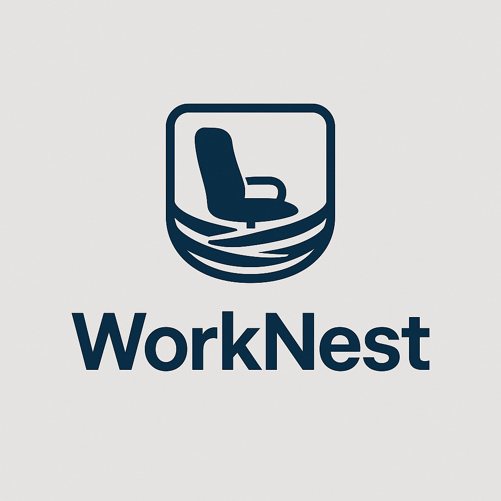
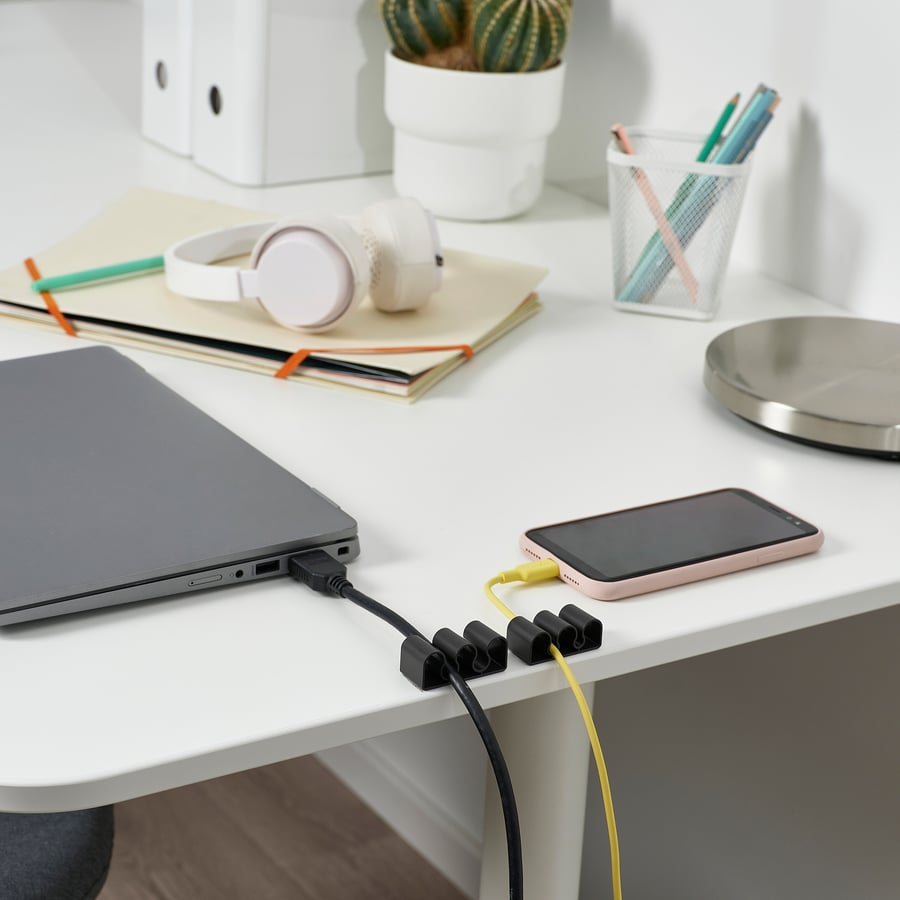
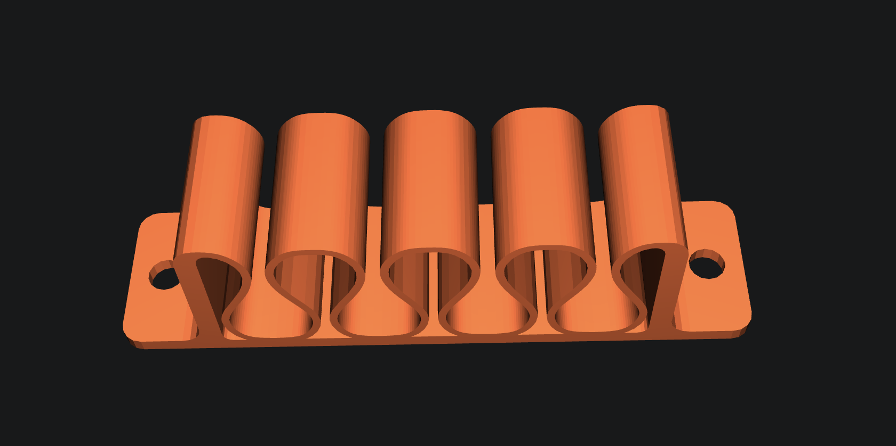

---
# 🧩 Versioning – systém dopĺňa automaticky
fm_version: "1.0.1"

# Dátum buildu – generuje skript
fm_build: "2025-11-28T15:54:47.952256+00:00"

# Poznámka k verzii – voliteľné
fm_version_comment: ""

# 🆔 IDENTITY --------------------------------------------------------

# ID generuje CLI / skript

# Unikátne UUID – generuje skript
guid: "bf8e768f-40d4-4330-9a48-5bd9093144e6"

# 🧭 CONTEXT ---------------------------------------------------------

# DAO / doména (knife, sdlc, q12, 7ds...) dopĺňa skript
dao: "class_sthdf_dashboard"

# Názov zápisu – dopĺňa používateľ
title: "slides"

# Krátky popis – dopĺňa používateľ (voliteľné)
description: "{{DESCRIPTION}}"

# 👥 AUTHORSHIP ------------------------------------------------------

# Hlavný autor – z globálneho configu
author: "Roman Kazicka"

# Zoznam autorov – generuje skript
authors:
  - "Roman Kazicka"

# 🗂 CLASSIFICATION ---------------------------------------------------

# Nadradená kategória – môže doplniť používateľ
category: ""

# Typ dokumentu (guide, case, tutorial...) – používateľ (voliteľné)
type: ""

# Priorita (low/medium/high) – voliteľné
priority: ""

# Tagy – odporúča sa 2–6 tagov.
# Typy tagov:
#   - rámce: knife, 7ds, sdlc, q12
#   - účel: tutorial, guide, pattern, case-study
#   - téma: git, backup, ai, communication
#   - úroveň: beginner, intermediate, advanced
tags: []

# 🌍 LOCALIZATION -----------------------------------------------------

# Jazyk dokumentu – doplní skript podľa štruktúry
locale: "sk"

# 🕒 LIFECYCLE --------------------------------------------------------

# Dátum vytvorenia – generuje skript
created: "2025-11-28 16:54"

# Dátum poslednej úpravy – dopĺňa človek
modified: "2025-11-28 16:54"

# Stav dokumentu – default "backlog"
status: "backlog"

# Viditeľnosť – default "public"
privacy: "public"

# ⚖ INTELLECTUAL PROPERTY -------------------------------------------

# Držiteľ práv k obsahu – dopĺňa skript
rights_holder_content: "Patrik Fejda, Daria Sira"

# Systémový vlastník práv
rights_holder_system: "CAA / KNIFE / LetItGrow"

# Licencia
license: "CC-BY-NC-SA-4.0"

# Disclaimer
disclaimer: "Use at your own risk. Methods provided as-is; participation is voluntary and context-aware."

# Copyright
copyright: "© 2025 Roman Kazicka"

# 🔗 ORIGIN / PROVENANCE ---------------------------------------------

# Repozitár pôvodu
origin_repo: ""

# URL pôvodného repozitára
origin_repo_url: ""

# Commit pôvodu
origin_commit: ""

# Branch pôvodu
origin_branch: ""

# Systém pôvodu (CAA/KNIFE/STHDF…)
origin_system: "CAA"

# Pôvodný autor
origin_author: "Roman Kazicka"

# Importovaný zdroj
origin_imported_from: ""

# Dátum importu
origin_import_date: ""

# 🧱 RESERVED ---------------------------------------------------------

fm_reserved1: ""
fm_reserved2: ""
---

<!-- class_sthdf_dashboard_INSTANCE_ID: 01-class_sthdf_dashboard_2025-2026 -->

[🏠 Domov](../../../index.md) · [⬅️ Nahor](../)
# PRJ013 — WorkNest

--- Headline ---
## Headline
**2025-PRJ-013-ST_010-ST_043-WorkNest**

--- Headline ---

--- introduction ---
## Introduction
**2025-PRJ-013-ST_010-ST_043-WorkNest**

Našou víziou je zlepšiť život a pracovné prostredie ľudí, ktorí trávia veľa času pri počítači – programátorov, office pracovníkov či kreatívcov. Zameriavame sa na pohodlie, zdravie a estetiku pracovného setupu. Dlhodobým cieľom je vytvoriť komplexný ekosystém riešení, ktorý pomôže správne nastaviť pracovné miesto.

--- introduction ---

--- obsah ---
## Obsah
- [01-Business plan](../sdlc/01-business-plan/index.md)
- [02-Project phases](../sdlc/02-project-phases/index.md)
- [03-Cable holder - Držkábel](../sdlc/03-cable-holder/index.md)
- [04-App](../sdlc/04-app/index.md)
--- obsah ---

## 01-Business plan
- **Dlhodobý cieľ**
  - Vybudovať ekosystém pre moderné PC pracovné miesta (zdravie + produktivita + estetika)
  - Organický rast, reálna hodnota pre používateľa, interoperabilita s existujúcimi smart produktmi
  - Kombinácia jednoduchých fyzických doplnkov + inteligentnej aplikácie
- **Ako chceme rásť**
  - Začať malými, praktickými produktmi a MVP apkou; iterovať na základe feedbacku
  - Podpora otvorených protokolov a integrácií tretích strán
  - Primárne B2C; neskôr piloty/B2B príležitosti
- **Focus na najbližší čas**
  - Validácia produktu Držkábel (predaj, používateľské testy, iterácie)
  - MVP app: ergonomické odporúčania, pripomienky sedenie/státie, pomodoro
  - Distribúcia: komunita, e‑shop, piloty so školami/firmami

## 02-Project phases
- **1. Držkábel**
  - Výroba, balenie, pilotný predaj; zber a vyhodnotenie spätnej väzby
- **2. Apka**
  - MVP: ergonomické odporúčania + pripomienky + pomodoro + základný profil
- **3. Feedback od používateľov**
  - Testy, dotazníky, rozhovory; metriky používania (čo funguje/nefunguje)
- **4. Na tom budeme robiť**
  - Roadmapa podľa dát; rozšírenia: integrácie, senzory, doplnky
  - Napr. standing desk, svetlá, senzory (vzduch/CO₂, svetlo, hluk), ďalšie organizéry

## 03-Cable holder - Držkábel
- **Ako sme vyvíjali**
  - Otestovali sme viaceré komerčné držáky – nič nevyhovovalo (slabá fixácia, ostré hrany, zlý „return“, neestetika)
  - Navrhli sme vlastný 3D model: plynulý pohyb kábla, jednoduché založenie, istý návrat, stabilita
  - Iterácie podľa používania; finále: jednoduché, spoľahlivé, lacné na výrobu
- **Zlé príklady (čo nechceme)**
  - 
  - 
  - 
  - 
- **Náš návrh**
  - 
  - 
  - 
- **3D model (STL)**
  - [Stiahnuť model STL](../src/cableholder.stl)
- Skúšali sme ich „mega veľa“, preto sme navrhli vlastné riešenie a iterovali podľa reálneho používania.

## 04-App
- **Na čo bude slúžiť v budúcnosti**
  - Ergonomické odporúčania (výška sedenia/stola, umiestnenie monitora, nastavenie stoličky)
  - Pripomienky striedania sedenia/státia, sledovanie času v polohách, prestávky
  - Personalizované kompenzačné cvičenia, pomodoro, AI rady pre cable management
  - Integrácie tretích strán, malé senzory (svetlo, CO₂, hluk)
- **Čo obsahuje teraz (MVP/prototyp)**
  - Onboarding s telesnými údajmi + základné ergonomické odporúčania
  - Pomodoro timer a jednoduché pripomienky prestávok
  - Základný profil + checklist nastavenia setupu
- **Odkaz na model (Figma)**
  - [Smart Cable Management App – prototyp](https://www.figma.com/make/x6OcLtSWBVfoPrO1ktyxl8/Smart-Cable-Management-App?node-id=0-4&t=ov0OmfD7uj8mJ02F-1)
  