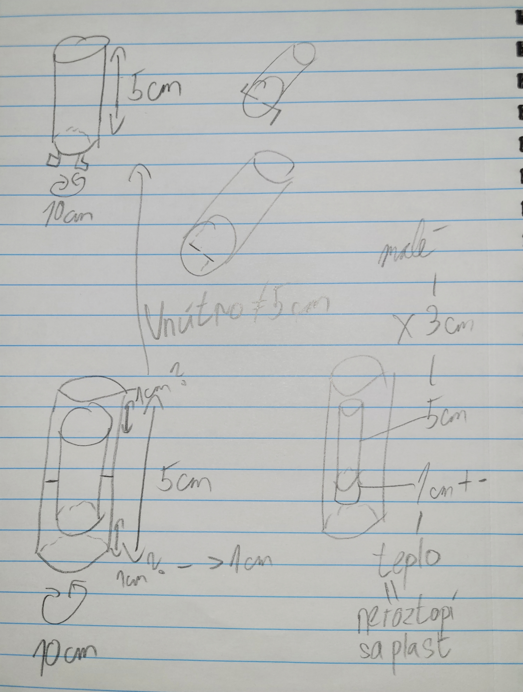
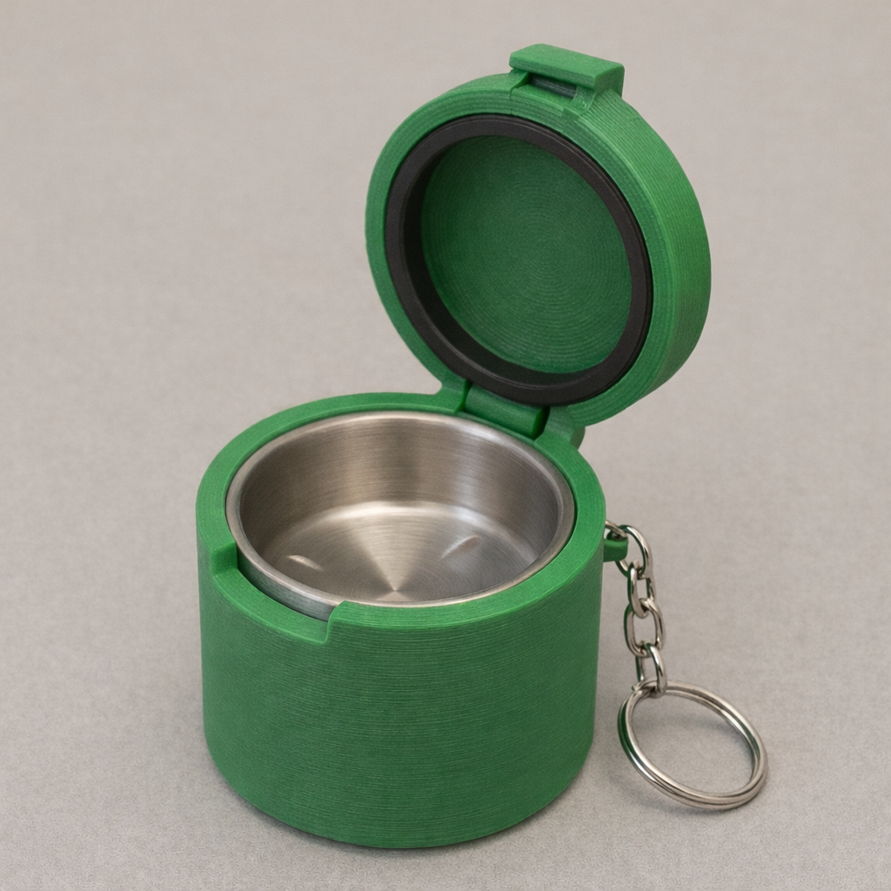
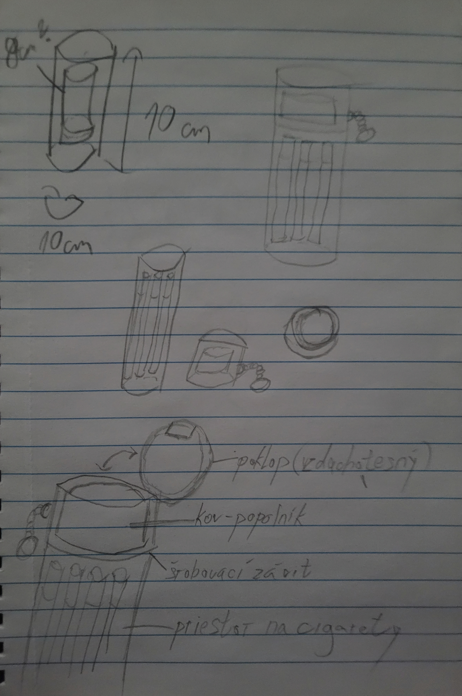
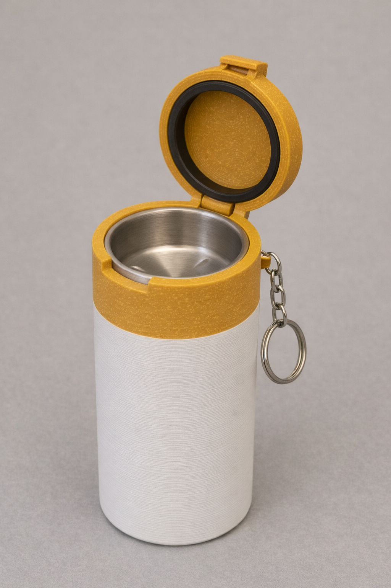
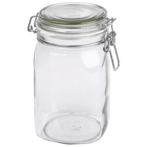

# PRJ015 - AshLock

## 1. Prehľad projektu
**AshLock** je koncept prenosného uzatvárateľného popolníka a zároveň puzdra na cigarety, navrhnutého ako **kľúčenka**.  
Cieľom projektu je vytvoriť **kompaktné, bezpečné a zápach minimalizujúce riešenie**, ktoré umožní:
- bezpečne uhasiť cigaretu,
- krátkodobo uložiť popol,
- prípadne prenášať niekoľko čistých cigariet,
bez rizika vysypania, zápachu alebo poškodenia okolia.

Projekt kombinuje:
- **mechanický dizajn (3D tlač)**,
- **tepelnú ochranu pomocou vložky**,
- **uzatvárateľný systém so závitom a tesnením**.

## 2. Hlavná myšlienka dizajnu
Pôvodný dizajn zahŕňal iba prenosný popolník, bez ďalšej funkcionality.

Druhá verzia s pridanou možnosťou úschovy cigariet bola navrhnutá tak, aby kľúčenka **pripomínala cigaretu**:
- **horná časť (žltá)** – imituje filter, je odskrutkovateľná,
- **spodná časť (biela)** – imituje papier cigarety a tvorí hlavný objem.

Celkovo má teda AshLock:
- **funkčný popolník** (s kovovou vložkou),
- **menší úložný priestor** (až 6 cigariet),
- **kľúčenku** – vhodnú na každodenné nosenie.

## 3. Scenáre použitia
- rýchle zahasenie cigarety na cestách,
- krátkodobé uloženie popola bez koša,
- prenášanie cigariet bez krabičky,
- festivaly, turistika, mestské prostredie.

## 4. Mechanická konštrukcia
### 4.1 Základné časti
- **Spodná časť (base)**  
  - biely 3D tlačený obal  
  - vnútorný priestor pre cigarety / popol  

- **Horná časť (lid / filter)**  
  - žltý 3D tlačený diel
  - integrované očko pre kľúčenku    
  - závitové spojenie  
  - drážka pre gumové tesnenie (O-ring)  

- **Vnútorná vložka**  
  - kovová (nerez / hliník)  
  - chráni plast pred teplom a žeravým popolom  

## 5. Vypočítané parametre (na základe návrhu)
### 5.1 Rozmery (odhad podľa použitia ako kľúčenka)
- **Vonkajší priemer:** ~35–38 mm  
- **Vnútorný priemer:** ~22–24 mm  
- **Celková výška:** ~120–130 mm  
  - cca 2,5× vyššia verzia oproti pôvodnému popolníku  
- **Hmotnosť (bez cigariet):** ~70–90 g (s kovovou vložkou)

### 5.2 Kapacita
- **Maximálny počet cigariet:** 6 ks  
  - usporiadanie v kruhu (5 + 1 stred)  
- Zachovaná prenosnosť a použiteľnosť ako kľúčenka

## 6. Uzatváranie a tesnenie
- **Závitové spojenie** (šróbovanie) medzi hornou a spodnou časťou  

Tesnenie bolo inšpirované zaváraninovým pohárom, ktorého tesnenie je účinné pred únikom plynov.

- **Gumové tesnenie**:
  - priemer tesnenia: cca 6/4" (≈ 19 mm vnútorný)
  - kompresia ~10–20 %
- Výsledok:
  - výrazné zníženie zápachu,
  - ochrana pred vysypaním popola,
  - bezpečné nosenie vo vrecku alebo na kľúčoch.

## 7. Tepelná ochrana (kritická časť návrhu)
### Aktuálny stav prototypu
**Finálny produkt zatiaľ nebolo možné dodať**, pretože:
- bežné 3D tlačové materiály (PLA, PETG, ABS)  
  **nie sú odolné voči priamemu žiaru**,
- žeravý popol môže dosahovať **400–500 °C**,
- existuje riziko:
  - deformácie plastu,
  - poškodenia tesnenia,
  - ohrozenia kľúčenky.

### Riešenia, ktoré sa aktuálne zvažujú:
- kovová vložka s **tepelnou medzerou (air gap)**,
- oddelenie plastu od horúcej zóny,
- použitie vysokoteplotného lepidla alebo mechanického uchytenia vložky.

## 8. Stav projektu
- ✔ hotový **koncept a vizuálny dizajn**
- ✔ overená **ergonómia a kapacita**
- ✔ uzatvárateľný a prenosný mechanizmus
- ❌ prebieha riešenie **termoregulácie a bezpečnosti**

## 9. Záver
Projekt **AshLock** predstavuje praktické a dizajnovo výrazné riešenie problému prenosného fajčenia v mestskom prostredí.  
Spája:
- mechanický dizajn,
- 3D tlač,
- materiálové obmedzenia,
- a reálne používateľské scenáre.

Ďalší krok projektu je **finalizácia tepelnej ochrany**, po ktorej bude možné dodať plnohodnotný funkčný prototyp.

Možné budúce rozšírenia:
- viacfarebné varianty,
- verzia len ako popolník / len ako puzdro,
- vymeniteľné vložky,
- branding a custom dizajn.