# SmartClock

## 1. Prehľad projektu
Cieľom projektu je zostaviť jednoduché riešenie postavené na **Raspberry Pi** a **LCD displeji**, ktoré po spustení vykresľuje vybrané informácie priamo na lokálny displej.

Riešenie je rozdelené na:
- **HW vrstvu**: Raspberry Pi + 3.5" LCD displej
- **SW vrstvu**: Raspberry Pi OS + driver displeja + Python script

> Displej 320×480, kompatibilný s rôznymi verziami Raspberry Pi.  
> Ovládač sme riešili cez projekt LCD-show (https://github.com/waveshareteam/LCD-show),   
> Referencie: LCDWiki / LCD-show / Raspberry Pi Imager.  

## 2. Obsah repozitára
Aktuálna štruktúra repozitára (https://github.com/drizzle021/rpiclock):
- `main.py` – hlavný Python skript
- `requirements.txt` – Závislosti projektu
- `screens/` – skript jednotlivých obrazoviek aplikácie
- `assets/1x/` – grafické assets (ikony, obrázky…)

## 3. Hardvér a fyzická integrácia
### 3.1 Použitý hardvér
- Raspberry zero W 2
- 3.5" LCD s dotykovou vrstvou (rezistívny touch)
- Spájač na piny
- microSD karta
- Napájanie (USB adaptér)

### 3.2 Mechanická časť
V projekte používame aj jednoduchý mechanický 3D vytlačený pop-in obal.  

#### Ručný nákres prototypu na papier

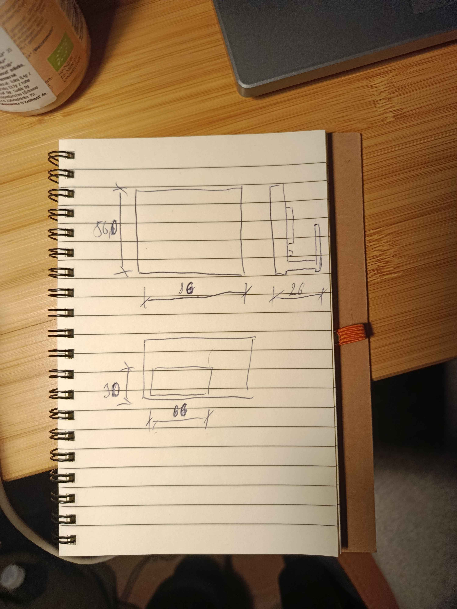


#### Nákres

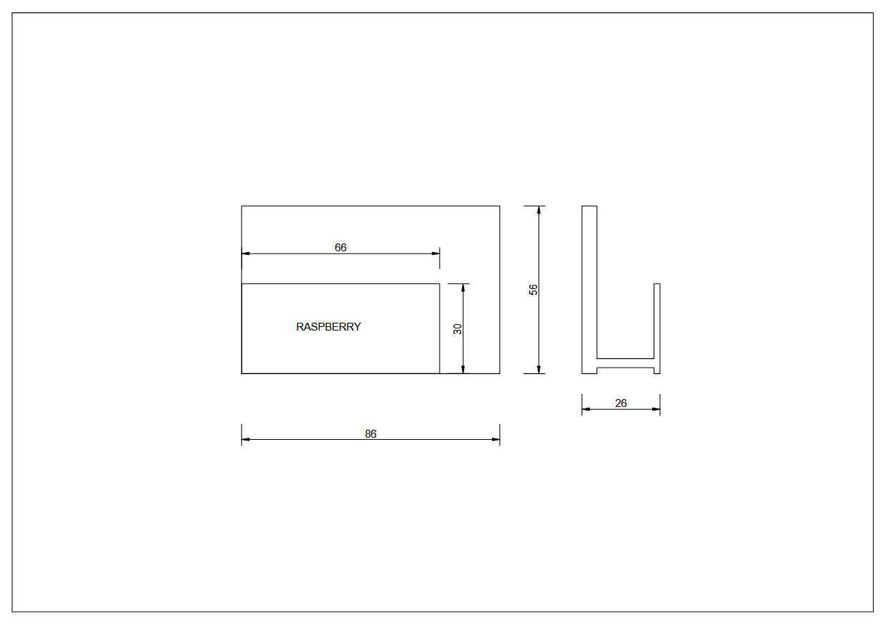

Parametre boli navrhnuté tak, aby sme mohli náš displej ľahko vtlačiť do vytlačeného obalu tak, že tam zapadne a bude držať. Časť okolo displeja bola navrhnutá aby držala displej pevne, zatiaľ čo časť obalu okolo dosky je mriežkovaná kvôli vetraniu, takisto boli vyrezané diery na potrebné porty.

#### Model obalu v softvére

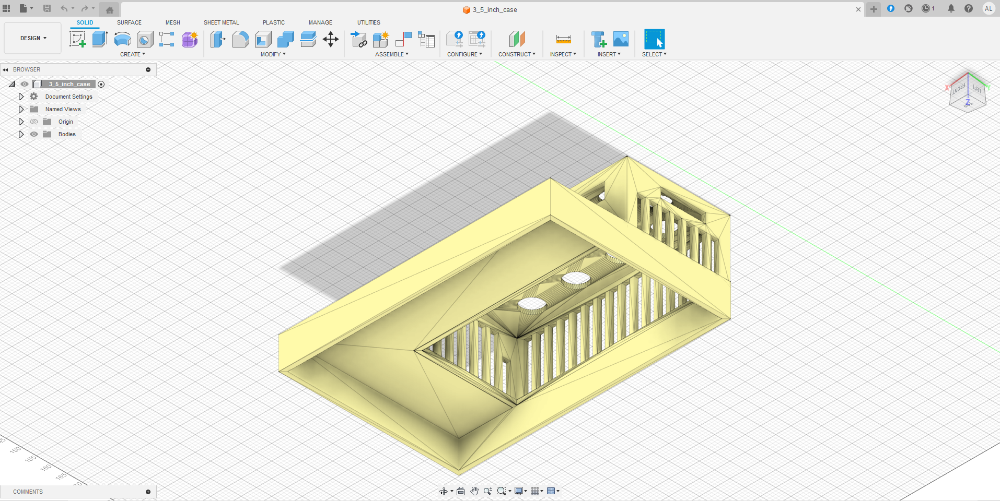
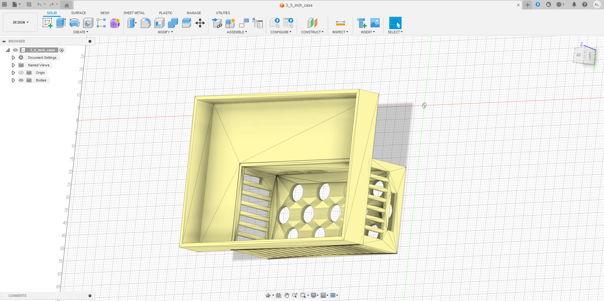


## 4. Softvér a architektúra riešenia
### 4.1 Softvérové vrstvy
1. **Raspberry Pi OS**
2. **Driver displeja** 
3. **Python aplikácia**:
   - získa dáta (čas, systémové metriky, …)
   - vykreslí UI (texty/ikony)
   - pošle frame na displej
   - cyklicky opakuje aktualizáciu

### 4.2 Diagramy
Diagramy sú exportované z Enterprise Architect.

- **Deployment diagram** (HW/SW nasadenie)  

  

- **Component diagram** (softvérové komponenty)  
  

- **Sequence diagram** (runtime update loop)  
  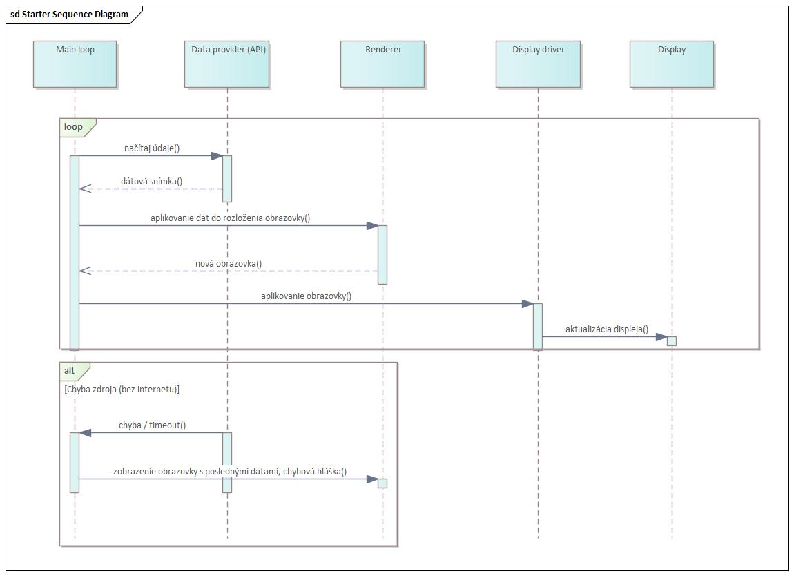

- **Activity diagram** (inštalačný postup)  
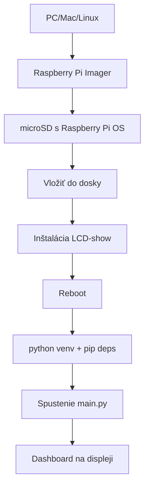

## 5. Inštalácia a spustenie
### 5.1 Príprava microSD (Raspberry Pi Imager)

Na prípravu OS používame Raspberry Pi Imager (https://www.raspberrypi.com/software):

1. Vyber Raspberry Pi OS
2. Zapíš image na microSD
3. Vlož kartu do Raspberry Pi a nabootuj

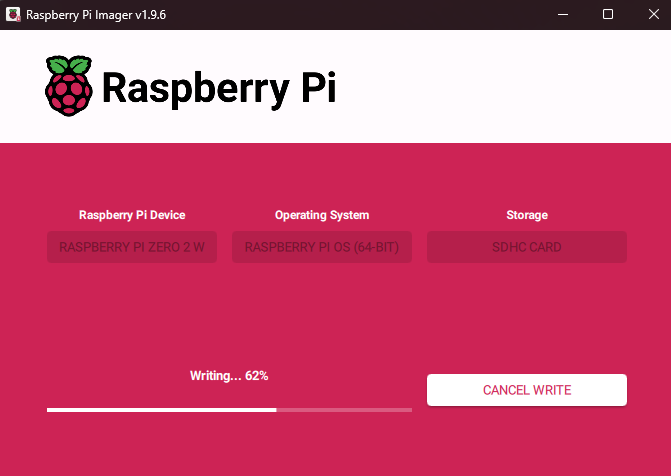


### 5.2 Inštalácia driveru displeja
```bash
sudo apt update
sudo apt install -y git
git clone https://github.com/waveshareteam/LCD-show.git
cd LCD-show
sudo ./LCD35-show
```

## 6. Finálny produkt
### Vypnutý displej
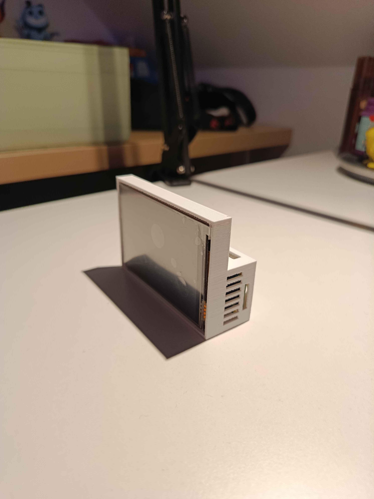
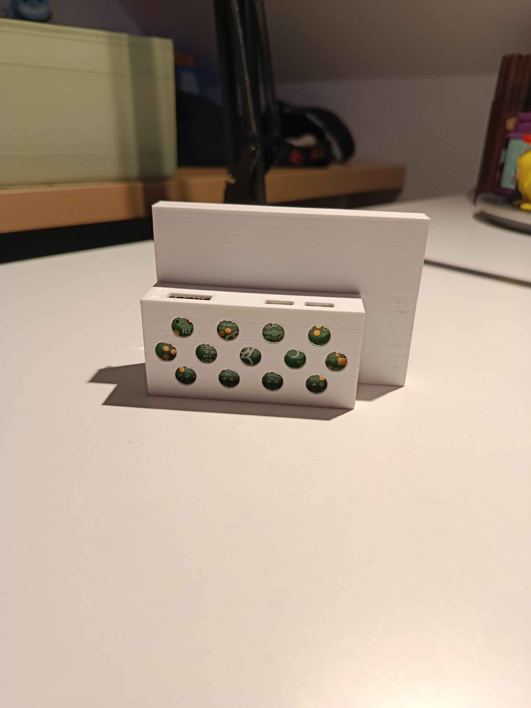
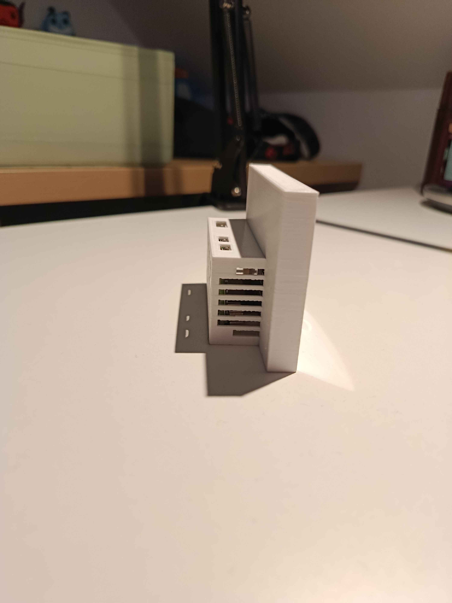
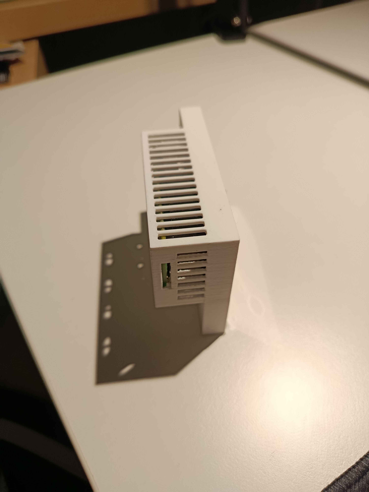
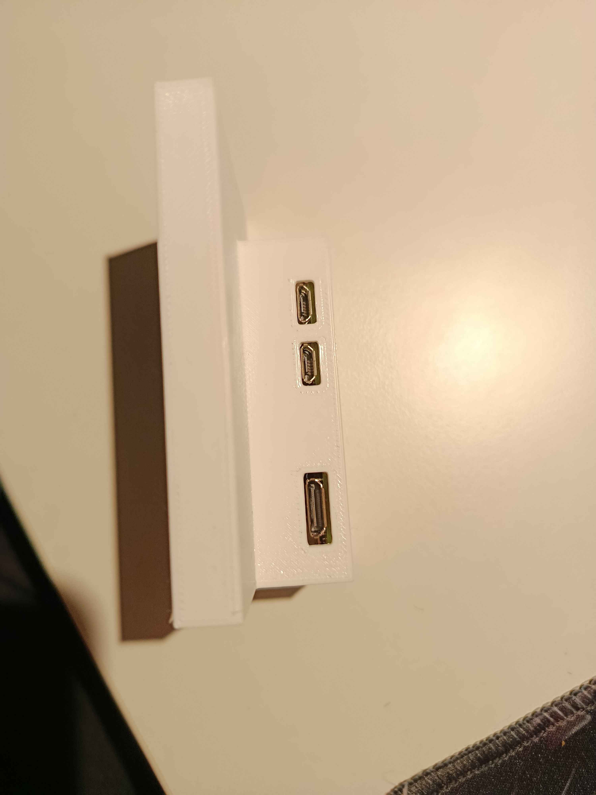

### Fungujúci SmartClock


## 7. Záver
Projekt **SmartClock** ukazuje praktický spôsob, ako na Raspberry Pi vytvoriť lokálny „dashboard“ bez potreby externého monitora. Kombinácia Raspberry Pi, displeja a jednoduchého skriptu umožňuje vykresľovať informácie v reálnom čase priamo na zariadení a riešenie je zároveň rozšíriteľné o ďalšie obrazovky alebo vstupy (dotykové ovládanie).

Z pohľadu architektúry sme si overili celý reťazec od fyzickej integrácie (osadenie displeja, obal, prístup k portom a vetranie) až po softvérovú časť (inštalácia driveru, závislosti vykresľovanie UI). Výsledkom je funkčný prototyp, pri ktorom sme sa naučili: prácu s HW perifériou, nasadenie na konkrétnu platformu a UI vykresľovanie na displej.

Možné zlepšenia do budúcna:
- automatické spúšťanie aplikácie po spustení
- konfigurovateľné obrazovky (config)
- doplnenie externých dát (notifikácie)
- využitie dotyku na prepínanie obrazoviek / interakciu

