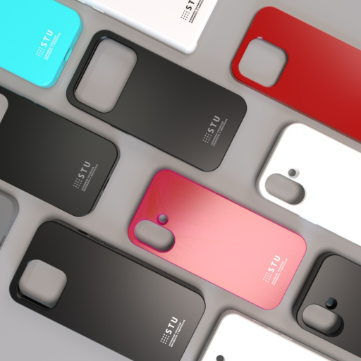
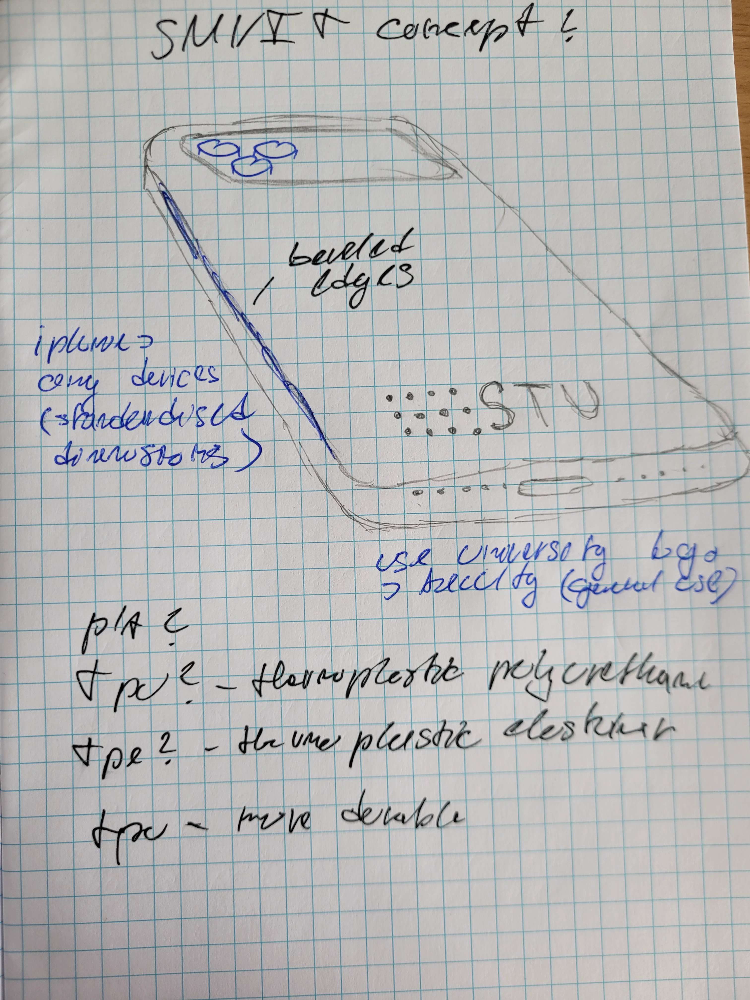
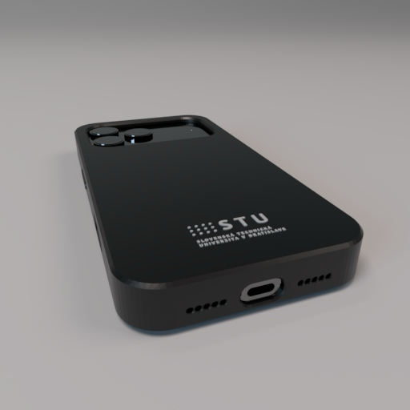
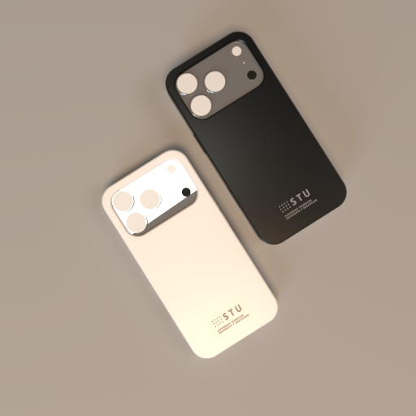
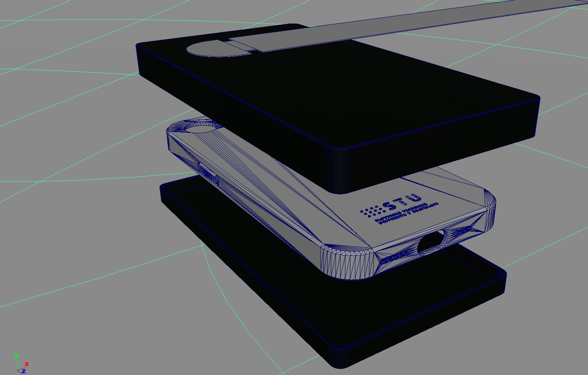

---
# 🧩 Versioning – systém dopĺňa automaticky
fm_version: "1.0.1"

# Dátum buildu – generuje skript
fm_build: "2025-11-28T15:54:48.028598+00:00"

# Poznámka k verzii – voliteľné
fm_version_comment: ""

# 🆔 IDENTITY --------------------------------------------------------

# ID generuje CLI / skript

# Unikátne UUID – generuje skript
guid: "041e4865-162d-4e35-9aa4-f4eadd9a41b1"

# 🧭 CONTEXT ---------------------------------------------------------

# DAO / doména (knife, sdlc, q12, 7ds...) dopĺňa skript
dao: "class_sthdf_dashboard"

# Názov zápisu – dopĺňa používateľ
title: "prototype"

# Krátky popis – dopĺňa používateľ (voliteľné)
description: "{{DESCRIPTION}}"

# 👥 AUTHORSHIP ------------------------------------------------------

# Hlavný autor – z globálneho configu
author: "Roman Kazicka"

# Zoznam autorov – generuje skript
authors:
  - "Roman Kazicka"

# 🗂 CLASSIFICATION ---------------------------------------------------

# Nadradená kategória – môže doplniť používateľ
category: ""

# Typ dokumentu (guide, case, tutorial...) – používateľ (voliteľné)
type: ""

# Priorita (low/medium/high) – voliteľné
priority: ""

# Tagy – odporúča sa 2–6 tagov.
# Typy tagov:
#   - rámce: knife, 7ds, sdlc, q12
#   - účel: tutorial, guide, pattern, case-study
#   - téma: git, backup, ai, communication
#   - úroveň: beginner, intermediate, advanced
tags: []

# 🌍 LOCALIZATION -----------------------------------------------------

# Jazyk dokumentu – doplní skript podľa štruktúry
locale: "sk"

# 🕒 LIFECYCLE --------------------------------------------------------

# Dátum vytvorenia – generuje skript
created: "2025-11-28 16:54"

# Dátum poslednej úpravy – dopĺňa človek
modified: "2025-11-28 16:54"

# Stav dokumentu – default "backlog"
status: "backlog"

# Viditeľnosť – default "public"
privacy: "public"

# ⚖ INTELLECTUAL PROPERTY -------------------------------------------

# Držiteľ práv k obsahu – dopĺňa skript
rights_holder_content: "Roman Kazicka"

# Systémový vlastník práv
rights_holder_system: "CAA / KNIFE / LetItGrow"

# Licencia
license: "CC-BY-NC-SA-4.0"

# Disclaimer
disclaimer: "Use at your own risk. Methods provided as-is; participation is voluntary and context-aware."

# Copyright
copyright: "© 2025 Roman Kazicka"

# 🔗 ORIGIN / PROVENANCE ---------------------------------------------

# Repozitár pôvodu
origin_repo: ""

# URL pôvodného repozitára
origin_repo_url: ""

# Commit pôvodu
origin_commit: ""

# Branch pôvodu
origin_branch: ""

# Systém pôvodu (CAA/KNIFE/STHDF…)
origin_system: "CAA"

# Pôvodný autor
origin_author: "Roman Kazicka"

# Importovaný zdroj
origin_imported_from: ""

# Dátum importu
origin_import_date: ""

# 🧱 RESERVED ---------------------------------------------------------

fm_reserved1: ""
fm_reserved2: ""
---

<!-- class_sthdf_dashboard_INSTANCE_ID: 01-class_sthdf_dashboard_2025-2026 -->

PRJ017 / 05-design / prototype.md

Táto časť sumarizuje, ako sme navrhli vzhľad obalov ako STU merch a ako sme riešili praktické aspekty (fit, výrezy, ochrana). Vizuálne ukážky sú doplnené prototypovaním a výrobou.

## 1) Vizuálny smer (STU merch)
Cieľ bol jednoduchý: aby obal pôsobil ako **oficiálny merch STU** – čistý, čitateľný, bez preplácaných prvkov a s konzistentným umiestnením loga.

**Čo je na dizajne dôležité:**
- STU logo je malé, ale jasne čitateľné a vždy na rovnakom mieste (konzistentná identita).
- Varianty farieb pokrývajú “basic” (čierna/biela) aj “hero” (gradient/živé farby) pre marketingový efekt.
- Dizajn je použiteľný na viac modelov telefónov (rôzne výrezy na kamery).

## 2) Produktový dizajn
Okrem vzhľadu musí obal:
- sedieť na konkrétny model telefónu,
- mať presné výrezy (kamera/porty/tlačidlá),
- mať bezpečné hrany (neškrabe telefón ani ruku),
- mať minimálnu ochranu rohov (aspoň základná).

## 3) Sustainable balenie + info o vrátení
Balenie musí byť jednoduché a udržateľné a zároveň má komunikovať:
- čo je to za produkt,
- ako sa oň starať,
- ako vrátiť použitý obal (waste collection).

[Next](../06-implementation/index.md)