---
# 🧩 Versioning – systém dopĺňa automaticky
fm_version: "1.0.1"

# Dátum buildu – generuje skript
fm_build: "2025-11-28T15:54:48.070805+00:00"

# Poznámka k verzii – voliteľné
fm_version_comment: ""


# 🆔 IDENTITY --------------------------------------------------------

# ID generuje CLI / skript

# Unikátne UUID – generuje skript
guid: "4e15a52c-c703-4219-8d7e-777995a65422"


# 🧭 CONTEXT ---------------------------------------------------------

# DAO / doména (knife, sdlc, q12, 7ds...) dopĺňa skript
dao: "class_sthdf_dashboard"

# Názov zápisu – dopĺňa používateľ
title: "slides"

# Krátky popis – dopĺňa používateľ (voliteľné)
description: "{{DESCRIPTION}}"


# 👥 AUTHORSHIP ------------------------------------------------------

# Hlavný autor – z globálneho configu
author: "Roman Kazicka"

# Zoznam autorov – generuje skript
authors:
  - "Roman Kazicka"


# 🗂 CLASSIFICATION ---------------------------------------------------

# Nadradená kategória – môže doplniť používateľ
category: ""

# Typ dokumentu (guide, case, tutorial...) – používateľ (voliteľné)
type: ""

# Priorita (low/medium/high) – voliteľné
priority: ""

# Tagy – odporúča sa 2–6 tagov.
# Typy tagov:
#   - rámce: knife, 7ds, sdlc, q12
#   - účel: tutorial, guide, pattern, case-study
#   - téma: git, backup, ai, communication
#   - úroveň: beginner, intermediate, advanced
tags: []


# 🌍 LOCALIZATION -----------------------------------------------------

# Jazyk dokumentu – doplní skript podľa štruktúry
locale: "sk"


# 🕒 LIFECYCLE --------------------------------------------------------

# Dátum vytvorenia – generuje skript
created: "2025-11-28 16:54"

# Dátum poslednej úpravy – dopĺňa človek
modified: "2025-11-28 16:54"

# Stav dokumentu – default "backlog"
status: "backlog"

# Viditeľnosť – default "public"
privacy: "public"


# ⚖ INTELLECTUAL PROPERTY -------------------------------------------

# Držiteľ práv k obsahu – dopĺňa skript
rights_holder_content: "Roman Kazicka"

# Systémový vlastník práv
rights_holder_system: "CAA / KNIFE / LetItGrow"

# Licencia
license: "CC-BY-NC-SA-4.0"

# Disclaimer
disclaimer: "Use at your own risk. Methods provided as-is; participation is voluntary and context-aware."

# Copyright
copyright: "© 2025 Roman Kazicka"


# 🔗 ORIGIN / PROVENANCE ---------------------------------------------

# Repozitár pôvodu
origin_repo: ""

# URL pôvodného repozitára
origin_repo_url: ""

# Commit pôvodu
origin_commit: ""

# Branch pôvodu
origin_branch: ""

# Systém pôvodu (CAA/KNIFE/STHDF…)
origin_system: "CAA"

# Pôvodný autor
origin_author: "Roman Kazicka"

# Importovaný zdroj
origin_imported_from: ""

# Dátum importu
origin_import_date: ""


# 🧱 RESERVED ---------------------------------------------------------

fm_reserved1: ""
fm_reserved2: ""
---

<!-- class_sthdf_dashboard_INSTANCE_ID: 01-class_sthdf_dashboard_2025-2026 -->

[🏠 Domov](../../../index.md) · [⬅️ Nahor](../)
# PRJ020 — Presentation

## PixelPet
**2025-PRJ-020-ST_020-ST_020-PixelPet**

**Verzia:** 2.1  
**Dátum:** Január 2025  
**Autor:** Alexandra Vetrov  
**Typ projektu:** IoT Stolný Spoločník


# Projektová Dokumentácia


---

##  OBSAH

1. [Business](#01-business)
2. [Top Level Architecture](#02-top-level-architecture)
3. [Solution Architecture](#03-solution-architecture)
4. [Analysis](#04-analysis)
5. [Design](#05-design)
6. [Implementation](#06-implementation)
7. [Testing & Verification](#07-testing--verification)
8. [Operation](#08-operation)
9. [Change Management](#09-change-management)
10. [Future Work](#10-future-work)

---

<a id="01-business"></a>
## 01 Business

## 1.1 Čo je PixelPet?

**PixelPet** je inteligentný stolný spoločník, ktorý vám pomôže byť produktívnejší a zdravší. Je to malé zariadenie s farebným displejom, ktoré sedí na vašom stole a stará sa o vás - pripomína pitie vody, pomáha udržať koncentráciu pomocou Pomodoro techniky a sleduje, či máte v miestnosti dobrú teplotu a dostatok svetla.

Najlepšie na tom je, že to nie je len nudný nástroj - PixelPet je virtuálny miláčik s emóciami. Keď je chladno, triasi sa. Keď ho pohladkáte (klepnete na displej), ukáže vám srdiečko. Je to váš malý pomocník, ktorý robí prácu príjemnejšou.

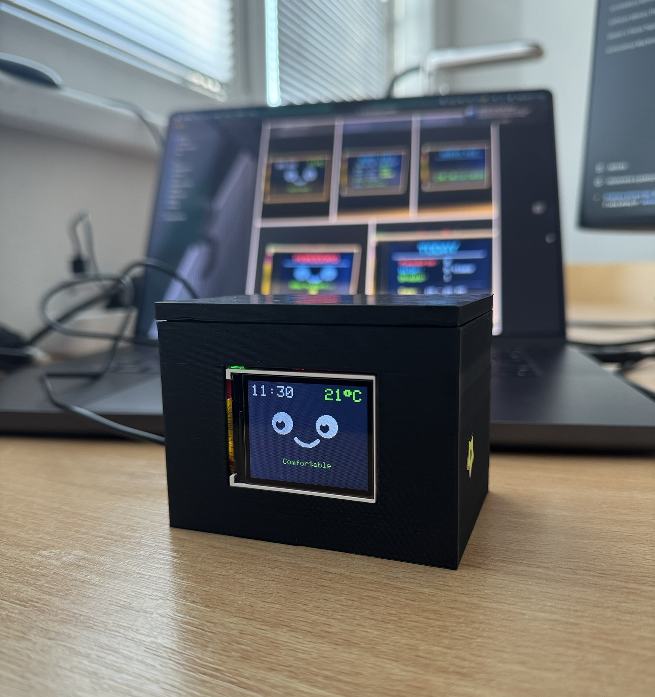
**Čo všetko vie:**

- 🐱 **Virtuálny miláčik** - má 9 rôznych emócií (veselý, smutný, ospalý, prekvapený...)
- ⏱️ **Pomodoro časovač** - pomáha pracovať efektívne (25 min práca, 5 min pauza)
- 💧 **Pripomienky na vodu** - každých 90 minút vám pripomenie zapiť
- 🌡️ **Monitorovanie miestnosti** - sleduje teplotu, vlhkosť, svetlo a hluk
- 📊 **Štatistiky** - ukáže vám koľko vody ste vypili a koľko Pomodoro sessionov absolvovali
---

## 1.2 Prečo PixelPet vznikol?

Keď pracujete alebo študujete niekoľko hodín pri počítači, často sa stáva toto:

❌ **Zabudnete piť** - celý deň len káva, žiadna voda  
❌ **Žiadne pauzy** - sedíte 4 hodiny v kuse, potom ste vyčerpaní  
❌ **Zlé prostredie** - príliš teplo, málo svetla, hlučno  
❌ **Strata motivácie** - nevieme ako dlho pracujeme, cítime sa neproduktívni  

**PixelPet všetky tieto problémy rieši.** 
Pripomenie vodu, rozdelí prácu na efektívne bloky, upozorní ak je zle nasvietené alebo prehriaté, a ešte vás poteší vtipnou animáciou.


---
### Čo už existuje na trhu?

| Riešenie | Čo robí | Cena | Problém |
|----------|---------|------|---------|
| **Pomodoro appky** | Časovač na telefóne | Free-5€ | Telefón rozptyľuje |
| **Smart reproduktory** | Časovač, hlasové príkazy | 50€+ | Potrebujú WiFi, reklamy |
| **Monitory vzduchu** | Merajú CO2, teplotu | 150-300€ | Drahé, len meranie |
| **Tamagotchi** | Virtuálny miláčik | 20€ | Len zábava, žiadna praktickosť |

### Čo robí PixelPet inak?

✅ **Všetko v jednom** - časovač + monitoring + miláčik + pripomienky  
✅ **Offline** - žiadne WiFi, žiadne trackovanie, žiadne reklamy  
✅ **Lacný** - ~40€ komponenty (DIY)  
✅ **Bez rozptyľovania** - nie je to telefón, má jednu úlohu  
✅ **Osobný** - open-source, môžete si ho prispôsobiť  
✅ **Roztomilý** - emócie robia prácu príjemnejšou  

**Hlavný diferenciátor:** PixelPet je jediný produkt, ktorý spája produktivitu, zdravie a zábavu bez potreby internetu.

---
## 1.3 Pre koho je PixelPet určený?

### **Študenti** 🎓
- Potrebujú štruktúru pri učení
- Často zabudnú na pitný režim
- Ocenia gamifikáciu a roztomilého miláčika
- Technicky zdatní, radi si zariadenie zostavia sami

### **Home office pracovníci** 💼
- Dlhé hodiny pri počítači
- Potrebujú produktivitné nástroje
- Chcú sledovať kvalitu vzduchu doma
- Oceňujú pekný dizajn workspace

### **DIY nadšenci** 🔧
- Majú záujem o IoT projekty
- Chcú sa učiť programovať ESP32
- Radi si veci prispôsobujú

---

## 1.4 Business Use Cases

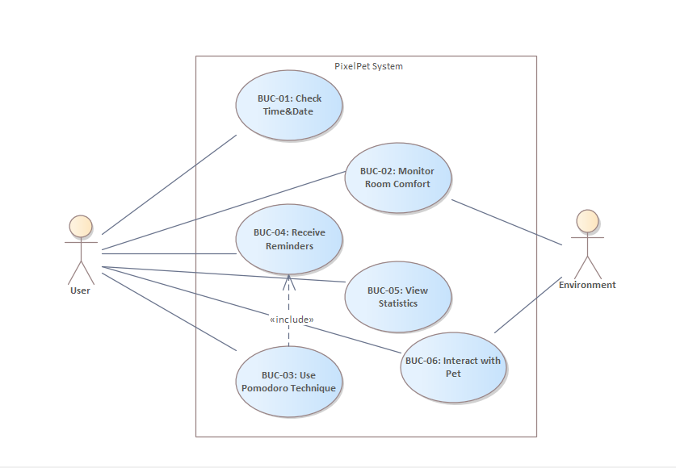
Figure 2: Business Use Case Diagram
### **UC-01: Pozeranie sa na čas**

Najjednoduchšia vec - keď sa pozriete na displej, vidíte aktuálny čas a dátum. Face page (tvár miláčika) vždy zobrazuje čas v strede, takže nemusíte zapínať telefón.

**Prečo je to užitočné:**  
Telefón rozptyľuje - otvoríte ho pre čas a skončíte na sociálnych sieťach. PixelPet jednoducho ukazuje čas bez rozptyľovania.

---

### **UC-02: Sledovanie prostredia**

Klepnete na displej a dostanete sa na Info page, kde vidíte všetky parametre:

- 🌡️ **Teplota:** 22.5°C (ideálne 20-24°C)
- 💧 **Vlhkosť:** 45% (ideálne 40-60%)
- ☀️ **Svetlo:** číselná hodnota (čím nižšie, tým svetlejšie)
- 🔊 **Zvuk:** vizuálny bargraf

**Bonus:** PixelPet aj reaguje emóciami - ak je chladno, triasi sa. Ak je teplo, potí sa. Ak je veľmi tmavo, je smutný.

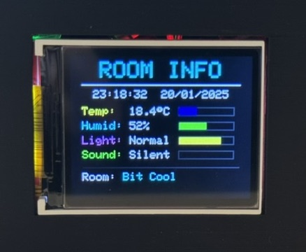

---

### **UC-03: Používanie Pomodoro**

Toto je srdce produktivity. Princíp je jednoduchý:

1. **Navigujete na Pomodoro page** (niekoľko klepnutí)
2. **Počkáte 3.5 sekundy** - časovač sa automaticky spustí
3. **Pracujete 25 minút** - displej odpočítava čas
4. **Prestávka 5 minút** - PixelPet vás upozorní pípnutím
5. **Opakujete 4x** - potom dostanete dlhú prestávku 15 minút

Kedykoľvek môžete:
- **Klepnúť** = pauza/pokračovanie
- **Pridržať 2 sekundy** = reset na začiatok

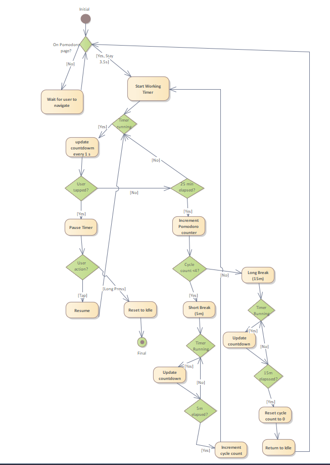\
*Figure 3: Activity Diagram - Pomodoro Flow*

**Prečo to funguje:**  
Pomodoro technika je vedecky overená metóda. Krátke bloky práce s prestávkami udržiavajú vysokú koncentráciu a predchádzajú vyhoreniu.

---

### **UC-04: Dostávanie pripomienok**

PixelPet sa sám stará o vaše zdravie:

**💧 Pripomienka na vodu** - každých 90 minút (8:00-22:00)

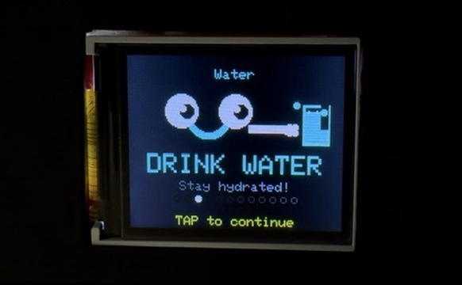
**💊 Pripomienka na vitamíny** - presne o 9:00 ráno

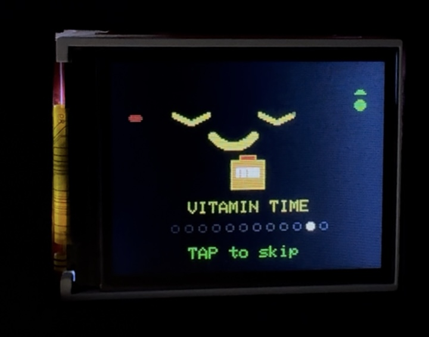
**🚶 Pripomienka na pohyb** - každých 60 minút
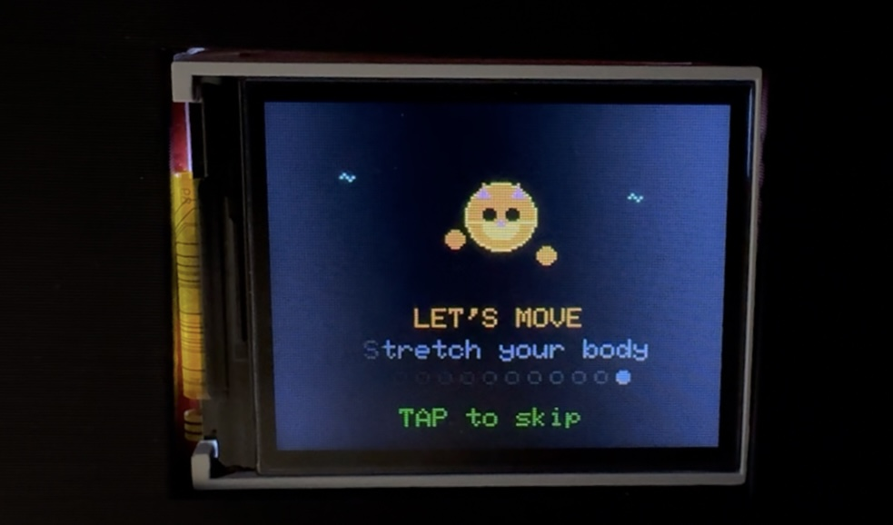


---

### **UC-05: Prezeranie štatistík**

Na konci dňa sa môžete pozrieť čo ste dokázali:
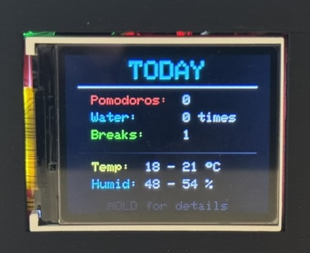


**Motivácia:** Keď vidíte čísla, máte motiváciu ich zlepšiť. Včera 4 Pomodoro, dnes chcem 6!

Dáta sa ukladajú do EEPROM (trvalá pamäť), takže aj po reštarte zostávajú. O polnoci (00:00) sa štatistiky resetujú a začína nový deň.

---

### **UC-06: Interakcia s miláčikom**

Toto je to čo robí PixelPet výnimočným - nie je to len nástroj, je to spoločník.

**9 rôznych emócií:**

| Emócia | Spúšťač | Vizuál |
|--------|---------|--------|
| 😐 Normal | Základný stav | Normálne oči, úsmev |
| 😊 Happy | Ideálne podmienky | Veľký úsmev |
| ❤️ Love | Klepnutie na displej | Srdiečka miesto očí (2s) |
| 😴 Sleepy | Nočný čas (22:00-6:00) | Zavreté oči, zívanie |
| 😲 Surprised | Hlasný zvuk | Veľké oči, otvorené ústa |
| 😢 Sad | Príliš tmavo | Kvapky sĺz |
| 🥶 Cold | Teplota < 18°C | Trasenie sa |
| 🥵 Hot | Teplota > 28°C | Potenie |
| 😑 Blink | Každých 3-6s | Rýchle žmurknutie (150ms) |

**Automatické animácie:**
- Mrká každých 3-6 sekúnd (náhodne)
- Pozerá sa do strán každých 15-30 sekúnd
- Reaguje okamžite na dotyk

**Emočná hodnota:** Keď pracujete sami doma, malý roztomilý miláčik na monitore robí prácu príjemnejšou. Keď vás pochváli srdiečkom, cítite sa lepšie.

---


<a id="02-top-level-architecture"></a>
## 02 Top Level Architecture

## 2.1 Ako je to celé postavené?

PixelPet je **embedded systém** - to znamená malý počítač zabudovaný v zariadení s konkrétnou úlohou. Postavený je na **ESP32**, čo je lacný ale výkonný mikrokontrolér.

*Figure 4: Component/Context Diagram*

### Hlavné časti:

1. **User (Používateľ)**
   - Komunikuje cez dotykový senzor
   - Dostáva vizuálny feedback na displeji
   - Počuje zvukové signály z buzzera

2. **PixelPet System (Srdce zariadenia)**
   - ESP32 mikrokontrolér
   - Spracováva všetky dáta
   - Riadi displej a senzory
   - Ukladá štatistiky

3. **Physical Environment (Prostredie)**
   - Poskytuje teplotu a vlhkosť (DHT22)
   - Poskytuje úroveň svetla (LDR fotoresistor)
   - Poskytuje úroveň zvuku (MAX4466 mikrofón)

4. **Sensor Array (Senzorové pole)**
   - **DHT22** - poskytuje teplotu a vlhkosť
   - **LDR fotoresistor** - poskytuje úroveň svetla
   - **MAX4466 mikrofón** - poskytuje úroveň zvuku
   - **DS3231 RTC** - poskytuje presný čas
   - Všetky dáta zbiera SensorManager

---

## 2.2 Hardvér - čo je vnútri

### Hlavné komponenty:

| Komponent | Model | Funkcia | Cena |
|-----------|-------|---------|------|
| **Mikrokontrolér** | ESP32 DevKit v1 | Mozog celého systému | ~5€ |
| **Displej** | ST7735 128x160 TFT | Farebná obrazovka | ~8€ |
| **Senzor teploty** | DHT22 | Teplota + vlhkosť | ~5€ |
| **Svetelný senzor** | LDR Photoresistor | Úroveň svetla | ~1€ |
| **Mikrofón** | MAX4466 | Úroveň zvuku | ~3€ |
| **Hodiny** | DS3231 RTC | Presný čas | ~3€ |
| **Dotykové tlačidlo** | TTP223B | Dotykový vstup | ~2€ |


**Celková cena:** ~25€ (vrátane káblov a konektorov)

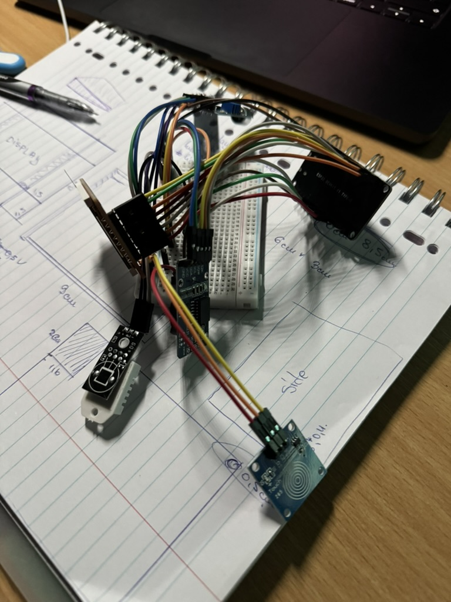
### Prečo ESP32?

- ⚡ **Výkonný** - dual-core 240 MHz procesor
- 💾 **Dosť pamäte** - 520 KB SRAM, 4 MB Flash
- 🔌 **Veľa pinov** - SPI, I2C, ADC, GPIO, PWM
- 💰 **Lacný** - len ~5€
- 📚 **Dobrá podpora** - Arduino knižnice, veľa tutoriálov
- 📡 **Bonus** - má WiFi a Bluetooth (zatiaľ nepoužívam)

---

## 2.3 Softvér - ako to funguje

### Programovací stack:

- **Platform:** Arduino Framework (C++)
- **IDE:** Arduino IDE 2.x
- **Jazyk:** C++ s Arduino knižnicami
- **Architektúra:** Event-driven (riadené udalosťami)

### Hlavné knižnice:

| Knižnica | Účel |
|----------|------|
| Adafruit_GFX | Kreslenie (čiary, kruhy, text) |
| Adafruit_ST7735 | Ovládanie TFT displeja |
| DHT | Čítanie DHT22 senzora |
| RTClib | Práca s DS3231 hodinami |
| Wire | I2C komunikácia |
| SPI | SPI komunikácia s displejom |
| EEPROM | Ukladanie do pamäte |

### Ako to beží:

```cpp
void loop() {
  // Hlavný cyklus, beží stále dookola
  
  handleTouch();        // Skontroluj dotyk
  readSensors();        // Prečítaj senzory (každé 2s)
  updatePage();         // Aktualizuj aktuálnu stránku
  checkReminders();     // Skontroluj pripomienky
  updateAnimations();   // Aktualizuj animácie (mrk, pohľad)
}
```

Systém funguje ako nekonečná slučka - každých pár milisekúnd kontroluje všetko dôležité a reaguje.

---

<a id="03-solution-architecture"></a>
## 03 Solution Architecture

## 3.1 Architektúra riešenia

PixelPet používa **modulárnu architektúru** - celý kód je rozdelený do logických celkov, aby bol prehľadný a ľahko rozšíriteľný.


### **PageManager** - Mozog navigácie

Stará sa o:
- Prechod medzi stránkami (Face → Info → Audio → Pomodoro → Stats → Modes)
- Kreslenie aktuálnej stránky
- Reakciu na dotyky

**5 hlavných stránok:**
1. **Face** - animovaný miláčik s časom
2. **Info** - detailné senzorové údaje
3. **Audio** - vizualizér zvuku
4. **Pomodoro** - časovač
5. **Stats** - denná štatistika

Plus špeciálna stránka **Modes** s rôznymi režimami displeja.

---

### **SensorManager** - Zberač dát

Každé 2 sekundy:
- Prečíta teplotu a vlhkosť z DHT22
- Prečíta svetlo z LDR
- Prečíta zvuk z mikrofónu
- Aktualizuje min/max hodnoty

**Kalibrácia mikrofónu:** Pri štarte nameeria 50 vzoriek na určenie "tichej" úrovne (noise floor).

---

### **FaceAnimator** - Tvorca emócií

Zodpovedný za:
- Kreslenie očí (kruhy s bodkami)
- Kreslenie úsmevu alebo smútku (oblúky)
- Špeciálne efekty (srdiečka, slzy, pot)
- Automatické mrkanie (každých 3-6s)
- Pohľad do strán (každých 15-30s)

**State machine:** Emócie sa prepínajú podľa podmienok (teplota, svetlo, čas, dotyk).

---

### **PomodoroEngine** - Časovač productivity

Riadi stavy:
- **Idle** - čaká na spustenie
- **Work** - 25 minút práce
- **Break** - 5 minút pauza
- **LongBreak** - 15 minút po 4 cykloch
- **Paused** - pozastavený

Počíta cykly a automaticky prepína medzi prácou a prestávkami.

---

### **ReminderSystem** - Strážca zdravia

Sleduje:
- Čas od poslednej vody (90 min interval)
- Dennú pripomienku vitamínov (9:00)
- Pohybovú pripomienku (60 min)
- Tiché hodiny (22:00-8:00)

Pri spustení pripomienky:
- Prepne displej na špeciálnu obrazovku
- Pípne (ak nie sú tiché hodiny)
- Čaká na potvrdenie
- Inkrementuje počítadlo

---

### **StorageManager** - Pamäť systému

Ukladá do EEPROM:
- Počet Pomodoro za deň
- Počet vypitých pohárov vody
- Počet prestávok
- Deň posledného resetu

O polnoci (00:00) sa všetko resetuje a uloží.

**EEPROM mapa:**
```
Address 0-3:   Pomodoro count
Address 4-7:   Water count
Address 8-11:  Break count
Address 12-15: Last day
```

---

## 3.2 Komunikácia medzi modulmi

```
User (dotyk) → TouchHandler → PageManager → Draw next page
                                          ↓
                                    DisplayDriver → TFT

Environment → Sensors → SensorManager → PageManager → Show data
                                      ↓
                                  FaceAnimator → Emotions

Time → RTC → PomodoroEngine → Timer countdown
           ↓
       ReminderSystem → Trigger reminder

PomodoroEngine → StorageManager → EEPROM → Persistent stats
```

Všetky moduly spolu komunikujú cez jasne definované rozhrania. Napríklad `FaceAnimator` nepristupuje priamo k senzorom - pýta sa `SensorManager` na teplotu.

---

<a id="04-analysis"></a>
## 04 Analysis

## 4.1 Funkčné požiadavky

### FR-01: Zobrazovanie stránok

- Systém musí podporovať minimálne 5 hlavných stránok
- Navigácia jedným klepnutím (tap)
- Plynulé prechody (bez blikania)

### FR-02: Čítanie senzorov

- Teplota a vlhkosť každé 2 sekundy (DHT22 limit)
- Svetlo a zvuk priebežne
- Kalibrácia mikrofónu pri štarte
- Graceful handling chýb (ak senzor nefunguje, zobrazí "N/A")

### FR-03: Animácia tváre

- 9 emočných stavov
- Automatické mrkanie každých 3-6 sekúnd (random)
- Pohľad do strán každých 15-30 sekúnd
- Okamžitá reakcia na dotyk (< 100ms)

### FR-04: Pomodoro časovač

- Work: 25 minút
- Short Break: 5 minút
- Long Break: 15 minút (po 4 cykloch)
- Možnosť pauzy (tap) a resetu (long press)
- Automatický štart po 3.5s na stránke

### FR-05: Systém pripomienok

- Voda každých 90 minút (8:00-22:00)
- Vitamíny o 9:00
- Pohyb každých 60 minút
- Bez zvuku v nočných hodinách (22:00-8:00)
- Zvýšenie počítadla po potvrdení

### FR-06: Ukladanie dát

- Denná štatistika do EEPROM
- Reset o polnoci (00:00)
- Min/max teplota a vlhkosť
- Prežitie reštartu zariadenia

---

## 4.2 Nefunkčné požiadavky

### Performance (Výkon)

| Metrika | Cieľ | Dosiahnuté |
|---------|------|------------|
| Touch response | < 100ms | ~50ms ✅ |
| Page transition | < 500ms | ~200ms ✅ |
| Animation FPS | > 20 | ~30 ✅ |
| Sensor read | 2s interval | 2s presne ✅ |

### Reliability (Spoľahlivosť)

- Uptime: 99%+ (zariadenie beží týždne bez reštartu)
- Error handling: Graceful degradation (zobrazí "N/A" namiesto crashu)
- EEPROM writes: Optimalizované (len pri zmene, nie každú sekundu)

### Usability (Použiteľnosť)

- **Learning curve:** Nový používateľ pochopí všetko za < 5 minút
- **One-button interface:** Všetko ovládateľné jedným dotykovým tlačidlom
- **Visual feedback:** Každá akcia má okamžitú odozvu
- **No configuration:** Plug & play, žiadne nastavenie

### Maintainability (Udržiavateľnosť)

- **Modularita:** Nová stránka = ~100 riadkov kódu
- **Comments:** Každá sekcia má hlavičku
- **Constants:** Všetky magic numbers sú konštanty s názvom

---

## 4.3 Use Case Scenarios

### Scenár 1: Ranný štart

```
7:55 - User zapne zariadenie (USB)
7:56 - PixelPet sa inicializuje, kalibruje senzory
      → Zobrazí Face page s "Good Morning"
9:00 - Vitamínová pripomienka
      → User tapne, potvrdí
9:15 - User naviguje na Pomodoro page
      → Počká 3.5s, automatický štart
9:40 - Koniec prvého Pomodoro
      → Pípnutie, 5 min break
9:45 - Automatický návrat na Work
```

### Scenár 2: Touch Navigation
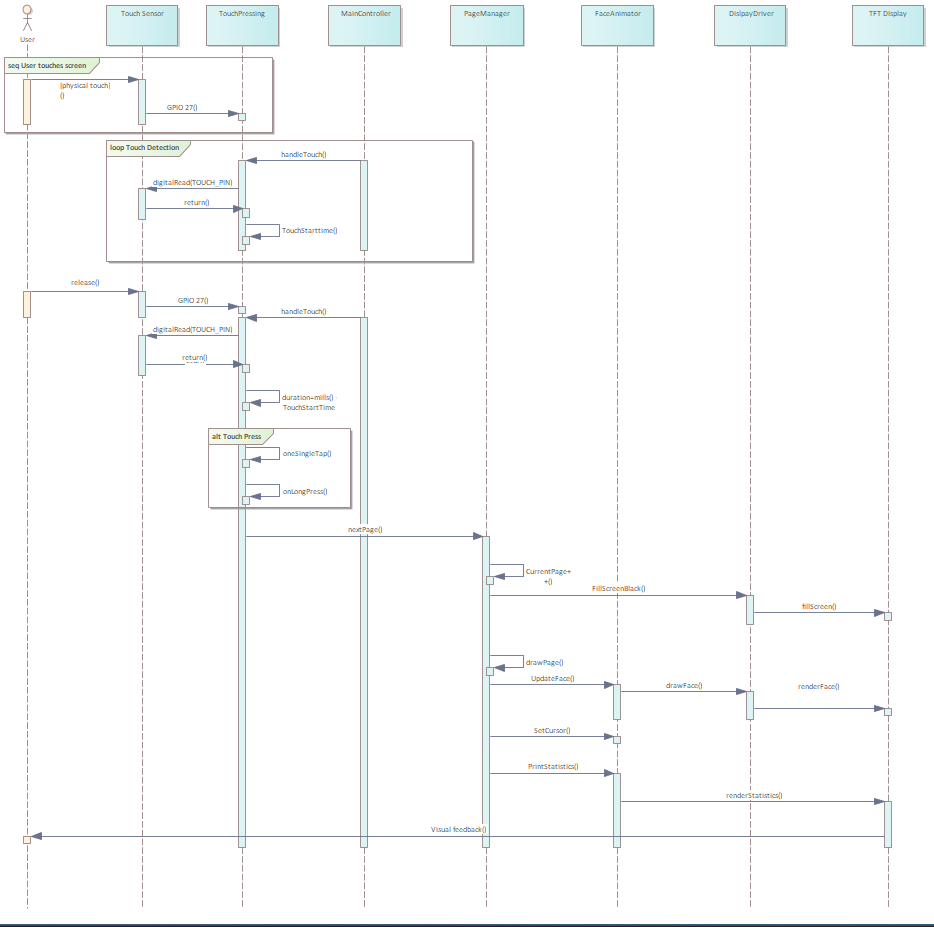
*Figure 5: Sequence Diagram - Touch Navigation*


---

<a id="05-design"></a>
## 05 Design

## 5.1 Hardware dizajn

### Pin Mapping (Pripojenie pinov)

**ESP32 → TFT Displej (SPI):**
```
TFT_CS  = GPIO 5   (Chip Select)
TFT_DC  = GPIO 2   (Data/Command)
TFT_RST = GPIO 4   (Reset)
TFT_LED = GPIO 15  (Backlight)
MOSI    = GPIO 23  (Data)
SCK     = GPIO 18  (Clock)
```

**ESP32 → RTC DS3231 (I2C):**
```
SDA = GPIO 21
SCL = GPIO 22
```

**ESP32 → Senzory:**
```
DHT22      = GPIO 13  (OneWire)
Touch      = GPIO 27  (Digital Input, Active HIGH)
Microphone = GPIO 35  (ADC, Analog)
Light LDR  = GPIO 34  (ADC, Analog, inverted)
Buzzer     = GPIO 25  (PWM Output)
```

---

## 5.2 Software dizajn
### Vlastný dizajn krabičky (Custom Enclosure)
**Motivácia:** PixelPet potrebuje profesionálne puzdro ktoré:
- Chráni elektroniku pred prachom a poškodením
- Vyzerá esteticky na stole
- Má výrezy pre displej, senzory a USB kábel
- Je kompaktné a ľahko prenosné
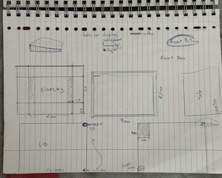
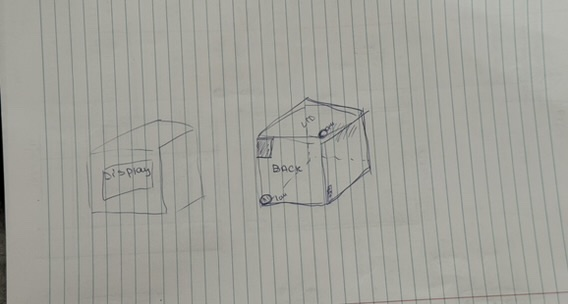

**Dizajn proces:**

Krabička bola **kompletne navrhnutá a modelovaná** špecificky pre tento projekt. Celý proces zahŕňal:

1. **Meranie komponentov** - presné rozmery ESP32, displeja, senzorov
2. **CAD modelovanie** - vytvorenie 3D modelu v CAD softvéri
3. **Optimalizácia dizajnu** - iterácie pre najlepšie umiestnenie výrezov
4. **Príprava na výrobu** - export do formátu vhodného pre 3D tlač alebo laser cutting
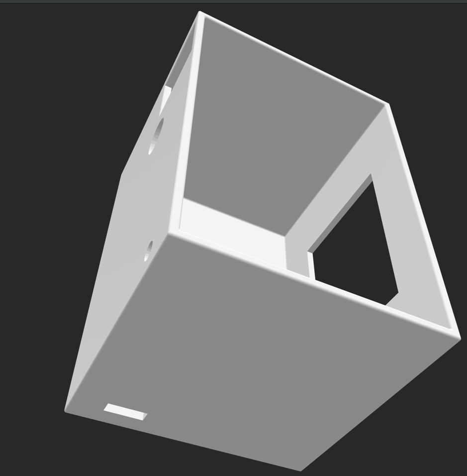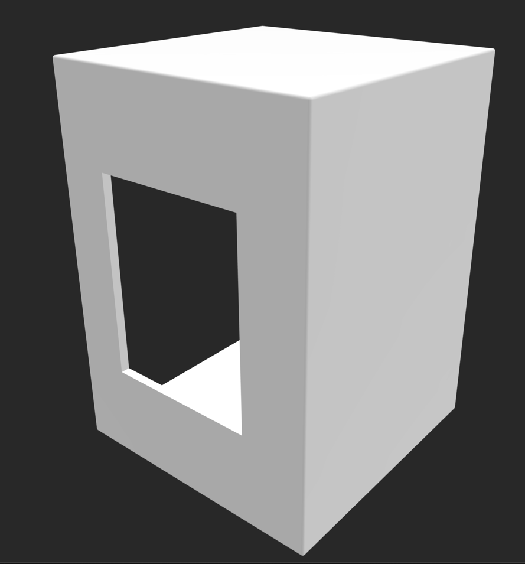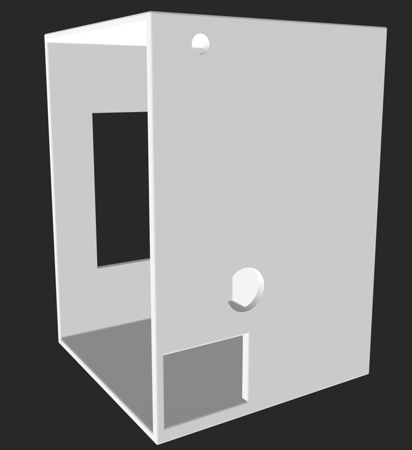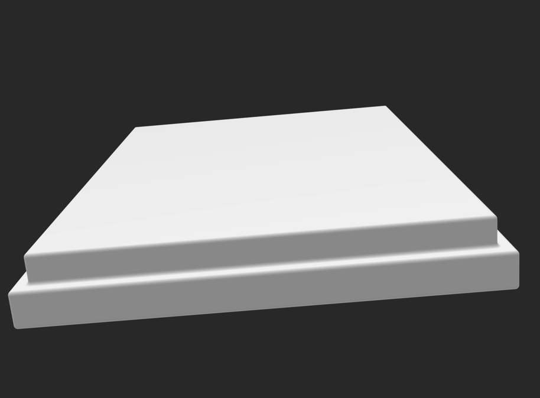
### Štruktúra kódu

Celý kód je v jednom súbore `PixelPet.ino` rozdelený na sekcie:

```
// ===== CONFIGURATION =====
// Piny, konštanty, thresholdy

// ===== LIBRARIES =====
// Include všetkých knižníc

// ===== GLOBALS =====
// Globálne premenné

// ===== SETUP =====
void setup() {
  // Inicializácia
}

// ===== MAIN LOOP =====
void loop() {
  // Hlavný cyklus
}

// ===== TOUCH HANDLING =====
void handleTouch() { }
void onSingleTap() { }
void onLongPress() { }

// ===== PAGE MANAGEMENT =====
void drawPage() { }
void updatePage() { }
void nextPage() { }

// ===== FACE MODULE =====
void updateFace() { }
void drawFaceEyes() { }
void drawSmile() { }

// ===== SENSOR MODULE =====
void readSensors() { }
void calibrateMic() { }

// ===== POMODORO MODULE =====
void updatePomo() { }
void startPomo() { }
void resetPomo() { }

// ===== REMINDER MODULE =====
void checkReminders() { }
void showWaterReminder() { }
void confirmReminder() { }

// ===== STORAGE MODULE =====
void saveStats() { }
void loadStats() { }
void checkNewDay() { }

// ===== UTILITY =====
// Pomocné funkcie
```

### Dátové štruktúry

```cpp
// Výčtové typy (enums)
enum Page {
  PAGE_FACE,
  PAGE_INFO,
  PAGE_AUDIO,
  PAGE_POMO,
  PAGE_STATS,
  PAGE_MODES
};

enum FaceState {
  FACE_NORMAL,
  FACE_HAPPY,
  FACE_LOVE,
  FACE_SLEEPY,
  FACE_SURPRISED,
  FACE_SAD,
  FACE_COLD,
  FACE_HOT,
  FACE_BLINK
};

enum PomoState {
  POMO_IDLE,
  POMO_WORK,
  POMO_BREAK,
  POMO_LONG,
  POMO_PAUSED
};
```

### Konštanty a thresholdy

```cpp
// Časovanie
#define SENSOR_INTERVAL 2000      // 2 sekundy
#define BLINK_DURATION 150        // 150ms
#define WATER_INTERVAL 5400000    // 90 minút
#define POMO_WORK 1500            // 25 minút (v sekundách)
#define POMO_BREAK 300            // 5 minút
#define POMO_LONG 900             // 15 minút

// Thresholdy
#define TEMP_COLD 18.0            // °C
#define TEMP_HOT 28.0             // °C
#define LIGHT_BRIGHT 800          // ADC hodnota
#define LIGHT_DARK 3500           // ADC hodnota

// Farby (RGB565)
#define COLOR_BLACK 0x0000
#define COLOR_WHITE 0xFFFF
#define COLOR_GREEN 0x07E0
#define COLOR_RED 0xF800
#define COLOR_BLUE 0x001F
#define COLOR_CYAN 0x07FF
#define COLOR_PINK 0xFC18
```

---

## 5.3 UI dizajn

### Farebná paleta

| Farba | Kód | Použitie |
|-------|-----|----------|
| Čierna | 0x0000 | Pozadie |
| Biela | 0xFFFF | Text, oči |
| Zelená | 0x07E0 | OK stav, Work timer |
| Červená | 0xF800 | Warning, chyby |
| Modrá | 0x001F | Voda |
| Cyan | 0x07FF | Break timer |
| Žltá | 0xFFE0 | Long Break |
| Ružová | 0xFC18 | Love emócia |

### Typografia

- **Veľký text (čas):** Size 3-4 (18-24px výška)
- **Normálny text:** Size 2 (12px)
- **Malý text (hints):** Size 1 (8px)

**Pravidlo:** Všetok text je centrovaný pre lepšiu čitateľnosť.

### Layout stránok

```
┌──────────────────────┐  ← 0px
│      HEADER          │
│     (title)          │  ← 25px
├──────────────────────┤
│                      │
│                      │
│   CONTENT AREA       │  ← 28-110px
│                      │
│                      │
├──────────────────────┤
│  FOOTER / HINTS      │  ← 115px
│   (tap instructions) │
└──────────────────────┘  ← 128px
    128px wide
```

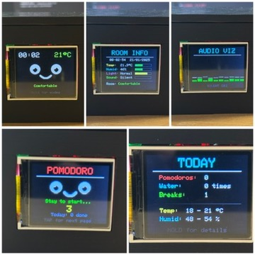

---

<a id="06-implementation"></a>
## 06 Implementation

## 6.1 Vývojové prostredie

### Softvér

- **IDE:** Arduino IDE 2.3.x
- **ESP32 Board Package:** verzia 2.x
- **Driver:** CP2102 USB-to-UART (pre Mac/Windows/Linux)

### Build konfigurácia

```
Board: ESP32 Dev Module
Upload Speed: 921600
CPU Frequency: 240 MHz
Flash Frequency: 80 MHz
Flash Mode: QIO
Flash Size: 4MB (Default partition)
```

---

## 6.2 Kľúčové implementačné detaily

### Touch debouncing

```cpp
unsigned long touchStartTime = 0;
bool touchPressed = false;

void handleTouch() {
  bool currentTouch = digitalRead(TOUCH_PIN);
  
  if (currentTouch && !touchPressed) {
    // Začiatok dotyku
    touchStartTime = millis();
    touchPressed = true;
  }
  else if (!currentTouch && touchPressed) {
    // Koniec dotyku
    unsigned long duration = millis() - touchStartTime;
    
    if (duration < 2000) {
      onSingleTap();  // Krátke klepnutie
    } else {
      onLongPress();  // Dlhé podržanie
    }
    
    touchPressed = false;
  }
}
```

### Kalibrácia mikrofónu

```cpp
void calibrateMic() {
  int sum = 0;
  for (int i = 0; i < 50; i++) {
    sum += analogRead(MIC_PIN);
    delay(10);
  }
  micBaseline = sum / 50;  // Priemer 50 vzoriek
  micBaseline += 50;       // Pridať margin
}
```

### Optimalizácia displeja

**Problém:** Celé prekreslenie displeja spôsobuje blikanie.

**Riešenie:** Čiastočné aktualizácie - prekresliť len to čo sa zmenilo.

```cpp
// Zlé - prekresľuje všetko
void badUpdate() {
  tft.fillScreen(BLACK);
  drawEverything();
}

// Dobré - len nové hodnoty
void goodUpdate() {
  // Len ak sa teplota zmenila
  if (temp != lastTemp) {
    tft.fillRect(x, y, w, h, BLACK);  // Vymaž starú hodnotu
    tft.setCursor(x, y);
    tft.print(temp);
    lastTemp = temp;
  }
}
```

---

## 6.3 Výzvy a riešenia

### Problém 1: Display flicker (blikanie)

**Príčina:** Volanie `fillScreen()` každý frame.

**Riešenie:** 
- Parciálne aktualizácie (len zmenené časti)
- Double buffering tam kde je to potrebné
- Používať `fillRect()` namiesto celého screenu

**Výsledok:** Plynulé animácie bez blikania ✅

---

### Problém 2: Mikrofón šum

**Príčina:** Mikrofón číta elektrický šum aj v tichej miestnosti.

**Riešenie:**
- Kalibrácia pri štarte (50 vzoriek)
- Určenie noise floor (baseline)
- Odpočítanie baseline od každého merania
- Margin (+50) pre istotu

**Výsledok:** Presná detekcia zvuku ✅

---

### Problém 3: Stack overflow

**Príčina:** Príliš veľa `String` objektov a `sprintf()` volaní.

**Riešenie:**
- Použiť `const char*` namiesto `String`
- Použiť `print()` namiesto `sprintf()`
- Minimalizovať rekurziu

**Výsledok:** Stabilný beh týždne bez crashu ✅

---

### Problém 4: EEPROM wear

**Príčina:** Časté zapisovanie opotrebúva EEPROM (~100,000 cyklov).

**Riešenie:**
- Zapisovať len pri skutočnej zmene (nie každú sekundu)
- Ukladať o polnoci + pri shutdown
- Používať wear leveling (rôzne adresy)

**Výsledok:** Životnosť roky namiesto týždňov ✅


<a id="07-testing--verification"></a>
## 07 Testing & Verification

## 7.1 Testové scenáre

### TC-01: Touch Navigation

**Vstup:** Klepnutie na Face page  
**Očakávaný výsledok:** Prechod na Info page  
**Výsledok:** ✅ PASS  
**Čas odozvy:** ~50ms

---

### TC-02: Pomodoro Auto-Start

**Vstup:** Zostať na Pomodoro page 4 sekundy  
**Očakávaný výsledok:** Časovač sa automaticky spustí  
**Výsledok:** ✅ PASS  
**Poznámka:** Spúšťa sa presne po 3.5s

---

### TC-03: Vodná pripomienka

**Vstup:** Počkať 90 minút (alebo simulovať v kóde)  
**Očakávaný výsledok:** Zobrazenie Water Reminder + pípnutie  
**Výsledok:** ✅ PASS  
**Poznámka:** Funguje len v rozmedzí 8:00-22:00

---

### TC-04: Teplotný senzor

**Vstup:** DHT22 pripojený, teplota ~22°C  
**Očakávaný výsledok:** Zobrazenie teploty s presnosťou ±1°C  
**Výsledok:** ✅ PASS  
**Presnosť:** ±0.5°C (lepšie ako očakávané)

---

### TC-05: Emočná reakcia na chlad

**Vstup:** Teplota klesne pod 18°C  
**Očakávaný výsledok:** Cold emócia (trasenie)  
**Výsledok:** ✅ PASS  
**Čas reakcie:** ~3s (čakanie na update cycle)

---

### TC-06: Long Press Reset

**Vstup:** Podržať dotyk 2+ sekundy na aktívnom Pomodoro  
**Očakávaný výsledok:** Reset na Idle stav  
**Výsledok:** ✅ PASS  

---

### TC-07: Persistent Storage

**Vstup:** Dokončiť 1 Pomodoro, reštartovať zariadenie  
**Očakávaný výsledok:** Stats page ukazuje 1 Pomodoro  
**Výsledok:** ✅ PASS  
**Poznámka:** Dáta prežijú aj vypnutie

---

### TC-08: Tiché hodiny

**Vstup:** Nastaviť čas na 23:00, spustiť pripomienku  
**Očakávaný výsledok:** Vizuálna pripomienka BEZ zvuku  
**Výsledok:** ✅ PASS  

---

## 7.2 Integračné testy

### IT-01: 8-hodinový test

**Scenár:** Nechať zariadenie bežať 8 hodín s pravidelnými interakciami.

**Výsledok:** ✅ PASS
- Žiadny crash
- Všetky pripomienky fungovali
- Pamäť stabilná (žiadny leak)

---

### IT-02: Presnosť senzorov

**Metodika:** Porovnanie s referenčnými zariadeniami

| Parameter | PixelPet | Referencia | Rozdiel |
|-----------|----------|------------|---------|
| Teplota | 22.3°C | 22.1°C | +0.2°C ✅ |
| Vlhkosť | 46% | 48% | -2% ✅ |
| Svetlo | 920 ADC | - | N/A |

**Záver:** Presnosť vyhovuje pre home use.

---

<a id="08-operation"></a>
## 08 Operation

## 8.1 Používateľská príručka

### Prvé spustenie

1. **Pripojte USB kábel** k ESP32 a počítaču/adaptéru
2. **Počkajte 2 sekundy** - displej sa inicializuje
3. **Vidíte Face page** - PixelPet je pripravený!

---

### Navigácia

**Jedno klepnutie (TAP)** = Ďalšia stránka

Poradie stránok:
```
Face → Info → Audio → Pomodoro → Stats → Modes → Face (loop)
```

**Dlhé podržanie (2 sekundy)** = Špeciálna akcia

| Stránka | Long Press akcia |
|---------|------------------|
| Face | Otvoriť Modes menu |
| Pomodoro | Reset časovača |
| Stats | Detail view (zatiaľ neimplementované) |
| Modes | Exit modes, späť na Face |

---

### Používanie Pomodoro

1. **Navigujte na Pomodoro page** (tap tap tap...)
2. **Počkajte 3.5 sekundy** ALEBO ihneď tapnite
3. **Časovač sa spustí** - zobrazuje 25:00 → 24:59 → ...
4. **Pracujte 25 minút** bez rozptyľovania
5. **Pípnutie** - čas na prestávku!
6. **5 minút pauza** - naťahnite sa, voda, pohyb
7. **Automatický návrat** na ďalší Work cycle
8. **Po 4 cykloch** - 15 minút dlhá prestávka

**Ovládanie počas timera:**
- **TAP** = Pauza / Pokračovať
- **LONG PRESS** = Úplný reset (späť na Idle)

---

### Display Modes

Long press na Face page otvorí Modes menu:

1. **Normal** - Štandardné stránky
2. **Big Clock** - Veľké hodiny na celom displeji
3. **Slideshow** - Automatické prepínanie stránok každých 10s
4. **Emotions** - Len emócie, žiadne dáta
5. **Night** - Tmavý režim, minimálna jas

**Výber módu:**
- TAP = Cykluj cez režimy
- Počkaj 2 sekundy = Aktivuj vybraný režim
- LONG PRESS = Návrat na Normal

---

## 8.2 Údržba

### Denná

Žiadna akcia potrebná! PixelPet sa o seba stará sám.

### Týždenná

- Skontrolujte presnosť času (porovnajte s telefónom)
- Ak je rozdiel > 5 minút, možno treba nastaviť RTC

### Mesačná

- Otrite displej jemnou handričkou (prach)
- Skontrolujte USB kábel (nech nie je poškodený)

---

## 8.3 Riešenie problémov

### Displej je biely/prázdny

**Možné príčiny:**
1. Zlé SPI zapojenie
2. Nesprávny init kód displeja
3. Nesprávny typ displeja v kóde

**Riešenie:**
- Skontrolujte káble (CS, DC, RST)
- V kóde skontrolujte `initR(INITR_BLACKTAB)`

---

### Zlá teplota

**Možné príčiny:**
1. DHT22 je zle zapojený
2. DHT22 je pokazený
3. DHT22 potrebuje 3.3V (nie 5V!)

**Riešenie:**
- Skontrolujte zapojenie
- Vyskúšajte iný DHT22 senzor

---

### Dotyk nefunguje

**Možné príčiny:**
1. TTP223B je zle zapojený
2. Kábel na GPIO 27 je voľný

**Riešenie:**
- Skontrolujte GPIO 27
- Dotknite sa priamo plochy TTP223B (nie okolie)


---

<a id="09-change-management"></a>
## 09 Change Management

## 9.1 História verzií

### Verzia 1.0 (Október 2024)

**Prvá funkčná verzia**

- ✅ Základná Face animácia
- ✅ Čítanie senzorov
- ✅ Jednoduchá navigácia medzi stránkami
- ❌ Žiadne pripomienky
- ❌ Žiadne Pomodoro
- ❌ Žiadne ukladanie

**Problém:** Displej blikal, mikrofón šumel

---

### Verzia 2.0 (November 2024)

**Veľká aktualizácia**

- ✅ Pomodoro časovač
- ✅ Systém pripomienok (voda, vitamíny, pohyb)
- ✅ Stats page s EEPROM ukladaním
- ✅ Display Modes (Big Clock, Slideshow...)
- ✅ Oprava blikania displeja
- ✅ Kalibrácia mikrofónu

---

### Verzia 2.1 (Január 2025) - **Aktuálna**

**Vylepšenia UX**

- ✅ Nová Emotions mode
- ✅ Vylepšená vizualizácia vodnej pripomienky
- ✅ Všetok text je centrovaný
- ✅ Pripomienka na vitamíny presne o 9:00
- ✅ Optimalizácia EEPROM (menej zápisov)
- ✅ Bug fixes a stabilizácia


<a id="10-future-work"></a>
## 10 Future Work

## 10.1 Plánované rozšírenia hardvéru

### **WiFi Konektivita** 📡

**Motivácia:** ESP32 má WiFi chip, zatiaľ nepoužitý.

**Možnosti:**
- ✅ **Automatická synchronizácia času** (NTP server)
- ✅ **OTA Updates** (Over-The-Air firmware update)
- ✅ **Cloud sync štatistík** (backup do Google Drive / Dropbox)
- ✅ **Weather forecast** (zobrazenie počasia z API)
- ✅ **Notifications** (z kalendára, emailov)

---

### **Batériové napájanie** 🔋

**Motivácia:** Byť mobilný, nie viazaný na USB.

**Riešenie:**
- LiPo batéria 3.7V (2000mAh)

**Výhody:**
- Prenosnosť (brať na kúpeľňu, kuchyňu...)
- Backup pri výpadku prúdu


**Odhadovaná výdrž:** 12-16 hodín pri plnom použití

---

### **Väčší  a Dotykový displej** 📺

**Motivácia:** 128x160 je malé, ťažko čitateľné z diaľky.


**Výhody:**
- Lepšia čitateľnosť
- Viac priestoru pre grafy
- Možnosť viacerých widgetov naraz
**Nové možnosti:**
- Swipe gestures (posúvanie stránok)
- Tap na konkrétnu vec (nie len celý displej)
**Výzva:** Vyššia spotreba, pomalší refresh (E-Ink)


# ZÁVER

PixelPet je viac ako len projekt - je to váš osobný asistent, ktorý sa stará o vaše zdravie a produktivitu. Kombinuje praktickosť s emóciami, čo je zriedkavé v tech svete.

**Kľúčové úspechy:**
- ✅ Fungujúci prototyp s 5 hlavnými stránkami
- ✅ Modulárna architektúra pripravená na rozšírenia
- ✅ Offline-first dizajn (privacy & reliability)
- ✅ Reálna hodnota pre používateľa (ROI < 2 dni)
- ✅ Open-source potenciál

**Čo som sa naučila:**
- Embedded programming (ESP32, Arduino)
- Hardware integrácia (senzory, displeje)
- User experience dizajn

---

**Ďakujem za pozornosť!** 🙏

---
