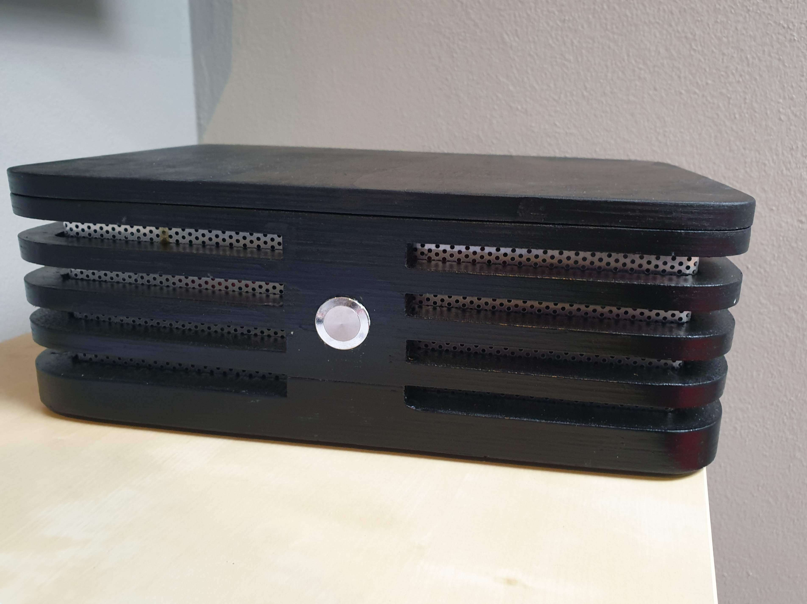
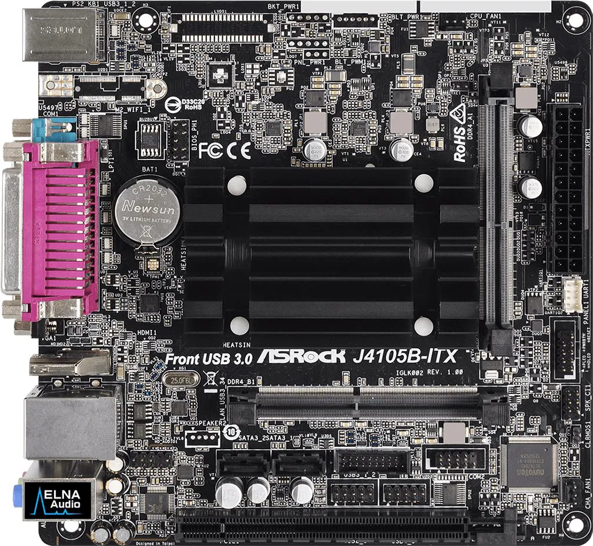
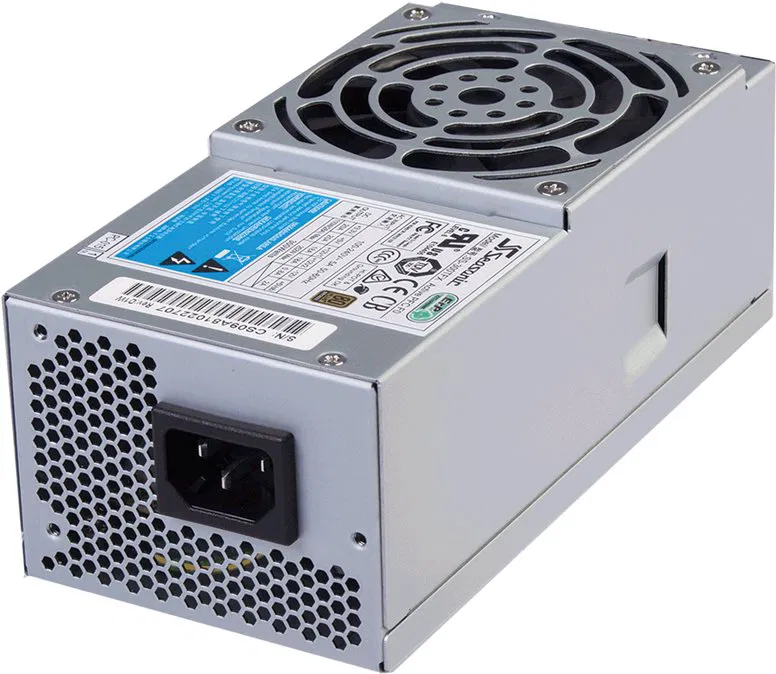
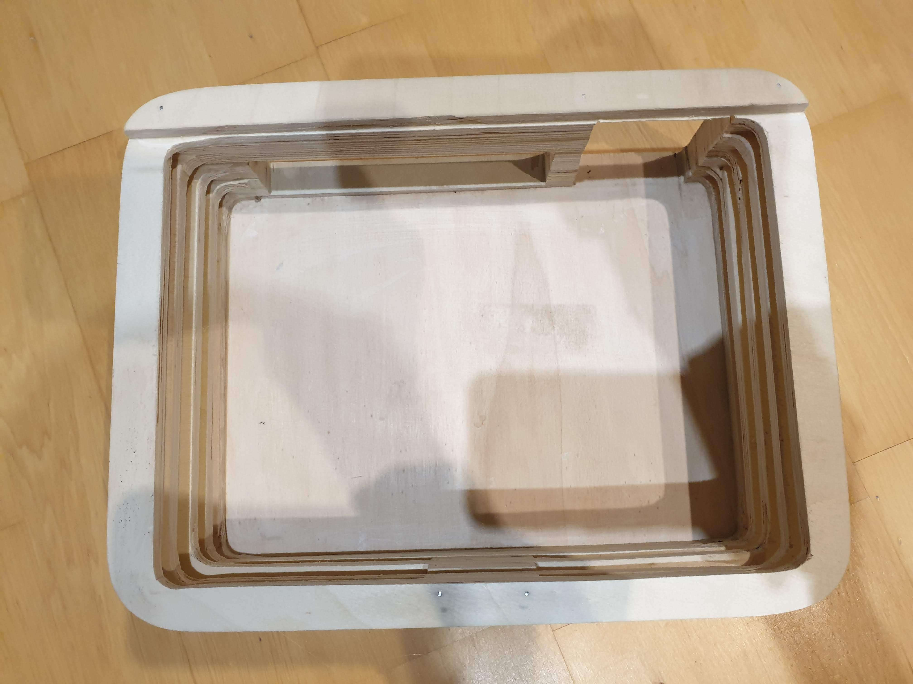
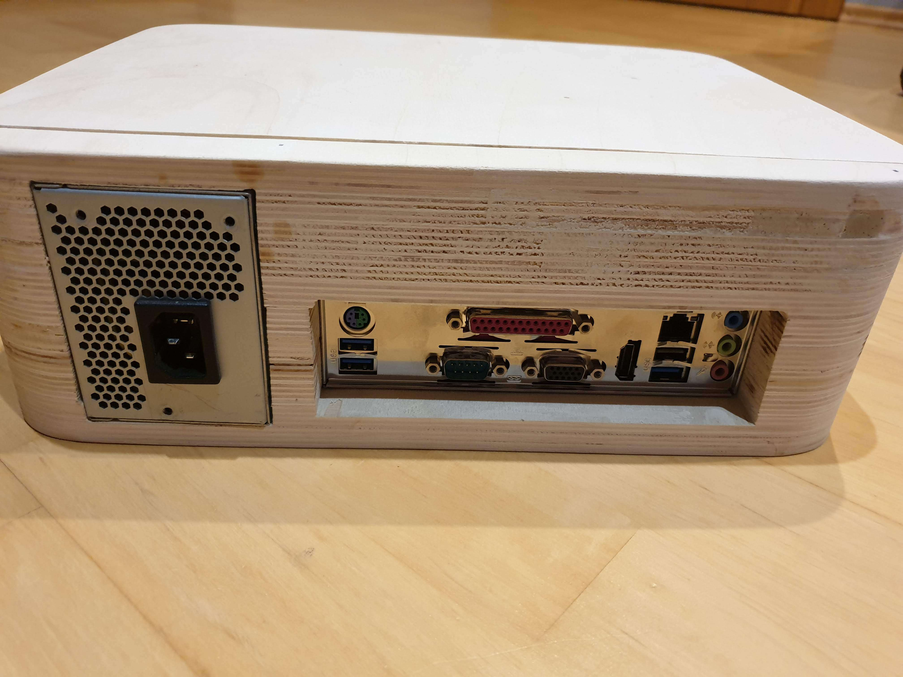
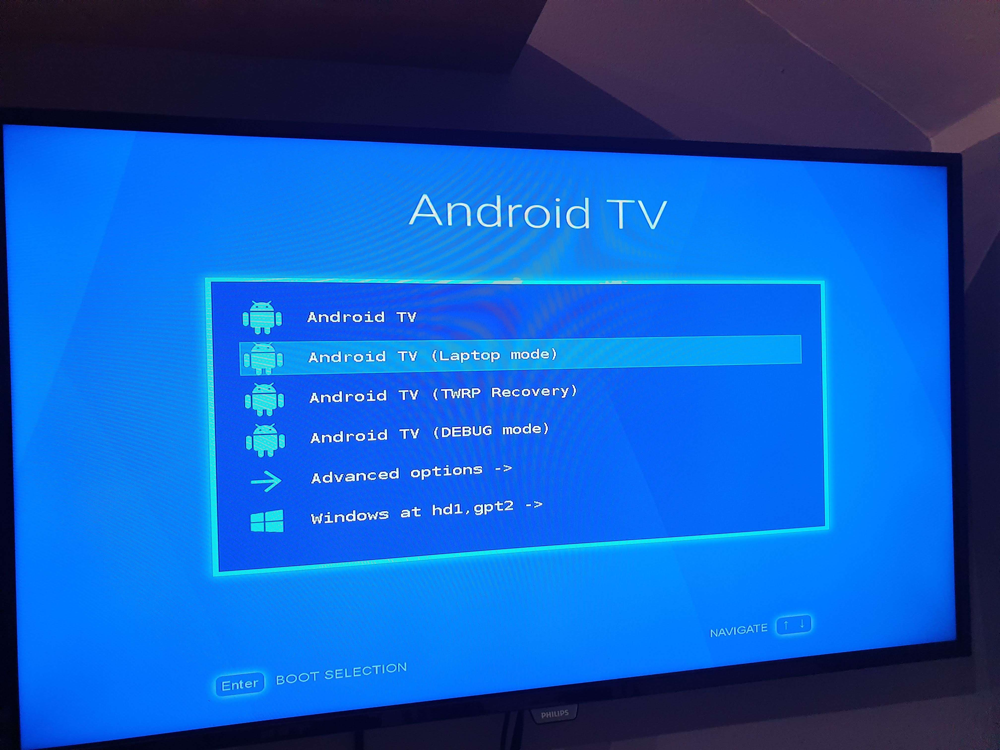
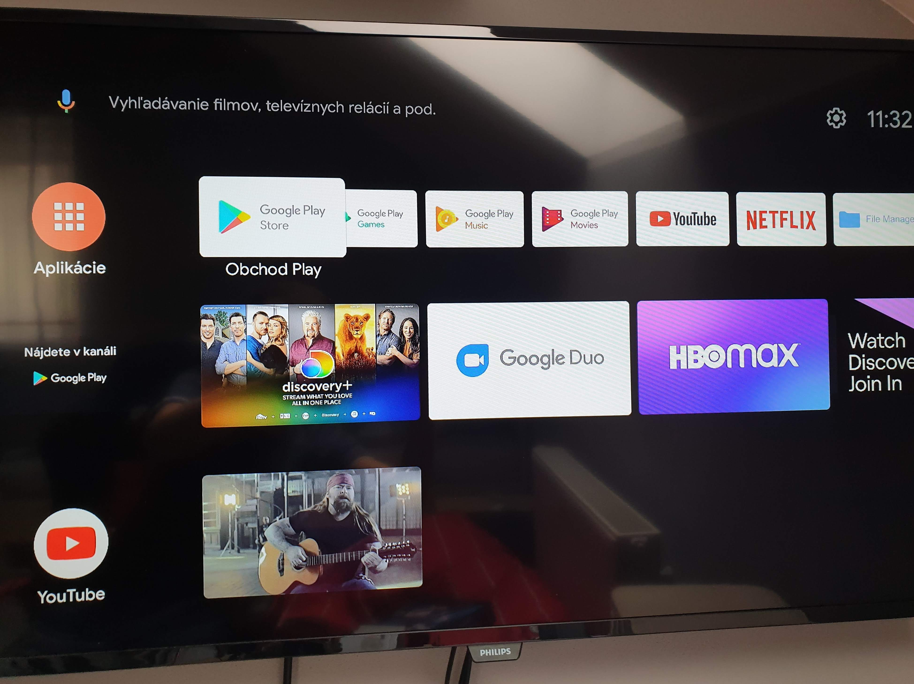

---
# 🧩 Versioning – systém dopĺňa automaticky
fm_version: "1.0.1"

# Dátum buildu – generuje skript
fm_build: "2025-11-28T15:54:48.039028+00:00"

# Poznámka k verzii – voliteľné
fm_version_comment: ""

# 🆔 IDENTITY --------------------------------------------------------

# ID generuje CLI / skript

# Unikátne UUID – generuje skript
guid: "281570ba-e351-4ee3-82f6-97e8f45d7ff5"

# 🧭 CONTEXT ---------------------------------------------------------

# DAO / doména (knife, sdlc, q12, 7ds...) dopĺňa skript
dao: "class_sthdf_dashboard"

# Názov zápisu – dopĺňa používateľ
title: "slides"

# Krátky popis – dopĺňa používateľ (voliteľné)
description: "{{DESCRIPTION}}"

# 👥 AUTHORSHIP ------------------------------------------------------

# Hlavný autor – z globálneho configu
author: "Roman Kazicka"

# Zoznam autorov – generuje skript
authors:
  - "Roman Kazicka"

# 🗂 CLASSIFICATION ---------------------------------------------------

# Nadradená kategória – môže doplniť používateľ
category: ""

# Typ dokumentu (guide, case, tutorial...) – používateľ (voliteľné)
type: ""

# Priorita (low/medium/high) – voliteľné
priority: ""

# Tagy – odporúča sa 2–6 tagov.
# Typy tagov:
#   - rámce: knife, 7ds, sdlc, q12
#   - účel: tutorial, guide, pattern, case-study
#   - téma: git, backup, ai, communication
#   - úroveň: beginner, intermediate, advanced
tags: []

# 🌍 LOCALIZATION -----------------------------------------------------

# Jazyk dokumentu – doplní skript podľa štruktúry
locale: "sk"

# 🕒 LIFECYCLE --------------------------------------------------------

# Dátum vytvorenia – generuje skript
created: "2025-11-28 16:54"

# Dátum poslednej úpravy – dopĺňa človek
modified: "2025-11-28 16:54"

# Stav dokumentu – default "backlog"
status: "backlog"

# Viditeľnosť – default "public"
privacy: "public"

# ⚖ INTELLECTUAL PROPERTY -------------------------------------------

# Držiteľ práv k obsahu – dopĺňa skript
rights_holder_content: "Roman Kazicka"

# Systémový vlastník práv
rights_holder_system: "CAA / KNIFE / LetItGrow"

# Licencia
license: "CC-BY-NC-SA-4.0"

# Disclaimer
disclaimer: "Use at your own risk. Methods provided as-is; participation is voluntary and context-aware."

# Copyright
copyright: "© 2025 Roman Kazicka"

# 🔗 ORIGIN / PROVENANCE ---------------------------------------------

# Repozitár pôvodu
origin_repo: ""

# URL pôvodného repozitára
origin_repo_url: ""

# Commit pôvodu
origin_commit: ""

# Branch pôvodu
origin_branch: ""

# Systém pôvodu (CAA/KNIFE/STHDF…)
origin_system: "CAA"

# Pôvodný autor
origin_author: "Roman Kazicka"

# Importovaný zdroj
origin_imported_from: ""

# Dátum importu
origin_import_date: ""

# 🧱 RESERVED ---------------------------------------------------------

fm_reserved1: ""
fm_reserved2: ""
---

<!-- class_sthdf_dashboard_INSTANCE_ID: 01-class_sthdf_dashboard_2025-2026 -->

[🏠 Domov](../../../index.md) · [⬅️ Nahor](../)
# **PRJ021 — Presentation**
# **2025-PRJ-021-ST_021-ST_021-Smart TV Box**

## Bc. Oliver Hofer
## Bc. Oleksandr Lypovetskyi

## Stručný popis projektu:
Projekt Smart TV Box sa zameriava na návrh a realizáciu externého zariadenia,
ktoré rozširuje funkcionalitu starších televízorov o Smart TV vlastnosti
prostredníctvom operačného systému Android TV.

## Introduction
**2025-PRJ-021-ST_021-ST_021-Smart TV Box**

Cieľom projektu je navrhnúť a implementovať kompaktný Smart TV Box založený
na PC hardvéri, ktorý umožní používateľom starších televízorov využívať
moderné multimediálne služby.
Riešenie kombinuje vlastnú hardvérovú zostavu, drevené púzdro navrhnuté v
nástroji Fusion 360 a podporu operačných systémov Android TV a Windows
prostredníctvom dualboot konfigurácie.

## Obsah
- [01-Business](../sdlc/01-business/index.md)
- [02-Top Level Architecture](../sdlc/02-top-level-architecture/index.md)
- [03-Solution Architecture](../sdlc/03-solution-architecture/index.md)
- [04-Analysis](../sdlc/04-analysis/index.md)
- [05-Design](../sdlc/05-design/index.md)
- [06-Implementation](../sdlc/06-implementation/index.md)
- [07-Testing & Verification](../sdlc/07-testing-verification/index.md)
- [08-Operation](../sdlc/08-operation/index.md)
- [09-Change Management](../sdlc/09-Change-Management/index.md)
--- obsah ---

## 01-Business

### Business Context

### Problem Statement
Mnoho používateľov stále vlastní staršie televízory, ktoré nedisponujú Smart TV funkcionalitou.
Tieto zariadenia síce poskytujú kvalitný obraz, avšak neumožňujú používanie moderných aplikácií
ako YouTube, Netflix alebo streamovacie služby bez dodatočného hardvéru.

### Project Goal
Cieľom projektu Smart TV Box je vytvoriť zariadenie, ktoré umožní rozšíriť funkcionalitu
bežného televízora o Smart TV vlastnosti pomocou externého zariadenia.

### Target Users
- používatelia starších televízorov bez Smart TV podpory
- technicky zdatní používatelia
- domácnosti hľadajúce lacnejšiu alternatívu ku komerčným riešeniam

### Value Proposition
Projekt ponúka:
- lacnú alternatívu ku komerčným Smart TV Boxom,
- možnosť využitia existujúceho hardvéru,
- flexibilné a rozšíriteľné riešenie založené na Android platforme.

### Constraints
- obmedzený výkon použitých komponentov,
- DIY charakter riešenia,
- neoficiálna podpora operačného systému Android TV.

## 02-Top Level Architecture

### System Description
Smart TV Box je externé zariadenie, ktoré sa pripája k televízoru prostredníctvom HDMI rozhrania
a poskytuje používateľovi rozhranie operačného systému Android TV alebo jeho funkčného ekvivalentu.

### Main Components
Systém pozostáva z nasledujúcich hlavných častí:
- hardvérová jednotka (základná doska, SSD, napájanie),
- operačný systém Android,
- používateľské vstupné zariadenia,
- zobrazovacie zariadenie (televízor).

### External Interfaces
- HDMI výstup pre obraz a zvuk,
- USB porty pre vstupné zariadenia,
- Ethernet rozhranie pre pripojenie na internet,
- napájací vstup.

### User Interaction
Používateľ interaguje so systémom prostredníctvom:
- diaľkového ovládača,
- klávesnice alebo myši,
- grafického používateľského rozhrania Android TV.

## 03-Solution Architecture

### Hardware Design
Zariadenie je postavené na Mini-ITX základovej doske s integrovaným procesorom a operačnou pamäťou.
Ako úložisko slúži 2.5" SSD disk, na ktorom je nainštalovaný operačný systém a používateľské dáta.
Napájanie zabezpečuje samostatný elektrický zdroj.

### Case Construction
Hardvérové komponenty sú umiestnené do dreveného púzdra vyrobeného z preglejky.
Púzdro je navrhnuté ako viacvrstvová konštrukcia s medzerami medzi jednotlivými vrstvami,
čo umožňuje prirodzenú cirkuláciu vzduchu a zlepšuje odvádzanie tepla.

### Cooling Concept
Základná doska disponuje pasívnym chladením procesora.
Konštrukcia púzdra je navrhnutá ako viacvrstvová s medzerami medzi jednotlivými drevenými úrovňami,
čo podporuje prirodzenú cirkuláciu vzduchu.

Odvod teplého vzduchu z vnútra púzdra je zabezpečený napájacím zdrojom,
ktorý je umiestnený v skrinke a aktívne odvádza teplý vzduch smerom von zo zariadenia.
Týmto spôsobom je zabezpečený základný airflow bez potreby dodatočných chladiacich ventilátorov.

### Software Architecture
Na zariadení je nainštalovaný operačný systém Android TV alebo Android s TV rozhraním,
ktorý je spúšťaný priamo z SSD disku a slúži ako primárne používateľské prostredie
pre multimediálne využitie.

Zariadenie zároveň podporuje operačný systém Windows,
ktorý je nainštalovaný na rovnakom SSD disku a je dostupný prostredníctvom dualboot riešenia.
Používateľ si pri štarte zariadenia môže zvoliť, ktorý operačný systém bude spustený.

### Design Decisions
- použitie dreveného púzdra z dôvodu jednoduchosti výroby a estetiky,
- využitie existujúcich PC komponentov,
- dôraz na nízku spotrebu energie a tichú prevádzku.

## 04-Analysis

### Problem Analysis
Cieľom projektu je vytvoriť externé zariadenie, ktoré rozšíri funkcionalitu
bežného televízora bez Smart TV podpory o moderné multimediálne služby.
Riešenie musí byť cenovo dostupné, kompaktné a vhodné na domáce použitie.

### Functional Requirements
- zariadenie musí umožniť pripojenie k televízoru prostredníctvom HDMI,
- systém musí poskytovať používateľské rozhranie Android TV alebo jeho funkčný ekvivalent,
- zariadenie musí podporovať prehrávanie multimediálneho obsahu,
- systém musí umožniť spustenie operačného systému Windows pomocou dualboot riešenia,
- používateľ musí mať prístup k vstupno-výstupným rozhraniam základovej dosky.

### Non-Functional Requirements
- tichá prevádzka zariadenia,
- nízka spotreba energie,
- zabezpečené dostatočné chladenie komponentov,
- estetické vyhotovenie vhodné do domácnosti,

### Hardware Constraints
- použitie Mini-ITX základovej dosky s integrovaným procesorom,
- použitie 2.5" SSD disku ako hlavného úložiska,
- použitie samostatného napájacieho zdroja,
- obmedzený výkon hardvérových komponentov.

### Software Constraints
- neoficiálna podpora Android TV na x86 platforme,
- obmedzená dostupnosť ovládačov v prostredí Android,
- nutnosť manuálnej konfigurácie dualboot riešenia.

## 05-Design

### Overall Design Concept
Systém je navrhnutý ako kompaktné externé zariadenie umiestnené v drevenom púzdre.
Návrh kladie dôraz na jednoduchú výrobu, dobrú ventiláciu a prístupnosť portov.

### Hardware Design
Hardvérová časť pozostáva z Mini-ITX základovej dosky s integrovaným procesorom,
2.5" SSD disku a napájacieho zdroja.

Na nasledujúcom obrázku je zobrazená základová doska ASRock J4105B-ITX

Napájaci zdroj bol vybraný Seasonic SS-300TFX

Komponenty sú rozmiestnené tak, aby bol zabezpečený prirodzený airflow
a zároveň jednoduchý prístup k vstupno-výstupným rozhraniam.

### Case Design
Púzdro zariadenia je vyrobené z preglejky a navrhnuté ako viacvrstvová konštrukcia.
Medzery medzi jednotlivými vrstvami podporujú cirkuláciu vzduchu
a pomáhajú odvádzať teplo z vnútra zariadenia.

### Cooling Design
Chladenie zariadenia je založené na pasívnom chladení procesora
a prirodzenej ventilácii púzdra.
Odvod teplého vzduchu je podporený napájacím zdrojom,
ktorý aktívne odvádza teplý vzduch smerom von zo skrinky.

### Software Design
Primárnym operačným systémom zariadenia je Android TV alebo Android s TV rozhraním.
Zariadenie zároveň podporuje operačný systém Windows,
ktorý je dostupný prostredníctvom dualboot riešenia.
Výber operačného systému prebieha pri štarte zariadenia.

### Design Tools
Návrh mechanickej konštrukcie zariadenia bol vytvorený v nástroji Fusion 360.
V rámci návrhu bol spracovaný 3D model púzdra a technické výkresy (drawings) jednotlivých dielov potrebné pre výrobu.

Na ďalších dvoch obrázkoch je zobrazený výsledný 3D model púzdra aj jeho technický výkres s popisom 
exterierových rozmerov.

## 06-Implementation

### Hardware Implementation
Implementácia hardvérovej časti zahŕňa montáž základovej dosky,
SSD disku a napájacieho zdroja do navrhnutého dreveného púzdra.
Jednotlivé časti púzdra boli vyrezané z preglejky podľa technických výkresov
vytvorených v nástroji Fusion 360 a následne zlepené do finálnej konštrukcie.

Na nasledujúcich obrázkoch je znazornený vzhľad dreveného púzdra
vyrezaného z preglejky, ale pred umiestnením hardvérových komponentov.

Po umiestnení hardvérových komponentov, zariadenie vyzeralo následovne:

### Software Implementation
Na SSD disk bol nainštalovaný operačný systém Android TV alebo Android s TV rozhraním
ako primárne používateľské prostredie.
Zároveň bol nainštalovaný operačný systém Windows,
pričom oba systémy sú dostupné prostredníctvom dualboot riešenia:

### Current State
V aktuálnej fáze projektu je zariadenie zostavené po hardvérovej stránke
a pripravené na ďalšie testovanie softvéru, stability a teplotného správania.

## 07-Testing & Verification

### Cieľ testovania
Cieľom testovania bolo overiť funkčnosť zariadenia Smart TV Box v reálnych podmienkach používania, najmä na televízoroch, ktoré nepodporujú Smart TV funkcionalitu. Testovanie sa zameriavalo na kompatibilitu, stabilitu systému Android TV a používateľský komfort.

### Testovacie prostredie
Zariadenie bolo testované na viacerých typoch starších televízorov rôznych výrobcov, ktoré disponujú HDMI vstupom, ale nemajú vlastný Smart TV operačný systém.  
Pripojenie k internetu bolo realizované výhradne pomocou káblového pripojenia cez rozhranie **RJ-45 (Ethernet)**, aby bola zabezpečená stabilita siete počas testovania.

### Scenáre testovania
Počas testovania boli vykonané nasledovné scenáre:
- spustenie zariadenia a boot operačného systému Android TV,
- inicializácia obrazu a zvuku po pripojení k televízoru,
- test funkčnosti sieťového pripojenia cez RJ-45,
- inštalácia a spustenie multimediálnych aplikácií,
- dlhodobejšie prehrávanie obsahu.

### Testované aplikácie
Funkčnosť zariadenia bola overená najmä pomocou bežne používaných streamovacích služieb:
- **YouTube** – prehrávanie videí v rôznych rozlíšeniach,
- **Netflix** – prehrávanie filmov a seriálov po prihlásení do používateľského účtu.

Aplikácie sa spúšťali korektne, bez pádov a bez viditeľného oneskorenia používateľského rozhrania.

### Výsledky testovania
- Zariadenie bolo úspešne rozpoznané všetkými testovanými televízormi.
- Obraz aj zvuk boli prenášané bez chýb cez HDMI rozhranie.
- Sieťové pripojenie cez RJ-45 bolo stabilné počas celého testovania.
- Multimediálne aplikácie fungovali spoľahlivo a bez výpadkov.
- Počas testovania nebolo zaznamenané prehrievanie zariadenia.

### Záver testovania
Na základe vykonaných testov je možné uvažovať, že Smart TV Box spĺňa požadované funkčné a kvalitatívne kritériá. Zariadenie je vhodné na bežné domáce používanie ako náhrada Smart TV funkcionality pre staršie televízory a spĺňa očakávania definované v návrhovej fáze projektu.

## 08-Operation

### System Startup
Po pripojení zariadenia k elektrickej sieti a televízoru prostredníctvom HDMI
je možné Smart TV Box zapnúť pomocou napájacieho tlačidla alebo pripojeného zdroja.
Pri štarte zariadenia má používateľ možnosť zvoliť operačný systém
(Android TV alebo Windows) prostredníctvom dualboot menu.

### Normal Operation
Po spustení operačného systému Android TV môže používateľ:
- používať multimediálne aplikácie,
- prehrávať video a audio obsah,
- pristupovať k internetovým službám.

Ovládanie zariadenia je možné pomocou:
- klávesnice alebo myši pripojenej cez USB,
- diaľkového ovládača kompatibilného s Android TV.

### Maintenance
Zariadenie nevyžaduje pravidelnú údržbu.
Odporúča sa však:
- občasná kontrola vnútorného priestoru púzdra,
- odstránenie prípadného prachu,
- kontrola správneho odvádzania tepla.

### Safety Considerations
- zariadenie by malo byť umiestnené na dobre vetranom mieste,
- nesmie byť zakryté predmetmi brániacimi prúdeniu vzduchu,
- počas prevádzky by nemalo byť vystavené vlhkosti.

## 09-Change Management

### Pôvodný návrh
V pôvodnom návrhu projektu Smart TV Box sa počítalo s použitím **3D tlačeného držiaka pre 2.5" SSD disk**, ktorý mal byť:
- navrhnutý v CAD nástroji,
- vytlačený na 3D tlačiarni,
- pevne integrovaný do vnútorného priestoru dreveného púzdra.

Cieľom tohto riešenia bolo zlepšiť mechanickú stabilitu disku, vnútornú organizáciu komponentov a celkovú modularitu zariadenia.

### Identifikovaná zmena (Change Request)
Počas realizácie projektu bol identifikovaný časový limit, ktorý neumožnil dokončenie návrhu a výroby 3D tlačeného držiaka SSD disku v plánovanom rozsahu.

Z tohto dôvodu bolo rozhodnuté:
- neimplementovať 3D tlačený držiak SSD disku v aktuálnej verzii projektu,
- ponechať SSD disk umiestnený v púzdre bez dedikovaného držiaka.

### Analýza dopadu (Impact Analysis)
Dopad tejto zmeny na projekt bol vyhodnotený nasledovne:
- **Funkčnosť zariadenia** nebola ovplyvnená, SSD disk je plne funkčný.
- **Časový harmonogram projektu** bol dodržaný.
- **Bezpečnosť a stabilita** zariadenia ostala na akceptovateľnej úrovni pre školský projekt.
- **Estetika a modularita** vnútorného usporiadania môže byť mierne znížená.

### Záznam zmeny (Change log)
- **Zmena:** Neimplementovaný 3D tlačený držiak pre SSD disk  
- **Dôvod:** Nedostatok času na návrh a výrobu  
- **Stav:** Odložené / nerealizované  
- **Dátum rozhodnutia:** počas realizácie projektu  

### Potenciálne zlepšenia (Future Improvements)
Nerealizovaný 3D tlačený držiak SSD disku je možné považovať za:
- potenciálne rozšírenie projektu,
- vylepšenie budúcej verzie zariadenia,
- vhodnú úlohu pre ďalšiu iteráciu alebo nadväzujúci projekt.

Implementácia tohto prvku by mohla zvýšiť mechanickú odolnosť, servisovateľnosť a profesionálny charakter výsledného riešenia.