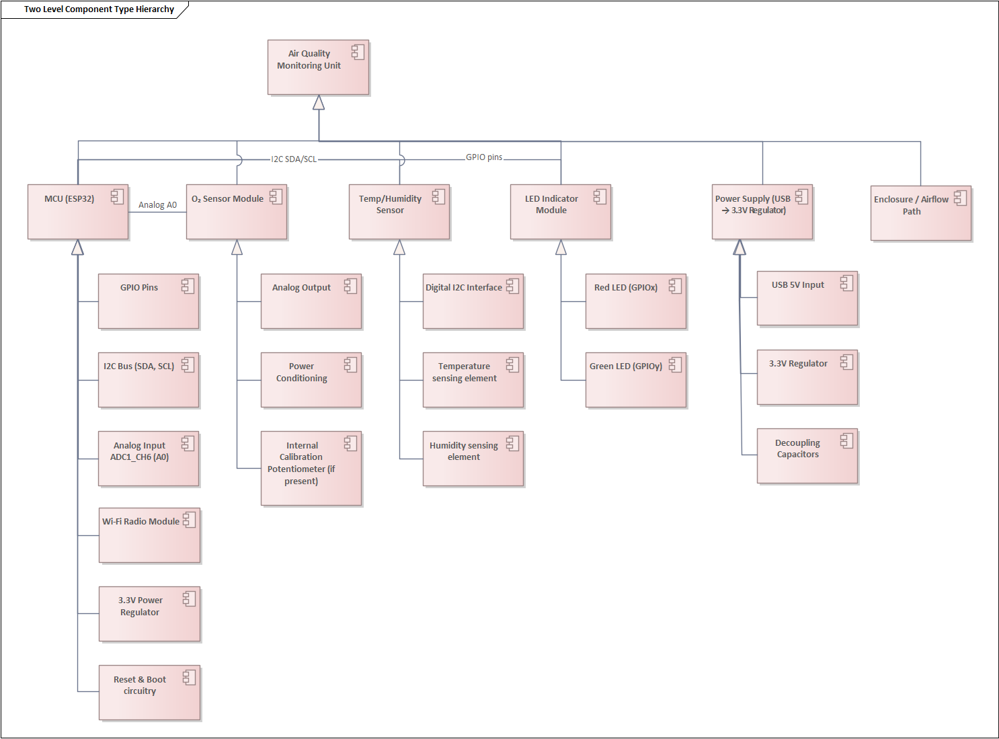
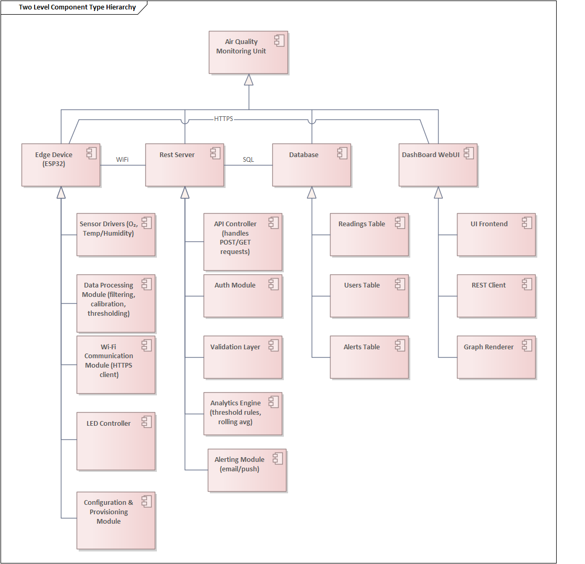
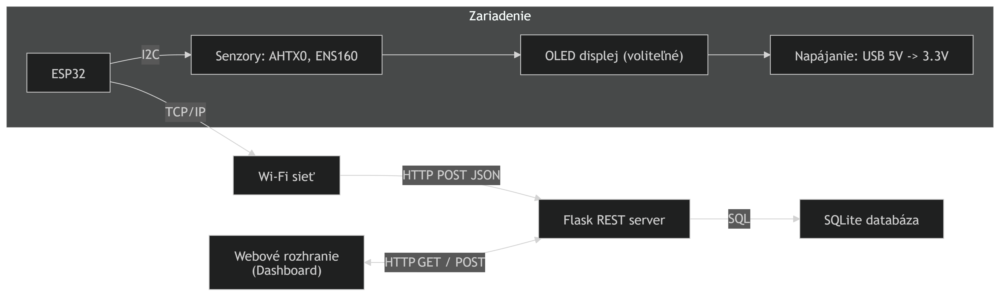
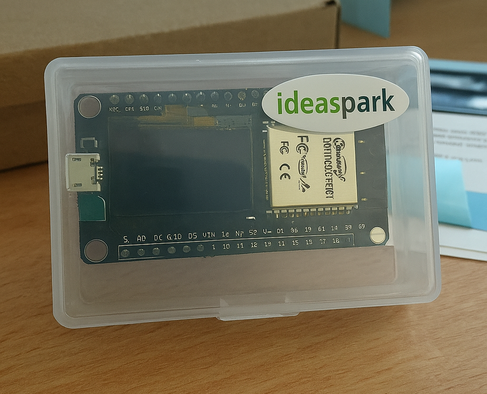
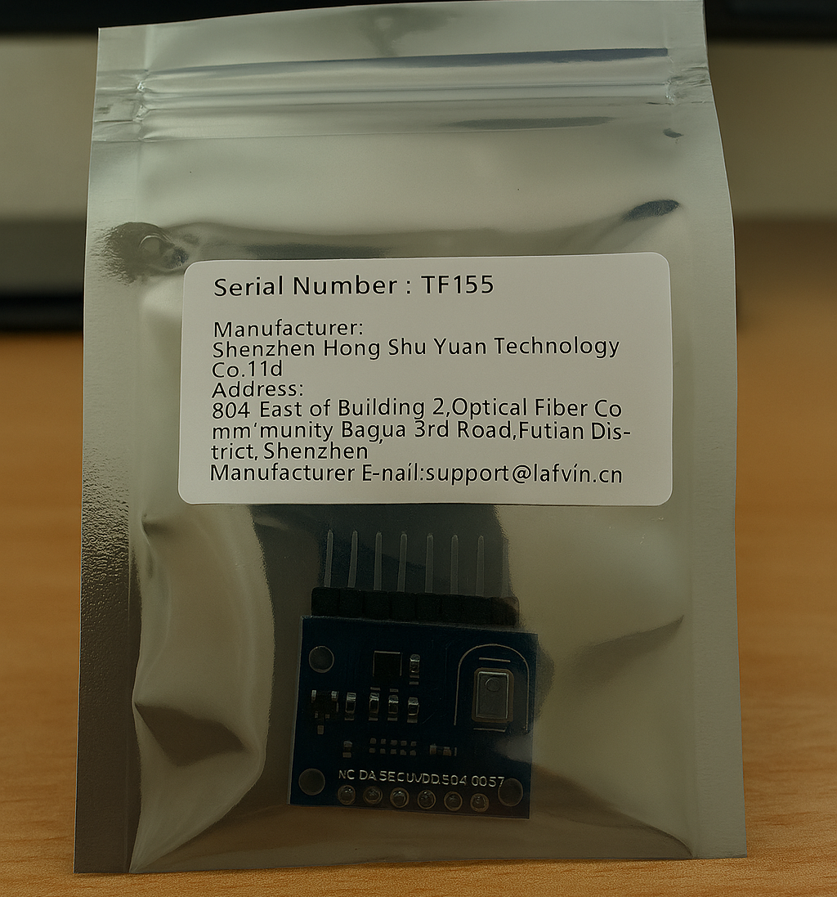
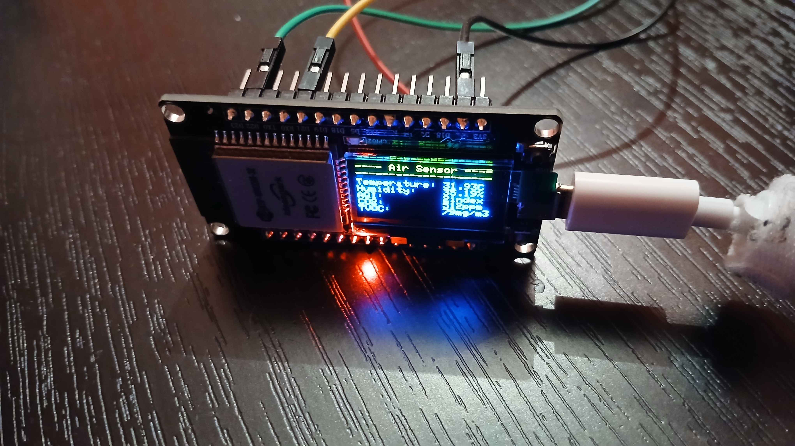
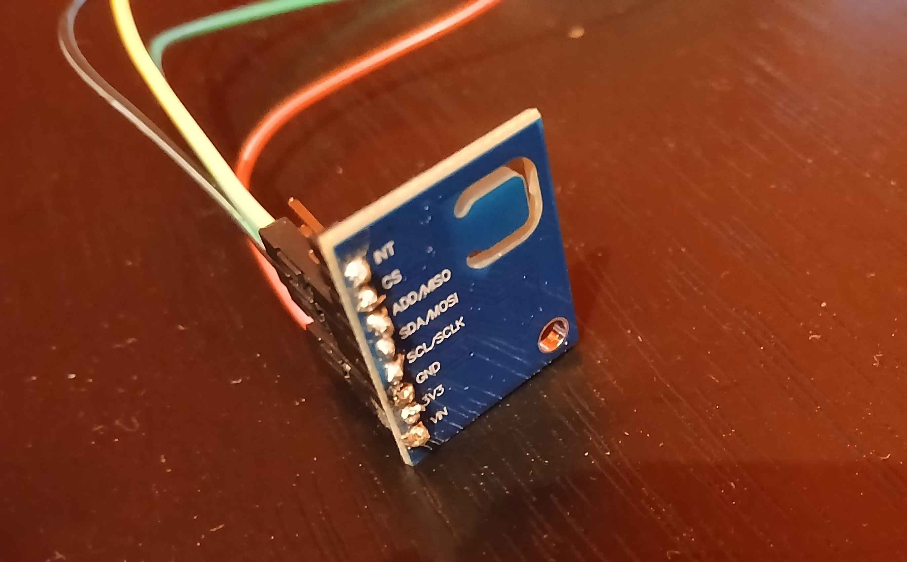
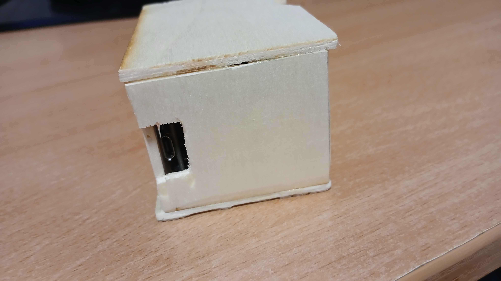
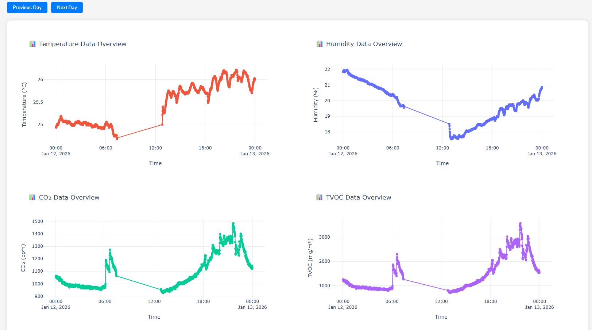

---
# 🧩 Versioning – systém dopĺňa automaticky
fm_version: "1.0.1"

# Dátum buildu – generuje skript
fm_build: "2025-11-28T15:54:47.971362+00:00"

# Poznámka k verzii – voliteľné
fm_version_comment: ""


# 🆔 IDENTITY --------------------------------------------------------

# ID generuje CLI / skript

# Unikátne UUID – generuje skript
guid: "5dbb47e5-dac3-4468-b7f4-d6793079ef66"


# 🧭 CONTEXT ---------------------------------------------------------

# DAO / doména (knife, sdlc, q12, 7ds...) dopĺňa skript
dao: "class_sthdf_dashboard"

# Názov zápisu – dopĺňa používateľ
title: "slides"

# Krátky popis – dopĺňa používateľ (voliteľné)
description: "{{DESCRIPTION}}"


# 👥 AUTHORSHIP ------------------------------------------------------

# Hlavný autor – z globálneho configu
author: "Roman Kazicka"

# Zoznam autorov – generuje skript
authors:
  - "Roman Kazicka"


# 🗂 CLASSIFICATION ---------------------------------------------------

# Nadradená kategória – môže doplniť používateľ
category: ""

# Typ dokumentu (guide, case, tutorial...) – používateľ (voliteľné)
type: ""

# Priorita (low/medium/high) – voliteľné
priority: ""

# Tagy – odporúča sa 2–6 tagov.
# Typy tagov:
#   - rámce: knife, 7ds, sdlc, q12
#   - účel: tutorial, guide, pattern, case-study
#   - téma: git, backup, ai, communication
#   - úroveň: beginner, intermediate, advanced
tags: []


# 🌍 LOCALIZATION -----------------------------------------------------

# Jazyk dokumentu – doplní skript podľa štruktúry
locale: "sk"


# 🕒 LIFECYCLE --------------------------------------------------------

# Dátum vytvorenia – generuje skript
created: "2025-11-28 16:54"

# Dátum poslednej úpravy – dopĺňa človek
modified: "2025-11-28 16:54"

# Stav dokumentu – default "backlog"
status: "backlog"

# Viditeľnosť – default "public"
privacy: "public"


# ⚖ INTELLECTUAL PROPERTY -------------------------------------------

# Držiteľ práv k obsahu – dopĺňa skript
rights_holder_content: "Roman Kazicka"

# Systémový vlastník práv
rights_holder_system: "CAA / KNIFE / LetItGrow"

# Licencia
license: "CC-BY-NC-SA-4.0"

# Disclaimer
disclaimer: "Use at your own risk. Methods provided as-is; participation is voluntary and context-aware."

# Copyright
copyright: "© 2025 Roman Kazicka"


# 🔗 ORIGIN / PROVENANCE ---------------------------------------------

# Repozitár pôvodu
origin_repo: ""

# URL pôvodného repozitára
origin_repo_url: ""

# Commit pôvodu
origin_commit: ""

# Branch pôvodu
origin_branch: ""

# Systém pôvodu (CAA/KNIFE/STHDF…)
origin_system: "CAA"

# Pôvodný autor
origin_author: "Roman Kazicka"

# Importovaný zdroj
origin_imported_from: ""

# Dátum importu
origin_import_date: ""


# 🧱 RESERVED ---------------------------------------------------------

fm_reserved1: ""
fm_reserved2: ""
---

<!-- class_sthdf_dashboard_INSTANCE_ID: 01-class_sthdf_dashboard_2025-2026 -->

# PRJ023 — Presentation

**2025-PRJ-023-ST_023-ST_023-Air quality monitor**

<figure>
  
  <figcaption>Obr.:  Model senzoru kvality ovzdušia</figcaption>
</figure>

## Project Summary [🗂️ [zobraziť]](../sdlc/00-project-summary/index.md)

Tento projekt je kompletné riešenie na meranie kvality ovzdušia pomocou syntézy mikrontroléra a senzorov.

## Introduction
**2025-PRJ-023-ST_023-ST_023-Air quality monito**

Projekt rieši meranie kvality ovzdušia pomocou mikrokontroléra ESP32 a senzorov AHTX0 a ENS160, pričom údaje o teplote, vlhkosti, TVOC, eCO₂ a odvodenom AQI sú zobrazované na OLED displeji a odosielané na server. Server ich ukladá do databázy a poskytuje responzívne webové rozhranie na sledovanie aktuálnych hodnôt aj historických trendov. Prínosom je dostupné, cenovo efektívne riešenie pre monitoring kvality vzduchu s možnosťou vzdialeného prístupu k dátam.

## Obsah
- [00-Project Summary](../sdlc/00-project-summary/index.md)
- [01-Business](../sdlc/01-business/index.md)
- [02-Top Level Architecture](../sdlc/02-top-level-architecture/index.md)
- [03-Solution Architecture](../sdlc/03-solution-architecture/index.md)
- [04-Analysis](../sdlc/04-analysis/index.md)
- [05-Design](../sdlc/05-design/index.md)
- [06-Implementation](../sdlc/06-implementation/index.md)
- [07-Testing & Verification](../sdlc/07-testing-verification/index.md)
- [08-Operation](../sdlc/08-operation/index.md)
- [09-Change Management](../sdlc/09-Change-Management/index.md)
- [10-Lemontree](../sdlc/09-Change-Management/lemontree.md)


## 01-Business

#### Problém
Zvýšená koncentrácia CO₂ a TVOC v interiéroch znižuje komfort, zdravie a produktivitu, pričom dostupné riešenia sú drahé alebo komplikované.
#### Cieľ projektu
Vyvinúť cenovo dostupné zariadenie na meranie kvality ovzdušia s lokálnym displejom a vzdialeným prístupom cez webové rozhranie.
#### Cieľoví používatelia
Domácnosti, kancelárie, školy, malé firmy – všetci, ktorí potrebujú sledovať kvalitu vzduchu v uzavretých priestoroch.
#### Hodnota projektu
Dostupnosť: nízke náklady, jednoduchá inštalácia  
Prehľadnosť: OLED displej + webová aplikácia   
#### Obmedzenia
Výkon a pamäť ESP32  
Stabilita Wi-Fi pripojenia  
Presnosť senzorov závislá od kalibrácie  
#### Použitia
Monitorovanie kvality vzduchu v domácnosti  
Riadenie ventilácie v kancelárii podľa CO₂  


## 02-Top Level Architecture

#### Fyzické komponenty
- ESP32 DevKit (mikrokontrolér, Wi-Fi modul, GPIO piny, I²C zbernica, displej, napájanie)
- Senzorový modul: AHTX0 (meranie teploty & vlhkosti)
- Senzorový modul: ENS160 (meranie TVOC, eCO₂, výpočet AQI)
- Drevený kryt (otvor pre prúdenie vzduchu, otvor na napájanie)

#### Hardware architektúra
<figure>
  
  <figcaption>Obr.:  Diagram zobrazujúci fyzické komponenty</figcaption>
</figure>


#### System architektúra
<figure>
  
  <figcaption>Obr.:  Diagram zobrazujúci softvérové a systémové komponenty</figcaption>
</figure>

## 03-Solution Architecture
ESP32 so senzormi (I²C) vykresľuje merania na displej a zároveň ich posiela cez Wi‑Fi v JSON formáte na REST server, ktorý ich validuje, ukladá do SQLite a sprístupňuje ich vo webovom dashboarde.

#### Vývojový diagram
<figure>
  
  <figcaption>Obr.:  Diagram vizualizuje tok riešenia. Mikrokontrolér číta senzorové dáta a vykresľuje na displej. Zároveň ich zasiela v intervaloch cez sieť na server, kde sa ukladajú do databázy. Dáta si môže používa hocikedy prezrieť z PC alebo mobilu.</figcaption>
</figure>


## 04-Analysis

#### Analýza problému
Cieľom projektu je vytvoriť zariadenie na monitorovanie kvality ovzdušia, ktoré bude cenovo dostupné, jednoduché na inštaláciu a poskytne používateľovi prehľadné dáta v reálnom čase aj historické trendy. Riešenie musí byť vhodné pre domáce aj kancelárske prostredie.

#### Funkčné požiadavky
- zariadenie musí merať teplotu, vlhkosť, TVOC, eCO₂ a odvodený AQI,
- musí umožniť pripojenie k Wi‑Fi a odosielanie dát na server,
- systém musí poskytovať webové rozhranie (desktop & mobil) na vizualizáciu dát,
- musí podporovať historické grafy a aktuálne hodnoty,

#### Nefunkčné požiadavky
- stabilné pripojenie k Wi‑Fi,
- jednoduchá konfigurácia (plug & play),
- responzívne a intuitívne UI,
- bezpečná komunikácia (napr. HTTPS).

#### Hardvérové obmedzenia
- použitie ESP32 ako hlavného mikrokontroléra,
- senzory AHTX0 a ENS160 (I²C),
- napájanie cez USB (5V),
- obmedzený výpočtový výkon ESP32.

#### Softvérové obmedzenia
- firmware v Arduino IDE (C++),
- komunikácia cez HTTP/JSON,
- server postavený na Python Flask + SQLite,
- obmedzená pamäť ESP32 → optimalizácia kódu,
- nutnosť spracovania dát na strane servera (agregácie, grafy).

#### Cenová analýza
- Senzor CO₂ príliš drahý: 90€
- Senzor ENS160+AHT21 (eCO₂): 9.90€
- ESP32: 7.30€
- Káble: 3.40€ (počet 120ks)


## 05-Design

<figure>
  
  <figcaption>Obr.:  Náčrť drevenej krabičky, ktorá zakrýva hardvér.</figcaption>
</figure>

<figure>
  
  <figcaption>Obr.:  3D model drevenej krabičky.</figcaption>
</figure>

<figure>
  
  <figcaption>Obr.:  Návrh kabeláže medzi mikrokontrolérom a senzorom.</figcaption>
</figure>


### Server API

- **GET /health** – stav servera (uptime, verzia)  
- **POST /send-data** – prijme najnovšie merania zo senzora (JSON payload)  
- **GET /read-data** – vráti dáta pre používateľa a dátum/interval  
  - Query parametre: user_id, date (napr. 2026-01-13)

---

### Databázová schéma

#### users (väzba používateľ ↔ zariadenie)

| Stĺpec        | Typ     | Popis                                  |
|---------------|---------|----------------------------------------|
| id            | INTEGER | Primárny kľúč                         |
| serial_number | TEXT    | Jedinečný identifikátor zariadenia    |

#### sensor_realtime (posledné merania na používateľa/zariadenie)

| Stĺpec      | Typ     | Popis                                  |
|-------------|---------|----------------------------------------|
| id          | INTEGER | Primárny kľúč                         |
| user_id     | INTEGER | FK na users.id                        |
| temperature | REAL    | Teplota v °C                          |
| humidity    | REAL    | Relatívna vlhkosť v %                 |
| aqi         | INTEGER | Index kvality vzduchu                 |
| co2         | REAL    | eCO₂ v ppm                            |
| tvoc        | REAL    | TVOC                                  |
| timestamp   | INTEGER | Unix čas merania  

---

## 06-Implementation
<figure>
  
  <figcaption>Obr.:  Balík s hardvérom.</figcaption>
</figure>

<figure>
  
  <figcaption>Obr.:  Balík s ESP32.</figcaption>
</figure>

<figure>
  
  <figcaption>Obr.:  Balík s ENS160+AHT21.</figcaption>
</figure>

#### Úryvok kódu senzora:
```ino
// Reading the sensor data
void readSensorData(unsigned long currentMillis) {
  // --- Read AHT21 ---
  sensors_event_t hmd, temp;
  aht.getEvent(&hmd, &temp);
  float temperature = temp.temperature;
  float humidity = hmd.relative_humidity;
  // --- Print AHT21 results ---
  Serial.print("Temp: "); Serial.print(temperature); Serial.print(" °C, ");
  Serial.print("Humidity: "); Serial.print(humidity); Serial.println(" %");
  // --- Read ENS160 ---
  int aqi; // air quality index (1-5)
  int co2; // estimated CO2 (ppm)
  int tvoc; // total VOC [Volatile Organic Compounds] (ppb)
  if( ens.checkDataStatus() ) {
    aqi = ens.getAQI();
    co2 = ens.getECO2();
    tvoc = ens.getTVOC();
    // --- Print ENS160 results ---
    Serial.print("Air Quality Index (1-5): "); Serial.print(aqi); Serial.print(", ");
    Serial.print("eCO2: "); Serial.print(co2); Serial.print(" ppm, ");
    Serial.print("TVOC: "); Serial.print(tvoc); Serial.println(" ppb");
  }
  else {
    Serial.print("Failed to read air quality data!");
  }
  // Displaying message to display
  displayMessage(
    "Temperature: " + String(temperature) + "C\nHumidity:    " + String(humidity) +
    "%\nAQI:         " + String(aqi) + "index\nCO2:         " + String(co2) + 
    "ppm\nTVOC:        " + String(tvoc) + "mg/m3"
  );
  // Every 5 minutes also send to server
  if (currentMillis - lastSendTime >= SEND_INTERVAL) {
    Serial.println("Sending sensor data to server...");
    lastSendTime = currentMillis;
    sendDataToServer(temperature, humidity, aqi, co2, tvoc);
  }
}
```

#### Úryvok kódu servera:
```python
@app.route('/send-data/', methods=['POST'])
def receive_data():
    """Receive data endpoint."""
    try:
        # If no JSON is provided
        request_json = request.json
        if not request_json:
            return fill_json_response(status=STATUS_OK, error="No JSON provided")
        # Convert JSON to dictionary
        request_dict = dict(request_json)
        # Validate JSON schema
        valid, missing_key = validate_received_data_schema(data=request_dict)
        if not valid:
            return fill_json_response(status=STATUS_BAD, error=f"Missing key: {missing_key}")
        # Save to database
        write_data(data=request_dict)
        # Return success
        return fill_json_response(status=STATUS_ADD, error=None)
    # Handle errors
    except (ValueError, RuntimeError) as error:
        print("Error:", error)
        return fill_json_response(status=STATUS_ERROR, error="Internal server error")
```

Server je hostovaný na platforme **Azure**.

#### Zapojenie hardvéru a prototypovanie
<figure>
  
  <figcaption>Obr.:  Zapojený ESP32.</figcaption>
</figure>

<figure>
  
  <figcaption>Obr.:  Zapojený senzor ENS160+AHT21.</figcaption>
</figure>


#### Vloženie hardvéru do krabičky z dreva
<figure>
  
  <figcaption>Obr.:  Otvor na vzduch.</figcaption>
</figure>

<figure>
  
  <figcaption>Obr.:  Otvor na display.</figcaption>
</figure>

<figure>
  
  <figcaption>Obr.:  Otvor na napájanie.</figcaption>
</figure>


## 07-Testing & Verification

Nechali sme na internáte bežať senzor 8 dní. 4 dni bol senzor bez krytu, 4 dni v krabičke.

#### Bez krytu

<figure>
  
  <figcaption>Obr.:  Hodnoty teploty a vlhkosti sú pomerne presné. Hodnoty oxidu uhličitého primerané.</figcaption>
</figure>


#### S krytom

<figure>
  
  <figcaption>Obr.:  Hodnoty teploty sú značne zvýšené (v priemere o 4 stupne). Vlhkosť rovnaká. Oxid uhličitý zvýšený (v priemere o hodnotu 300).</figcaption>
</figure>

#### Výsledky

Krabička nedodáva senzoru dostatočnú výmenu vzduchu. Zariadenie 
sa prehrieva a skresľuje výsledky. Taktiež skresľuje aj častice v ovzduší a oxid uhličitý kvôli slabej výmene vzduchu.

## 08-Operation


#### Bežná prevádzka
Používateľ zapojí senzor (micro-usb). Senzor sa sám naštartuje a vypisuje na obrazovku jeho stav. Automaticky začína merať a pri prístupe na wifi aj zasielať dáta na server.

#### WiFi
Ak používateľ chce, aby sa zariadenie pripojilo na sieť, tak musí zdieľať pripojenie s určitými podmienkami. Meno siete musí byť "Hotspot" a heslo "smvit12345". Pre finálny produkt by bol použitý sofistikovanejší prístup ako pre POC.

#### Signály

##### Modrá LEDka bliká v intervale pripomínajúci tlkot srdca
Všetko beží v poriadku. Zariadenie meria a úšpešne zasiela dáta na server.

##### Modrá LEDka bliká v pol sekundovom rovnomernom intervale
Zariadenie signalizuje, že sa mu nepodarilo pripojiť na WiFi. Zariadenie ďalej funguje a meria, ale nezasiela dáta na server.

##### Modrá LEDka bliká v sekundovom rovnomernom intervale
Zariadenie signalizuje, že je na WiFi pripojené, ale nevie dopytovať server (výpadok buď servera alebo lokálnej siete WiFi). Zariadenie ďalej funguje a meria, ale nezasiela dáta na server. 


## 09-Change Management

#### Pôvodný návrh
V pôvodnom návrhu projektu Air Quality Monitor sa počítalo s kompletnou implementáciou merania kvality ovzdušia, prenosu dát na server a vizualizácie v prehľadnom webovom rozhraní. Zariadenie malo byť umiestnené v kompaktnom drevenom púzdre, ktoré zabezpečí ochranu elektroniky a jednoduchú manipuláciu.

#### Realizácia
Všetky plánované funkcie boli implementované:

- meranie teploty, vlhkosti, TVOC, eCO₂ a odvodeného AQI,  
- prenos dát cez Wi-Fi na Flask server,  
- ukladanie dát do SQLite,  
- webové rozhranie s historickými grafmi a aktuálnymi hodnotami,  
- voliteľný OLED displej pre lokálne zobrazenie.  

#### Potenciálne zlepšenia

Pre ďalšiu verziu projektu boli identifikované možnosti vylepšenia:


- Sofistikovanejšie Wi-Fi pripájanie
(konfigurácia cez webový portál alebo mobilnú aplikáciu).


- Lepšie uchopenie hardvéru v krabičke (presne vybudované drážky pre ESP32 a senzory, aby boli pevne uchytené a odolné voči pohybu).


- Optimalizovaný prietok vzduchu (ventilačné otvory alebo mriežky, aby sa zabránilo skresleniu meraní spôsobenému uzavretým priestorom).


Implementácia týchto vylepšení by zvýšila presnosť meraní, mechanickú stabilitu a profesionálny vzhľad zariadenia.

## 10-Lemontree [🗂️ [zobraziť]](../sdlc/09-Change-Management/lemontree.md)

Nasledujúce obrázky zobrazujú proces porovnávania a zlúčenia modelov v nástroji Lemontree, ktorý sa používa na správu verzovania modelov vytvorených v Enterprise Architect (EA). Lemontree umožňuje identifikovať rozdiely medzi dvoma verziami modelu, vizualizovať zmeny a vykonať ich zlúčenie.

<figure>
  
  <figcaption>Obr.: Porovnanie modulov v hierarchii komponentov. Lemontree zobrazuje rozdiely v štruktúre modulov a ich vlastnostiach. V spodnej časti sú detailné zmeny atribútov (napr. názvy, typy).</figcaption>
</figure>

<figure>
  
  <figcaption>Obr.: Zlúčenie rozdielov medzi dvoma verziami modelu. V hornej časti sú zobrazené tri stĺpce: pôvodná verzia, upravená verzia a cieľová verzia po zlúčení. V strede je vizualizovaný Use Case diagram s vyznačenými zmenami. V spodnej časti sú detailné informácie o zlúčených vlastnostiach.</figcaption>
</figure>
