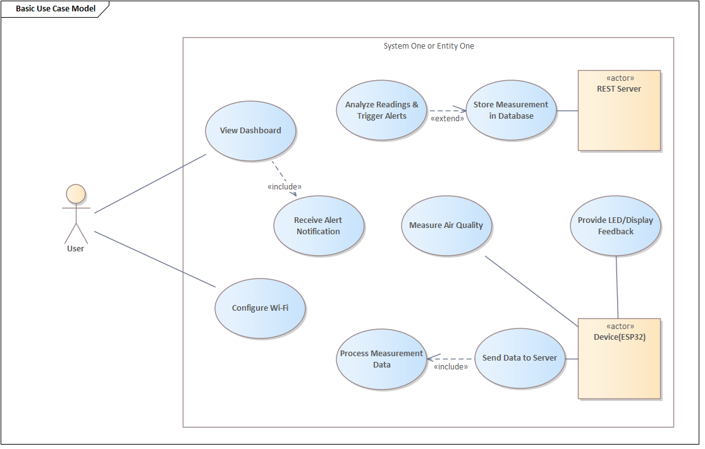

---
# 🧩 Versioning – systém dopĺňa automaticky
fm_version: "1.0.1"

# Dátum buildu – generuje skript
fm_build: "2025-11-28T15:54:47.972406+00:00"

# Poznámka k verzii – voliteľné
fm_version_comment: ""

# 🆔 IDENTITY --------------------------------------------------------

# ID generuje CLI / skript

# Unikátne UUID – generuje skript
guid: "57384df4-f421-45b8-a49f-38456b8de2cb"

# 🧭 CONTEXT ---------------------------------------------------------

# DAO / doména (knife, sdlc, q12, 7ds...) dopĺňa skript
dao: "class_sthdf_dashboard"

# Názov zápisu – dopĺňa používateľ
title: "01 business"

# Krátky popis – dopĺňa používateľ (voliteľné)
description: "{{DESCRIPTION}}"

# 👥 AUTHORSHIP ------------------------------------------------------

# Hlavný autor – z globálneho configu
author: "Roman Kazicka"

# Zoznam autorov – generuje skript
authors:
  - "Roman Kazicka"

# 🗂 CLASSIFICATION ---------------------------------------------------

# Nadradená kategória – môže doplniť používateľ
category: ""

# Typ dokumentu (guide, case, tutorial...) – používateľ (voliteľné)
type: ""

# Priorita (low/medium/high) – voliteľné
priority: ""

# Tagy – odporúča sa 2–6 tagov.
# Typy tagov:
#   - rámce: knife, 7ds, sdlc, q12
#   - účel: tutorial, guide, pattern, case-study
#   - téma: git, backup, ai, communication
#   - úroveň: beginner, intermediate, advanced
tags: []

# 🌍 LOCALIZATION -----------------------------------------------------

# Jazyk dokumentu – doplní skript podľa štruktúry
locale: "sk"

# 🕒 LIFECYCLE --------------------------------------------------------

# Dátum vytvorenia – generuje skript
created: "2025-11-28 16:54"

# Dátum poslednej úpravy – dopĺňa človek
modified: "2025-11-28 16:54"

# Stav dokumentu – default "backlog"
status: "backlog"

# Viditeľnosť – default "public"
privacy: "public"

# ⚖ INTELLECTUAL PROPERTY -------------------------------------------

# Držiteľ práv k obsahu – dopĺňa skript
rights_holder_content: "Roman Kazicka"

# Systémový vlastník práv
rights_holder_system: "CAA / KNIFE / LetItGrow"

# Licencia
license: "CC-BY-NC-SA-4.0"

# Disclaimer
disclaimer: "Use at your own risk. Methods provided as-is; participation is voluntary and context-aware."

# Copyright
copyright: "© 2025 Roman Kazicka"

# 🔗 ORIGIN / PROVENANCE ---------------------------------------------

# Repozitár pôvodu
origin_repo: ""

# URL pôvodného repozitára
origin_repo_url: ""

# Commit pôvodu
origin_commit: ""

# Branch pôvodu
origin_branch: ""

# Systém pôvodu (CAA/KNIFE/STHDF…)
origin_system: "CAA"

# Pôvodný autor
origin_author: "Roman Kazicka"

# Importovaný zdroj
origin_imported_from: ""

# Dátum importu
origin_import_date: ""

# 🧱 RESERVED ---------------------------------------------------------

fm_reserved1: ""
fm_reserved2: ""
---

<!-- class_sthdf_dashboard_INSTANCE_ID: 01-class_sthdf_dashboard_2025-2026 -->

# 01-Business

## Problém
Zvýšená koncentrácia CO₂ a TVOC v interiéroch negatívne ovplyvňuje zdravie, komfort a produktivitu ľudí. Nedostatočné vetranie vedie k únave, zníženej koncentrácii a môže spôsobovať zdravotné problémy.
Dostupné riešenia na trhu sú často drahé, vyžadujú zložitú inštaláciu alebo sú viazané na uzavreté ekosystémy.

## Cieľ projektu
Vyvinúť cenovo dostupné, kompaktné a jednoducho použiteľné zariadenie na monitorovanie kvality ovzdušia, ktoré:

- meria teplotu, vlhkosť, TVOC, eCO₂ a odvodený AQI,
- poskytuje lokálny OLED displej pre okamžitý prehľad,
- umožňuje vzdialený prístup cez webové rozhranie s historickými grafmi.

## Cieľoví používatelia

- Domácnosti – sledovanie kvality vzduchu v obývacích izbách, spálňach.
- Kancelárie – riadenie vetrania podľa koncentrácie CO₂.
- Školy a škôlky – zabezpečenie zdravého prostredia pre deti.
- Malé firmy – monitoring vzduchu v uzavretých priestoroch.

## Prípady použitia

<figure>
  
  <figcaption>Obr.:  Prípady použitia.</figcaption>
</figure>

## Hodnota projektu

- Dostupnosť: nízke náklady, jednoduchá inštalácia, open-source riešenie.
- Prehľadnosť: OLED displej + webová aplikácia (PC & mobil).
- Flexibilita: možnosť rozšírenia o ďalšie senzory alebo funkcie.
- Bezpečnosť: lokálne uloženie dát, žiadne cloudové závislosti.

## Obmedzenia

- Výkon a pamäť ESP32 – nutná optimalizácia kódu.
- Stabilita Wi-Fi pripojenia – závislosť od siete používateľa.
- Presnosť senzorov – vyžaduje kalibráciu pre dlhodobé merania.
- Obmedzený priestor v púzdre – potreba premysleného dizajnu.

## Použitia

- Monitorovanie kvality vzduchu v domácnosti – zlepšenie komfortu.
- Riadenie ventilácie v kancelárii podľa CO₂ – úspora energie.
- Preventívne opatrenia – včasné upozornenie na zhoršenú kvalitu vzduchu.
- Analýza trendov – sledovanie dlhodobých zmien kvality ovzdušia.

- [Business poznámky](./notes.md)

**Navigation:** [⬆️ SDLC](../index.md) · [⬅️ Projekt](../../index.md)
