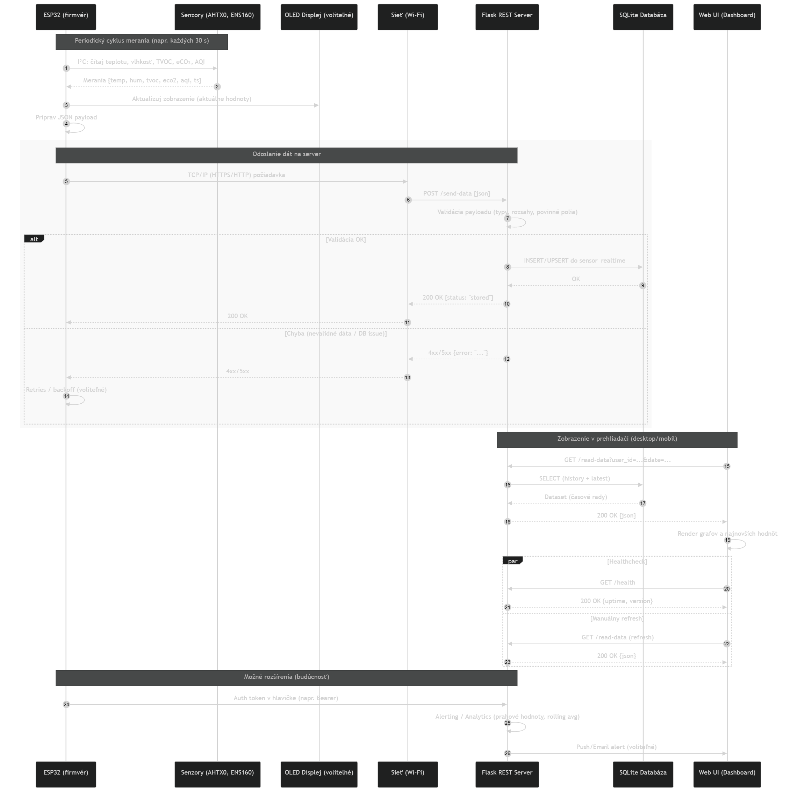

---
# 🧩 Versioning – systém dopĺňa automaticky
fm_version: "1.0.1"

# Dátum buildu – generuje skript
fm_build: "2025-11-28T15:54:47.973767+00:00"

# Poznámka k verzii – voliteľné
fm_version_comment: ""

# 🆔 IDENTITY --------------------------------------------------------

# ID generuje CLI / skript

# Unikátne UUID – generuje skript
guid: "2e06edfe-3bb7-45e5-9a2c-bf2bdf85fea2"

# 🧭 CONTEXT ---------------------------------------------------------

# DAO / doména (knife, sdlc, q12, 7ds...) dopĺňa skript
dao: "class_sthdf_dashboard"

# Názov zápisu – dopĺňa používateľ
title: "03 solution architecture"

# Krátky popis – dopĺňa používateľ (voliteľné)
description: "{{DESCRIPTION}}"

# 👥 AUTHORSHIP ------------------------------------------------------

# Hlavný autor – z globálneho configu
author: "Roman Kazicka"

# Zoznam autorov – generuje skript
authors:
  - "Roman Kazicka"

# 🗂 CLASSIFICATION ---------------------------------------------------

# Nadradená kategória – môže doplniť používateľ
category: ""

# Typ dokumentu (guide, case, tutorial...) – používateľ (voliteľné)
type: ""

# Priorita (low/medium/high) – voliteľné
priority: ""

# Tagy – odporúča sa 2–6 tagov.
# Typy tagov:
#   - rámce: knife, 7ds, sdlc, q12
#   - účel: tutorial, guide, pattern, case-study
#   - téma: git, backup, ai, communication
#   - úroveň: beginner, intermediate, advanced
tags: []

# 🌍 LOCALIZATION -----------------------------------------------------

# Jazyk dokumentu – doplní skript podľa štruktúry
locale: "sk"

# 🕒 LIFECYCLE --------------------------------------------------------

# Dátum vytvorenia – generuje skript
created: "2025-11-28 16:54"

# Dátum poslednej úpravy – dopĺňa človek
modified: "2025-11-28 16:54"

# Stav dokumentu – default "backlog"
status: "backlog"

# Viditeľnosť – default "public"
privacy: "public"

# ⚖ INTELLECTUAL PROPERTY -------------------------------------------

# Držiteľ práv k obsahu – dopĺňa skript
rights_holder_content: "Roman Kazicka"

# Systémový vlastník práv
rights_holder_system: "CAA / KNIFE / LetItGrow"

# Licencia
license: "CC-BY-NC-SA-4.0"

# Disclaimer
disclaimer: "Use at your own risk. Methods provided as-is; participation is voluntary and context-aware."

# Copyright
copyright: "© 2025 Roman Kazicka"

# 🔗 ORIGIN / PROVENANCE ---------------------------------------------

# Repozitár pôvodu
origin_repo: ""

# URL pôvodného repozitára
origin_repo_url: ""

# Commit pôvodu
origin_commit: ""

# Branch pôvodu
origin_branch: ""

# Systém pôvodu (CAA/KNIFE/STHDF…)
origin_system: "CAA"

# Pôvodný autor
origin_author: "Roman Kazicka"

# Importovaný zdroj
origin_imported_from: ""

# Dátum importu
origin_import_date: ""

# 🧱 RESERVED ---------------------------------------------------------

fm_reserved1: ""
fm_reserved2: ""
---

<!-- class_sthdf_dashboard_INSTANCE_ID: 01-class_sthdf_dashboard_2025-2026 -->

# 03-Solution Architecture

### Popis riešenia

Zariadenie ESP32 je centrálnym prvkom systému.

- Na strane hardvéru:
  - ESP32 komunikuje so senzormi AHTX0 (teplota, vlhkosť) a ENS160 (TVOC, eCO₂, AQI) cez I²C zbernicu.
  - Hodnoty sú zobrazované na OLED displeji (SSD1306) pripojenom cez I²C.

- Na strane softvéru:

  - ESP32 periodicky odosiela namerané dáta cez Wi-Fi na Flask REST API vo formáte JSON.
  - Server vykonáva validáciu dát, ukladá ich do SQLite databázy a poskytuje webové rozhranie pre vizualizáciu (grafy, tabuľky, aktuálne hodnoty).

---

### Kľúčové komponenty riešenia

- ESP32 firmware:
  - Zber dát zo senzorov
  - Zobrazenie na OLED displeji
  - Odosielanie dát cez HTTP POST

- Flask server:
  - REST API endpointy (/send-data, /read-data)
  - Ukladanie dát do SQLite
  - Webová aplikácia (HTML, CSS, JS, Chart.js)

- Databáza SQLite:
  - Tabuľky users a sensor_realtime

- Používateľské rozhranie:
  - Responzívny dashboard (PC & mobil)
  - Historické grafy + aktuálne hodnoty

---

### Vývojový diagram
<figure>
  
  <figcaption>Obr.:  Diagram vizualizuje tok riešenia. Mikrokontrolér číta senzorové dáta a vykresľuje na displej. Zároveň ich zasiela v intervaloch cez sieť na server, kde sa ukladajú do databázy. Dáta si môže používa hocikedy prezrieť z PC alebo mobilu.</figcaption>
</figure>

---

### Sekvenčný diagram

<figure>
  
  <figcaption>Obr.:  Sekvenčný diagram komunikácie medzi ESP32, serverom a používateľom. Zahŕňa cyklus merania, odosielania dát, ukladania do DB a načítania pre vizualizáciu.</figcaption>
</figure>

---

### Tok dát

1. Senzory → ESP32: meranie teploty, vlhkosti, TVOC, eCO₂, AQI
2. ESP32 → Server: odosielanie dát cez HTTP POST (JSON)
3. Server → SQLite: ukladanie dát do databázy
4. Web UI → Používateľ: vizualizácia dát (aktuálne hodnoty + historické grafy)

<!-- - [Solution design](./design.md) -->

**Navigation:** [⬆️ SDLC](../index.md) · [⬅️ Projekt](../../index.md)
