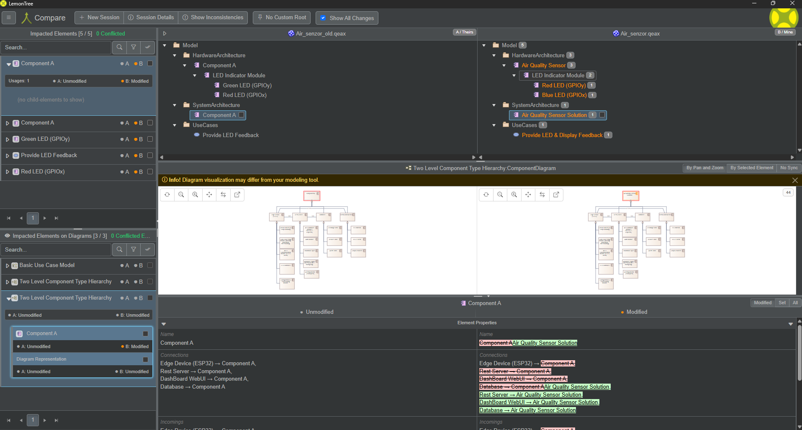

[🏠 Domov](../../../index.md) · [⬅️ Nahor](../index.md)

## EA & Lemontree

Tieto obrázky zobrazujú proces porovnávania a zlúčenia modelov v nástroji Lemontree, ktorý sa používa na správu verzovania modelov vytvorených v Enterprise Architect (EA). Lemontree umožňuje identifikovať rozdiely medzi dvoma verziami modelu, vizualizovať zmeny a vykonať ich zlúčenie.

<figure>
  
  <figcaption>Obr.: Porovnanie dvoch verzií modelu komponentov. V hornej časti sú zobrazené rozdiely v štruktúre modelu (ľavá verzia vs pravá verzia). V strede je vizualizovaný diagram komponentov, kde sú zmenené prvky zvýraznené. V spodnej časti sú detailné vlastnosti vybraného prvku s označením, čo sa zmenilo.</figcaption>
</figure>

<figure>
  
  <figcaption>Obr.: Porovnanie dvoch verzií Use Case diagramu. Lemontree zvýrazňuje zmenené prvky (napr. názvy prípadov použitia) a umožňuje kontrolu rozdielov v atribútoch. V spodnej časti sú zobrazené konkrétne zmeny v názvoch a vlastnostiach.</figcaption>
</figure>

<figure>
  
  <figcaption>Obr.: Porovnanie modulov v hierarchii komponentov. Lemontree zobrazuje rozdiely v štruktúre modulov a ich vlastnostiach. V spodnej časti sú detailné zmeny atribútov (napr. názvy, typy).</figcaption>
</figure>

<figure>
  
  <figcaption>Obr.: Zlúčenie rozdielov medzi dvoma verziami modelu. V hornej časti sú zobrazené tri stĺpce: pôvodná verzia, upravená verzia a cieľová verzia po zlúčení. V strede je vizualizovaný Use Case diagram s vyznačenými zmenami. V spodnej časti sú detailné informácie o zlúčených vlastnostiach.</figcaption>
</figure>

---

**Navigation:** [⬆️ SDLC](../index.md) · [⬅️ Projekt](../../index.md)
