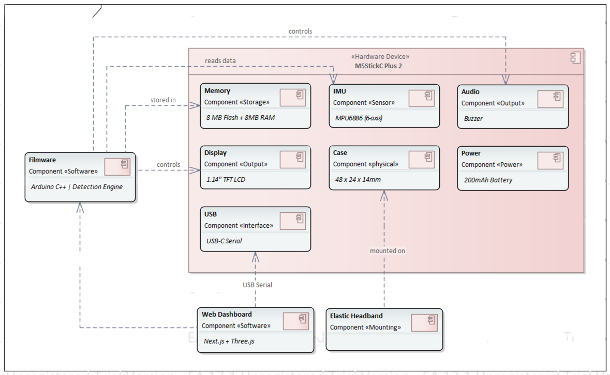

---
# 🧩 Versioning – systém dopĺňa automaticky
fm_version: "1.0.1"

# Dátum buildu – generuje skript
fm_build: "2025-11-28T15:54:47.963728+00:00"

# Poznámka k verzii – voliteľné
fm_version_comment: ""

# 🆔 IDENTITY --------------------------------------------------------

# ID generuje CLI / skript

# Unikátne UUID – generuje skript
guid: "e8bb697f-ac88-40c6-a4a6-add86e8d8ce4"

# 🧭 CONTEXT ---------------------------------------------------------

# DAO / doména (knife, sdlc, q12, 7ds...) dopĺňa skript
dao: "class_sthdf_dashboard"

# Názov zápisu – dopĺňa používateľ
title: "02 top level architecture"

# Krátky popis – dopĺňa používateľ (voliteľné)
description: "{{DESCRIPTION}}"

# 👥 AUTHORSHIP ------------------------------------------------------

# Hlavný autor – z globálneho configu
author: "Roman Kazicka"

# Zoznam autorov – generuje skript
authors:
  - "Roman Kazicka"

# 🗂 CLASSIFICATION ---------------------------------------------------

# Nadradená kategória – môže doplniť používateľ
category: ""

# Typ dokumentu (guide, case, tutorial...) – používateľ (voliteľné)
type: ""

# Priorita (low/medium/high) – voliteľné
priority: ""

# Tagy – odporúča sa 2–6 tagov.
# Typy tagov:
#   - rámce: knife, 7ds, sdlc, q12
#   - účel: tutorial, guide, pattern, case-study
#   - téma: git, backup, ai, communication
#   - úroveň: beginner, intermediate, advanced
tags: []

# 🌍 LOCALIZATION -----------------------------------------------------

# Jazyk dokumentu – doplní skript podľa štruktúry
locale: "sk"

# 🕒 LIFECYCLE --------------------------------------------------------

# Dátum vytvorenia – generuje skript
created: "2025-11-28 16:54"

# Dátum poslednej úpravy – dopĺňa človek
modified: "2025-11-28 16:54"

# Stav dokumentu – default "backlog"
status: "backlog"

# Viditeľnosť – default "public"
privacy: "public"

# ⚖ INTELLECTUAL PROPERTY -------------------------------------------

# Držiteľ práv k obsahu – dopĺňa skript
rights_holder_content: "Roman Kazicka"

# Systémový vlastník práv
rights_holder_system: "CAA / KNIFE / LetItGrow"

# Licencia
license: "CC-BY-NC-SA-4.0"

# Disclaimer
disclaimer: "Use at your own risk. Methods provided as-is; participation is voluntary and context-aware."

# Copyright
copyright: "© 2025 Roman Kazicka"

# 🔗 ORIGIN / PROVENANCE ---------------------------------------------

# Repozitár pôvodu
origin_repo: ""

# URL pôvodného repozitára
origin_repo_url: ""

# Commit pôvodu
origin_commit: ""

# Branch pôvodu
origin_branch: ""

# Systém pôvodu (CAA/KNIFE/STHDF…)
origin_system: "CAA"

# Pôvodný autor
origin_author: "Roman Kazicka"

# Importovaný zdroj
origin_imported_from: ""

# Dátum importu
origin_import_date: ""

# 🧱 RESERVED ---------------------------------------------------------

fm_reserved1: ""
fm_reserved2: ""
---

<!-- class_sthdf_dashboard_INSTANCE_ID: 01-class_sthdf_dashboard_2025-2026 -->

# 02-Top Level Architecture

## Vysokoúrovňová architektúra systému

### System Context Diagram

*Top-Level Architecture - Hlavné komponenty systému Nodyne*

---

## Hlavné komponenty systému

Systém Nodyne pozostáva z **3 hlavných komponentov**:

### 1. Hardware Component (Nositeľné zariadenie)

**Účel:** Fyzické zariadenie nosené vodičom na hlave, ktoré deteguje pohyby hlavy a vydáva alarmy.

**Komponenty:**
- **M5StickC Plus 2**
  - Procesor: ESP32-PICO-V3-02 (240 MHz dual-core)
  - Memory: 8MB PSRAM + 8MB RAM
  - Display: 1.14" TFT LCD (135×240 px)
  - IMU: MPU6886 (6-axis: akcelerometer + gyroskop)
  - Audio: Buzzer/Speaker
  - LED: RGB LED indikátor
  - Batéria: 200mAh Li-Po
  - USB-C: Nabíjanie + Serial komunikácia

- **Elastická čelenka**
  - Materiál: elastická textília
  - Účel: uchytenie zariadenia na čelo vodiča

**Hmotnosť:** ~20g
**Rozmery:** 48×24×14 mm
**Cena:** ~€35

---

### 2. Firmware Component (Arduino firmvér)

**Účel:** Softvér bežiaci na M5StickC Plus 2, ktorý spracováva IMU dáta a deteguje vzory spánku.

**Hlavné moduly:**

#### 2.1 IMU Driver Module
- Inicializácia MPU6886 senzora
- Čítanie akcelerometra a gyroskopu
- Výpočet roll/pitch/yaw pomocou AHRS algoritmu
- Frekvencia: 50Hz (20ms period)

#### 2.2 Calibration Module
- Automatická kalibrácia pri štarte
- Záznam baseline polohy hlavy
- Trvanie: 3 sekundy (50 vzoriek × 60ms)
- Uloženie kalibračných offsetov

#### 2.3 Detection Engine
5 nezávislých detekčných algoritmov:
1. **Strong Nod** - silné prikývnutie
2. **Micro Nods** - mikrokývnutia
3. **Slow Drift** - pomalé kĺzanie
4. **Freeze** - zamrznutie (absencia pohybu)
5. **Side Tilt** - bočný náklon

#### 2.4 Alert System
- Zvukový alarm (buzzer): striedavý tón 1000Hz/1500Hz
- LED signalizácia: červené blikanie
- Display notifikácia: typ alarmu

#### 2.5 Telemetry Module
- JSON formát telemetrie
- Vysielanie cez USB Serial
- Obsahuje: roll, pitch, motion, battery, alerts

---

### 3. Web Dashboard Component

**Účel:** Webová aplikácia pre vizualizáciu telemetrie a kalibráciu (demo účely).

**Technológie:**
- Next.js (frontend framework)
- Web Serial API (komunikácia s zariadením)
- Three.js (3D vizualizácia hlavy)
- Chart.js (grafy telemetrie)

**Hlavné funkcie:**
- Real-time 3D vizualizácia orientácie hlavy
- Grafy roll/pitch v čase
- Štatistiky relácie (počet alarmov, max. náklon)
- Vzdialené príkazy (kalibrácia, reset, stop alarm)

**Poznámka:** Dashboard je **sekundárna funkcia** - zariadenie funguje úplne samostatne bez pripojenia k dashboardu.

---

## Použitie systému

**Scenár 1: Samostatné použitie (Production)**
- M5StickC Plus 2 na hlave vodiča (uchytené čelenkou)
- Zariadenie funguje autonómne
- Alarmy cez reproduktor + LED + display
- Žiadne pripojenie k počítaču

**Scenár 2: S Web Dashboardom (Demo/Kalibrácia)**
- M5StickC Plus 2 pripojený USB káblom k laptopu
- Web dashboard v prehliadači (Chrome/Edge)
- Real-time vizualizácia telemetrie

---

## Technologický stack

### Hardware
| Komponent | Technológia | Špecifikácia |
|-----------|-------------|--------------|
| MCU | ESP32-PICO-V3-02 | 240MHz dual-core, WiFi/BT |
| RAM | PSRAM | 8MB |
| Flash | SPI Flash | 8MB |
| IMU | MPU6886 | 6-axis |
| Display | TFT LCD | 1.14", 135×240 px |
| Audio | Buzzer | PWM driven |
| Battery | Li-Po | 200mAh, 3.7V |

### Firmware
| Layer | Technológia | Účel |
|-------|-------------|------|
| IDE | Arduino IDE | Vývojové prostredie |
| Board Support | M5StickCPlus2 Library | HAL pre M5StickC Plus 2 |
| IMU | MPU6886 Driver | Čítanie senzora |
| AHRS | Custom algorithm | Roll/Pitch výpočet |
| Filtering | EMA | Exponential Moving Average |
| Protocol | JSON | Telemetria formát |

### Web Dashboard
| Layer | Technológia    | Účel |
|-------|----------------|------|
| Frontend | Next.js        | UI |
| Communication | Web Serial API | USB pripojenie |
| 3D Graphics | Three.js       | Vizualizácia hlavy |
| Charts | Chart.js       | Grafy telemetrie |
| Browser | Chrome/Edge    | Web Serial support |

---

## Rozhrania (Interfaces)

### 1. IMU Interface (I2C)
- **Protokol:** I2C
- **Adresa:** 0x68
- **Frekvencia:** 400 kHz (Fast Mode)
- **Registre:**
  - ACCEL_XOUT_H/L, ACCEL_YOUT_H/L, ACCEL_ZOUT_H/L
  - GYRO_XOUT_H/L, GYRO_YOUT_H/L, GYRO_ZOUT_H/L

### 2. USB Serial Interface
- **Fyzické:** USB 2.0 Full Speed (12 Mbps)
- **Protokol:** CDC (Communication Device Class)
- **Baudrate:** 115200 bps
- **Data bits:** 8
- **Parity:** None
- **Stop bits:** 1
- **Flow control:** None

### 3. Display Interface (SPI)
- **Protokol:** SPI
- **Frekvencia:** 40 MHz
- **Driver:** ST7789V
- **Resolution:** 135×240 px
- **Color depth:** 16-bit (RGB565)

### 4. Alert Interfaces
- **Audio:** PWM (variable frequency 500-2000Hz)
- **LED:** GPIO (digital on/off)
- **Display:** SPI (text rendering)

---

## Výkonnostné charakteristiky

| Metrika | Hodnota | Poznámka |
|---------|---------|----------|
| IMU Sampling Rate | 50 Hz | 20ms period |
| Detection Latency | \<500 ms | Od pohybu po detekciu |
| Alarm Latency | \<1000 ms | Od detekcie po alarm |
| Telemetry Rate | 10 Hz | 100ms period |
| Battery Life | 5-8 hodín | Závisí od používania |
| Boot Time | ~2 sekundy | Od zapnutia po ready |
| Calibration Time | 3 sekundy | 50 vzoriek |

---

## Architektúrne rozhodnutia

### 1. Prečo M5StickC Plus 2?
**Výhody:**
- All-in-one riešenie (MCU + IMU + Display + Battery)
- Kompaktné (48×24×14 mm)
- Arduino ekosystém (rýchly vývoj)
- Cenovo dostupné (~€30)

**Alternatívy:**
- Arduino Nano 33 BLE Sense - väčší, vyžaduje externý displej/audio
- Vlastný PCB s ESP32 - vyšší čas vývoja, vyššie náklady

### 2. Prečo USB Serial namiesto Bluetooth/WiFi?
**USB Serial:**
- Nižšia spotreba energie (BT by znížil výdrž na 2-3h)
- Jednoduchšia implementácia
- Stabilnejšie pripojenie
- Dashboard je len demo funkcia

**V budúcnosti:** Bluetooth Low Energy pre mobilnú aplikáciu

### 3. Prečo Web Serial API namiesto desktop app?
**Web Serial API:**
- Žiadna inštalácia softvéru
- Cross-platform (Windows, Mac, Linux)
- Rýchly vývoj
- Jednoduchá distribúcia

**Nevýhoda:** Funguje len v Chrome/Edge

---

## Súlad s požiadavkami

| Biznis požiadavka | Architektúrne riešenie               | Status |
|----------------|--------------------------------------|--|
| Cena ~€35 | M5StickC Plus 2 (€30) + čelenka (€3) |  |
| 5 detekčných algoritmov | Detection Engine s 5 modulmi         |  |
| Real-time upozornenia | Latencia \<1s, Alert System           |  |
| Výdrž 5+ hodín | 200mAh batéria, 5-8h výdrž           |  |
| Jednoduchá kalibrácia | 3s automatická kalibrácia            |  |
| Open-source | Arduino firmvér na GitHub            |  |

---

**Navigation:** [⬅️ Business](../01-business/index.md) · [⬆️ SDLC](../index.md) · [⬅️ Projekt](../../index.md) · [➡️ Solution Architecture](../03-solution-architecture/index.md)
