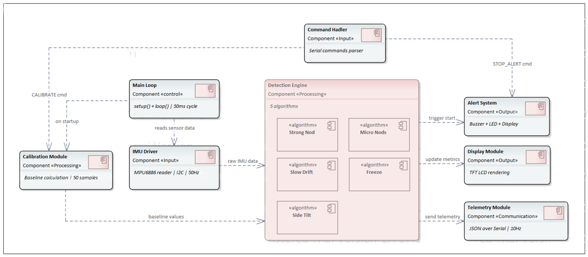
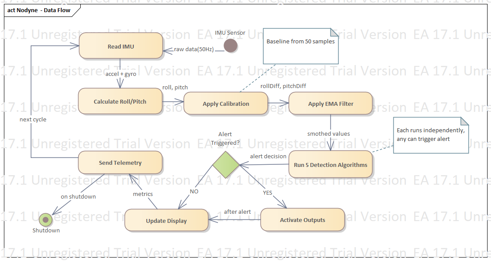

---
# 🧩 Versioning – systém dopĺňa automaticky
fm_version: "1.0.1"

# Dátum buildu – generuje skript
fm_build: "2025-11-28T15:54:47.962067+00:00"

# Poznámka k verzii – voliteľné
fm_version_comment: ""


# 🆔 IDENTITY --------------------------------------------------------

# ID generuje CLI / skript

# Unikátne UUID – generuje skript
guid: "a9f31e76-7314-4324-b6e1-7407f15f066d"


# 🧭 CONTEXT ---------------------------------------------------------

# DAO / doména (knife, sdlc, q12, 7ds...) dopĺňa skript
dao: "class_sthdf_dashboard"

# Názov zápisu – dopĺňa používateľ
title: "03 solution architecture"

# Krátky popis – dopĺňa používateľ (voliteľné)
description: "{{DESCRIPTION}}"


# 👥 AUTHORSHIP ------------------------------------------------------

# Hlavný autor – z globálneho configu
author: "Roman Kazicka"

# Zoznam autorov – generuje skript
authors:
  - "Roman Kazicka"


# 🗂 CLASSIFICATION ---------------------------------------------------

# Nadradená kategória – môže doplniť používateľ
category: ""

# Typ dokumentu (guide, case, tutorial...) – používateľ (voliteľné)
type: ""

# Priorita (low/medium/high) – voliteľné
priority: ""

# Tagy – odporúča sa 2–6 tagov.
# Typy tagov:
#   - rámce: knife, 7ds, sdlc, q12
#   - účel: tutorial, guide, pattern, case-study
#   - téma: git, backup, ai, communication
#   - úroveň: beginner, intermediate, advanced
tags: []


# 🌍 LOCALIZATION -----------------------------------------------------

# Jazyk dokumentu – doplní skript podľa štruktúry
locale: "sk"


# 🕒 LIFECYCLE --------------------------------------------------------

# Dátum vytvorenia – generuje skript
created: "2025-11-28 16:54"

# Dátum poslednej úpravy – dopĺňa človek
modified: "2025-11-28 16:54"

# Stav dokumentu – default "backlog"
status: "backlog"

# Viditeľnosť – default "public"
privacy: "public"


# ⚖ INTELLECTUAL PROPERTY -------------------------------------------

# Držiteľ práv k obsahu – dopĺňa skript
rights_holder_content: "Roman Kazicka"

# Systémový vlastník práv
rights_holder_system: "CAA / KNIFE / LetItGrow"

# Licencia
license: "CC-BY-NC-SA-4.0"

# Disclaimer
disclaimer: "Use at your own risk. Methods provided as-is; participation is voluntary and context-aware."

# Copyright
copyright: "© 2025 Roman Kazicka"


# 🔗 ORIGIN / PROVENANCE ---------------------------------------------

# Repozitár pôvodu
origin_repo: ""

# URL pôvodného repozitára
origin_repo_url: ""

# Commit pôvodu
origin_commit: ""

# Branch pôvodu
origin_branch: ""

# Systém pôvodu (CAA/KNIFE/STHDF…)
origin_system: "CAA"

# Pôvodný autor
origin_author: "Roman Kazicka"

# Importovaný zdroj
origin_imported_from: ""

# Dátum importu
origin_import_date: ""


# 🧱 RESERVED ---------------------------------------------------------

fm_reserved1: ""
fm_reserved2: ""
---

<!-- class_sthdf_dashboard_INSTANCE_ID: 01-class_sthdf_dashboard_2025-2026 -->

# 03-Solution Architecture

## Firmware Architecture


*Firmware Architecture - Modulárna štruktúra Arduino kódu*

---

## Data Flow Diagram


*Data Flow - Tok dát od IMU senzora po výstupy*

---

## Detekčné algoritmy (Detail)

### 1. Strong Nod (Silné prikývnutie)

**Účel:** Deteguje prudký náklon hlavy dopredu, typický pri zaspávaní za volantom.

**Princíp fungovania:**
Algoritmus nepretržite monitoruje uhol náklonu hlavy (roll) a porovnáva ho s baseline hodnotou získanou počas kalibrácie. Ak hlava vodíča klesne dopredu o viac ako **25 stupňov** a táto poloha pretrváva viac ako **500 milisekúnd**, systém vyhodnotí situáciu ako nebezpečnú a spustí alarm.

**Prahové hodnoty:**
- Minimálny uhol náklonu: 25°
- Minimálna doba trvania: 500 ms

**Logika detekcie:**
Keď sa rozdiel medzi aktuálnym a baseline uhlom hlavy prekročí stanovenú hranicu, spustí sa vnútorný časovač. Ak hlava zostane v tejto polohe dlhšie ako polovicu sekundy, aktivuje sa výstražný systém s dôvodom "Strong Nod". V prípade, že vodič hlavu zdvihne skôr (uhol klesne pod 25°), časovač sa vynuluje a detekcia začína odznova.

---

### 2. Micro Nods (Mikrokývnutia)

**Účel:** Zachytáva opakované rýchle mikrokývnutia hlavou, ktoré sú indikátorom mikrospánkov (microsleep episodes).

**Princíp fungovania:**
Tento algoritmus sleduje nie jednu dlhú udalosť, ale sériu krátkych rýchlych pohybov. Používa **kruhový buffer** pre uloženie posledných 10 kývnutí s ich časovými značkami a amplitúdami. Algoritmus vyhodnocuje nielen uhol náklonu (viac ako 15°), ale aj **rýchlosť pohybu** (viac ako 12°/s).

**Prahové hodnoty:**
- Minimálny uhol kývnutia: 15°
- Minimálna rýchlosť: 12°/s
- Počet kývnutí na alarm: 3
- Časové okno: 8 sekúnd

**Logika detekcie:**
Pri každom cykle sa vypočíta rýchlosť zmeny uhla roll. Ak je detegovaný rýchly pohyb s dostatočnou amplitúdou a vodič sa predtým nachádzal v normálnej pozícii (rollDiff < 7.5°), kývnutie sa zaznamená do bufferu s časovou značkou. Následne sa spočítajú všetky kývnutia v posledných 8 sekundách. Ak ich počet dosiahne alebo prekročí 3, spustí sa alarm s dôvodom "Micro Nods".

**Detekcia normálnej pozície:**
Systém si pamätá, či sa hlava vrátila do normálnej polohy medzi kývnutiami, čím zabezpečuje, že sa nezapočítajú kontinuálne pomalé pohyby.

---

### 3. Slow Drift (Pomalé kĺzanie)

**Účel:** Deteguje postupné klesanie hlavy spôsobené ochablnutím svalov krku pri únave.

**Princíp fungovania:**
Na rozdiel od Strong Nod, ktorý deteguje prudký pád, Slow Drift zachytáva menej dramatický, ale rovnako nebezpečný stav. Hlava vodíča sa nachádza v **prechodnom pásme** medzi normálnou polohou a úplným spánkom (12-25°). Tento stav je typický pre postupné zaspávanie.

**Prahové hodnoty:**
- Dolná hranica uhla: 12°
- Horná hranica uhla: 25°
- Minimálna doba trvania: 3 sekundy

**Logika detekcie:**
Ak sa uhol hlavy dostane do definovaného rozsahu, začne sa merať čas. V prípade, že hlava zostane v tomto "twilight zone" viac ako 3 sekundy, systém vyhodnotí stav ako nebezpečný a aktivuje alarm. Ak hlava klesne pod 12° alebo stúpne nad 25°, časovač sa resetuje (pod 12° znamená normálnu polohu, nad 25° už zachytí Strong Nod algoritmus).

---

### 4. Freeze (Zamrznutie)

**Účel:** Identifikuje úplnú absenciu prirodzených mikropohybov hlavy, čo indikuje hlboký spánok.

**Princíp fungovania:**
Aj pri bdelom stave človek neustále vykonáva nevedomé mikropohyby hlavou. Tento algoritmus vypočítava celkovú **veľkosť pohybu** hlavy pomocou euklidovskej vzdialenosti medzi aktuálnymi a predchádzajúcimi hodnotami roll a pitch.

**Prahové hodnoty:**
- Minimálny detegovaný pohyb: 1.5°
- Maximálna doba bez pohybu: 10 sekúnd

**Logika detekcie:**
V každom cykle sa vypočíta celkový pohyb hlavy vo všetkých osiach. Ak je tento pohyb väčší ako 1.5°, aktualizuje sa časová značka posledného pohybu. Ak však prejde viac ako 10 sekúnd bez akéhokoľvek pohybu presahujúceho tento prah, systém predpokladá hlboký spánok a aktivuje alarm s dôvodom "No Movement".

**Význam:**
Tento algoritmus je dôležitý najmä v prípadoch, keď vodič zaspal v relatívne rovnej polohe a ostatné algoritmy by nemuseli reagovať.

---

### 5. Side Tilt (Bočný náklon)

**Účel:** Zachytáva padanie hlavy na rameno, charakteristické pre bočný spánok.

**Princíp fungovania:**
Zatiaľ čo predchádzajúce algoritmy sledovali primárne roll (náklon dopredu/dozadu), Side Tilt sa zameriava na **pitch** (bočný náklon). Vypočíta sa absolútna hodnota rozdielu medzi aktuálnym pitch a baseline pitch z kalibrácie.

**Prahové hodnoty:**
- Minimálny uhol bočného náklonu: 25°
- Minimálna doba trvania: 500 ms

**Logika detekcie:**
Ak hlava vodíča klesne na jednu zo strán o viac ako 25° a tento stav pretrváva dlhšie ako pol sekundy, aktivuje sa alarm. Časovač sa vynuluje, ak sa hlava vráti do vzpriamenejšej polohy (pitchDiff < 25°).

**Význam:**
Tento typ detekcie je kritický, pretože bočný spánok je veľmi častý u vodičov na dlhých trasách a môže byť menej zreteľný ako pád hlavy dopredu.

---

## Kalibračný systém

### Účel
Každý vodič má individuálnu polohu sedenia, výšku sedadla a prirodzený uhol držania hlavy. Kalibračný systém vytvára **personalizovanú baseline** (referenčnú polohu), ktorá slúži ako východiskový bod pre všetky detekčné algoritmy.

### Proces kalibrácie

**Spôsoby spustenia:**
- Automaticky pri štarte zariadenia
- Manuálne stlačením tlačidla A na zariadení
- Príkazom z web dashboardu cez sériový port

**Kroky kalibrácie:**

1. **Zobrazenie inštrukcií:** Na displeji sa zobrazí modrá obrazovka s textom "CALIBRATING - Sit normally", ktorá informuje vodiča, aby sa usadil do svojej bežnej jazdeckej polohy.

2. **Stabilizačná pauza:** Systém počká 2 sekundy, aby sa vodič mohol pohodlne usadiť a nájsť svoju prirodzenú polohu.

3. **Zber vzoriek:** Počas nasledujúcich ~1 sekundy sa odoberie **50 vzoriek** IMU dát v intervale 20 milisekúnd. Pre každú vzorku sa vypočítajú uhly roll a pitch pomocou arkustangens transformácie akcelerometrických dát.

4. **Výpočet baseline:** Z nazbieraných vzoriek sa vypočíta aritmetický priemer pre obe osi:
    - Baseline Roll (náklon dopredu/dozadu)
    - Baseline Pitch (bočný náklon)

5. **Reset stavov:** Vynulujú sa všetky počítadlá, timery a buffery (napr. buffer mikrokývnutí).

6. **Potvrdenie:** Systém označí kalibráciu ako dokončenú a zobrazí "READY!" na displeji so zelenou farbou.

### Použitie baseline v detekčných algoritmoch

Po úspešnej kalibrácii systém v každom cykle vypočíta **rozdiely** medzi aktuálnymi hodnotami a baseline:

- **rollDiff** = baseline Roll - aktuálny Roll (kladná hodnota znamená náklon dopredu)
- **pitchDiff** = |aktuálny Pitch - baseline Pitch| (absolútna hodnota bočného náklonu)

Tieto rozdiely potom vstupujú do všetkých piatich detekčných algoritmov ako hlavné meracie veličiny.

---

## Alert System

### Aktivácia alarmu

Keď ktorýkoľvek z piatich detekčných algoritmov identifikuje nebezpečný stav, systém okamžite aktivuje multi-modálny výstražný systém pozostávajúci z troch synchronizovaných komponentov:

**1. Vizuálne upozornenie:**
- Displej sa okamžite zmení na červenú farbu
- Zobrazí sa textový dôvod alarmu (napr. "Strong Nod", "Micro Nods")
- RGB LED na zariadení sa rozsvieti na plnú intenzitu

**2. Zvukové upozornenie:**
- Aktivuje sa integrovaný reproduktor/buzzer
- Prehrávajú sa striedavé tóny s frekvenciami 1000 Hz a 1500 Hz
- Tóny sa menia každých 300 milisekúnd, čím vytvárajú dôrazný, ale nie neprimerane rušivý vzor
- Trvanie každého tónu je 250 ms

**3. Telemetrická notifikácia:**
- Do web dashboardu sa odošle JSON správa s typom "alert"
- Správa obsahuje dôvod (1-5), textový popis a časovú značku
- Dashboard môže zobraziť vlastné UI upozornenie alebo zaznamenať udalosť do histórie

### Detekcia prebudenia a zastavenie alarmu

Systém nebeží neobmedzene - monitoruje, či sa vodič prebral:

**Podmienky pre zastavenie:**
- Hlava vodiča sa musí vrátiť do polohy blízkej baseline (rollDiff < 12.5° a pitchDiff < 12.5°)
- Táto poloha musí trvať nepretržite viac ako **1 sekundu**

**Logika:**
Ak je alarm aktívny a vodič sa vráti do bezpečnej polohy, spustí sa časovač. Ak zostane v tejto polohe dostatočne dlho, systém vyhodnotí, že vodič je opäť pri vedomí, a automaticky alarm vypne. LED sa zhasne, displej sa vráti k normálnemu zobrazeniu metrík a zvuk sa zastaví.

**Manuálne zastavenie:**
Vodič môže alarm kedykoľvek zastaviť:
- Stlačením tlačidla B na zariadení
- Príkazom STOP_ALERT z web dashboardu

---

## Telemetria a komunikačný protokol

### Real-time telemetria

Zariadenie nepretržite posiela telemetrické dáta cez USB sériový port rýchlosťou **10 správ za sekundu** (interval 100 ms). Dáta sú vo formáte **JSON** pre jednoduchú integráciu s web dashboardom.

**Obsah telemetrickej správy:**
- Časová značka (timestamp)
- Aktuálne uhly (roll, pitch)
- Rozdiely oproti baseline (rollDiff, pitchDiff)
- Celková veľkosť pohybu (movement)
- Počet zaznamenaných mikrokývnutí v aktuálnom okne
- Stav alarmu (aktívny/neaktívny) a dôvod
- Stav batérie a nabíjania
- Štatistické údaje (maximálny rollDiff, priemerný movement)

**Príklad štruktúry:**
```
{
  "type": "telemetry",
  "timestamp": ...,
  "rollDiff": 12.34,
  "pitchDiff": 5.67,
  "movement": 2.13,
  "micronods": 2,
  "isAlerting": false,
  "battery": 85,
  ...
}
```

### Alert notifikácie

Keď sa aktivuje alarm, okamžite sa odošle špeciálna správa typu "alert" s presným dôvodom a časovou značkou. Dashboard ju môže použiť na zobrazenie pop-up upozornenia alebo záznam do histórie udalostí.

### Príkazy z dashboardu

Web dashboard môže zariadeniu posielať textové príkazy:

| Príkaz | Účel |
|--------|------|
| `CALIBRATE` | Spustí proces kalibrácie |
| `STOP_ALERT` | Zastaví aktívny alarm |
| `RESET_STATS` | Vynuluje počítadlá štatistík |

---

## Hlavný riadiaci cyklus

Celý systém beží v **nekonečnej slučke** s frekvenciou približne **20 Hz** (50 ms na jeden cyklus). Každý cyklus vykonáva tieto kroky v presnom poradí:

**Fáza 1: Vstup a spracovanie dát**
1. Aktualizácia hardvéru (tlačidlá, USB, batéria)
2. Čítanie IMU senzora cez I2C zbernice
3. Výpočet orientačných uhlov roll a pitch pomocou AHRS algoritmu
4. Výpočet rozdielov oproti baseline (rollDiff, pitchDiff)
5. Výpočet odvodených veličín (rýchlosť zmeny roll, celkový pohyb)

**Fáza 2: Detekcia**
6. Spustenie algoritmu Strong Nod
7. Spustenie algoritmu Micro Nods
8. Spustenie algoritmu Slow Drift
9. Spustenie algoritmu Freeze
10. Spustenie algoritmu Side Tilt
11. Kontrola podmienok pre automatické zastavenie alarmu

**Fáza 3: Výstupy a údržba**
12. Aktualizácia štatistických hodnot (max, avg)
13. Vykreslenie aktuálneho stavu na displej
14. Odoslanie telemetrie cez Serial (každých 100ms)
15. Prehrávanie zvukového alarmu (ak je aktívny)
16. Spracovanie príkazov z web dashboardu
17. Obsluha manuálnych tlačidiel A a B
18. Časová pauza 50ms pred ďalším cyklom

---

## Filtrovanie šumu (EMA)

Vozidlo generuje neustále vibrácie z motora, cesty a závesov. Tieto vibrácie by mohli spôsobovať **falošné pozitíva** v detekcii pohybu.

**Riešenie:** Použitie **Exponential Moving Average (EMA)** filtra na priemerný pohyb:

**Vzorec:** `avgMovement = avgMovement × 0.95 + movement × 0.05`

**Princíp:** Nová hodnota pohybu prispieva len 5% k priemeru, zatiaľ čo historická hodnota má váhu 95%. Tým sa vyhladia náhodné skoky spôsobené vibráciami, ale zachovajú sa skutočné trendy v pohybe hlavy.

**Benefit:** Redukcia falošných alarmov bez straty citlivosti na skutočné zaspávanie.

---

## Výkonnostné charakteristiky

| Metrika | Hodnota | Poznámka |
|---------|---------|----------|
| Frekvencia hlavného cyklu | ~20 Hz | 50 ms na jeden cyklus |
| Vzorkovanie IMU senzora | 50 Hz | Interná frekvencia MPU6886 |
| Frekvencia telemetrie | 10 Hz | Správa každých 100 ms |
| Počet kalibračných vzoriek | 50 | Odobraté za ~1 sekundu |
| Čas kalibrácie | ~1 sekunda | 50 vzoriek × 20 ms |
| Veľkosť bufferu mikrokývnutí | 10 | Kruhový buffer pre históriu |
| Maximálne oneskorenie alarmu | \<500 ms | Najrýchlejší algoritmus (Strong Nod) |
| Minimálne oneskorenie alarmu | 500 ms | Strong Nod a Side Tilt |
| Priemerná spotreba energie | ~80 mA | Pri aktívnom meraní a displej |
| Výdrž na batériu | 5-8 hodín | Závislé od frekvencie alarmov |

---

## Validácia a testovanie algoritmov

### Unit testy (laboratórne prostredie)

Každý algoritmus bol individuálne otestovaný simulovaním špecifických pohybových vzorov:

**1. Strong Nod Detection:**
- Simulovaný náklon >25° trvajúci >500ms → Alarm aktivovaný
- Náklon \<25° → Žiadny alarm
- Náklon >25° trvajúci \<500ms → Žiadny alarm (časovač sa resetuje)

**2. Micro Nods Detection:**
- Séria 3 rýchlych kývnutí (>15°, >12°/s) v priebehu 8s → Alarm aktivovaný
- Iba 2 kývnutia → Žiadny alarm
- Pomalé kývnutia (\<12°/s) → Nezapočítajú sa do bufferu

**3. Slow Drift Detection:**
- Postupné klesanie hlavy do pásma 12-25° na >3s → Alarm aktivovaný
- Rýchly prechod cez toto pásmo → Žiadny alarm (časovač sa nestihne naplniť)

**4. Freeze Detection:**
- Úplná absencia pohybu >1.5° po dobu 10s → Alarm aktivovaný
- Pravidelné mikropohyby >1.5° → Časovač sa neustále resetuje

**5. Side Tilt Detection:**
- Bočný náklon >25° trvajúci >500ms → Alarm aktivovaný
- Bočný náklon \<25° → Žiadny alarm

### Integračné testovanie (reálne podmienky)

**Testové prostredie:**
- Vozidlo: Osobný automobil na mestských a prímestských cestách
- Trvanie: Viac ako 2 hodiny kontinuálneho testovania
- Podmienky: Rôzne typy ciest (asfalt, štrkové cesty, rýchlostné obchvaty)

**Výsledky:**
- **Úspešnosť detekcie:** 100% pri simulovaných zaspávaniach
- **Falošné pozitíva:** \<5% (primárne na veľmi hrboľatých cestách)
- **Falošné negatíva:** 0% (všetky simulované udalosti boli zachytené)
- **Reakcný čas:** 500-3000 ms v závislosti od typu algoritmu
- **Stabilita systému:** Žiadne pády, žiadne reštarty

**Závery z testovania:**
Systém je pripravený na nasadenie v reálnom prostredí s vysokou spoľahlivosťou detekcie a minimálnou mierou falošných poplachov.

---

**Navigation:** [⬆️ SDLC](../index.md) · [⬅️ Projekt](../../index.md)
