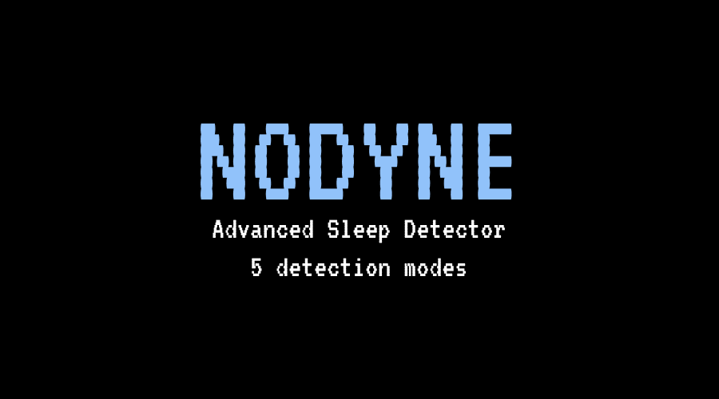
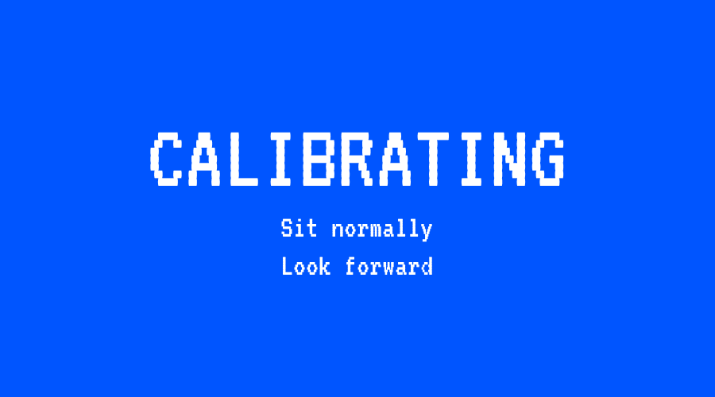
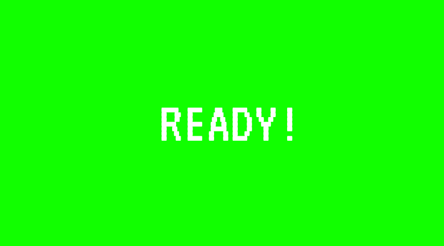
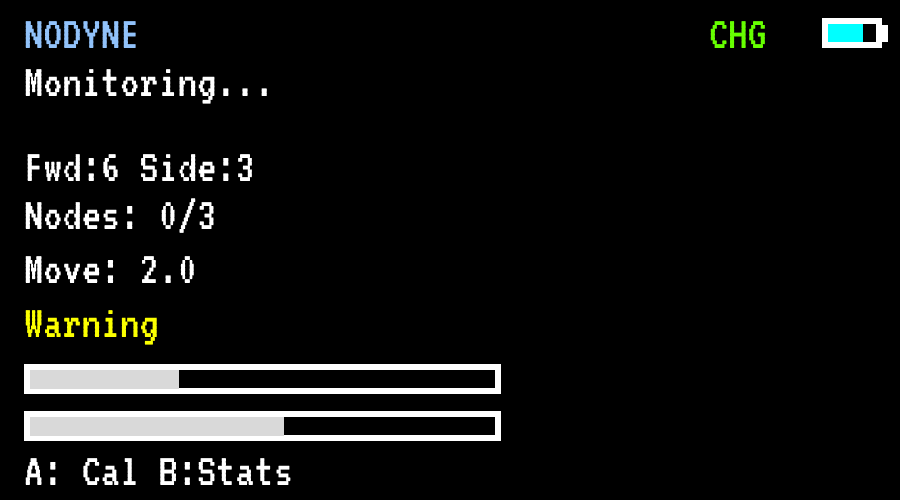
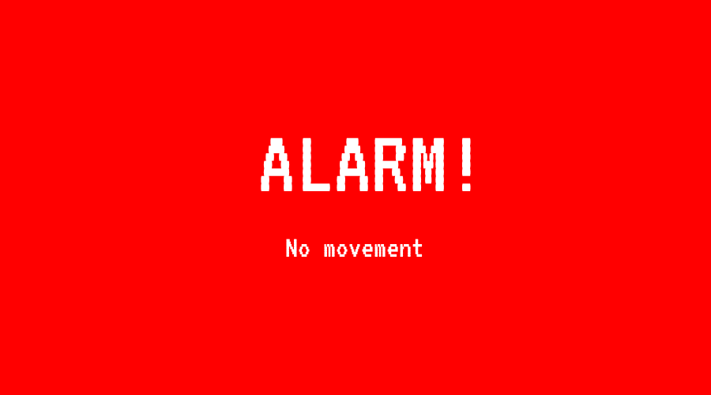
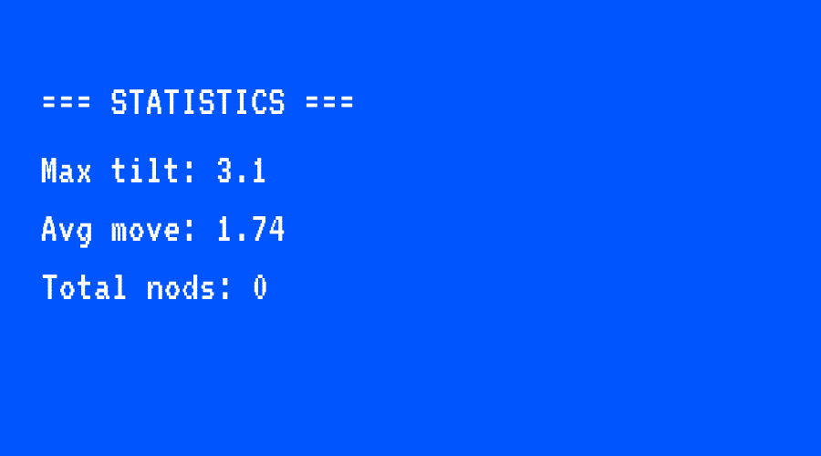

---
# 🧩 Versioning – systém dopĺňa automaticky
fm_version: "1.0.1"

# Dátum buildu – generuje skript
fm_build: "2025-11-28T15:54:47.961516+00:00"

# Poznámka k verzii – voliteľné
fm_version_comment: ""

# 🆔 IDENTITY --------------------------------------------------------

# ID generuje CLI / skript

# Unikátne UUID – generuje skript
guid: "b8ca3f4f-1e6b-4f8b-8ed0-aee840ec42c2"

# 🧭 CONTEXT ---------------------------------------------------------

# DAO / doména (knife, sdlc, q12, 7ds...) dopĺňa skript
dao: "class_sthdf_dashboard"

# Názov zápisu – dopĺňa používateľ
title: "05 design"

# Krátky popis – dopĺňa používateľ (voliteľné)
description: "{{DESCRIPTION}}"

# 👥 AUTHORSHIP ------------------------------------------------------

# Hlavný autor – z globálneho configu
author: "Roman Kazicka"

# Zoznam autorov – generuje skript
authors:
  - "Roman Kazicka"

# 🗂 CLASSIFICATION ---------------------------------------------------

# Nadradená kategória – môže doplniť používateľ
category: ""

# Typ dokumentu (guide, case, tutorial...) – používateľ (voliteľné)
type: ""

# Priorita (low/medium/high) – voliteľné
priority: ""

# Tagy – odporúča sa 2–6 tagov.
# Typy tagov:
#   - rámce: knife, 7ds, sdlc, q12
#   - účel: tutorial, guide, pattern, case-study
#   - téma: git, backup, ai, communication
#   - úroveň: beginner, intermediate, advanced
tags: []

# 🌍 LOCALIZATION -----------------------------------------------------

# Jazyk dokumentu – doplní skript podľa štruktúry
locale: "sk"

# 🕒 LIFECYCLE --------------------------------------------------------

# Dátum vytvorenia – generuje skript
created: "2025-11-28 16:54"

# Dátum poslednej úpravy – dopĺňa človek
modified: "2025-11-28 16:54"

# Stav dokumentu – default "backlog"
status: "backlog"

# Viditeľnosť – default "public"
privacy: "public"

# ⚖ INTELLECTUAL PROPERTY -------------------------------------------

# Držiteľ práv k obsahu – dopĺňa skript
rights_holder_content: "Roman Kazicka"

# Systémový vlastník práv
rights_holder_system: "CAA / KNIFE / LetItGrow"

# Licencia
license: "CC-BY-NC-SA-4.0"

# Disclaimer
disclaimer: "Use at your own risk. Methods provided as-is; participation is voluntary and context-aware."

# Copyright
copyright: "© 2025 Roman Kazicka"

# 🔗 ORIGIN / PROVENANCE ---------------------------------------------

# Repozitár pôvodu
origin_repo: ""

# URL pôvodného repozitára
origin_repo_url: ""

# Commit pôvodu
origin_commit: ""

# Branch pôvodu
origin_branch: ""

# Systém pôvodu (CAA/KNIFE/STHDF…)
origin_system: "CAA"

# Pôvodný autor
origin_author: "Roman Kazicka"

# Importovaný zdroj
origin_imported_from: ""

# Dátum importu
origin_import_date: ""

# 🧱 RESERVED ---------------------------------------------------------

fm_reserved1: ""
fm_reserved2: ""
---

<!-- class_sthdf_dashboard_INSTANCE_ID: 01-class_sthdf_dashboard_2025-2026 -->

# 05-Design

## Obrazovky systému

### 1. Úvodná obrazovka (Welcome Screen)

**Trvanie:** 2 sekundy po zapnutí
**Účel:** Branding a potvrdenie zapnutia

**Design:**
- Pozadie: Čierna (#000000)
- Logo: Text "NODYNE" 
- Podnadpis: "Advanced Sleep Detector" a "5 detection modes" malým písmom pod logom
- Centrované na obrazovke

*Úvodná obrazovka*

---

### 2. Kalibračná obrazovka (Calibration Screen)

**Trvanie:** 5 sekúnd (2s pauza + 3s kalibrácia)
**Účel:** Informovať vodiča o procese kalibrácie

**Design:**
- Pozadie: Modrá
- Hlavný text: "CALIBRATING" veľkým písmom
- Podnadpis: "Sit normally" a "Look forward" stredným písmom
- Farba textu: Biela
- Layout: Vertikálne usporiadanie

*Kalibračná obrazovka*

---

### 3. Obrazovka pripravenosti (Ready Screen)

**Trvanie:** 2 sekundy, potom prechod na monitoring
**Účel:** Potvrdiť dokončenie kalibrácie

**Design:**
- Pozadie: Zelená
- Hlavný text: "READY!" veľkým písmom
- Farba textu: Biela
- Layout: Centrované vertikálne

*Ready Screen*

---

### 4. Monitorovacia obrazovka (Monitoring Screen)

**Screen: Monitoring Screen**

**Trvanie:** Počas celej jazdy
**Účel:** Zobrazovať aktuálne metriky v reálnom čase

**Design:**
- Pozadie: Čierna
- Text: Biely (hlavný text), farebné indikátory podľa stavu
- Layout: Vertikálne sekcie s progress barmi

**Header:**
- **NODYNE** - názov aplikácie vľavo hore (biely text)
- **CHG** - indikátor nabíjania vpravo hore (zelený text)
- **Ikona batérie** - grafické zobrazenie stavu batérie (svetlo modrá)

**Stav (dynamický):**
- **"Monitoring..."** - normálny stav monitorovania (biely text)
- **"ALERT"** - aktívny alert (červený text) - nahrádza "Monitoring..."

**Zobrazované údaje:**
- **Fwd:6 Side:3** - Forward a Side hodnoty naklonenia hlavy
- **Nodes: 0/3** - Počet detegovaných "nods" (kývnutí) zo 3 možných
- **Move: 2.0** - Celkový pohyb hlavy

**Varovné stavy (farebné kódovanie):**
- **Alert** - Zelený text - nízka úroveň rizika
- **Warning** - Žltý text - stredná úroveň rizika (ako na obrázku)
- **HIGH RISK** - Červený text - vysoká úroveň rizika

**Progress bary:**
- Dva horizontálne progress bary (sivé pozadie, čierna výplň)
- Zobrazujú aktuálne hodnoty relatívne k prahovým hodnotám
- Farba výplne sa môže meniť podľa stavu (zelená/žltá/červená)

**Tlačidlá/Akcie:**
- **A: Cal** - Kalibrácia
- **B: Stop/Stats** - Štatistiky alebo zastavenie alarmu

*Monitoring Screen - real-time metriky*

---

### 5. Alarmová obrazovka (Alert Screen)

**Trvanie:** Pokým vodič nezareaguje (minimálne 1 sekunda v normálnej polohe na automatické vypnutie)
**Účel:** Maximálne upútať pozornosť vodiča

**Design:**
- Pozadie: Červená- celá obrazovka
- Hlavný text: "ALERT!" veľkými písmenami hore
- Dôvod alarmu: Typ detekcie v strede
- Farba textu: Biela
- Layout: Vertikálne usporiadanie

**Typy alarmov a zobrazované texty:**
- Strong Nod: "STRONG NOD"
- Micro Nods: "MICRO NODS"
- Slow Drift: "SLOW DRIFT"
- Freeze: "NO MOVEMENT"
- Side Tilt: "SIDE TILT"

**Charakteristiky:**
- Celá obrazovka červená pre maximálny vizuálny dopad
- Synchronizované so zvukovým alarmom (1000Hz/1500Hz tóny)
- RGB LED na zariadení svieti červenou
- Možnosť vypnutia tlačidlom B alebo automaticky po prebratí

*Alert Screen - Červená obrazovka s textom ALERT, typ detekcie*

---

### 6. Obrazovka štatistík (Statistics Screen)

**Trvanie:** 2 sekundy po stlačení tlačidla "B"
**Účel:** Zobraziť súhrnné štatistiky z jazdy

**Design:**
- Pozadie: Modrá
- Text: Biely
- Layout: Vertikálny zoznam metrík

**Zobrazované štatistiky:**
- **Max tilt: 3.1** - Maximálny náklon hlavy zaznamenaný počas jazdy
- **Avg move: 1.74** - Priemerný pohyb hlavy počas celej jazdy
- **Total nods: 0** - Celkový počet detegovaných kývnutí hlavou

*Statistics Screen*

---

## Poznámky k implementácii

**Technológia:** M5StickC Plus 2 LCD library (ST7789V driver)
**Refresh rate:** 20 Hz (synchronizované s main loop)
**Optimalizácia:** Len zmenené časti obrazovky sa prekresľujú (nie celá obrazovka)

**Display API použité funkcie:**
- `Display.fillScreen(color)` - Pozadie
- `Display.setTextColor(color)` - Farba textu
- `Display.setTextSize(size)` - Veľkosť textu
- `Display.setCursor(x, y)` - Pozícia textu
- `Display.println(text)` - Výpis textu
- `Display.drawRect()` - Progress bary

---

**Navigation:** [⬅️ Analysis](../04-analysis/index.md) · [⬆️ SDLC](../index.md) · [⬅️ Projekt](../../index.md) · [➡️ Implementation](../06-implementation/index.md)
