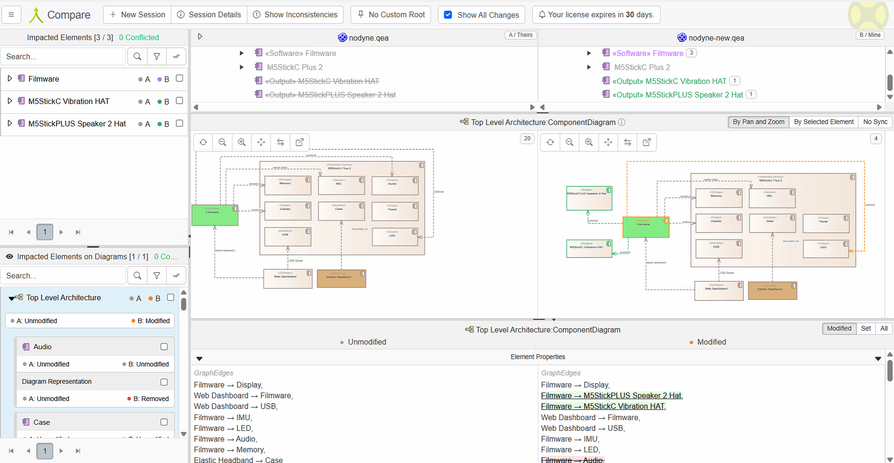

---
# 🧩 Versioning – systém dopĺňa automaticky
fm_version: "1.0.1"

# Dátum buildu – generuje skript
fm_build: "2025-11-28T15:54:47.961786+00:00"

# Poznámka k verzii – voliteľné
fm_version_comment: ""

# 🆔 IDENTITY --------------------------------------------------------

# ID generuje CLI / skript

# Unikátne UUID – generuje skript
guid: "eb99e161-09a4-4a29-af5a-30ea378bf012"

# 🧭 CONTEXT ---------------------------------------------------------

# DAO / doména (knife, sdlc, q12, 7ds...) dopĺňa skript
dao: "class_sthdf_dashboard"

# Názov zápisu – dopĺňa používateľ
title: "09 Change Management"

# Krátky popis – dopĺňa používateľ (voliteľné)
description: "{{DESCRIPTION}}"

# 👥 AUTHORSHIP ------------------------------------------------------

# Hlavný autor – z globálneho configu
author: "Roman Kazicka"

# Zoznam autorov – generuje skript
authors:
  - "Roman Kazicka"

# 🗂 CLASSIFICATION ---------------------------------------------------

# Nadradená kategória – môže doplniť používateľ
category: ""

# Typ dokumentu (guide, case, tutorial...) – používateľ (voliteľné)
type: ""

# Priorita (low/medium/high) – voliteľné
priority: ""

# Tagy – odporúča sa 2–6 tagov.
# Typy tagov:
#   - rámce: knife, 7ds, sdlc, q12
#   - účel: tutorial, guide, pattern, case-study
#   - téma: git, backup, ai, communication
#   - úroveň: beginner, intermediate, advanced
tags: []

# 🌍 LOCALIZATION -----------------------------------------------------

# Jazyk dokumentu – doplní skript podľa štruktúry
locale: "sk"

# 🕒 LIFECYCLE --------------------------------------------------------

# Dátum vytvorenia – generuje skript
created: "2025-11-28 16:54"

# Dátum poslednej úpravy – dopĺňa človek
modified: "2025-11-28 16:54"

# Stav dokumentu – default "backlog"
status: "backlog"

# Viditeľnosť – default "public"
privacy: "public"

# ⚖ INTELLECTUAL PROPERTY -------------------------------------------

# Držiteľ práv k obsahu – dopĺňa skript
rights_holder_content: "Roman Kazicka"

# Systémový vlastník práv
rights_holder_system: "CAA / KNIFE / LetItGrow"

# Licencia
license: "CC-BY-NC-SA-4.0"

# Disclaimer
disclaimer: "Use at your own risk. Methods provided as-is; participation is voluntary and context-aware."

# Copyright
copyright: "© 2025 Roman Kazicka"

# 🔗 ORIGIN / PROVENANCE ---------------------------------------------

# Repozitár pôvodu
origin_repo: ""

# URL pôvodného repozitára
origin_repo_url: ""

# Commit pôvodu
origin_commit: ""

# Branch pôvodu
origin_branch: ""

# Systém pôvodu (CAA/KNIFE/STHDF…)
origin_system: "CAA"

# Pôvodný autor
origin_author: "Roman Kazicka"

# Importovaný zdroj
origin_imported_from: ""

# Dátum importu
origin_import_date: ""

# 🧱 RESERVED ---------------------------------------------------------

fm_reserved1: ""
fm_reserved2: ""
---

<!-- class_sthdf_dashboard_INSTANCE_ID: 01-class_sthdf_dashboard_2025-2026 -->

# 09-Change Management

## 1. Súčasný stav (v1.0)

**Aktuálna implementácia:**
- M5StickC Plus 2 s MPU6886 IMU senzorom
- 5 detekčných algoritmov (Strong Nod, Micro Nods, Slow Drift, Freeze, Side Tilt)
- Alert System: Zvukový alarm (1000-1500Hz), Vizuálna obrazovka, RGB LED, Dashboard notifikácia
- Web Dashboard (Next.js 16 + Three.js)

**Zistené obmedzenia:**
1. **Nízka hlasitosť alarmu** - 8-bitový DAC má obmedzenú hlasitosť v hlučnom prostredí
2. **Chýbajúce haptické upozornenie** - Vodič môže ignorovať len zvukový alarm
3. **Obmedzená efektivita** - Pri silnej únave nemusí vodič reagovať na zvuk

---

## 2. Navrhované zmeny (v2.0)

### 2.1 Pridanie externého Audio modulu (CR-001)

**Riešenie:** M5StickCPLUS Speaker 2 Hat (MAX98357)
- Link: [M5Stack Speaker 2 Hat](https://shop.m5stack.com/products/m5stickcplus-speaker-2-hat-max98357)
- 3.2W reproduktor integrovaný
- Nastaviteľná hlasitosť
- HAT modul (externý komponent)

### 2.2 Pridanie vibračného modulu (CR-002)

**Riešenie:** M5StickC Vibration HAT
- Link: [M5Stack Vibration HAT](https://shop.m5stack.com/products/m5stickc-vibration-hat)
- Integrovaný vibračný motor
- Nastaviteľná intenzita vibrácií
- HAT modul (externý komponent)

---

## 3. Zmeny v architektúre (Lemontree)

### 3.1 Súčasná Top-Level Architektúra (v1.0)

*Aktuálna architektúra s M5StickC Plus 2, IMU senzorom a Web Dashboard*

---

### 3.2 Lemontree Conflict - Identifikácia potreby zmeny

*Analýza konfliktu: Nízka hlasitosť a chýbajúce haptické upozornenie vytvárajú riziko nedostatočnej reakcie vodiča*

**Konflikt:**
- **Problém:** Existujúci alert systém má obmedzenú hlasitosť a chýbajú vibrácie
- **Dôsledok:** Vodič nemusí zaregistrovať alarm v hlučnom prostredí alebo pri silnej únave
- **Riešenie:** Pridanie M5StickCPLUS Speaker 2 Hat (hlasitosť) + M5StickC Vibration HAT (haptická spätná väzba)

**Zmeny v architektúre (Lemontree):**
- **Odstránené:** Audio komponent z M5StickC Plus 2 (interný)
- **Pridané:** M5StickCPLUS Speaker 2 Hat (externý komponent)
- **Pridané:** M5StickC Vibration HAT (externý komponent)
- **Nové väzby:** Firmware → "controls" → Speaker 2 Hat
- **Nové väzby:** Firmware → "controls" → Vibration HAT

---

### 3.3 Navrhovaná Top-Level Architektúra (v2.0)

*Aktualizovaná architektúra s M5StickCPLUS Speaker 2 Hat (MAX98357) a M5StickC Vibration HAT modulmi*

**Kľúčové zmeny:**
1. **M5StickCPLUS Speaker 2 Hat** - externý audio modul (3.2W reproduktor)
2. **M5StickC Vibration HAT** - externý vibračný modul
3. **Firmware** riadi oba HAT moduly (controls relationship)
4. **Web Dashboard** s nastavením hlasitosti a intenzity vibrácií

---

## 4. Impact Analysis

**Hardvérové zmeny:**
- M5StickCPLUS Speaker 2 Hat (MAX98357) - €9.95
- M5StickC Vibration HAT - €5.95
- Žiadne dodatočné káble (HAT moduly sa nasadia priamo)

**Softvérové zmeny:**
- Firmware: Pridať podporu pre Speaker 2 Hat a Vibration HAT, funkcie `playAlarmSound()` a `vibratePattern()`
- Dashboard: Pridať ovládacie prvky pre hlasitosť a intenzitu vibrácií

**Náklady:**
- Hardvér: +€16 (Speaker Hat €9.95 + Vibration HAT €5.95)
- Čas implementácie: ~1-2 týždne (jednoduchšia montáž vďaka HAT modulom)

---

## 5. Ďalšie kroky

1. Vytvoriť hardware prototyp (breadboard test)
2. Implementovať software (firmware + dashboard)
3. Testovať v reálnych podmienkach (v aute)
4. Aktualizovať dokumentáciu (Top-Level Architecture, Implementation, Testing)
5. Publikovať release v2.0

---

**Navigation:** [⬆️ SDLC](../index.md) · [⬅️ Projekt](../../index.md)
