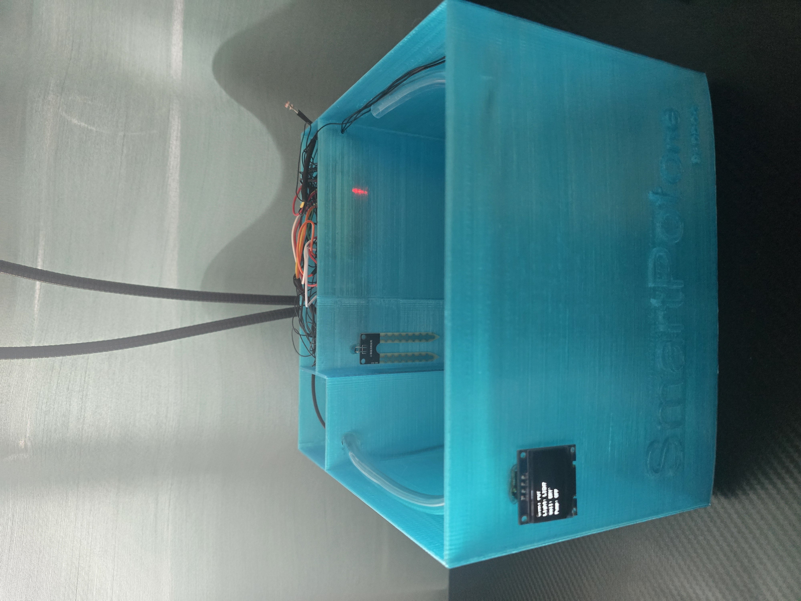
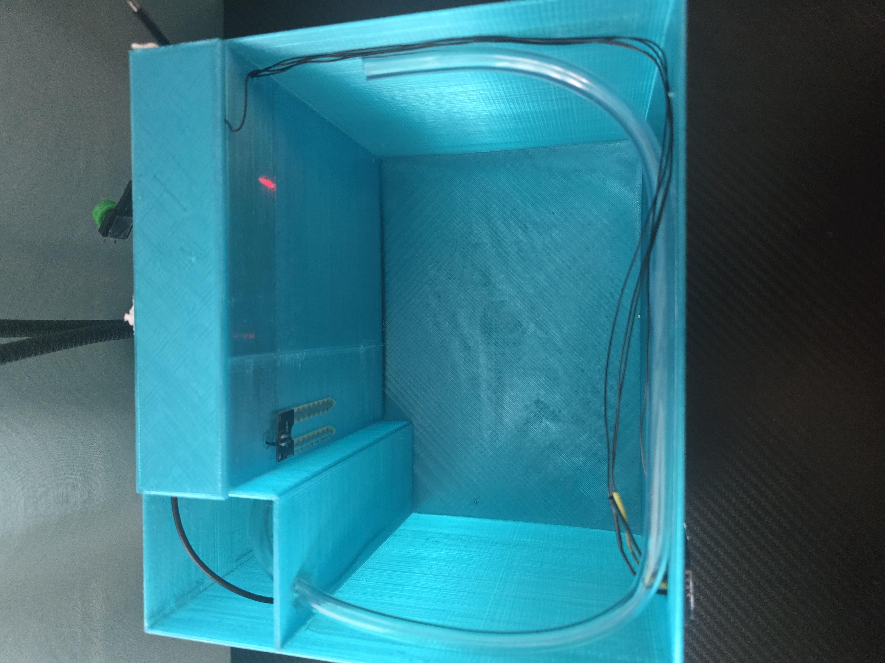
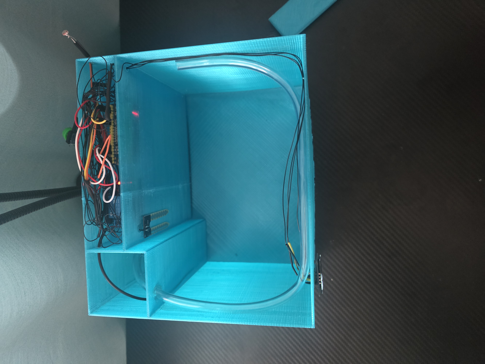
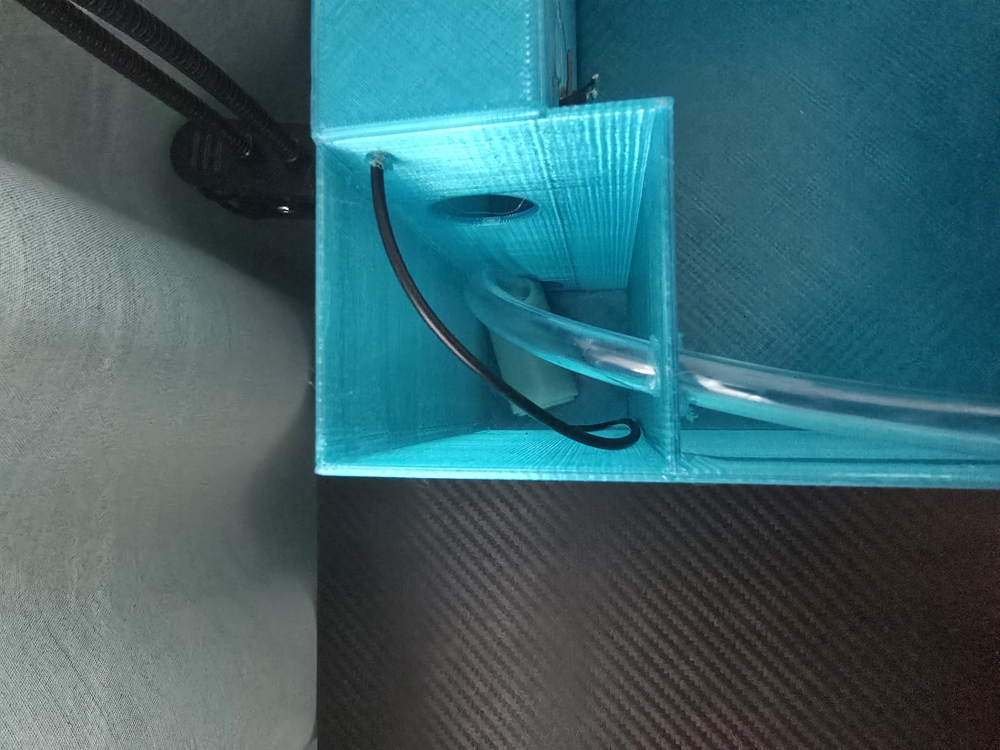
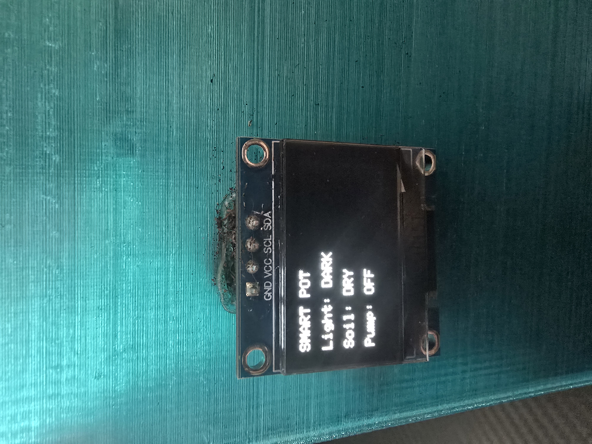
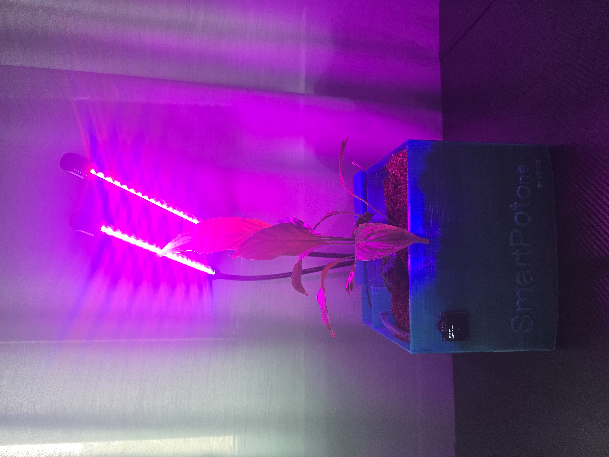
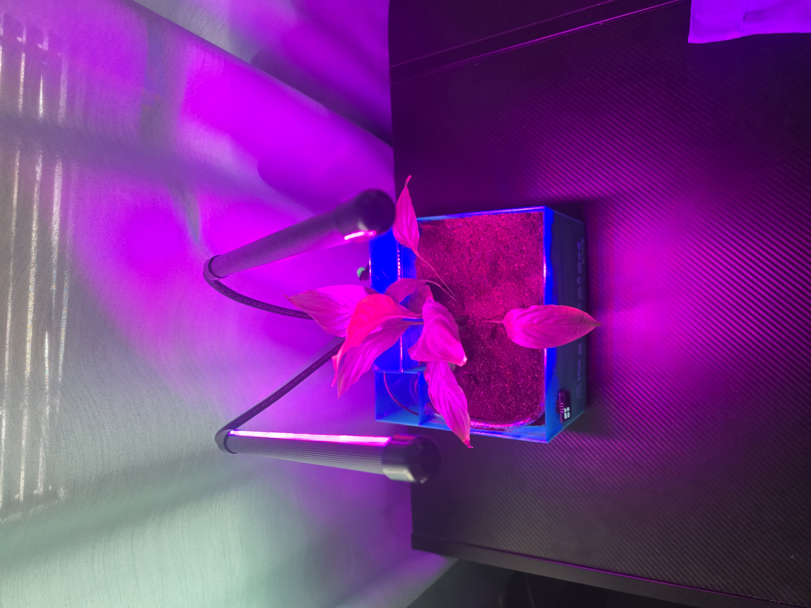

---
# 🧩 Versioning – systém dopĺňa automaticky
fm_version: "1.0.1"

# Dátum buildu – generuje skript
fm_build: "2025-11-28T15:54:48.057749+00:00"

# Poznámka k verzii – voliteľné
fm_version_comment: ""


# 🆔 IDENTITY --------------------------------------------------------

# ID generuje CLI / skript

# Unikátne UUID – generuje skript
guid: "33cbe355-43ad-438b-887c-b2b425f1ac5f"


# 🧭 CONTEXT ---------------------------------------------------------

# DAO / doména (knife, sdlc, q12, 7ds...) dopĺňa skript
dao: "class_sthdf_dashboard"

# Názov zápisu – dopĺňa používateľ
title: "slides"

# Krátky popis – dopĺňa používateľ (voliteľné)
description: "{{DESCRIPTION}}"


# 👥 AUTHORSHIP ------------------------------------------------------

# Hlavný autor – z globálneho configu
author: "Roman Kazicka"

# Zoznam autorov – generuje skript
authors:
  - "Roman Kazicka"


# 🗂 CLASSIFICATION ---------------------------------------------------

# Nadradená kategória – môže doplniť používateľ
category: ""

# Typ dokumentu (guide, case, tutorial...) – používateľ (voliteľné)
type: ""

# Priorita (low/medium/high) – voliteľné
priority: ""

# Tagy – odporúča sa 2–6 tagov.
# Typy tagov:
#   - rámce: knife, 7ds, sdlc, q12
#   - účel: tutorial, guide, pattern, case-study
#   - téma: git, backup, ai, communication
#   - úroveň: beginner, intermediate, advanced
tags: []


# 🌍 LOCALIZATION -----------------------------------------------------

# Jazyk dokumentu – doplní skript podľa štruktúry
locale: "sk"


# 🕒 LIFECYCLE --------------------------------------------------------

# Dátum vytvorenia – generuje skript
created: "2025-11-28 16:54"

# Dátum poslednej úpravy – dopĺňa človek
modified: "2025-11-28 16:54"

# Stav dokumentu – default "backlog"
status: "backlog"

# Viditeľnosť – default "public"
privacy: "public"


# ⚖ INTELLECTUAL PROPERTY -------------------------------------------

# Držiteľ práv k obsahu – dopĺňa skript
rights_holder_content: "Roman Kazicka"

# Systémový vlastník práv
rights_holder_system: "CAA / KNIFE / LetItGrow"

# Licencia
license: "CC-BY-NC-SA-4.0"

# Disclaimer
disclaimer: "Use at your own risk. Methods provided as-is; participation is voluntary and context-aware."

# Copyright
copyright: "© 2025 Roman Kazicka"


# 🔗 ORIGIN / PROVENANCE ---------------------------------------------

# Repozitár pôvodu
origin_repo: ""

# URL pôvodného repozitára
origin_repo_url: ""

# Commit pôvodu
origin_commit: ""

# Branch pôvodu
origin_branch: ""

# Systém pôvodu (CAA/KNIFE/STHDF…)
origin_system: "CAA"

# Pôvodný autor
origin_author: "Roman Kazicka"

# Importovaný zdroj
origin_imported_from: ""

# Dátum importu
origin_import_date: ""


# 🧱 RESERVED ---------------------------------------------------------

fm_reserved1: ""
fm_reserved2: ""
---

<!-- class_sthdf_dashboard_INSTANCE_ID: 01-class_sthdf_dashboard_2025-2026 -->

# PRJ027 — Presentation

--- Headline ---
## Headline
**2025-PRJ-027-ST_009-ST_012-SmartPotOne**
<figure>
  
  <figcaption>Obr. 1: Product</figcaption>
</figure>

## Téma Projektu
Vývoj a výroba funkcného prototypu inteligentného kvetináča (SmartPot One), ktorý automaticky deteguje nízku vlhkosť pôdy a nedostatek svetla, a podľa toho spúšťa automatické zavlažovanie a doplnkové LED osvetlenie. Projekt spája hardvér (mikrokontrolér STM32, senzory vlhkosti a svetla, vodná pumpa), softvér (programovanie v C++), 3D modelovanie a 3D tlač do jedného funkcného celku. --- Headline ---

--- introduction ---
## Introduction
**2025-PRJ-027-ST_009-ST_012-SmartPotOne**

SmartPot One je riešenie pre zaneprázdnených ľudí a technických nadšencov, ktorí si chcú udržať rastliny bez potreby manuálneho zalievania. Projekt kombinuje senzory, mikrokontrolér STM32, senzor vlhkosti pôdy, svetelný senzor a malú vodnu pumpu v jednom 3D tlačenom kvetináči, ktorý dokáže udržať rastlinu pri živote bez manuálneho zásahu. Výsledkom je funkcný prototyp schopný automaticky riadiť polievanie a osvetlenie na základe parametrov prostredia.
--- introduction ---

--- obsah ---
## Obsah
- [01-Business](../sdlc/01-business/index.md)
- [02-Top Level Architecture](../sdlc/02-top-level-architecture/index.md)
- [03-Solution Architecture](../sdlc/03-solution-architecture/index.md)
- [04-Analysis](../sdlc/04-analysis/index.md)
- [05-Design](../sdlc/05-design/index.md)
- [06-Implementation](../sdlc/06-implementation/index.md)
- [07-Testing & Verification](../sdlc/07-testing-verification/index.md)
- [08-Operation](../sdlc/08-operation/index.md)
- [09-Change Management](../sdlc/09-Change-Management/index.md)
--- obsah ---

## 01-Business
Problém: Ľudia zabúdajú zalievať rastliny.
Riešenie: SmartPot One automaticky deteguje vlhkosť pôdy a svetlo, spúšťa pumpu a LED.
Cieľ: Zaneprázdnení ľudia, tech nadšenci.
Pridaná hodnota: Automácia, monitorovanie.

## 02-Top Level Architecture
**Fyzické komponenty:**
- STM32 DevKit
- Senzor vlhkosti pôdy
- Svetelný senzor LDR
- Vodná pumpa 5V
- LED pásik
- 3D tlačený kvetináč s nádržou

**Logická štruktúra:**
```
Setup() → Inicializácia pinov
Loop() → Čítaj senzory → Porovnaj prahy → Spusti pumpu/LED → Čakaj 600s → Opakuj
```

<figure>
  
  <figcaption>Obr.: Logický model definujúci štruktúru softvéru.</figcaption>
</figure>


## 03-Solution Architecture
**Prvé testy:** Breadboard s STM32, senzory testované jednotlivo.

**Dizajn iterácie:**
1. Jednoduchý kontajner na zem
2. Kompartmenty: voda, elektronika, senzory
3. Finálny dizajn

**Výstup:** 3D model kvetináča s integrovanými priestormi.

## 04-Analysis

**Požiadavky:**
- Automatické zavlažovanie pri nízkej vlhkosti
- Monitorovanie vlhkosti a svetla
- LED osvetlenie pri nedostatku svetla
- Výdrž nádrže na vodu
- Bezpečnosť

## 05-Design

<figure>
  
  <figcaption>Obr.: plan</figcaption>
</figure>

<figure>
  
  <figcaption>Obr.: 3D model</figcaption>
</figure>


## 06-Implementation

**3D tlač:** modeling, post-processing .

**HW montáž:** Senzory zapájané, MOSFET na pumpu, LED pripojena.

<figure>
  
  <figcaption>Obr.: Implementacia</figcaption>
</figure>

**Softvér (C++ + Arduino IDE):**
```cpp

#include <Arduino.h>
#include <Wire.h>
#include <Adafruit_GFX.h>
#include <Adafruit_SSD1306.h>

/* ===== OLED ===== */
#define SCREEN_WIDTH 128
#define SCREEN_HEIGHT 64
#define OLED_ADDR 0x3C

/* ===== PINS ===== */
#define BUTTON_PIN         PB15
#define SENSOR_PIN         PB12
#define RELAY_PIN          PB13
#define SOIL_DIGITAL_PIN   PA8   // Digital soil sensor value
#define SOIL_POWER_PIN     PA9
#define LED_PIN            PB14   // External transistor LED

/* ===== RELAY LOGIC (ACTIVE LOW) ===== */
#define RELAY_ON  LOW
#define RELAY_OFF HIGH

/* ===== PROJECT CONSTANTS ===== */
#define CYCLE_INTERVAL   1200   // 20 minutes
#define SOIL_WARMUP_TIME 3    // 3 seconds
#define RELAY_TIME       5     // 5 seconds
#define MOSFET_TIME      1     // 1 second
#define BUTTON_RUN_TIME  3     // 2 seconds for manual button press
#define DEBOUNCE_DELAY   50    // 50ms for button

Adafruit_SSD1306 display(SCREEN_WIDTH, SCREEN_HEIGHT, &Wire, -1);

/* ===== GLOBAL STATE (VOLATILE FOR ISR) ===== */
volatile uint32_t secondsCounter = 0;
volatile bool lastSoilState = false; // false = DRY, true = WET
volatile bool isSoilSensorPowering = false;
volatile uint32_t soilPowerOnTime = 0;

volatile bool isRelayRunning = false;
volatile uint32_t relayStartTime = 0;
volatile bool isManualMode = false;  // Track manual vs automatic mode

volatile bool isMosfetRunning = false;
volatile uint32_t mosfetStartTime = 0;

volatile bool requestImmediateRun = true;
volatile bool showResetMessage = false;

// Lamp Logic States
volatile bool isLampActuallyOn = false; 
volatile int mosfetStep = 0; // 0=Idle, 1=Pulsing, 2=Waiting for re-check
volatile uint32_t mosfetStepTimer = 0;

/* ===== BUTTON STATE ===== */
volatile uint32_t lastButtonPressTime = 0;

/* ===== TIMER HANDLER ===== */
void onTimerTick() {
  secondsCounter++;

  // 1. TRIGGER MEASUREMENT
  if (secondsCounter % CYCLE_INTERVAL == 0 || requestImmediateRun) {
    if (!isSoilSensorPowering) { 
      digitalWrite(SOIL_POWER_PIN, HIGH);
      isSoilSensorPowering = true;
      soilPowerOnTime = secondsCounter;
      requestImmediateRun = false;
    }
  }

  // 2. SOIL SENSOR SAMPLING
  if (isSoilSensorPowering && (secondsCounter - soilPowerOnTime >= SOIL_WARMUP_TIME)) {
    int rawReading = digitalRead(SOIL_DIGITAL_PIN);
    lastSoilState = (rawReading == LOW); 
    digitalWrite(SOIL_POWER_PIN, LOW);
    isSoilSensorPowering = false;

    if (!lastSoilState && !isRelayRunning) { 
      digitalWrite(RELAY_PIN, RELAY_ON);
      isRelayRunning = true;
      relayStartTime = secondsCounter;
      isManualMode = false;
    }
  }

  // 3. LIGHT SENSOR (LAMP) LOGIC
  bool isCurrentlyDark = (digitalRead(SENSOR_PIN) == HIGH);

  if (!isMosfetRunning && !isManualMode && mosfetStep == 0) {
    if (secondsCounter % CYCLE_INTERVAL == 0) {
      
      // IF LAMP OFF + DARK -> Pulse ON
      if (!isLampActuallyOn && isCurrentlyDark) {
        digitalWrite(LED_PIN, HIGH);
        isMosfetRunning = true;
        mosfetStartTime = secondsCounter;
        isLampActuallyOn = true;
      }
      // IF LAMP ON + DARK -> Pulse (Keep ON)
      else if (isLampActuallyOn && isCurrentlyDark) {
        digitalWrite(LED_PIN, HIGH);
        isMosfetRunning = true;
        mosfetStartTime = secondsCounter;
        // isLampActuallyOn remains true
      }
      // IF LAMP ON + LIGHT -> Pulse OFF and start re-check logic
      else if (isLampActuallyOn && !isCurrentlyDark) {
        digitalWrite(LED_PIN, HIGH);
        isMosfetRunning = true;
        mosfetStartTime = secondsCounter;
        isLampActuallyOn = false;
        mosfetStep = 1; // Mark for double check
      }
    }
  }

  // 4. PUMP (RELAY) TIMEOUT MANAGEMENT
  if (isRelayRunning) {
    uint32_t timeout = isManualMode ? BUTTON_RUN_TIME : RELAY_TIME;
    if (secondsCounter - relayStartTime >= timeout) {
      digitalWrite(RELAY_PIN, RELAY_OFF);
      isRelayRunning = false;
    }
  }

  // 5. MOSFET TIMEOUT & RE-CHECK LOGIC
  if (isMosfetRunning) {
    uint32_t timeout = isManualMode ? BUTTON_RUN_TIME : MOSFET_TIME;
    if (secondsCounter - mosfetStartTime >= timeout) {
      digitalWrite(LED_PIN, LOW);
      isMosfetRunning = false;
      
      if (mosfetStep == 1) {
        mosfetStep = 2;
        mosfetStepTimer = secondsCounter;
      }
    }
  }

  if (mosfetStep == 2 && (secondsCounter - mosfetStepTimer >= 1)) {
    if (isCurrentlyDark) {
      digitalWrite(LED_PIN, HIGH);
      isMosfetRunning = true;
      mosfetStartTime = secondsCounter;
      isLampActuallyOn = true;
    }
    mosfetStep = 0; 
  }

  if (!isRelayRunning && !isMosfetRunning && mosfetStep == 0) {
    isManualMode = false;
  }
}

/* ===== BUTTON INTERRUPT (DEBOUNCED) ===== */
void onButtonPress() {
  uint32_t now = millis();
  if (now - lastButtonPressTime > DEBOUNCE_DELAY) {
    digitalWrite(RELAY_PIN, RELAY_ON);
    digitalWrite(LED_PIN, HIGH);
    isRelayRunning = true;
    isMosfetRunning = true;
    isManualMode = true; 
    relayStartTime = secondsCounter;
    mosfetStartTime = secondsCounter;
    
    showResetMessage = true;
  }
  lastButtonPressTime = now;
}

/* ===== SETUP ===== */
void setup() {
  Wire.begin(PB7, PB6);
  Wire.setClock(1000);

  if (!display.begin(SSD1306_SWITCHCAPVCC, OLED_ADDR)) {
    while (1);
  }

  display.setTextSize(1);
  display.setTextColor(SSD1306_WHITE);

  pinMode(BUTTON_PIN, INPUT_PULLUP);
  attachInterrupt(digitalPinToInterrupt(BUTTON_PIN), onButtonPress, FALLING);

  pinMode(SENSOR_PIN, INPUT_PULLUP);

  pinMode(RELAY_PIN, OUTPUT_OPEN_DRAIN);
  digitalWrite(RELAY_PIN, RELAY_OFF);

  pinMode(LED_PIN, OUTPUT);
  digitalWrite(LED_PIN, LOW);

  pinMode(SOIL_DIGITAL_PIN, INPUT);
  pinMode(SOIL_POWER_PIN, OUTPUT);
  digitalWrite(SOIL_POWER_PIN, LOW);

  HardwareTimer *timer = new HardwareTimer(TIM2);
  timer->setOverflow(1, HERTZ_FORMAT);
  timer->attachInterrupt(onTimerTick);
  timer->resume();
}

/* ===== LOOP ===== */
void loop() {
  if (showResetMessage) {
    display.clearDisplay();
    display.setTextSize(2);
    display.setCursor(34, 24);
    display.println("TEST");
    display.display();
    delay(1000);
    showResetMessage = false;
    display.setTextSize(1);
    return;
  }

  bool dark = (digitalRead(SENSOR_PIN) == HIGH);
  bool relay = (isRelayRunning);
  bool soilWet = lastSoilState;

  display.clearDisplay();
  display.setCursor(0, 0);
  display.println("SMART POT");
  display.setCursor(0, 16);
  display.print("Light: ");
  display.println(dark ? "DARK" : "LIGHT");
  display.setCursor(0, 32);
  display.print("Soil: ");
  display.println(soilWet ? "WET" : "DRY");
  display.setCursor(0, 48);
  display.print("Pump: ");
  display.println(relay ? "ON" : "OFF");
  display.display();
  delay(200);
}
```

---

## 07-Testing & Verification

Pre testovanie sme pridali rastlinu a pozorovali sme funkčnosť systému.



<figure>
  
  <figcaption>Obr.: Testovanie – finálny produkt</figcaption>
</figure>



<figure>
  
  <figcaption>Obr.: Testovanie – finálny produkt</figcaption>
</figure>



<figure>
  
  <figcaption>Obr.: Testovanie – finálny produkt</figcaption>
</figure>



<figure>
  
  <figcaption>Obr.: Testovanie – finálny produkt</figcaption>
</figure>


<figure>
  
  <figcaption>Obr.: Testovanie – finálny produkt</figcaption>
</figure>



<figure>
  
  <figcaption>Obr.: Testovanie – finálny produkt</figcaption>
</figure>


<figure>
  
  <figcaption>Obr.: Testovanie – finálny produkt</figcaption>
</figure>




<figure>
  
  <figcaption>Obr.: Testovanie – finálny produkt</figcaption>
</figure>



<figure>
  
  <figcaption>Obr.: Testovanie – finálny produkt</figcaption>
</figure>


## 08-Operation
## 09-Change Management

Príklad pre merge v LemonTree

<figure>
  
  <figcaption>Obr.: LemonTree</figcaption>
</figure>
