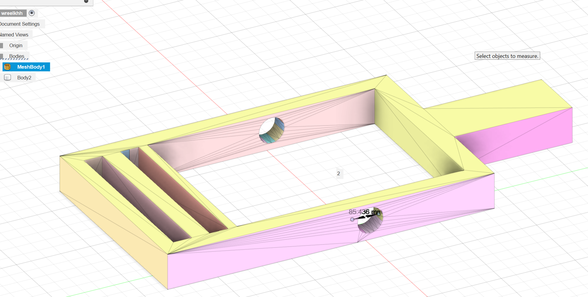

---
# 🧩 Versioning – systém dopĺňa automaticky
fm_version: "1.0.1"

# Dátum buildu – generuje skript
fm_build: "2025-11-28T15:54:48.035536+00:00"

# Poznámka k verzii – voliteľné
fm_version_comment: ""

# 🆔 IDENTITY --------------------------------------------------------

# ID generuje CLI / skript

# Unikátne UUID – generuje skript
guid: "1a3e753d-a30e-4b63-9de4-b1bb90c72a76"

# 🧭 CONTEXT ---------------------------------------------------------

# DAO / doména (knife, sdlc, q12, 7ds...) dopĺňa skript
dao: "class_sthdf_dashboard"

# Názov zápisu – dopĺňa používateľ
title: "03 solution architecture"

# Krátky popis – dopĺňa používateľ (voliteľné)
description: "{{DESCRIPTION}}"

# 👥 AUTHORSHIP ------------------------------------------------------

# Hlavný autor – z globálneho configu
author: "Roman Kazicka"

# Zoznam autorov – generuje skript
authors:
  - "Roman Kazicka"

# 🗂 CLASSIFICATION ---------------------------------------------------

# Nadradená kategória – môže doplniť používateľ
category: ""

# Typ dokumentu (guide, case, tutorial...) – používateľ (voliteľné)
type: ""

# Priorita (low/medium/high) – voliteľné
priority: ""

# Tagy – odporúča sa 2–6 tagov.
# Typy tagov:
#   - rámce: knife, 7ds, sdlc, q12
#   - účel: tutorial, guide, pattern, case-study
#   - téma: git, backup, ai, communication
#   - úroveň: beginner, intermediate, advanced
tags: []

# 🌍 LOCALIZATION -----------------------------------------------------

# Jazyk dokumentu – doplní skript podľa štruktúry
locale: "sk"

# 🕒 LIFECYCLE --------------------------------------------------------

# Dátum vytvorenia – generuje skript
created: "2025-11-28 16:54"

# Dátum poslednej úpravy – dopĺňa človek
modified: "2025-11-28 16:54"

# Stav dokumentu – default "backlog"
status: "backlog"

# Viditeľnosť – default "public"
privacy: "public"

# ⚖ INTELLECTUAL PROPERTY -------------------------------------------

# Držiteľ práv k obsahu – dopĺňa skript
rights_holder_content: "Roman Kazicka"

# Systémový vlastník práv
rights_holder_system: "CAA / KNIFE / LetItGrow"

# Licencia
license: "CC-BY-NC-SA-4.0"

# Disclaimer
disclaimer: "Use at your own risk. Methods provided as-is; participation is voluntary and context-aware."

# Copyright
copyright: "© 2025 Roman Kazicka"

# 🔗 ORIGIN / PROVENANCE ---------------------------------------------

# Repozitár pôvodu
origin_repo: ""

# URL pôvodného repozitára
origin_repo_url: ""

# Commit pôvodu
origin_commit: ""

# Branch pôvodu
origin_branch: ""

# Systém pôvodu (CAA/KNIFE/STHDF…)
origin_system: "CAA"

# Pôvodný autor
origin_author: "Roman Kazicka"

# Importovaný zdroj
origin_imported_from: ""

# Dátum importu
origin_import_date: ""

# 🧱 RESERVED ---------------------------------------------------------

fm_reserved1: ""
fm_reserved2: ""
---

<!-- class_sthdf_dashboard_INSTANCE_ID: 01-class_sthdf_dashboard_2025-2026 -->

# 03 – Solution Architecture

Tento dokument popisuje **konkrétne riešenie prototypu FightWrap Winder** na úrovni hlavných modulov, ich rozhraní a tokov (mechanika, elektronika, ovládanie). Nejde o výrobné výkresy – cieľom je mať jasne pomenované komponenty, zodpovednosti a väzby.

---

## 1️⃣ Ciele riešenia (Solution Goals)

- Automatizovať navíjanie bandáže pomocou jednoduchého elektromechanického riešenia.
- Zabezpečiť jednoduché ovládanie (spustenie/zastavenie) bez potreby zložitého UI.
- Navrhnúť modulárnu konštrukciu vhodnú na prototypovanie (3D tlač, dostupné diely).

---

## 2️⃣ Rozsah riešenia

### V scope
- Mechanická konštrukcia + navíjací mechanizmus
- Motor + prenos sily (spojka/prevod)
- Napájanie
- Ovládacie tlačidlo + LED indikácia

### Out of scope
- Mobilná aplikácia, cloud, telemetria
- Pokročilé režimy, automatická detekcia typu bandáže
- Priemyselná certifikácia / masová výroba

---

## 3️⃣ Prehľad modulov (Solution Building Blocks)

### 3.1 Mechanický modul
**Zodpovednosť:** drží bandáž a umožňuje jej navíjanie.
- Navíjacia oska (spool)
- Držiak bandáže / vedenie
- Nosná konštrukcia (3D tlač)
- Krytovanie (ochrana prstov)

### 3.2 Pohonný modul
**Zodpovednosť:** vytvára rotáciu a prenáša krútiaci moment na osku.
- DC motor (príp. motor s prevodovkou)
- Spojka / prevod (podľa dostupnosti)
- Uchytenie motora do rámu

### 3.3 Elektronický modul
**Zodpovednosť:** napájanie a spínanie motora.
- Napájací vstup (USB / batéria)
- Spínanie motora (napr. tranzistor / driver modul)
- Ochrany (základné: poistka alebo ochrana proti skratu – podľa možností)

### 3.4 Ovládanie a indikácia (UI modul)
**Zodpovednosť:** jednoduché ovládanie a informovanie používateľa.
- Tlačidlo START/STOP
- LED indikácia (napájanie / beží / chyba – voliteľné)

---

## 4️⃣ Vývoj produktu

Počiatočný návrh bol vypracovaný pomocou skíc v zošite. Nasledujúce obrázky dokumentujú základné koncepty mechanického usporiadania a tokov energie v prototypu.

Tento návrh sme neskôr preniesli do 3D formatu pomocou Fusion360

No a už len vytlačili, a prvá verzia nášho produktu bola na svete.

Neskôr sme sa rozhodli tento náš produkt posunúť ďalej, aby bol zaujímavejší a tak sme sa rozhodli ho obohatiť o motorček na samonavýjanie. Tak sme sa snažili vymyslieť ako by to asi išlo a čo by sme nato potrebovali.

## Tu je zoznam súčiastok čo sme si napísali:
| Komponent | Typ | Množstvo | Parametre | Modul |
|-----------|-----|----------|-----------|-------|
| Motor | DC motor | 1 | 12V, 100–500 RPM | Pohonný |
| Spojka | Flex spojka | 1 | D5–8mm | Pohonný |
| Batéria | Li-Ion 18650 / akumulátor | 1 | 12V | Elektronika |
| Tlačidlo | Push button | 1 | Momentálne | UI |
| Dióda | 1N4007 | 1 | Ochrana motora | Elektronika |
| Konektory | JST / DuPont | podľa potreby | — | Elektronika |

Následne navrhli nový model

Súčiastky sme sa snažili zohnať kde sa dalo, dokonca sme rozoberali aj stare eci čo sme našli doma. Kupodivu mali to čo sme potrebovali.

Tvorba dalšieho prototypu prebiehala v low-budget forme. Cielom bolo spraviť PoC (Proof of Concept), tak ako sa to robí v reálnom podnikaní pred tým ako sa plne spustí do projektu.

Finalna verzia produktu v stl formate:

- [Solution design](./design.md)

**Navigation:** [⬆️ SDLC](../index.md) · [⬅️ Projekt](../../index.md)
