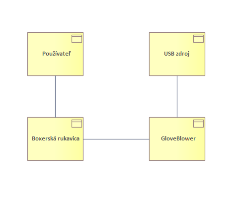
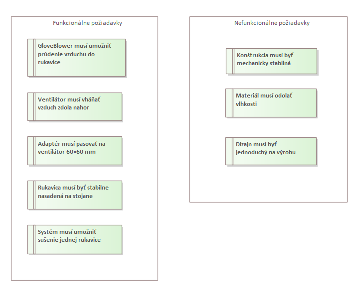
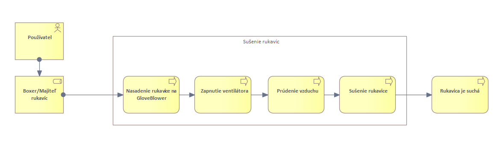
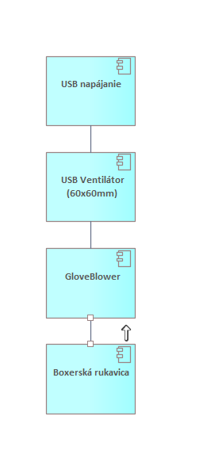

---
# 🧩 Versioning – systém dopĺňa automaticky
fm_version: "1.0.1"

# Dátum buildu – generuje skript
fm_build: "2025-11-28T15:54:48.082838+00:00"

# Poznámka k verzii – voliteľné
fm_version_comment: ""

# 🆔 IDENTITY --------------------------------------------------------

# ID generuje CLI / skript

# Unikátne UUID – generuje skript
guid: "b321b6fe-0061-48ee-b861-3b7c3754332b"

# 🧭 CONTEXT ---------------------------------------------------------

# DAO / doména (knife, sdlc, q12, 7ds...) dopĺňa skript
dao: "class_sthdf_dashboard"

# Názov zápisu – dopĺňa používateľ
title: "slides"

# Krátky popis – dopĺňa používateľ (voliteľné)
description: "{{DESCRIPTION}}"

# 👥 AUTHORSHIP ------------------------------------------------------

# Hlavný autor – z globálneho configu
author: "Roman Kazicka"

# Zoznam autorov – generuje skript
authors:
  - "Roman Kazicka"

# 🗂 CLASSIFICATION ---------------------------------------------------

# Nadradená kategória – môže doplniť používateľ
category: ""

# Typ dokumentu (guide, case, tutorial...) – používateľ (voliteľné)
type: ""

# Priorita (low/medium/high) – voliteľné
priority: ""

# Tagy – odporúča sa 2–6 tagov.
# Typy tagov:
#   - rámce: knife, 7ds, sdlc, q12
#   - účel: tutorial, guide, pattern, case-study
#   - téma: git, backup, ai, communication
#   - úroveň: beginner, intermediate, advanced
tags: []

# 🌍 LOCALIZATION -----------------------------------------------------

# Jazyk dokumentu – doplní skript podľa štruktúry
locale: "sk"

# 🕒 LIFECYCLE --------------------------------------------------------

# Dátum vytvorenia – generuje skript
created: "2025-11-28 16:54"

# Dátum poslednej úpravy – dopĺňa človek
modified: "2025-11-28 16:54"

# Stav dokumentu – default "backlog"
status: "backlog"

# Viditeľnosť – default "public"
privacy: "public"

# ⚖ INTELLECTUAL PROPERTY -------------------------------------------

# Držiteľ práv k obsahu – dopĺňa skript
rights_holder_content: "Roman Kazicka"

# Systémový vlastník práv
rights_holder_system: "CAA / KNIFE / LetItGrow"

# Licencia
license: "CC-BY-NC-SA-4.0"

# Disclaimer
disclaimer: "Use at your own risk. Methods provided as-is; participation is voluntary and context-aware."

# Copyright
copyright: "© 2025 Roman Kazicka"

# 🔗 ORIGIN / PROVENANCE ---------------------------------------------

# Repozitár pôvodu
origin_repo: ""

# URL pôvodného repozitára
origin_repo_url: ""

# Commit pôvodu
origin_commit: ""

# Branch pôvodu
origin_branch: ""

# Systém pôvodu (CAA/KNIFE/STHDF…)
origin_system: "CAA"

# Pôvodný autor
origin_author: "Roman Kazicka"

# Importovaný zdroj
origin_imported_from: ""

# Dátum importu
origin_import_date: ""

# 🧱 RESERVED ---------------------------------------------------------

fm_reserved1: ""
fm_reserved2: ""
---

<!-- class_sthdf_dashboard_INSTANCE_ID: 01-class_sthdf_dashboard_2025-2026 -->

# PRJ029 — Presentation

## Headline
**2025-PRJ-029-ST_029-GloveBlower**

  

**GloveBlower** je 3D tlačený sušič boxerských rukavíc, ktorý pomocou USB ventilátora vháňa vzduch priamo do vnútra rukavice a výrazne skracuje čas sušenia.

## Introduction

GloveBlower je študentský projekt zameraný na návrh jednoduchého fyzického produktu podporeného **systematickým architektonickým myslením** a metodikou SDLC.

Projekt kombinuje:
- 3D tlač,
- mechanický dizajn,
- modelovanie architektúry v nástroji Enterprise Architect.

Zariadenie pozostáva z:
- 3D tlačeného stojana (GloveBlower),
- adaptéra pre ventilátor 60×60 mm,
- USB ventilátora ako zdroja prúdenia vzduchu.

## Business Domain

Používateľ po tréningu potrebuje **rýchlo a hygienicky vysušiť boxerské rukavice**.

## Požiadavky

### Funkčné požiadavky
- prúdenie vzduchu do rukavice,
- ventilátor vháňa vzduch zdola nahor,
- adaptér kompatibilný s ventilátorom 60×60 mm,
- stabilné nasadenie rukavice,
- sušenie jednej rukavice.

### Nefunkčné požiadavky
- mechanická stabilita,
- odolnosť voči vlhkosti,
- jednoduchá výroba pomocou 3D tlače.

## Business Process – Sušenie rukavíc

**Postup:**
1. Používateľ nasadí rukavicu na GloveBlower  
2. Zapne USB ventilátor  
3. Ventilátor vytvorí prúdenie vzduchu  
4. Vzduch vysušuje vnútro rukavice  
5. Výsledkom je suchá rukavica  

## Top Level Architecture

**Komponenty systému:**
- USB napájanie,
- USB ventilátor (60×60 mm),
- 3D tlačený GloveBlower,
- boxerská rukavica.

## Návrh riešenia – vývoj tvaru

  

Návrh GloveBlower vznikol iteratívne – od ručného náčrtu až po
prakticky funkčný 3D model. Hlavným cieľom bolo zabezpečiť stabilné
nasadenie rukavice a efektívne vedenie vzduchu.

## 3D model – Fusion 360 (pracovný návrh)

  
  

Model bol vytvorený vo Fusion 360 s dôrazom na:
- jednoduchú geometriu,
- optimalizáciu pre 3D tlač,
- správny tok vzduchu smerom do rukavice.

## Implementácia – 3D tlač

Tlač realizovaná na **Original Prusa XL**.

  
  

- bez skrutiek,
- bez lepenia,
- jednoduchá montáž.

## Hotový prototyp

  
  

Produkt je:
- mechanicky stabilný,
- plne funkčný,
- reálne použiteľný po tréningu.

## Zhodnotenie projektu

Projekt GloveBlower demonštruje:
- návrh fyzického produktu,
- prácu s požiadavkami,
- architektonické myslenie,
- prepojenie návrhu a reálneho prototypu.

Riešenie je jednoduché, lacné a prakticky využiteľné.

## Možné rozšírenia

- sušenie dvoch rukavíc naraz,
- časovač sušenia,
- výkonnejší alebo tichší ventilátor,
- antibakteriálny filter,
- skladacia alebo cestovná verzia.
