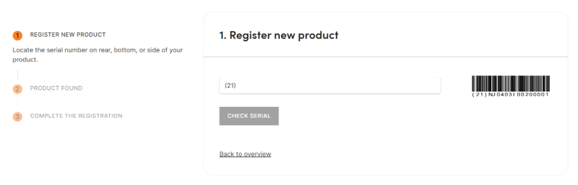
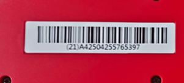
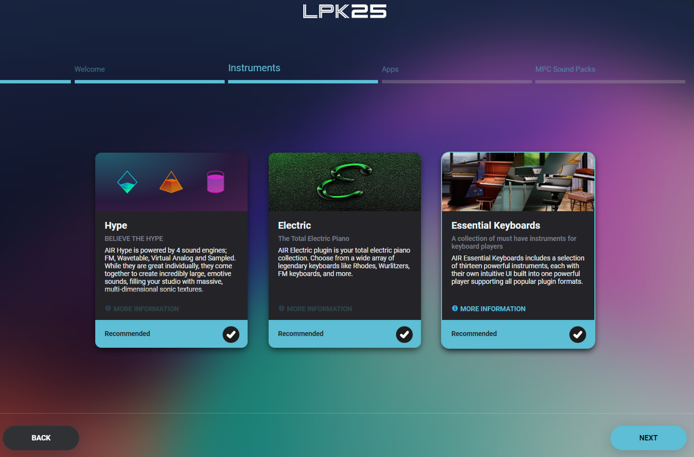

# 📚 Knowledge Contribution

## 🔖 Názov a stručný popis
**Nastavenie AKAI MIDI klávesnice – registrácia, softvér a prvé spustenie**

Tento KNIFE popisuje proces vytvorenia účtu na oficiálnej stránke AKAI, registráciu MIDI klávesnice a stiahnutie potrebného softvéru.  
Je dôležitý, pretože bez registrácie nezískame prístup k ovládačom, nástrojom a softvéru, ktorý umožňuje naplno využiť MIDI zariadenie.

---

## 🎯 Čo rieši (účel, cieľ)
- Umožňuje používateľovi zaregistrovať svoj AKAI produkt.  
- Sprístupňuje softvér, ktorý je súčasťou klávesnice (napr. Hype, MPC Beats).  
- Zabezpečuje, že klávesnica bude okamžite pripravená na použitie.

---

## 🧩 Ako to rieši (princíp)
- Vytvorí sa účet na AKAI stránke.  
- Produkt sa zaregistruje pomocou sériového čísla.  
- Získame prístup k softvéru, ktorý následne aktivujeme po prihlásení.

---

## 🧪 Ako to použiť (aplikácia)
Tento postup použiješ pri:
- prvom nastavovaní AKAI klávesnice,  
- inštalácii softvéru na tvorbu zvukov,  
- príprave MIDI zariadenia na hranie aj na experimentovanie so zvukmi.

---

## ⚡ Rýchly návod (Top)

1. Prejdi na **https://www.akaipro.com/download**  
2. Vytvor si účet alebo sa prihlás.  
3. Klikni na **Register New Product**  
  
<!-- Docusaurus (MDX-safe) -->

<!-- GitHub (plain Markdown) -->

  
4. Odpíš sériové číslo zo spodnej strany klávesnice.  
5. Po registrácii si stiahni softvér dostupný pre tvoje zariadenie.  
6. Nainštaluj EXE, prihlás sa a pripoj klávesnicu.  
7. Aktivuj odporúčaný softvér (napr. **Hype**).  
8. Dokonči sťahovanie zvukových balíkov a môžeš hrať.

---

## 📜 Detailný článok

### 1️⃣ Otvor oficiálnu stránku AKAI
Prejdime na:

➡️ **https://www.akaipro.com/download**

Tu sa nachádza všetok oficiálny softvér pre tvoju klávesnicu.

---

### 2️⃣ Vytvorenie účtu
Klikni na **Sign Up / Create Account**, vyplň údaje a potvrď registráciu.  
Ak už účet máš, jednoducho sa prihlás.

---

### 3️⃣ Registrácia MIDI klávesnice
Po prihlásení prejdime do sekcie:

➡️ **Register New Product**

Zobrazí sa formulár, do ktorého zadáš sériové číslo.  
Zospodu klávesnice nájdeš štítok so sériovým kódom — treba ho opísať presne.

<!-- Docusaurus (MDX-safe) -->

<!-- GitHub (plain Markdown) -->

Po potvrdení sa produkt uloží do účtu.

---

### 4️⃣ Stiahnutie softvéru
Po registrácii sa ti zobrazí zoznam softvéru pripraveného na stiahnutie:

<!-- Docusaurus (MDX-safe) -->

<!-- GitHub (plain Markdown) -->

Typické možnosti:
- **Hype**
- **MPC Beats**
- **Hybrid**
- **Mini Grand**

Stiahni EXE a spusti inštalátor.

---

### 5️⃣ Prvé spustenie softvéru
Po nainštalovaní aplikácie:

- prihlás sa vytvoreným účtom,  
- pripoj klávesnicu,  
- potvrď aktiváciu softvéru.

Softvér ti ponúkne zoznam nástrojov, ktoré môžeš nainštalovať.  
Ak nechceš produkovať hudbu, **zvukové banky nemusíš vyberať**.

---

### 6️⃣ Odporúčané nastavenia
Najlepšia voľba pre rýchly štart:

🎧 **Hype** – má prirodzené zvuky, kvalitné predvoľby a je ideálny pre začiatočníkov.

Po potvrdení prebehne sťahovanie a inštalácia.

---

## 💡 Tipy a poznámky
- Použi **USB kábel, ktorý prenáša dáta**, nielen napájanie.  
- Ak registrácia zlyhá, skontroluj, či je sériové číslo opísané presne.  
- Nástroje môžu mať veľkosť niekoľko GB — sťahovanie môže chvíľu trvať.  
- Po inštalácii si sprav test – stlač kláves a over, či softvér reaguje.

---

## ✅ Hodnota / Zhrnutie
Tento KNIFE zjednodušuje celý proces nastavenia MIDI klávesnice:

- vytvorenie účtu,  
- registrácia zariadenia,  
- stiahnutie a aktivácia softvéru,  
- pripravenie klávesnice na hranie.

Po absolvovaní postupov má používateľ plne funkčnú AKAI klávesnicu so softvérom pripraveným na ďalšiu prácu.

---

## 🗂️ Taxonómia KNIFE
- **Kategória:** IT / Hudobná technológia  
- **Typ:** Návod  
- **Tagy:** akai, midi, setup, klávesy, registrácia, hype, mpc beats

---

## 🌍 Referencie
- Oficiálna stránka AKAI: https://www.akaipro.com/download  

---

## Navigácia
- [↩️ Späť](../02_knowledge-contribution.md)
