# 📦 Project Outcomes

## 🔖 Stav projektu

**Status:** **MVP DOKONČENÉ A ÚSPEŠNE OTESTOVANÉ**

**Čo funguje:**
- Všetkých 5 detekčných algoritmov (silné prikývnutie, mikrokývnutia, pomalé kĺzanie, zamrznutie, bočný náklon)
- Systém upozornení (zvukový alarm + LED + displej)
- Kalibračný systém (3 sekundy, vizuálna spätná väzba)
- Webový dashboard s 3D vizualizáciou hlavy v reálnom čase
- Web Serial API komunikácia (JSON protokol)
- Monitorovanie batérie s indikátorom nabíjania
- Progress bary pre vizuálne monitorovanie prahov
- Vzdialené príkazy (kalibrácia, reset stats, stop alarm)
- Testovanie v reálnom vozidle úspešné

**Čo funguje s obmedzeniami:**
- Výdrž batérie 5-8 hodín (dostatočné, ale mohlo by byť lepšie)
- Pohodlie čelenky pri dlhšom nosení (potrebná ďalšia optimalizácia dizajnu)
- Web Serial API len v Chromium prehliadačoch (nie Firefox/Safari)

**Celkové zhodnotenie:**
Projekt dosiahol všetky primárne ciele MVP. Zariadenie je plne funkčné, otestované v reálnych podmienkach a pripravené na používanie. Webový dashboard úspešne slúži ako demonštračný a kalibračný nástroj.

## 🧩 Výstupy podľa SDLC / V-modelu

Kompletná dokumentácia projektu: **[PRJ025 - Nodyne systém detekcie spánku](../../../projects/PRJ025/index.md)**

### 1. Business požiadavky
**Dokumentácia:** [01-Business](../../../projects/PRJ025/sdlc/01-business/index.md)

**Výstupy:**
- Definícia problému: 20% nehôd spôsobených ospalosťou, 1,200+ úmrtí ročne v USA
- Cieľová skupina: vodiči kamiónov, doručovatelia, nočné smeny, logistické firmy
- Biznis ciele: MVP s 5 algoritmami, cena €35, validácia v reálnych podmienkach
- Trhová príležitosť: TAM €2.5B, konkurencia €500-1000
- Biznis model: B2C Hardware → B2B Licencie → Premium Features
- Roadmap: MVP (dokončené 8 týždňov) → Pilot → B2B Expansion → Growth

### 2. Top Level Architecture
**Dokumentácia:** [02-Top Level Architecture](../../../projects/PRJ025/sdlc/02-top-level-architecture/index.md)

**Výstupy:**
- 3 hlavné komponenty: Hardware (M5StickC Plus 2), Firmware (Arduino), Web Dashboard (Next.js)
- Technologický stack: ESP32, MPU6886 IMU, TFT displej, Web Serial API, Three.js
- Rozhrania: I2C (IMU), USB Serial (telemetria), SPI (displej)
- Výkonnostné charakteristiky: 50Hz IMU, detekcia \<500ms, batéria 5-8h

### 3. Solution Architecture
**Dokumentácia:** [03-Solution Architecture](../../../projects/PRJ025/sdlc/03-solution-architecture/index.md)

**Výstupy:**
- Detailný popis 5 detekčných algoritmov s prahmi a logikou
- Kalibračný systém: 50 vzoriek, baseline výpočet, 3 sekundy
- Alert System: multi-modálny (zvuk + LED + displej), automatické zastavenie
- EMA filter pre redukcitu šumu z vibrácií
- JSON telemetria @ 10Hz, príkazy z dashboardu

### 4. Analysis
**Dokumentácia:** [04-Analysis](../../../projects/PRJ025/sdlc/04-analysis/index.md)

**Výstupy:**
- Funkčné požiadavky: 10 požiadaviek (FR-01 až FR-10)
- Nefunkčné požiadavky: reakcný čas \<1s, presnosť >95%, výdrž >5h, cena \<€50
- Use cases: štart jazdy, detekcia 5 typov ospalosti, manuálna rekalibrácia
- Analýza obmedzení: hardvérové, softvérové, používateľské

### 5. Design
**Dokumentácia:** [05-Design](../../../projects/PRJ025/sdlc/05-design/index.md)

**Výstupy:**
- 6 obrazoviek UI: Welcome, Calibration, Ready, Monitoring, Alert, Statistics
- Farebné schémy: modrá (kalibrácia), zelená (ready), červená (alarm), čierna (monitoring)
- Monitoring screen: real-time metriky (Fwd, Side, Nods, Move), progress bary, battery indikátor
- Alert screen: červená obrazovka + typ detekcie (Strong Nod, Micro Nods, atď.)

### 6. Implementation
**Dokumentácia:** [06-Implementation](../../../projects/PRJ025/sdlc/06-implementation/index.md)

**Výstupy:**
- Arduino Firmware: 5 detekčných algoritmov, kalibrácia, EMA filter, JSON telemetria
- Web Dashboard: Next.js 16 + React 19 + Three.js, Web Serial API, 3D vizualizácia hlavy
- GitHub repozitáre: nodyne-firmware, nodyne-web

**GitHub:**
- Firmware: [github.com/paulintheclub/nodyne-firmware](https://github.com/paulintheclub/nodyne-firmware)
- Dashboard: [github.com/paulintheclub/nodyne-web](https://github.com/paulintheclub/nodyne-web)

### 7. Verification & Testing
**Dokumentácia:** [07-Testing & Verification](../../../projects/PRJ025/sdlc/07-testing-verification/index.md)

**Výstupy:**
- Domáce testovanie: optimalizácia parametrov v1.0 → v2.0 (2-6x citlivejšie)
- Real-world testovanie: >2h v aute, rôzne podmienky (mestské, prímestské, hrboľaté cesty)
- Výsledky: 100% detekcia, \<5% falošné pozitíva, 5-8h výdrž batérie
- Video dokumentácia: [YouTube - Real-World Testing](https://youtu.be/x0nncwOG13A)

### 8. Operation
**Dokumentácia:** [08-Operation](../../../projects/PRJ025/sdlc/08-operation/index.md)

**Výstupy:**
- Deployment: Arduino IDE setup, M5StickC Plus 2 firmware nahratie, Vercel web dashboard
- User Manual: quick start guide, kalibrácia (3s), pripojenie k dashboardu, používanie tlačidiel
- Maintenance: nabíjanie (200mAh, 45-60 min), čistenie, skladovanie
- Updates: firmware v1.0 → v2.0, dashboard continuous deployment

### 9. Change Management
**Dokumentácia:** [09-Change Management](../../../projects/PRJ025/sdlc/09-Change-Management/index.md)

**Výstupy:**
- Súčasný stav v1.0: M5StickC Plus 2, 5 algoritmov, obmedzenia (nízka hlasitosť, chýbajúce vibrácie)
- Lemontree analýza: identifikácia konfliktu (nedostatočný alert systém)
- Navrhované zmeny v2.0: M5StickCPLUS Speaker 2 Hat (€9.95), M5StickC Vibration HAT (€5.95)
- Impact analysis: +€16, čas implementácie 1-2 týždne

## 🏆 Finálny produkt

### Čo tím reálne dodal

**Hardvérový produkt:**
- Funkčné nositeľné zariadenie Nodyne
- M5StickC Plus 2 s nahratým firmvérom
- Elastická čelenka pre uchytenie na hlave

**Softvér:**
- Arduino firmvér v1.0
- Webový dashboard v1.0
- Kompletný zdrojový kód (open-source)

**Dokumentácia:**
- Kompletná SDLC dokumentácia (9 fáz)
- KNIFE článok
- Technická špecifikácia
- Užívateľská príručka
- Video demonštrácia

### Ako to vyzerá

#### Zariadenie - Hardvér

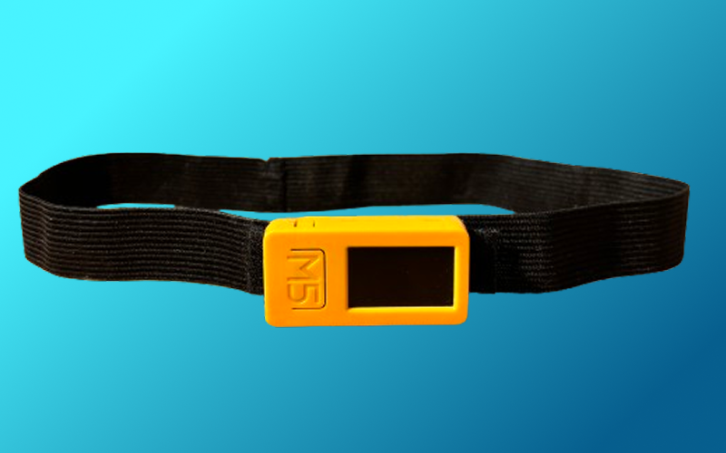
*M5StickC Plus 2 na elastickej čelenke - predný pohľad*

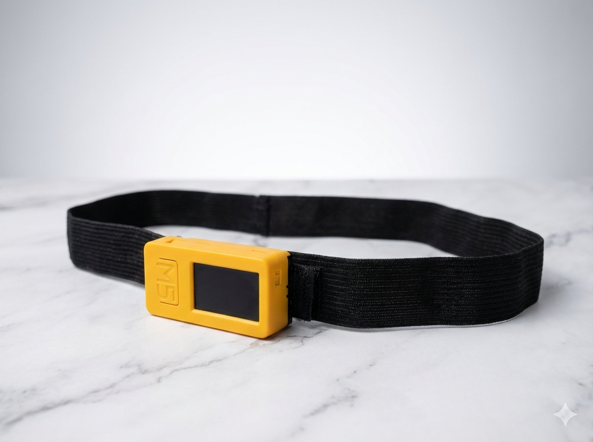
*Bočný pohľad - kompaktné rozmery 48×24×14 mm*

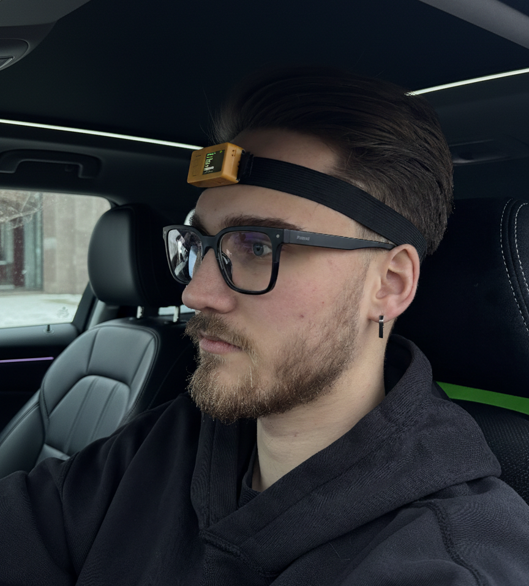
*Nosenie zariadenia - elastická čelenka na čele*

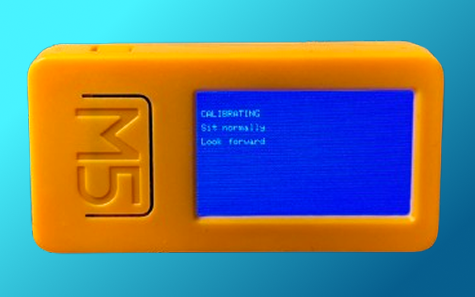
*Displej počas kalibrácie*

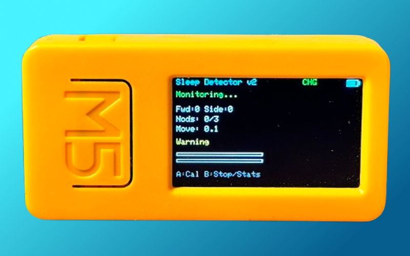
*Displej počas činnosti*

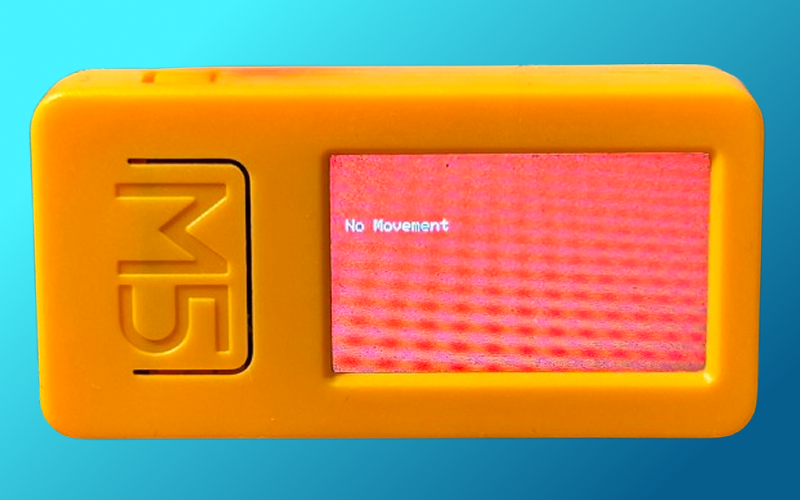
*Displej pri aktivácii alarmu (STRONG NOD)*

**Inštrukcie pre fotky hardvéru:**
1. **nodyne-device-front.jpg** - Predný pohľad na M5StickC Plus 2 pripevnený na čelenke
2. **nodyne-device-side.jpg** - Bočný pohľad zobrazujúci kompaktné rozmery
3. **nodyne-on-head.jpg** - Fotka osoby s nasadeným zariadením (pohľad spredu)
4. **nodyne-display-calibration.jpg** - Screenshot displeja zobrazujúci "CALIBRATED" správu
5. **nodyne-display-alarm.jpg** - Screenshot displeja pri alarme (napr. "STRONG NOD")

---

#### Webový Dashboard

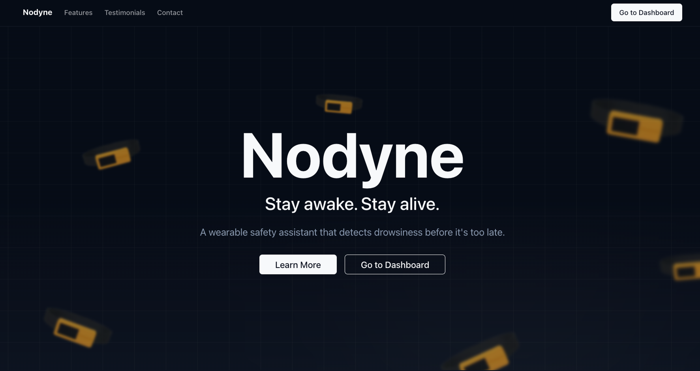
*Hlavná úvodná stránka webu Nodyne*

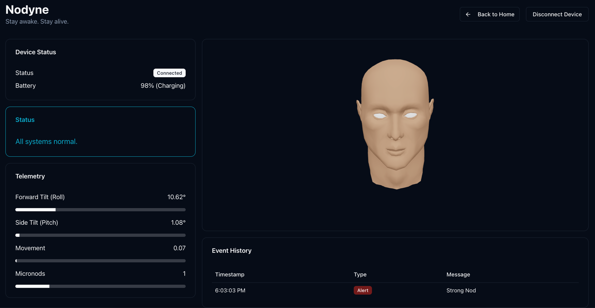
*Kompletný dashboard s všetkými komponentami v reálnom čase*

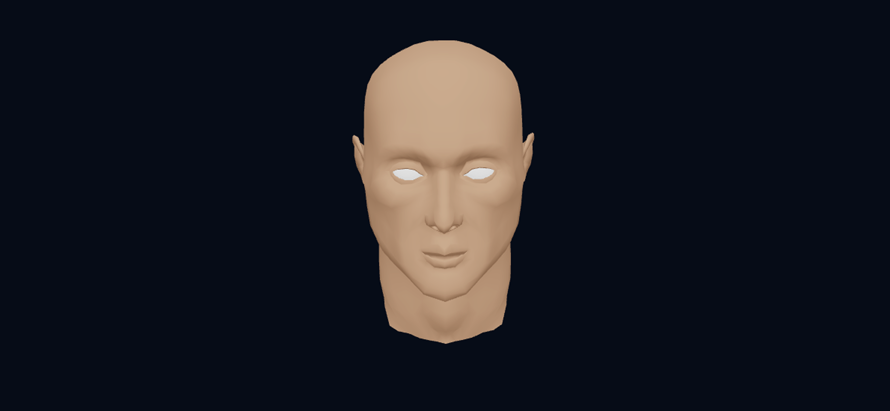
*3D vizualizácia hlavy (Three.js) zobrazujúca aktuálnu orientáciu v reálnom čase*

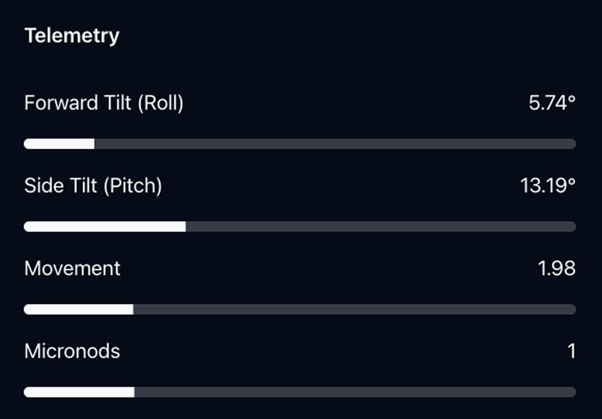
*Metriky: náklon hlavy (roll/pitch), intenzita pohybu, počet mikrokývnutí*

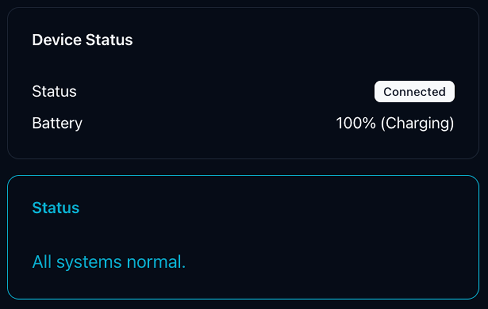
*Stav pripojenia zariadenia, úroveň batérie a stav systému (normálne/trevoga)*

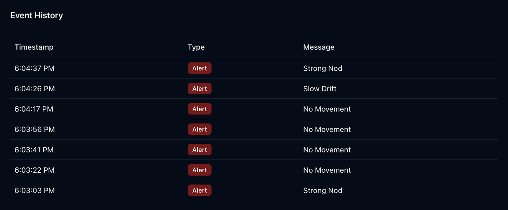
*História detegovaných alarmov zobrazujúca typ detekcie spánku (Strong Nod, Micro Nods, Slow Drift, No Movement, Side Tilt)*

**Inštrukcie pre screenshoty dashboardu:**
1. **website-landing.png** - Hlavná úvodná stránka webu (landing page) pred pripojením zariadenia
2. **dashboard-full.png** - Celý dashboard v jednom zábere (všetky komponenty viditeľné)
3. **dashboard-3d-head.png** - Detail 3D modelu hlavy (časť dashboardu) - ukázať orientáciu
4. **dashboard-metrics.png** - Sekcia s metrikami (roll, pitch, movement intensity, micronods count) - časť dashboardu
5. **dashboard-status.png** - Panel stavu (Connection: Connected, Battery: 85%, Status: Normal/Alert) - časť dashboardu
6. **dashboard-alert-history.png** - História alarmov (časy a typy detekcií: "14:23 - STRONG NOD", "14:45 - MICRO NODS") - časť dashboardu

---

#### Demo & Linky

**Live Demo:**
- Webový dashboard: [https://nodyne-web.vercel.app/](https://nodyne-web.vercel.app/)
- Vyžaduje pripojené zariadenie cez USB a Chromium prehliadač

**Video demonštrácie:**
- Úvod a kalibrácia: [YouTube link](https://www.youtube.com/watch?v=abc9rMlaIgM)
- Real-world test (jazda v aute): [YouTube link](https://youtu.be/x0nncwOG13A)

**Zdrojový kód:**
- GitHub Web Dashboard: [Web Dashboard implementation](https://github.com/paulintheclub/nodyne-web)
- GitHub Firmware: [Firmware implementation](https://github.com/paulintheclub/nodyne-firmware)

**Projekt dokumentácia:**
- 📚 SDLC: [PRJ025](../../../projects/PRJ025/index.md)
- 📖 KNIFE článok: [Detekcia spánku pomocou IMU](./02_knowledge-contribution.md)

---

#### Metriky úspešnosti

| Metrika | Cieľ       | Dosiahnuté               | Status |
|---------|------------|--------------------------|--------|
| Počet detekčných algoritmov | 5          | 5                        |100% |
| Čas odozvy alarmu | ~500ms     | ~500ms                   | 100% |
| Výdrž batérie | 5+ hodín   | 5-8 hodín                | 100% |
| Kalibrácia | \<5s        | 3s                       | 100% |
| Detekcia v reále | Validované | Áno (>2h jazda)          | 100% |
| Falošné pozitíva | Minimálne  | \<5%                      | 100% |
| Dashboard 3D vizualizácia | Áno        | Áno                      | 100% |
| Cena prototypu | ~35€       | ~30€ (M5) + 3€ (čelenka) | 100% |

## 🧭 Porovnanie s Project Summary

### Plánované vs. Dodané

| Položka | Plánované (Project Summary) | Dodané (Outcomes)                         | Status |
|---------|----------------------------|-------------------------------------------|-------|
| **Detekčné algoritmy** | 5 algoritmov | 5 algoritmov (všetky fungujú)             | 100%  |
| **Systém upozornení** | Audio + LED + Displej | Audio + LED + Displej                     | 100%  |
| **Kalibrácia** | Jednoduchá, \<5s | 3 sekundy, vizuálna spätná väzba          | 100%  |
| **Webový dashboard** | 3D vizualizácia, telemetria | 3D, metriky, telemetria, historia alarmov | 100%  |
| **Testovanie v aute** | Plánované | Dokončené (>2h, rôzne podmienky)          | 100%  |
| **Výdrž batérie** | 5+ hodín | 5-8 hodín                                 | 100%  |
| **Elastická čelenka** | Zaobstarať | Zaobstaraná a otestovaná                  | 100%  |
| **Dokumentácia SDLC** | Kompletná | Všetkých 9 fáz dokončených                | 100%  |
| **KNIFE článok** | 1 článok | 1 detailný článok                         | 100%  |

### Časový plán

| Fáza | Plán (týždne) | Skutočnosť (týždne) | Odchýlka |
|------|---------------|---------------------|----------|
| Prototypovanie | 1-3 | 1-3 | Podľa plánu |
| Webové rozhranie | 4-5 | 4-5 | Podľa plánu |
| Testovanie | 6-7 | 6-7 | Podľa plánu |
| Real-world test | 8 | 8 | Podľa plánu |
| **Celkom** | **8 týždňov** | **8 týždňov** | **0% odchýlka** |

### Rozpočet

| Položka | Plán (€) | Skutočnosť (€) | Odchýlka      |
|---------|----------|----------------|---------------|
| M5StickC Plus 2 | 30       | 30             | 0€            |
| Elastická čelenka | 3        | 3              | 0€            |
| **Celkom** | **~33€** | **~35€**        | **+1€ (+3%)** |

### Kľúčové úspechy

1. **100% dodanie MVP** - Všetky plánované funkcie implementované a otestované
2. **Dodržanie časového plánu** - 8 týždňov bez odchýlky
3. **Real-world validácia** - Testovanie v skutočnom vozidle úspešné
4. **Nižšia cena** - Pod plánovanou hranicou 35€
5. **Kvalitná dokumentácia** - Kompletná SDLC + KNIFE článok
6. **Open-source** - Pripravené na zverejnenie na GitHub

### Neočakávané výzvy a riešenia

| Výzva | Riešenie |
|-------|----------|
| Šum z vibrácií vozidla | Implementovaný Exponential Moving Average (EMA) filter |
| Falošné pozitívy pri nerovnej ceste | Optimalizované prahy na základe reálnych testov |
| Kalibrácia príliš zložitá | Zjednodušené na 3 sekundy s vizuálnou spätnou väzbou |
| Pohodlie čelenky | Testované rôzne typy, vybraná najpohodlnejšia športová čelenka |
| Web Serial API len Chromium | Dokumentované ako obmedzenie, Firefox/Safari nepodporované |

### Lessons Learned

**Čo fungovalo dobre:**
- Výber M5StickC Plus 2 - ideálna platforma s integrovanými komponentmi
- Viaceré detekčné algoritmy - redundancia zachytila rôzne vzory spánku
- Testovanie v reálnom vozidle skoro - včasná validácia predišla veľkým zmenám
- Web Serial API - výkonná komunikácia bez inštalácie softvéru

**Čo by som robil inak:**
- Zaobstarať čelenku skôr (čakanie +1 týždeň)
- Viac času stráviť na optimalizácii výdrže batérie
- Navrhnúť vlastný 3D tlačený kryt od začiatku

---

## Navigácia
- [↩️ Späť](../index.md)
- [📊 Projekt PRJ025](../../../projects/PRJ025/index.md)
- [📝 Project Summary](./03_project-summary.md)
- [📚 KNIFE článok](./02_knowledge-contribution.md)
