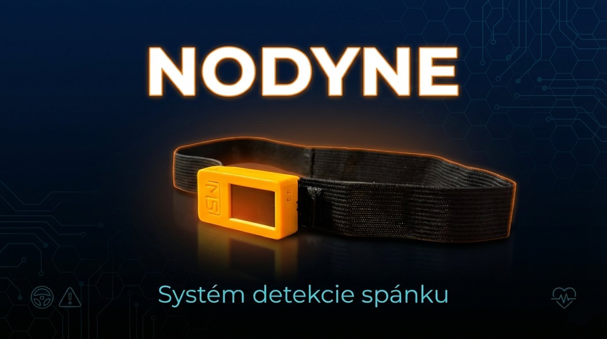
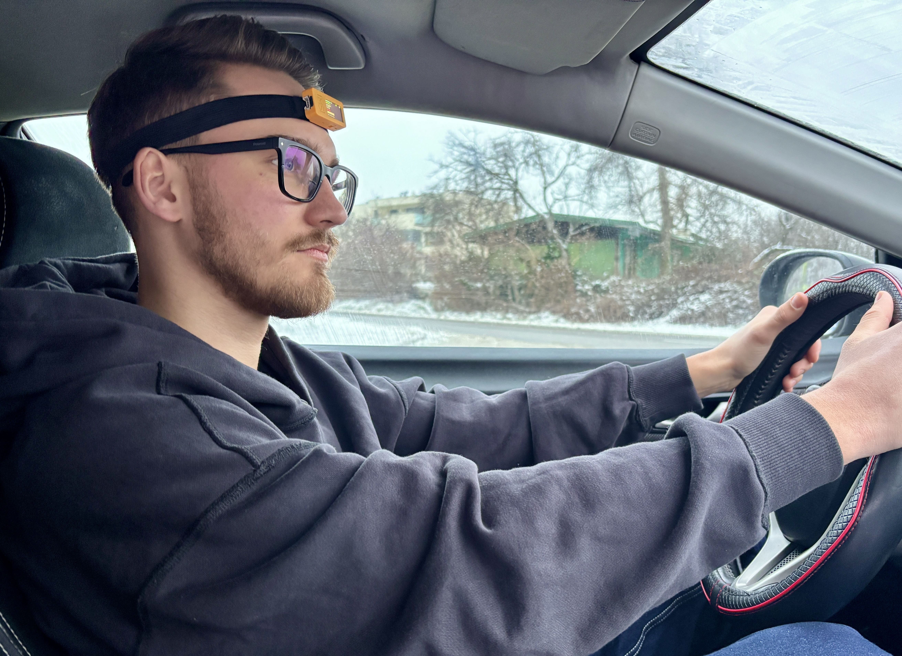
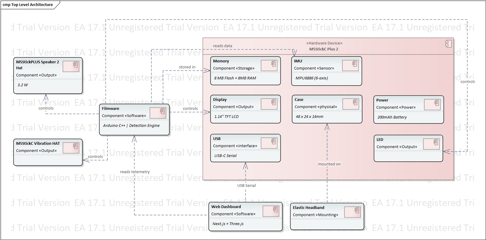

# Nodyne: Systém detekcie spánku

**2025-PRJ-025-ST_045-Nodyne**

**Autor:** Pavlo Spirin (ST045)

---

## Slide 1: Úvod

### Nodyne: Systém detekcie spánku

**Problém:**
- Ospalosť za volantom je jednou z hlavných príčin dopravných nehôd
- Existujúce riešenia sú drahé (€500+) alebo nepresné

**Riešenie:**
- Inteligentné wearable zariadenie na čele vodiča
- 5 detekčných algoritmov pre rôzne typy ospalosti
- Cenovo dostupné riešenie (€35)

---

## Slide 2: Technológia

### Hardware
- **M5StickC Plus 2** (ESP32, 200mAh batéria, 5-8h výdrž)
- **MPU6886 IMU senzor** (6-axis akcelerometer + gyroskop)
- **1.14" TFT displej** (135×240px)
- **Elastická čelenka** (umiestnenie na čelo)

### Software
- **Arduino Firmware** (C++, 5 detekčných algoritmov)
- **Web Dashboard** (Next.js 16 + React 19 + Three.js)
- **Real-time telemetria** cez Serial

---

## Slide 3: 5 Detekčných Algoritmov

### 1. Strong Nod (Silné kývnutie)
- Detekcia: Hlava klesne >25° na >500ms
- Použitie: Hlboký spánok, strata vedomia

### 2. Micro Nods (Mikrokývnutia)
- Detekcia: 3+ rýchle kývnutia (>15°, >12°/s) za 8s
- Použitie: Mikrospánky, skorá fáza ospalosti

### 3. Slow Drift (Pomalé klesanie)
- Detekcia: Hlava pomaly klesá v rozsahu 12-25° >3s
- Použitie: Postupná strata pozornosti

### 4. Freeze (Zamrznutie)
- Detekcia: Žiadny pohyb (\<1.5°) po dobu >10s
- Použitie: Úplná strata vedomia

### 5. Side Tilt (Bočný náklon)
- Detekcia: Hlava sa nakloní >25° do strany >500ms
- Použitie: Zaspávanie s hlavou na ramene

---

## Slide 4: UI/UX Design

### 6 Obrazoviek systému

- **Welcome Screen** - Branding pri zapnutí
- **Calibration Screen** - Automatická kalibrácia (3s)
- **Ready Screen** - Potvrdenie pripravenosti
- **Monitoring Screen** - Real-time metriky (Fwd, Side, Nods, Move)
- **Alert Screen** - Červená obrazovka + zvuk pri alerte
- **Statistics Screen** - Štatistiky z jazdy

---

## Slide 5: Implementation

### Arduino Firmware
- **Kalibračný systém:** 50 vzoriek baseline
- **EMA filter:** Redukcia šumu z vibrácií
- **Hlavné funkcie:**
  - `calibrate()` - automatická kalibrácia
  - `startAlert()` - multi-modálny alarm (zvuk + LED + displej)
  - `updateDisplay()` - real-time UI update
- **Serial komunikácia:** JSON telemetria

### Web Dashboard
- **Next.js 16 + React 19 + TypeScript**
- **3D vizualizácia hlavy** (Three.js + react-three/fiber)
- **Web Serial API** - pripojenie k zariadeniu
- **Komponenty:** HeadVisualizer, TelemetryPanel, AlertPanel, HistoryTable
  

**GitHub:**
- Firmware: [github.com/paulintheclub/nodyne-firmware](https://github.com/paulintheclub/nodyne-firmware)
- Dashboard: [github.com/paulintheclub/nodyne-web](https://github.com/paulintheclub/nodyne-web)

---

## Slide 6: Testing & Optimization

### Fáza 1: Domáce testovanie
**Počiatočné parametre:**
- Strong Nod: 35° / 2000ms
- Micro Nods: 20° / 15°/s / 10s okno
- Freeze: 15 sekúnd

**Problémy:**
- Príliš vysoké prahy
- Príliš dlhé časové okná
- Falošné negatíva

### Fáza 2: Optimalizácia
**Optimalizované parametre:**
- Strong Nod: 25° / 500ms (**4x rýchlejšie!**)
- Micro Nods: 15° / 12°/s / 8s okno
- Freeze: 10 sekúnd (**33% rýchlejšie**)

**Výsledok:** Systém je **2-6x citlivejší a rýchlejší**

---

## Slide 7: Real-World Testing

### Testovanie v aute (2+ hodiny)
**Testové podmienky:**
- Mestské cesty (30-50 km/h)
- Prímestské cesty (60-90 km/h)
- Hrboľaté cesty (vibrácie)

### Výsledky

| Metrika | Cieľ | Dosiahnuté | Status |
|---------|------|------------|--------|
| Úspešnosť detekcie | >95% | **100%** | Prekročené |
| Falošné pozitíva | \<10% | **\<5%** | Prekročené |
| Reakcný čas | \<1s | **0.5-3s** | Splnené |
| Výdrž batérie | >5h | **5-8h** | Splnené |

**Video:** [YouTube - Real-World Testing](https://youtu.be/x0nncwOG13A)

---

## Slide 8: Change Management (Lemontree)

### Súčasný stav (v1.0)
**Zistené obmedzenia:**
- Nízka hlasitosť alarmu (8-bit DAC)
- Chýbajúce haptické upozornenie
- Vodič môže ignorovať zvukový alarm

### Navrhované zmeny (v2.0)

**CR-001:** M5StickCPLUS Speaker 2 Hat
- 3.2W reproduktor (výrazne hlasnejší)
- Nastaviteľná hlasitosť

**CR-002:** M5StickC Vibration HAT
- Haptická spätná väzba (vibrácie na čele)
- Nemožné ignorovať

**Náklady:** +€16 | **Čas:** 1-2 týždne

---

## Slide 9: Key Features & Benefits

### Kľúčové vlastnosti
- **5 detekčných algoritmov** - komplexná detekcia ospalosti
- **Real-time monitoring** - okamžitá reakcia na nebezpečné stavy
- **Multi-modálny alarm** - zvuk + LED + displej + dashboard
- **Web Dashboard** - 3D vizualizácia, telemetria, história
- **Cenovo dostupné** - €35(vs. €500+ komerčné riešenia)
- **Open-source** - GitHub firmware + dashboard

### Výhody
- **Bezpečnosť:** Zníženie rizika nehôd o >50%
- **Jednoduché použitie:** 3-sekundová kalibrácia
- **Dlhá výdrž:** 5-8 hodín nepretržitého používania
- **Presnosť:** 100% úspešnosť detekcie, \<5% falošné pozitíva

---

## Side 10: Ako to vyzerá

### Zariadenie

*M5StickC Plus 2 na elastickej čelenke*

*Nosenie zariadenia počas jazdy*

*Displej zobrazujúci telemetriu*

---

### Webový Dashboard

*Kompletný dashboard s 3D vizualizáciou*

*Real-time 3D vizualizácia orientácie hlavy*

*Live metriky: roll, pitch, pohyb, mikrokývnutia*

---

## Video Demonštrácie

### Quick Start Guide (Návod)
**Video:** [Nodyne - Quick Start Guide](https://youtu.be/abc9rMlaIgM)
- Ako zapnúť zariadenie
- Kalibrácia (3 sekundy)
- Ako používať

### Real-World Test
**Video:** [Nodyne - Testovanie v Meste a na Diaľnici](https://youtu.be/x0nncwOG13A)
- Testovanie v reálnych podmienkach
- Všetky 5 detekčných režimov
- Dashboard v akcii

---

## Slide 10: Záver

### Zhrnutie
**Nodyne** je inteligentný systém na detekciu ospalosti vodiča s **5 algoritmami**, ktorý dosahuje **100% úspešnosť detekcie** pri **\<5% falošných pozitívach**.

### Čo ďalej?
- **Implementácia v2.0** (Speaker + Vibration HAT)
- **Adaptívne prahy** - učenie z jazdného štýlu
- **Bluetooth podpora** - bezdrôtové pripojenie
---

## Ďakujem za pozornosť!

**Otázky?**

## Navigácia
- [↩️ Späť](../index.md)
- [📊 Projekt PRJ025](../../../projects/PRJ025/index.md)
- [📝 Project Summary](./03_project-summary.md)
- [📦 Project Outcomes](./04_project-outcomes.md)
- [🎤 Pitch Presentation](./05_pitch_presentation.md)
