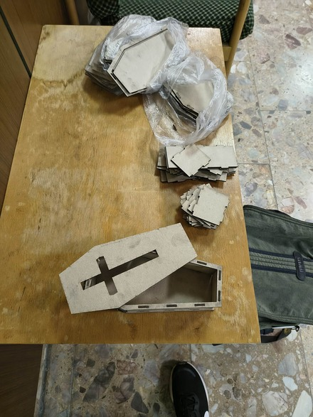
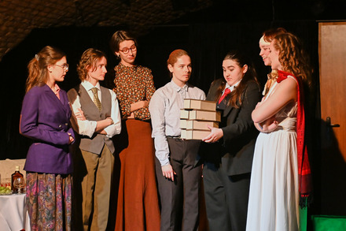

# 📝 Project Summary

## 🔖 Identifikácia
## 1️⃣ Názov projektu
- **Názov projektu:** Laserové rakvy
- **Stručný popis:** Projekt sa zameriava na návrh a výrobu siedmich malých rakiev ako divadelných rekvizít pomocou laserového rezu a lacného materiálu – kartónu. Cieľom je vytvoriť vizuálne presvedčivé, ľahké a funkčné rekvizity pre potreby inscenácie.  

## 2️⃣ Členovia tímu
| ST050 | Matej Ševčík | Project Lead | koordinácia |

## 3️⃣ Motivácia tímu
- Projekt som si vybral, pretože som potreboval vyrobiť rakvy ako rekvizity do divadelnej hry (ktorú som režíroval)
- Riešenie má pre mňa zmysel najmä praktický—učím sa pracovať s laserovým rezačom a vyrobiť pri tom produkt, ktorý využijem v osobnom projekte
- Projekt je dôležitý, pretože umožňuje vytvoriť kvalitné rekvizity aj s obmedzeným rozpočtom. 
- Rieši problém rýchlej, estetickej a cenovo dostupnej výroby viacerých 3D objektov pre scénické použitie.

## 4️⃣ Cieľ a pridaná hodnota projektu

- Cieľ: Vyrobiť sedem malých rakiev z kartónu (cca 25 cm), ktoré budú pevné, vizuálne vierohodné a použiteľné počas predstavenia.
- Ako spoznáme, že projekt je úspešný: Rakvy vyzerajú na scéne dobre a plnia svoj účel

## 5️⃣ Popis riešenia
Projekt používa jednoduchú architektúru:
- laser-cut šablóna pre materiál hrúbky ~3 mm,
- dostupný kartón ako primárny materiál,
- Herkules lepidlo na montáž

Zameriavame sa na efektívnu výrobu viacerých rovnakých kusov z lacného materiálu.

## 6️⃣ Projektový plán
- Odhadovaný čas na prácu: 2 hodiny / týždeň  
- Predpokladaný stav v čase prezentácie: funkčný produkt
- Hlavné míľniky:  
  - [ 25.11.2025 ] Príprava  
  - [ 01.12.2025 ] Implementácia  
  - [ 05.12.2025 ] Testovanie  
  - [ 14.01.2026 ] Prezentácia

Projekt zabral približne 4 týždne

1. **Príprava**  
   - Porovnávanie prístupov (3d tlač vs laser cutting)  
   - Cenový odhad
   - Hľadanie materiálu a vhodného modelu

2. **Implementácia**  
   - Vytvorenie 3D modelu pre rezačku
   - Vyrezanie 7 rakiev na laserovej rezačke vo FabLabe
   - Poskladanie, zlepenie rakiev (s pomocou backstage teamu študentského divadla)

3. **Testovanie** 
   - Odskúšanie rakiev na divadelnej skúške
   - Využitie rakiev na premiére (17.12.2025, Teatro Colorato)

4. **Dokumentácia**  
   - Zhotovenie dokumentácie a prezentácie

###  📅 Milníky a výstupy
- **Do prezentácie dodáme:**  
  - prototyp  
  - prezentáciu  
  - dokumentáciu  

## 7️⃣ Zákazník a hodnoty
- **Používateľ:** študentské divadlo Actofkaa 
- **Prínos:** rekvizity do aktuálnej a potenciálne aj budúcich inscenácií
  
## 8️⃣ Očakávané výstupy
- Dokumentácia: fotodokumentácia postupu, záznam z inscenácie, readme
- Artefakty: ukážka 1 z rakiev

## 📚 Kontext
- KNIFE: článok o výrobe malých rakiev
- Inšpirácie: laser-cut dizajny rakiev pre 3 mm materiál, opis rakiev v scenári

## 🧭 Riziká a závislosti
- Vysoká cena
- Vlhkosť
- Rakvy sa môžu poškodiť  

## 9️⃣ Reflexia a ďalšie kroky
Čo očakávate, že sa naučíte?  
- práce s laserovým rezačom,
- adaptácia dizajnu na materiál,
- rýchla výroba reálnych rekvizít pre divadelnú produkciu,
- jednoduchý projektový manažment (od návrhu po dodanie).

Ako by sa projekt mohol rozvíjať ďalej?
- vytvoriť aj ďalšie rekvizity týmto spôsobom,
- vyvinúť vlastné laser-cut šablóny,
- experimentovať s inými materiálmi (preglejka, MDF, EVA pena),
- dokumentáciu rozšíriť na plnohodnotný návod pre iné divadelné súbory.

---

## Navigácia
- [↩️ Späť](../index.md)
